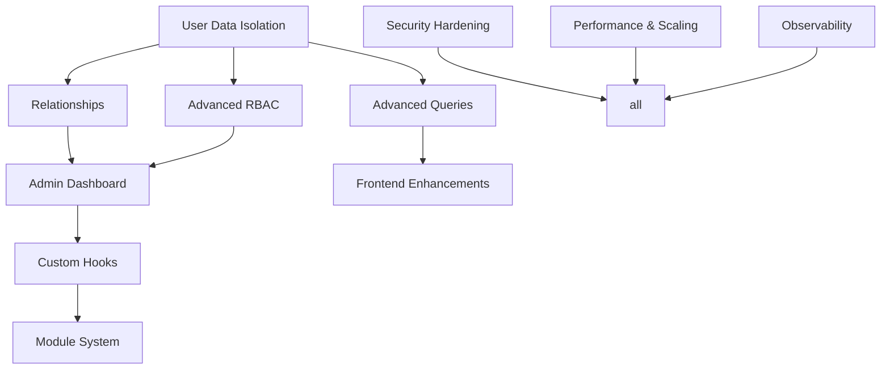

Excellent. With Phase 1 validated, the foundation is solid. Now we move toward a production‑grade ecosystem that not only adds the advanced features from the original master plan but also meets market standards for security, scalability, and maintainability—while introducing **user‑level data isolation with selective sharing** (a critical requirement you added).

Below is a structured **Phase 2 plan** that builds upon everything you already have. It’s organized into three layers:  
1. **Core Data & Access** (user isolation, relationships, advanced queries, field‑level RBAC)  
2. **Platform Extensibility** (hooks, modules, admin dashboard)  
3. **Production Hardening** (security, scalability, observability)

All workstreams assume multi‑tenancy is already in place; they extend it with per‑user boundaries and the ability to share across those boundaries.

---

## 🧩 PHASE 2 – PRODUCTION ECOSYSTEM & ADVANCED CAPABILITIES

### 🎯 Objective

Transform the working Phase 1 platform into a **secure, scalable, extensible ecosystem** that:

- Isolates data per **user** by default, with **explicit sharing** options
- Supports **relationships** between entities
- Provides **field‑level permissions** and **conditional access rules**
- Offers a **full admin UI** for platform and tenant management
- Allows **custom business logic** via hooks and extension modules
- Meets **production security, performance, and observability** best practices

---

## 📦 WORKSTREAMS

---

### 1. USER DATA ISOLATION & SHARING

#### 🎯 Objective
Every record is owned by a user; queries are automatically scoped to that user unless sharing or elevated permissions say otherwise. Sharing is explicit and revocable.

#### 📦 Deliverables
- Automatic `ownerId` field on every entity record (populated from auth context)
- DAL‑level scoping: `findAll` etc. filter by `ownerId == currentUser` **unless** the user holds `entity.read_all` or the record is explicitly shared
- Sharing sub‑system:
  - Each record can have a `sharedWith` array of `{ userId, permission: "read" | "write" }`
  - Dedicated API endpoints (secured by RBAC) to manage sharing: `POST /share`, `DELETE /share`
  - A “Shared with me” view in the UI
- Audit trail for share actions (for compliance)

#### ✅ Validation
- Regular user sees only their own records
- Shared records appear in both owner’s and recipient’s lists (with limited write if only read‑shared)
- Admin with `entity.read_all` sees everything
- Removing a share instantly revokes access

---

### 2. RELATIONAL DATA SYSTEM

#### 🎯 Objective
Define references between entities and navigate them via API and UI, while keeping Firestore performance in mind.

#### 📦 Deliverables
- New field type: `reference`, e.g. `{ type: "reference", entity: "customer" }`
- Option for one‑to‑many: reference array (denormalized) or separate junction entity (e.g., `order_items`)
- API support for **server‑side population** (optional query param `?populate=customer`) or **client‑side lookup** helpers
- UI components:
  - Dropdown / typeahead for selecting related records (scoped by tenant + user)
  - Inline display of related record summary in table/detail views

#### ✅ Validation
- Can define a `order.customer` reference
- Creating an order shows only customers the user owns (or all if admin)
- Detail view shows linked customer name
- Deleting a referenced record can be configured (cascade / restrict)

---

### 3. ADVANCED QUERY ENGINE

#### 🎯 Objective
Support filtering, sorting, and full‑text search on lists, with Firestore‑compatible query building.

#### 📦 Deliverables
- API query parameters: `?filter[field]=value&sort=field&search=term`
- Filter operators: eq, neq, gt, lt, contains, in
- Search: full‑text on string fields (Firestore requires composite indexes + `>=`/`<=` trick or third‑party like Algolia; initial version can use `array-contains` or `string search` with client‑side filtering for small datasets)
- Frontend table integrates filter/sort UI (column headers, search box)
- Pagination via cursor (prev/next)

#### ✅ Validation
- Can filter customer list by email, sort by name
- Search returns relevant results
- Pagination works with active filters

---

### 4. ADVANCED RBAC (FIELD‑LEVEL & CONDITIONAL)

#### 🎯 Objective
Granular permissions down to individual fields, and dynamic rules like “only edit your own records”.

#### 📦 Deliverables
- Permission granularity: `entity.field.read`, `entity.field.write`
- Conditional permissions: e.g., `order.update.own` (only if `ownerId == currentUser`)
- Role hierarchy: `editor` inherits `viewer` permissions
- Middleware expansion: field‑level filtering on API responses (strip fields user cannot read) and request validation (reject if trying to write a protected field)
- UI helpers: `canReadField(entity, field)`, `canWriteField(entity, field)` to conditionally render form elements

#### ✅ Validation
- A “viewer” role can see a customer’s email but not the phone number if `customer.phone.read` is revoked
- A “restricted editor” can edit own orders but not orders owned by others
- Superadmin can configure all roles via admin UI (workstream 5)

---

### 5. ADMIN DASHBOARD

#### 🎯 Objective
Centralized UI for managing platform configuration, tenants, users, roles, and entity schemas—not just Firestore console.

#### 📦 Deliverables
- **Platform superadmin** section:
  - Tenant creation / management
  - Global role templates
  - System health overview
- **Tenant admin** section:
  - User management (invite, assign roles)
  - Role editor (create/edit roles and assign permissions)
  - Entity schema editor (add/remove fields, change types) – updates Firestore config and triggers schema regeneration
  - Sharing overview (see all shared records, revoke)
- Access to admin UI gated by `platform.admin` or `tenant.admin` permissions

#### ✅ Validation
- Can create a new tenant and immediately define a custom entity for it without touching code
- Changing a user’s role in the admin UI instantly updates their UI visibility
- Entity schema changes propagate to API and frontend without restart (hot‑reload or on‑next‑request)

---

### 6. CUSTOM BUSINESS LOGIC (HOOKS)

#### 🎯 Objective
Allow per‑entity lifecycle hooks to execute custom code, enabling business rules without modifying the core.

#### 📦 Deliverables
- Hook definitions per entity and action: `beforeCreate`, `afterCreate`, `beforeUpdate`, `afterUpdate`, `beforeDelete`, `afterDelete`
- Hooks are async functions that receive the entity data and context (current user, tenant, etc.)
- Hook registration via a defined interface (e.g., a module exports `{ entity: 'order', beforeCreate: async (data, ctx) => ... }`)
- Execution in the CRUD generator pipeline; errors from hooks can abort the operation
- **Security:** Hooks run in the same server context for now (no sandboxing yet), but only developers can add them (no arbitrary code from admin UI)

#### ✅ Validation
- A `beforeCreate` hook on `order` sets a default `status` if not provided
- An `afterCreate` hook sends a notification (via external service)
- A hook that throws an error prevents the record from being saved and returns a meaningful message

---

### 7. MODULE & EXTENSION SYSTEM

#### 🎯 Objective
Enable packaging of entities, routes, UI components, and hooks as pluggable modules, isolated from the core.

#### 📦 Deliverables
- Module manifest structure: defines entities, hooks, custom API routes, React components (code‑split)
- Dynamic loader on backend: scans a `modules` directory, registers routes and hooks
- Frontend: module UI components loaded lazily, integrated into the entity‑driven layout (e.g., custom cards on dashboard)
- Per‑tenant activation: modules can be enabled/disabled per tenant via config
- Example module: “Invoicing” that adds `invoice` entity, custom PDF generation hook, and a dashboard widget

#### ✅ Validation
- Installing a module adds its entities to the registry for a specific tenant
- Custom routes from the module are reachable and secured by RBAC
- Disabling a module removes all its contributions without affecting the rest

---

### 8. PERFORMANCE & SCALABILITY

#### 🎯 Objective
Ensure the platform can handle growth in tenants, users, and data volume without degradation.

#### 📦 Deliverables
- **Firestore indexing strategy**: automatically create composite indexes from entity definitions and common queries (maybe via script or declarative file)
- **Caching layer**:
  - In‑memory cache (e.g., `node-cache` or Redis) for entity schemas, permissions, and frequently‑accessed reference data
  - Cache invalidation on config change
- **Rate limiting**: per‑user / per‑tenant rate limits on API (e.g., 100 req/s) using Fastify plugin (`@fastify/rate-limit`)
- **Background processing**: offload long‑running tasks (e.g., exports, bulk updates) to Cloud Tasks or BullMQ
- **Horizontal scaling**: stateless Fastify servers behind a load balancer; session data in external store (Firestore for permissions cache already external)
- **Load testing** to identify bottlenecks

#### ✅ Validation
- 10 tenants with 1000 entities each do not increase response time >50%
- Rate limiting kicks in and returns 429
- Schema changes propagate to all servers within seconds
- Background tasks complete successfully without blocking API

---

### 9. SECURITY HARDENING

#### 🎯 Objective
Meet OWASP Top 10 and general SaaS security standards.

#### 📦 Deliverables
- **HTTP security headers** (`helmet` for Fastify)
- **CORS** restricted to known domains
- **CSRF protection** (if using cookies; since we use token‑based auth with `Authorization` header, less critical but still good to add `X-Requested-With` check)
- **Input validation** – already via Zod; extend with sanitization against NoSQL injection (Firestore SDK safe, but ensure dynamic field names aren’t injected)
- **App Check** enforcement on all backend endpoints (already may exist from Phase 1)
- **Secret management**: all API keys, service account credentials from environment / Google Secret Manager, not hardcoded
- **Audit logging**: all data mutations logged with user, tenant, timestamp, old/new values (store in separate `_audit` collection)
- **Token refresh** and revocation: ensure frontend refresh flow works, and RBAC re‑fetches on token refresh
- **Dependency scanning** (npm audit, Snyk) in CI/CD

#### ✅ Validation
- Security headers present on responses
- Audit logs record every create/update/delete with full diff
- Attempted writes to forbidden fields are rejected and logged

---

### 10. OBSERVABILITY & MAINTENANCE

#### 🎯 Objective
Production‑grade monitoring, alerting, and developer experience.

#### 📦 Deliverables
- **Structured logging** (JSON, Pino) with correlation IDs across requests
- **Centralized logging** to Cloud Logging / Google Cloud Operations
- **Metrics** exported (e.g., via `prom-client`) for request count, duration, error rates; dashboards (Grafana / Cloud Monitoring)
- **Alerting** on 5xx spike, high latency, or Firestore quota nearing
- **Health check endpoints** `/health` and `/ready` for load balancers
- **Automated backups**: Firestore export scheduled daily to Cloud Storage
- **CI/CD pipeline**:
  - Lint, type check, unit tests, integration tests, build
  - Deploy staging → canary → production
  - Rollback capability
- **Documentation**:
  - API reference (auto‑generated from schemas? Swagger / OpenAPI)
  - Developer guide (how to add entity, hook, module)
  - Admin handbook

#### ✅ Validation
- Logs searchable in Cloud Console, correlated by trace ID
- Dashboard shows real‑time API throughput
- Deploying a new version shows zero downtime
- Backups restoreable

---

## 🔁 DEPENDENCIES & SEQUENCING

- **User data isolation** must be implemented first because it changes the DAL contract (all queries automatically scoped).
- **Relationships** and **Advanced RBAC** can be done in parallel after isolation.
- **Admin Dashboard** depends on RBAC and the new sharing system (to manage shares).
- **Hooks** and **Modules** rely on stable API generator and entity registry, so they come later.
- **Security** and **Observability** are cross‑cutting and can be integrated incrementally alongside feature work.

A practical order:
1. User Data Isolation & Sharing
2. Advanced RBAC (field‑level, conditional)  
3. Relationships  
4. Advanced Queries + UI improvements  
5. Admin Dashboard  
6. Hooks  
7. Module System  
8. Performance & Scaling (continuous)  
9. Security Hardening (continuous)  
10. Observability & Maintenance (continuous)

---

## 📅 SUGGESTED SPRINT THEMES

| Sprint | Focus |
|--------|-------|
| 1–2 | User isolation + sharing backend, DAL changes, basic sharing API |
| 3–4 | Advanced RBAC (field‑level) + update API/UI |
| 5–6 | Relationships (reference field, populating, UI) |
| 7–8 | Advanced query engine (filters, search) + frontend integration |
| 9–10 | Admin dashboard (roles, entities, users, sharing management) |
| 11–12 | Hooks infrastructure + first production hooks |
| 13–14 | Module system architecture + first internal module |
| 15–16 | Production hardening, load testing, monitoring, CI/CD |