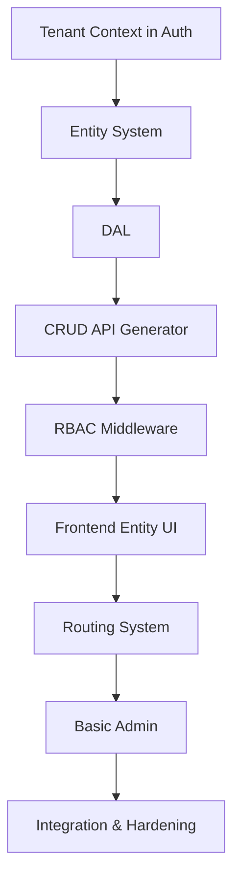

## 🧭 Phase 1 Execution Plan (Multi-Tenant Aware)

We'll work through the workstreams in dependency order, building **one full vertical slice early** (e.g., a `Customer` entity for one tenant), then generalizing.

### Step 0 – Foundation Setup (Prerequisites)

- [x] Monorepo structure (backend, frontend, shared packages)
- [x] Fastify + React Router v7 boilerplate
- [x] Firebase Auth (client) & Firebase Admin (server) with token verification
- [x] Zod + TypeScript shared schemas
- [x] Firestore converters
- [x] **Add tenant context to auth**  
  - **Decision:** Primary resolution = Firebase JWT `tenantId` custom claim (set via `POST /auth/select-tenant`). Subdomain and `x-tenant-id` header deferred — not needed for current SaaS model.  
  - User session/token includes `tenantId` claim; web syncs via `GET /auth/validate`.  
  - `createAuthenticatePreHandler` in `apps/api/src/auth/authenticate-request.ts` extracts `tenantId` into `request.ctx` for all downstream logic. Superadmins may override target tenant with `?tenantId=` on management and CRUD routes.  
  - See also: [apps/api/README.md](../../apps/api/README.md) auth section.

---

### 1. Entity System (Core Foundation) – *with tenant awareness*

**Status:** Complete (evolved design — see notes below)

**Objective**: Define entities dynamically, store their definitions in a tenant‑scoped Firestore collection, and generate Zod schemas + TypeScript types.

**Implementation (as built):**

| Layer | Source | Firestore path / registration |
| --- | --- | --- |
| **Static entities** | `defineEntity()` in modules (`modules/core`, etc.) | Registered at bootstrap via `bootstrapPlatformApp()` → in-memory registry |
| **Dynamic entities** | Model Builder / admin API | `tenants/{tenantId}/entity_definitions/{id}` — hydrated by `EntityRuntimeContext.loadTenantDefinitions()` |
| **Merged view** | `resolveEntity(name, tenantId)` | Static wins on name collision with dynamic |

> **Note:** Original plan path `_platform/entities` was superseded by `entity_definitions` in Phase 2 (Dynamic Entity Builder). No migration planned.

**Implementation steps:**

1. **Define entity config schema** — `defineEntity()` in `@repo/entities` (see `packages/shared-types/src/entities/`)
2. **Store dynamic entity configs in Firestore** — `tenants/{tenantId}/entity_definitions/{definitionId}`
3. **`EntityRuntimeContext`** — loads dynamic definitions (60s TTL cache); merges with static module entities
4. **Seed `Customer` entity** — static entity in `modules/core` (vertical slice alongside `organization`, `project`)

**Validation**:  
- Can load entity config from Firestore (dynamic) and modules (static).  
- Generated schema validates data correctly.  
- Permissions list is complete (`customer.read`, `customer.create`, etc.).

---

### 2. Firestore DAL – *tenant‑scoped from the start*

**Objective**: All data operations are isolated by tenant; no raw Firestore calls elsewhere.

**Implementation steps:**

1. **Create a generic `BaseRepository<T>`**  
   - Constructor takes `collectionName` and `tenantId`.  
   - All paths become `tenants/{tenantId}/{collectionName}`.  
   - Uses the shared Zod schema for validation before writes.
2. **Expose methods**  
   - `findAll(filters, pagination)`  
   - `findById(id)`  
   - `create(data)`  
   - `update(id, data)`  
   - `delete(id)`
3. **Factory function**  
   - Given an entity definition, returns a repository instance bound to the current tenant.

**Validation**:  
- Write a record → it appears under the correct tenant path.  
- A query from another tenant ID does not return the same data.  
- Schema violations are rejected.

---

### 3. CRUD API Generator – *auto‑register routes with RBAC*

**Objective**: For every entity in the registry, create Fastify routes that enforce permissions and use the DAL.

**Implementation steps:**

1. **Dynamic route registration**  
   - On startup (or config reload), iterate over entities from the registry.  
   - For each entity, register:  
     `GET /api/tenant/:tenantId/entity/:entityName`  
     `GET /api/tenant/:tenantId/entity/:entityName/:id`  
     `POST ...` etc.  
   *Tenant ID can be from a middleware‑injected parameter, not necessarily from URL.*
2. **Request pipeline**  
   - Extract `tenantId` from auth context.  
   - Look up entity definition and Zod schema.  
   - Check permission (`entity.read`, etc.) via RBAC middleware.  
   - Validate request body/params with Zod.  
   - Call appropriate repository method.
3. **Standard response envelope**  
   `{ success: boolean, data: ... }`

**Validation**:  
- Using Postman, CRUD works for `Customer` with valid token.  
- Missing permission returns 403.  
- Invalid data returns 400 with field‑level errors.

---

### 4. RBAC System – *per‑tenant role assignment*

**Objective**: Permissions are checked per request, with roles assigned per tenant.

**Implementation steps:**

1. **Permission format**: `<entity>.<action>` (e.g., `customer.read`)
2. **Role model** (Firestore)  
   Path: `tenants/{tenantId}/_platform/roles/{roleId}`  
   Document: `{ name: "viewer", permissions: ["customer.read", ...] }`
3. **User‑role mapping**  
   Path: `tenants/{tenantId}/_platform/userRoles/{userId}`  
   Document: `{ roles: ["viewer"] }`  
   *We can also store a default role for each user.*
4. **Fastify middleware**  
   - Decode user ID and tenant ID from token.  
   - Load roles for that user in that tenant.  
   - Merge all permissions.  
   - Compare against required permission for the route.  
   - Reject with 403 if missing.
5. **Frontend permission context**  
   - After login, fetch user’s permissions for the active tenant.  
   - Provide a React context/hook for components to hide/show UI.

**Validation**:  
- User A (viewer) can read list, but create/edit/delete returns 403.  
- User B (editor) has full access.  
- Changing a role in Firestore takes effect on next request.

---

### 5. Frontend Entity UI – *dynamic, tenant‑aware*

**Objective**: Render tables and forms from entity metadata without custom code.

**Implementation steps:**

1. **Generic `EntityTable` component**  
   - Props: `entityName`  
   - Fetches entity definition (fields, permissions).  
   - Calls API `GET /api/tenant/{tenantId}/entity/{entityName}`.  
   - Renders a table with columns from field list.  
   - Pagination controls.  
   - Uses permission context to show/hide action buttons (create/edit/delete).
2. **Generic `EntityForm` component**  
   - Mode: create / edit.  
   - Dynamically builds form fields based on entity field types.  
   - Validates client‑side with the shared Zod schema (using `zod` in the browser).  
   - On submit, calls `POST` or `PATCH`.
3. **Loading and error states** – with skeletons, error boundaries.
4. **Tenant context** – API calls automatically include tenant ID (via a configured API client or hook).

**Validation**:  
- Can view table, paginate, filter (basic).  
- Create a new record → appears in table.  
- Edit record → updates correctly.  
- Delete with confirmation.  
- Buttons hidden if user lacks permission.

---

### 6. Routing System – *dynamic routes per entity*

**Objective**: Automatically register frontend routes for each entity, protected by auth and permission.

**Implementation steps:**

1. **Route generation**  
   Using React Router v7, map entities to:  
   - `/app/:tenantId/entity/:entityName` → Table  
   - `/app/:tenantId/entity/:entityName/new` → Create Form  
   - `/app/:tenantId/entity/:entityName/:id` → Detail/Edit Form
2. **Route guard**  
   - Check authentication (redirect to login if missing).  
   - Check entity‑level permission (e.g., `customer.read`) before rendering the route, or show a "not allowed" page.
3. **Sidebar navigation**  
   - Fetch list of entities the user can access (based on permissions).  
   - Render links dynamically.

**Validation**:  
- Navigation works, URL reflects entity.  
- Directly accessing a route without permission shows an appropriate message.  
- Tenant ID changes reload the correct data.

---

### 7. Basic Admin – *role assignment per tenant*

**Objective**: Allow platform admins (superadmin) to manage roles for tenants.

**Implementation steps:**

1. **Seed default roles** (viewer, editor) and assign them to test users via Firestore console or a simple script.
2. **Minimal superadmin UI** (could be a simple page)  
   - List users in a tenant, edit their roles.  
   - For now, we can rely on Firestore UI to keep it minimal as per scope, but provide at least a programmatic way.
3. **Ensure role changes are reflected immediately** (invalidate cached permissions on update).

**Validation**:  
- Changing a user’s role from viewer to editor instantly gives them create/edit/delete access in both API and UI.

---

### 8. End‑to‑End Integration & Hardening

**Critical final steps before moving to Phase 2:**

1. **Create two test tenants**, each with a different set of entities (or same entities but different data).  
2. **Test cross‑tenant data isolation** – user from Tenant A cannot see Tenant B’s data, even if they share the same entity definition.  
3. **Test full RBAC matrix** per tenant (the table from the first doc).  
4. **Performance sanity check** – pagination, loading of many entities.  
5. **Error logging & monitoring basics** – at least console errors structured.  
6. **Documentation** – how to define a new entity, assign roles, etc.

---

## 🔁 Sequencing & Dependencies

- Steps 1–3 can be partially parallelized after tenant context is set.
- RBAC must be ready before UI components fully function, but UI can be built with mocked permissions early.

---

## ✅ Recommended Next Action

Steps 0 and 1 are complete. Continue with Phase 2 backlog items in [docs/next-phase-backlog.md](../../docs/next-phase-backlog.md) or run the [E2E validation runbook](../../docs/e2e-validation-runbook.md) to verify the platform end-to-end.