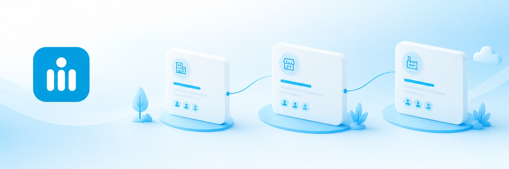

<p align="center">
  
</p>

<h1 align="center">Entity System (ESP)</h1>

<p align="center">
  <strong>The multi-tenant platform for building business apps without forking the core.</strong><br />
  Tenants define their own data models — and get APIs, UI, permissions, automation, and AI on top.
</p>

<!-- Compact status (native GitHub workflow badges + shields). Keep flat-square — for-the-badge is oversized. -->
<p align="center">
  <a href="https://github.com/AndresLGomezO/spa-base/actions/workflows/ci.yml"></a>
  <a href="https://github.com/AndresLGomezO/spa-base/actions/workflows/deploy.yml"></a>
  <a href="https://github.com/AndresLGomezO/spa-base/actions/workflows/verify.yml"></a>
  &nbsp;
  <a href="https://github.com/AndresLGomezO/spa-base/releases"></a>
  <a href="https://github.com/AndresLGomezO/spa-base/commits"></a>
  <a href="https://github.com/AndresLGomezO/spa-base/pulse"></a>
  <a href="https://github.com/AndresLGomezO/spa-base/issues"></a>
</p>

<p align="center">
  <a href="https://entitysystem-development.web.app"></a>
  <a href="https://entitysystem-staging.web.app"></a>
  <a href="https://entitysystem-production.web.app"></a>
  <a href="#quick-start"></a>
</p>

<p align="center">
  <a href="https://pnpm.io"></a>
  <a href="https://www.typescriptlang.org/"></a>
  <a href="https://react.dev/"></a>
  <a href="https://firebase.google.com/"></a>
  <a href="https://cloud.google.com/run"></a>
  <a href="https://fastify.dev/"></a>
  <a href="https://turbo.build/"></a>
</p>

<p align="center">
  <a href="#status--environments">Status</a> ·
  <a href="#quick-start">Quick start</a> ·
  <a href="#built-for-tenants">Tenants</a> ·
  <a href="#capabilities">Capabilities</a> ·
  <a href="#documentation">Docs</a> ·
  <a href="apps/web/README.md">Web</a> ·
  <a href="apps/api/README.md">API</a> ·
  <a href="docs/ai-platform/README.md">AI</a>
</p>

<p align="center">
  
</p>

---

## Status & environments

Workflow badges above are live (pass/fail). Env chips link to Hosting; API URLs come from `terraform output` — [per-environment](docs/infrastructure/per-environment.md).

|           |                                                                                                                                                                                                                                                                                                                      |
| --------- | -------------------------------------------------------------------------------------------------------------------------------------------------------------------------------------------------------------------------------------------------------------------------------------------------------------------- |
| Workflows | [CI](https://github.com/AndresLGomezO/spa-base/actions/workflows/ci.yml) · [Deploy](https://github.com/AndresLGomezO/spa-base/actions/workflows/deploy.yml) · [Terraform](https://github.com/AndresLGomezO/spa-base/actions/workflows/verify.yml) · [All Actions](https://github.com/AndresLGomezO/spa-base/actions) |
| Ship      | [Deployments](https://github.com/AndresLGomezO/spa-base/deployments) · [Releases / `v*` tags](https://github.com/AndresLGomezO/spa-base/releases) · [Pulse](https://github.com/AndresLGomezO/spa-base/pulse)                                                                                                         |
| Web       | [dev](https://entitysystem-development.web.app) · [staging](https://entitysystem-staging.web.app) · [prod](https://entitysystem-production.web.app) · local `http://localhost:5173`                                                                                                                                  |

---

## Why ESP?

Most SaaS codebases bake one product’s schema into the stack. ESP flips that: **the schema is data**. Each tenant designs entities, fields, and views in the Control Plane — the platform generates the rest.

| Without ESP                                   | With ESP                                   |
| --------------------------------------------- | ------------------------------------------ |
| New feature → new migrations, routes, screens | New model → catalog, CRUD, and UI appear   |
| Permissions bolted on later                   | Roles and field access from day one        |
| One UI look for every customer                | Per-tenant branding and layouts            |
| AI sprinkled as one-offs                      | Shared AI jobs, spend limits, and surfaces |

---

## Built for tenants

ESP is tenant-first by design:

1. **Onboard a tenant** — Isolated data plane under `tenants/{tenantId}/…`
2. **Model the domain** — Settings → **Data Model Builder** (`/settings/data-models`)
3. **Ship the experience** — Lists, forms, relations, metrics, and automation follow the catalog
4. **Brand it** — Appearance tokens and layouts per tenant
5. **Extend when needed** — Optional compile-time modules for product-specific logic ([guide](docs/guides/module-extension.md))

Default bootstrap ships with **no compile-time business modules** — tenants own their schema.

---

## Capabilities

<table>
  <tr>
    <td width="50%">
      <h3>Data & APIs</h3>
      Schema-driven entities, auto-generated CRUD, relations, and a query engine with RBAC baked in.
    </td>
    <td width="50%">
      <h3>Security</h3>
      Tenant isolation, ownership & sharing, role permissions, and field-level access control.
    </td>
  </tr>
  <tr>
    <td>
      <h3>UI & branding</h3>
      Configurable lists, forms, and dashboards — plus Appearance for logos, colors, and theme.
    </td>
    <td>
      <h3>Insights</h3>
      Event-driven aggregations and deterministic metrics reads for KPIs and series widgets.
    </td>
  </tr>
  <tr>
    <td>
      <h3>Automation</h3>
      Lifecycle hooks and tenant-authored data hooks — conditions, actions, no fork required.
    </td>
    <td>
      <h3>AI</h3>
      Grounded chat, UI builder assist, and hook-time AI — one controller, spend guards, job history.
    </td>
  </tr>
</table>

---

## Quick start

**Prerequisites:** Node.js 22+, [pnpm](https://pnpm.io) 10+, Docker (optional).

```bash
pnpm install
pnpm emulators            # Firebase Auth + Firestore (+ storage, pubsub)
pnpm --filter api dev     # API  → http://localhost:3000
pnpm --filter web dev     # Web  → http://localhost:5173
```

**All-in-one Docker**

```bash
pnpm dev:docker
pnpm seed:database
```

Tip: set `PLATFORM_BOOTSTRAP_SUPERADMIN_EMAILS=you@example.com` in `apps/api/.env.dev` so your first login is a platform superadmin.

---

## Repository layout

```text
apps/
  api/                   HTTP API (Fastify)
  web/                   Control Plane + tenant app (React Router)
  platform/              Shared bootstrap
  worker-service/        AI & async tasks
  worker-aggregation/    Metrics pipeline
  worker-indexer/        Firestore indexes
packages/                Shared libraries (@repo/*)
docs/                    Guides & references
```

---

## Documentation

| Start here                                                          |                                   |
| ------------------------------------------------------------------- | --------------------------------- |
| [Documentation index](docs/README.md)                               | Guides, contracts, infrastructure |
| [Codebase map](docs/guides/codebase-map.md)                         | Where to change what              |
| [GCP bootstrap](docs/infrastructure/bootstrap-new-gcp-account.md)   | New account → first deploy        |
| [AI platform](docs/ai-platform/README.md)                           | Chat, jobs, workers, spend        |
| [UI Design Manual](docs/ui-design-manual/README.md)                 | Layout JSON for designers         |
| [API README](apps/api/README.md) · [Web README](apps/web/README.md) | App-level contracts               |

---

## Common commands

| Command              | Description                     |
| -------------------- | ------------------------------- |
| `pnpm dev`           | Start apps (Turbo)              |
| `pnpm test`          | Run test suites                 |
| `pnpm typecheck`     | TypeScript across the monorepo  |
| `pnpm lint`          | Lint                            |
| `pnpm emulators`     | Firebase emulators              |
| `pnpm seed:database` | Seed roles + sample tenant      |
| `pnpm storybook`     | Component workshop (`@repo/ui`) |

---

<p align="center">
  <sub>Built for teams shipping multi-tenant products on a single schema-driven core.</sub>
</p>
