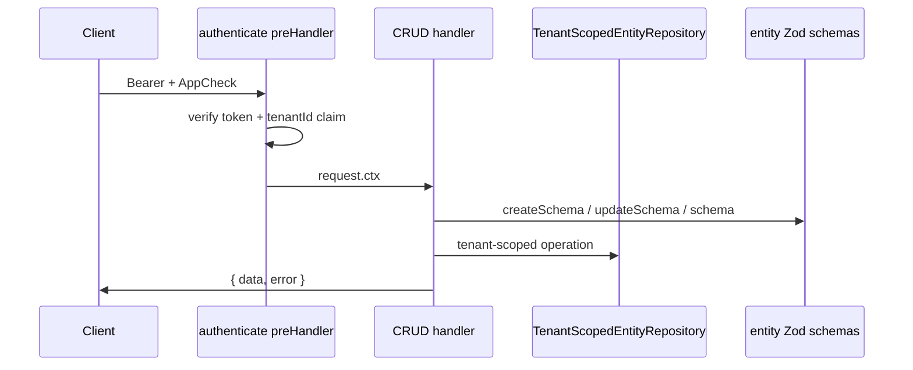

# CRUD route generator

Automatically registers REST endpoints for entities defined with `defineEntity()`.

## Entry point

[`registerCrudRoutes.ts`](./register-crud-routes.ts) — called from [`server.ts`](../server.ts) once per entity.

```ts
await registerCrudRoutes(server, {
  entity: Loan,
  repository: createFirestoreAdminEntityRepository({
    /* ... */
  }),
  authenticate: createAuthenticatePreHandler(firebaseAdminConfig),
});
```

Dynamic entities use parametric registration via [`register-dynamic-entity-crud-routes.ts`](../entities/register-dynamic-entity-crud-routes.ts).

## Design



### Validation layers

| Operation | Schema used                                                                  |
| --------- | ---------------------------------------------------------------------------- |
| POST      | `entity.createSchema` then full `entity.schema` after system field injection |
| PUT       | `entity.updateSchema` then full `entity.schema` after merge                  |
| GET       | No body validation; optional list query params (see below)                   |

System fields (`id`, `tenantId`, `createdAt`, `updatedAt`) are injected in handlers — never accepted from clients.

### Response envelope

| Module             | Role                                     |
| ------------------ | ---------------------------------------- |
| `response.ts`      | `successEnvelope`, `replyWithError`      |
| `errors.ts`        | Error code constants                     |
| `validation.ts`    | Zod → field error map                    |
| `error-handler.ts` | Global 500 handler for CRUD app instance |

## Extension points

### RBAC

Pass per-action `authorize` guards to `registerCrudRoutes`:

```ts
const authorize = createEntityPermissionGuards(permissionDeps, Loan.name);
```

| Route                | Permission        |
| -------------------- | ----------------- |
| GET list / GET by id | `{entity}.read`   |
| POST                 | `{entity}.create` |
| PUT                  | `{entity}.update` |
| DELETE               | `{entity}.delete` |

Default: `noopPreHandler` per action when `authorize` is omitted.

### Query Engine (Phase 2 — 10.0)

List and get routes use `@repo/query-engine` when `queryEngine` is passed to `registerCrudRoutes` (wired in [`server.ts`](../server.ts)).

**List query parameters:**

| Param    | Description                                                         |
| -------- | ------------------------------------------------------------------- |
| `limit`  | Page size (1–100, default 20). Merged into query pagination.        |
| `cursor` | Opaque cursor from previous page (`id` of last item).               |
| `query`  | Optional JSON string with `filter`, `sort`, `pagination`, `select`. |

Examples:

```http
GET /api/workItem?limit=20
GET /api/workItem?query={"filter":[{"field":"batchId","operator":"==","value":"batch_123"}]}
GET /api/workItem?query={"sort":[{"field":"createdAt","direction":"desc"}]}
```

Invalid queries return `400` with `QUERY_VALIDATION_ERROR` or `QUERY_UNSUPPORTED`. See [Query Engine Guide](../../../docs/query-engine-guide.md).

### Firestore (production)

Replace the repository — handlers stay unchanged:

```ts
repository: createFirestoreAdminEntityRepository({ collection: entity.metadata.collection, ... }),
```

Port: [`TenantScopedEntityRepository`](../../../../packages/firestore-converters/src/entity/tenant-scoped-repository-contract.ts).

### Lifecycle hooks (10.4)

CRUD handlers run six lifecycle hook points per operation. See [Hooks System Guide](../../../docs/hooks-system-guide.md).

| Event                   | When                |
| ----------------------- | ------------------- |
| `{entity}.beforeCreate` | Before POST persist |
| `{entity}.afterCreate`  | After POST          |
| `{entity}.beforeUpdate` | Before PUT persist  |
| `{entity}.afterUpdate`  | After PUT           |
| `{entity}.beforeDelete` | Before DELETE       |
| `{entity}.afterDelete`  | After DELETE        |

Module hooks register via `defineModule({ hooks })`. Tenant dynamic hooks register via `POST /api/hooks`.

## Workarounds

| Topic                   | Notes                                                             |
| ----------------------- | ----------------------------------------------------------------- |
| In-memory storage       | Resets on restart; use for dev/tests only                         |
| `/auth/validate` format | Different response envelope — intentional backward compat         |
| Empty `tenantId` claim  | Returns 403 `TENANT_NOT_RESOLVED`                                 |
| Pagination cursor       | Opaque entity `id`; sorted by query (default `id` asc) per tenant |
| PUT semantics           | Partial update via `updateSchema`, not full replace               |

## Testing

- [`crud.routes.test.ts`](./crud.routes.test.ts) — integration tests via `server.inject` (includes Query Engine filter/sort/pagination)
- [`../repositories/in-memory-entity-query-executor.test.ts`](../repositories/in-memory-entity-query-executor.test.ts) — in-memory query executor unit tests
- [`../repositories/in-memory-entity-repository.test.ts`](../repositories/in-memory-entity-repository.test.ts) — repository unit tests
