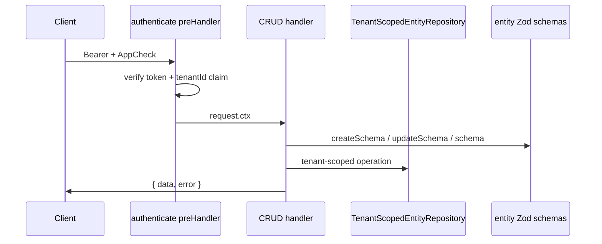

# CRUD route generator

Automatically registers REST endpoints for entities defined with `defineEntity()`.

## Entry point

[`registerCrudRoutes.ts`](./register-crud-routes.ts) — called from [`server.ts`](../server.ts) once per entity.

```ts
await registerCrudRoutes(server, {
  entity: Customer,
  repository: createInMemoryEntityRepository<CustomerRecord>(),
  authenticate: createAuthenticatePreHandler(firebaseAdminConfig),
});
```

## Design



### Validation layers

| Operation | Schema used                                                                  |
| --------- | ---------------------------------------------------------------------------- |
| POST      | `entity.createSchema` then full `entity.schema` after system field injection |
| PUT       | `entity.updateSchema` then full `entity.schema` after merge                  |
| GET       | No body validation                                                           |

System fields (`id`, `tenantId`, `createdAt`, `updatedAt`) are injected in handlers — never accepted from clients.

### Response envelope

| Module             | Role                                     |
| ------------------ | ---------------------------------------- |
| `response.ts`      | `successEnvelope`, `replyWithError`      |
| `errors.ts`        | Error code constants                     |
| `validation.ts`    | Zod → field error map                    |
| `error-handler.ts` | Global 500 handler for CRUD app instance |

## Extension points

### RBAC (Workstream 4)

Pass `requirePermission` preHandler to `registerCrudRoutes`:

```ts
await registerCrudRoutes(server, {
  entity: Customer,
  repository,
  authenticate,
  requirePermission: createRequirePermission("customer.read"), // future
});
```

Default: `noopPreHandler` (no enforcement).

### Firestore (Workstream 3)

Replace the repository — handlers stay unchanged:

```ts
repository: createFirestoreAdminEntityRepository(Customer, firebaseAdminConfig),
```

Port: [`TenantScopedEntityRepository`](../../../../packages/firestore-converters/src/entity/tenant-scoped-repository-contract.ts).

## Workarounds

| Topic                   | Notes                                                     |
| ----------------------- | --------------------------------------------------------- |
| In-memory storage       | Resets on restart; use for dev/tests until WS3            |
| `/auth/validate` format | Different response envelope — intentional backward compat |
| Empty `tenantId` claim  | Returns 403 `TENANT_NOT_RESOLVED`                         |
| Pagination cursor       | Opaque entity `id`; sorted lexicographically per tenant   |
| PUT semantics           | Partial update via `updateSchema`, not full replace       |

## Testing

- [`crud.routes.test.ts`](./crud.routes.test.ts) — integration tests via `server.inject`
- [`../repositories/in-memory-entity-repository.test.ts`](../repositories/in-memory-entity-repository.test.ts) — repository unit tests
