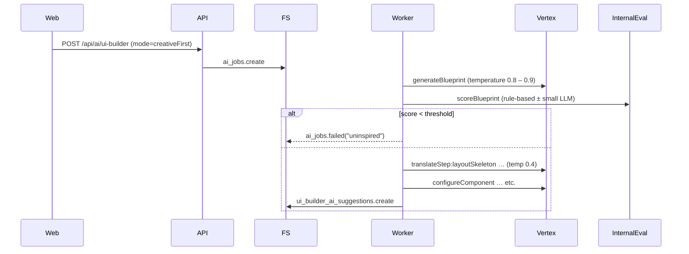

A-B Testing a “Creative-first, Spec-second” pipeline  
==================================================  
You want to let the model dream first, then bring it back to earth.  
That is feasible and often produces fresher UX, but you must bolt on a
few guard-rails so that the dream can still be translated into valid JSON.

Below is a concrete architecture (+ pros/cons and effort) you can drop
into your repo without throwing away the existing stepped orchestrator.

────────────────────────────────────────
0. Quick summary
────────────────────────────────────────
• Add a **Phase-0 : Concept pass** before the current step plan.  
• The concept pass produces a “Blueprint” document = pure natural
  language (or a light DSL) that describes wizard structure, visual
  metaphors, helper interactions, colour accents, etc.  
• The existing **Phase-1…N** steps then translate the Blueprint into
  fully-typed slices.  
• A tiny evaluator scores the Blueprint; if it’s bland the job aborts
  early and asks for a retry at higher temperature.

────────────────────────────────────────
1. New artefact: FormBlueprint
────────────────────────────────────────
Example (free-form, markdown allowed)

```
{
  "conceptName":  "Contract onboarding – colourful wizard",
  "presentation": "wizard",
  "visualTheme":  "left-rail progress, brand gradient header",
  "steps": [
    { "id": "overview",   "label": "Overview",   "goal": "basic identifiers", "maxFields": 3 },
    { "id": "parties",    "label": "Parties",    "goal": "provider & client", "maxFields": 4,
      "helper": "info-box -> 'Make sure the legal name matches certificate'" },
    { "id": "dates",      "label": "Dates",      "goal": "term & milestones", "maxFields": 3 },
    { "id": "financials", "label": "Financials", "goal": "amount, currency",
      "helper": "callout-warning -> 'Use company default currency'" },
    { "id": "review",     "label": "Review",     "readOnly": true }
  ],
  "footerLayout": "left=wizard-progress  right=Back/Next  far-right=Save draft"
}
```

Schema: `FormBlueprint` (loose, only a few required keys).

────────────────────────────────────────
2. Revised flow diagram
────────────────────────────────────────


────────────────────────────────────────
3. Implementation checklist
────────────────────────────────────────
3.1 Add new step type  
`forms.generateBlueprint` (phase “concept”) with output
`formBlueprintSchema`.

3.2 Blueprint prompt (system + user)  
System:

```
Pretend you are a senior product designer…
Output an imaginative FormBlueprint JSON (no comments) that elevates UX…
```

User context:

• Entity description  
• Field list & types  
• Theme snapshot  
• Known pain-points (“users always forget to set currency”)

3.3 Internal evaluator (optional but useful)  
`evaluate-form-blueprint.ts` returns 0-5.

Hard code reject criteria:  
• presentation === "plain" AND totalSteps === 1  
• any step.maxFields > 6  
• conceptName empty

Accept at score ≥3.

3.4 Pass Blueprint into step context  
In every later step add `ctx.blueprint` so the layout skeleton can map
wizard steps 1-to-1.

3.5 Translate Blueprint → wizardSteps / allocateFields  
Replace old `defineWizardSteps` + `allocateFieldsToSteps` with
`translateBlueprintSteps` that:

• uses the step ids & labels from Blueprint,  
• groups fields respecting `maxFields`,  
• injects helper components per `helper` key.

3.6 Fallback path  
Flag in submit body `allowCreative=false` keeps current deterministic
flow (needed for automated regression tests).

────────────────────────────────────────
4. Pros & cons
────────────────────────────────────────
Pros  
✓ Higher chance of novel layouts, colour usage, helper callouts.  
✓ Easier to iterate on *ideas* (you read a paragraph, not 600-line JSON).  
✓ Early evaluator can fail fast, saving Vertex tokens.

Cons / Risks  
✗ Two extra model calls → +20-25 % cost per job.  
✗ Blueprint may reference impossible ideas (video background) that
  translator must prune → need robust reconciliation logic.  
✗ Requires small additional code surface (blueprint schema, evaluator).

────────────────────────────────────────
5. Translator heuristics (turn prose into schema)
────────────────────────────────────────
Field allocation algorithm:

```
for step in blueprint.steps:
   bucket = []
   while len(bucket) < step.maxFields and fieldsLeft:
        pick next highest-priority field
   out[step.id] = bucket
```

Visual elements:

| Blueprint key        | JSON component(s)                     |
|----------------------|---------------------------------------|
| helper="info-box"    | `{ kind:"text", variant:"info", … }`  |
| helper="callout-warning" | `{ kind:"text", variant:"warning" }` |
| visualTheme=left-rail| add `wizard-progress` in shell layout |

Colour accent resolution:

```
if blueprint.visualTheme includes "brand gradient":
    shellLayout.styles.backgroundColor = theme.brandGradient
```

If something cannot be mapped, log warning and drop; do **not** fail the job.

────────────────────────────────────────
6. How much work?
────────────────────────────────────────
Task | Effort
---- | ------
Blueprint step + schema + prompt         | 0.5 d
Evaluator (rule-based)                   | 0.25 d
Wire ctx.blueprint into later steps      | 0.25 d
Replace define/allocate steps            | 0.5 d
Translator helpers + unit tests          | 0.75 d
Feature flag + API param                 | 0.25 d
Total                                    | ~2.5 d

────────────────────────────────────────
7. When to flip the switch?
────────────────────────────────────────
1. Pilot on **sandbox tenants** first; store both Blueprint and final slice in suggestions so designers can review.  
2. Compare manual rating of 20 suggestions vs baseline deterministic flow.  
3. If ≥70 % are “better or equal” and fail rate <5 %, turn on for
   production with temperature tuning.

────────────────────────────────────────
8. Roll-back plan
────────────────────────────────────────
Because the feature is behind the `allowCreative` flag you can revert to
the old flow instantly by toggling a default in `ai-ui-builder.schema.ts`
(no deploy needed on worker).

────────────────────────────────────────
TL;DR
• Add one imaginative “Blueprint” step at high temperature.  
• Score it quickly; if good, feed it into your existing strict pipeline.  
• Yields fresher wizards without sacrificing JSON validity.