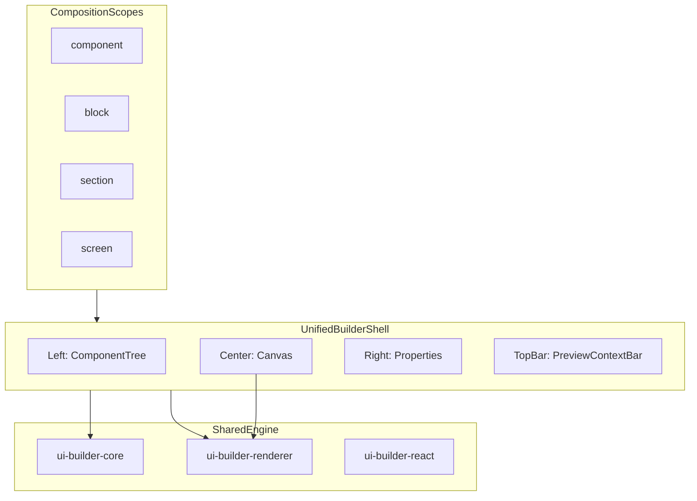

# UI Builder Unification — Master Plan

**Status:** Active implementation plan  
**Audience:** Engineers implementing the unified UI builder  
**Principles reference:** [UI-Builder-refactor-enhancement.md](./UI-Builder-refactor-enhancement.md)  
**Architecture index:** [UIMasterPlan.md](./UIMasterPlan.md)

---

## 1. Executive Summary

### Vision

One builder, multiple composition scopes. Every UI surface — dashboards, entity pages, forms, list cards, metrics — is edited through the same three-panel workbench:

- **Left:** Component tree
- **Center:** Canvas (preview = runtime via `RecursiveLayoutRenderer`)
- **Right:** Properties (layout + style + data binding)

Only **composition scope** and **preview context** change between editors.

### Reality Today

Six feature-specific designers share packages (`@repo/ui-builder-core`, `@repo/ui-builder-renderer`, `@repo/ui-builder-react`) but duplicate Provider/tabs/preview/snapshot logic. Layout mutations accidentally live in `form-designer-components-layout.ts`.

### Target Outcome

Users experience one consistent builder. Engineers maintain one shell (`UnifiedBuilderShell`) with thin scope adapters per route.

---

## 2. Core Principles

1. **One builder, multiple contexts** — scope changes, not the tool
2. **One layout system** — CSS Grid primary; Flex internal to components only
3. **No feature-specific UI logic** — templates instead of hardcoded types
4. **Preview = runtime** — same renderer; builder chrome is overlay-only
5. **Standardized roots** — Container (component/block/section) or ScreenRoot (screen)
6. **Layout ≠ Style** — never mix positioning with visual properties
7. **Progressive complexity** — templates → grid → full binding

---

## 3. Target Architecture



### Composition Scopes

| Scope | Description | Example | Root |
|-------|-------------|---------|------|
| Component | Small reusable unit | Input, Text, Metric KPI | Container |
| Block | Group of components | Card row, metric strip | Container |
| Section | Layout segment | Form section, dashboard section | Container |
| Screen | Full page | Main view, detail, dashboard | ScreenRoot (grid) |

### PreviewContext Rules

| Scope | Device Switcher | Width Slider | Container Frame |
|-------|-----------------|--------------|-----------------|
| component / block | No | Yes | Optional |
| section | No | Yes | Optional |
| screen | Yes | No | No |

Implemented in `@repo/ui-builder-core` as `PreviewContextConfig` and `resolvePreviewContextControls(scope)`.

---

## 4. Current State Inventory

### Packages

| Package | Path | Role |
|---------|------|------|
| `@repo/ui-builder-core` | `packages/ui-builder-core/` | Types, Zod, mutations, design surfaces |
| `@repo/ui-builder-renderer` | `packages/ui-builder-renderer/` | `RecursiveLayoutRenderer` |
| `@repo/ui-builder-react` | `packages/ui-builder-react/` | Structure panel, editors, layout binding |
| `@repo/ui-builder` | `packages/ui-builder/` | **Legacy** metadata engine (forms/tables) |
| `@repo/entities` | `packages/entities/src/ui/` | `EntityUIConfig`, overrides, slices |

### Layout JSON Model (current)

```
UiLayoutDocument
  └── root (LayoutRootNode: columnCount + columns[])
        └── ColumnNode (rows[], stackDirection, widthPercent, styles)
              └── RowNode = component only (grid + container components)
```

Target evolution: user-facing "columns" → "grid tracks"; `ColumnNode` retained in JSON for backward compatibility until migration.

### Designers (as-is)

| Designer | Route | Tabs | Persistence |
|----------|-------|------|-------------|
| Item List | `/settings/design-layout/list/:entity` | settings, columns, layout | `views`, `listItem` |
| Main View | `/settings/design-layout/main/:entity` | settings, layout | `mainPageLayout` |
| Detail View | `/settings/design-layout/detail/:entity` | settings, layout | `recordDetailLayout` |
| Forms | `/settings/design-layout/forms/:entity/:formId` | settings, layout, components | `forms`, `formDesigns` |
| Metrics Row | `/settings/design-layout/metrics/:entity` | settings, widgets, row | `metricWidgets`, `metricRowLayout` |
| Dashboard | `/settings/design-layout/dashboard` | sections, layout | `tenant_dashboard_layouts` |

### Data Flow

**Read:** Entity definitions + `entity_ui_overrides` → `GET /api/entities` → `EntityCatalogProvider` → runtime pages / designers.

**Write:** Designer hooks → `DesignLayoutSliceData` → `PUT /api/entities/:entityName/ui-override` → Firestore.

### Shared Integration

`apps/web/app/features/ui-builder/` — render contexts, `LayoutPreviewPanel`, presets, editor hooks.

`apps/web/app/features/unified-builder/` — **new** unified shell, preview context provider, scope adapters.

---

## 5. Gap Analysis

| # | Principle | Current State | Required Change | Status |
|---|-----------|---------------|-----------------|--------|
| 1 | One unified builder | 6 independent designer folders | `UnifiedBuilderShell` + scope adapters | In progress |
| 2 | PreviewContext system | Per-designer breakpoint + device duplication | `PreviewContextProvider` + scope gating | In progress |
| 3 | Column vs Container vs Grid | `ColumnNode` + container `stackDirection` | UI rename → grid tracks; container neutrality | Planned |
| 4 | Layout ≠ Style | Mixed in `StyleRule[]` | `LayoutProps` / `StyleProps` split | In progress |
| 5 | Standardized root | Per-designer init; `ensureContainerRoot` exists | `createDefaultLayoutDocument(scope)` + `ensureStandardRoot` | In progress |
| 6 | Preview = runtime | Extra designer CSS classes on renderer | Builder chrome overlay; parity tests | In progress |
| 7 | Single editing surface | columns/components/sections tabs | Absorb into tree + properties | Planned |
| 8 | Preset split | Single model with `fieldSlots` | `layout-preset` vs `component-template` | In progress |
| 9 | Templates not types | `ViewConfig.type` gates runtime | Insert templates; type = runtime preference | Planned |
| 10 | Shared kernel in packages | `form-designer-components-layout.ts` | `createLayoutEditorBinding` in ui-builder-react | In progress |
| 11 | Custom views incomplete | main/list/metrics only | Extend detail/forms routes | Planned |
| 12 | Runtime duplication | EntityPage ≈ CustomViewPage | `EntityMainPageShell` | In progress |
| 13 | Package naming | `@repo/ui-builder` collision | Alias `@repo/ui-metadata`; incremental rename | Documented |
| 14 | DesignSurface vs scope | 16+ surfaces | `resolveCompositionScope(surface)` | Done |
| 15 | Data binding | Ad-hoc `DataSource` | Binding panel + template placeholders | In progress |
| 16 | AI builder | Per-designer merge | Unified mutation API | Planned |

---

## 6. DesignSurface → CompositionScope Mapping

| DesignSurface(s) | CompositionScope |
|------------------|------------------|
| `metricWidget`, `tableColumnCell` | component |
| `listItem`, `metricRow`, `formPlain` | block |
| `recordDetail` (section), `formWizardStep`, `dashboardSection` | section |
| `mainPage`, `recordDetail` (full page), `dashboardLayout`, `formWizardShell` | screen |

Helper: `resolveCompositionScope(designSurface)` in `@repo/ui-builder-core`.

---

## 7. Feature Mapping (current → target)

| Current Feature | Target Scope | Route | Notes |
|-----------------|--------------|-------|-------|
| Dashboard | Screen | `/settings/design-layout/dashboard` | Sections → tree nodes |
| Main View | Screen | `/settings/design-layout/main/:entity` | First unified migration |
| Detail View | Screen | `/settings/design-layout/detail/:entity` | |
| Item List — card | Block | Same route | Absorb columns tab into properties |
| Item List — columns | Block metadata | Properties for `page-list` | |
| Forms — plain | Section | `/settings/design-layout/forms/:entity/:id` | |
| Forms — wizard | Screen + Section | Same route | Shell + steps in tree |
| Metrics — widget | Component | Widget editor | Width slider |
| Metrics — row | Block | Row tab → unified shell | |
| Presets | Templates | `/settings/design-layout/presets` | Split taxonomy |

---

## 8. JSON Schema Reference

### Component Tree Node (target abstraction)

```ts
interface ComponentTreeNode {
  id: string;
  kind: UiComponentKind | "grid" | "container";
  layout?: LayoutProps;
  styles?: StyleProps;
  dataBindings?: Record<string, DataSource | TemplatePlaceholder>;
  children?: ComponentTreeNode[];
}
```

### LayoutProps (grid-first)

```ts
interface LayoutProps {
  gridTemplateColumns?: string;
  gap?: string;
  alignItems?: LayoutAlign;
  stackDirection?: ColumnStackDirection;
  widthPercent?: number;
  displayFrom?: ResponsiveGridBreakpoint;
  displayTo?: ResponsiveGridBreakpoint;
}
```

### StyleProps

Visual-only subset of `StyleRule` — excludes `alignItems`, `justifyContent`, `gridColumns*`, `flex`, `flexWrap` at root layout level. See `LAYOUT_STYLE_PROPERTIES` and `VISUAL_STYLE_PROPERTIES` in `@repo/ui-builder-core`.

### Data Binding

```ts
type DataSource =
  | { type: "field"; path: string }
  | { type: "static"; value: unknown };

type TemplatePlaceholder = { type: "placeholder"; template: string };
// e.g. "{{entity.name}}", "{{metric.value}}"
```

### Backward Compatibility

Existing `UiLayoutDocument` deserializes unchanged. `ensureStandardRoot(scope, layout)` normalizes on load. `createDefaultLayoutDocument(scope)` creates canonical new documents.

---

## 9. Phased Implementation

### Phase 0 — Foundation & Schema

- `CompositionScope`, `PreviewContextConfig` types
- `createDefaultLayoutDocument(scope)`, `ensureStandardRoot(scope, layout)`
- `resolveCompositionScope(designSurface)`
- `LayoutProps` / `StyleProps` helpers
- Parity test harness in renderer package

### Phase 1 — Unified Builder Shell

- `apps/web/app/features/unified-builder/`
- `UnifiedBuilderShell`, `PreviewContextBar`, `BuilderScopeAdapter`
- `createLayoutEditorBinding` in `@repo/ui-builder-react`
- Migrate Main View designer layout tab

### Phase 2 — PreviewContext Rollout

- `PreviewContextProvider` with scope-gated controls
- Replace per-designer device/breakpoint duplication

### Phase 3 — Layout Model Evolution

- UI: "Columns" → "Grid tracks" in structure panel
- Container neutrality in renderer
- Root injection on load
- Layout/style editor split in properties panel
- Preset kind `"column"` → `"grid-track"` (alias retained)

### Phase 4 — Designer Migration

Order: Main View → Detail → Metrics → Item List → Forms → Dashboard

Per designer: `UnifiedBuilderShell` + adapter; collapse extra tabs into tree/properties; shared `useBuilderSession`.

### Phase 5 — Templates & Presets

- Split preset schema: `layout-preset` | `component-template`
- Placeholder resolution on insert (`resolveTemplatePlaceholders`)
- Built-in templates: table, wizard, card list, KPI strip

### Phase 6 — Runtime Consolidation

- `EntityMainPageShell` shared by EntityPage + CustomViewPage
- Preview parity test suite per surface
- Custom view design routes for detail/forms
- AI apply → unified mutation API *(deferred — see §15.13)*
- Legacy designer preview panels removed; all surfaces use `UnifiedDesignerPreviewPanel` + `PreviewContextBar` (no `designerPreviewLayoutFillClassName` on renderer)

### Phase 7 — Cleanup

- Designer folders reduced to route stubs + adapters
- Document `@repo/ui-builder` → `@repo/ui-metadata` rename path
- Update `UIMasterPlan.md` index
- Remove deprecated override aliases (`detailLayout`, etc.)

---

## 10. UX Strategy

| Level | Behavior |
|-------|----------|
| Level 1 (default) | Template gallery on insert; minimal properties |
| Level 2 | Grid/spacing controls in properties rail |
| Level 3 | Full tree editing, data binding, custom composition |

Properties panel sections collapsed by default except for selected node type.

---

## 11. Success Criteria

- [ ] All 6 designers use `UnifiedBuilderShell` for layout editing
- [ ] PreviewContext controls match scope rules
- [ ] Parity test suite passes for every `DesignSurface`
- [ ] No separate layout/components/columns tabs (absorbed into unified surface)
- [ ] Container neutrality conformance tests pass
- [ ] Presets split: layout vs component template
- [ ] New engineer can onboard from this document alone
- [ ] Zero regression in persisted layouts (backward-compatible read)

---

## 12. Risks & Mitigations

| Risk | Mitigation |
|------|------------|
| Migration breaks tenant layouts | Backward-compatible read; slice export before migration |
| Form wizard complexity | Multi-scope tree (shell + steps) |
| Column rename confuses users | UI-only rename first |
| Binding extraction breaks designers | Move with tests; one designer at a time |
| Dashboard sections differ | Map sections to tree nodes; separate save adapter |

---

## 13. Out of Scope (initial)

- Data hooks → layout component binding
- Full retirement of `@repo/ui-builder` FormLayout
- Real-time collaborative editing
- Canvas drag-and-drop (tree remains primary)

---

## 14. Key File Reference

| Concern | Path |
|---------|------|
| Composition / preview types | `packages/ui-builder-core/src/types/composition.ts` |
| Preview context | `packages/ui-builder-core/src/types/preview-context.ts` |
| Layout/style split | `packages/ui-builder-core/src/types/layout-props.ts` |
| Style validation | `packages/ui-builder-core/src/validation/validate-style-props.ts` |
| Grid migration | `packages/ui-builder-core/src/layout/migrate-to-grid.ts` |
| Standard root | `packages/ui-builder-core/src/layout/ensure-standard-root.ts` |
| Root adapters | `packages/ui-builder-core/src/layout/layout-root-adapters.ts` |
| Layout editor binding | `packages/ui-builder-react/src/layout/create-layout-editor-binding.ts` |
| Unified shell | `apps/web/app/features/unified-builder/` |
| Runtime shell | `apps/web/app/components/entity/EntityMainPageShell.tsx` |
| Template placeholders | `packages/ui-builder-core/src/presets/resolve-template-placeholders.ts` |
| Preset schema | `packages/entities/src/ui/ui-builder-preset-schema.ts` |
| Parity tests | `packages/ui-builder-renderer/src/layout/preview-runtime-parity.test.tsx` |

---

## 15. Critical Clarifications (Must Be Enforced)

### 15.1 Container vs Layout Components

Only two structural primitives: **Container** (neutral wrapper) and **Grid** (layout system). A 1-column layout is `Grid { gridTemplateColumns: "1fr" }`. No Column component. No layout logic inside Container.

Layouts are **grid-only** at authoring time. Legacy `nested-layout` row types are not supported — use `grid` component rows with per-track `container` children.

### 15.2 Layout vs Style (Strict Separation)

`LayoutProps` handles positioning; `StyleProps` handles visual appearance. Forbidden in styles: `justifyContent`, `alignItems`, `flex`, `gridColumn`, `gridRow`. Enforced via `validateStyleProps()`.

### 15.3 Root Component Standardization

| Scope | Root |
|-------|------|
| component / block / section | Container |
| screen | ScreenRoot (grid-based) |

Root is auto-injected via `ensureStandardRoot(scope, layout)` and non-removable in the tree.

**Load-path audit (forms):** `useEntityFormLayoutEditor` normalizes plain, wizard shell, and step layouts through `ensureContainerRoot` on init and definition reload.

**Load-path audit (screens):** `useEntityMainPageLayoutEditor`, `useEntityRecordDetailLayoutEditor`, and runtime `EntityMainPageShell` call `ensureStandardRoot("screen", …)`.

**Load-path audit (block/component):** dashboard, metrics, and list editors use `ensureContainerRoot`.

### 15.4 Preview Context Is Not Optional

Preview is fully driven by `PreviewContextConfig` + `PreviewContextProvider`. Device switcher only for `screen`. Width slider for component/block/section.

### 15.5 Templates Replace Hardcoded UI Types

Built-in presets are the SSOT for system layouts (`plain-form`, `plain-table-list`, `card-list`, `expandable-table-list`, `wizard-form`, `kpi-strip`). Runtime derives list presentation from layout shape; `listViewType` is a persisted fallback only.

### 15.6 Forms Are Not Special

Forms are compositions with input components. Wizard = screen + sections. No form-specific layout engine in the unified shell.

### 15.7 Unified Editing Surface

Single workbench: tree + canvas + properties. No layout/components/columns tabs for structure editing.

### 15.8 Presets System Simplification

`layout-preset` (structure only, no fieldSlots) vs `component-template` (supports `{{entity.name}}` placeholders). Binding happens after insertion.

### 15.9 Runtime Must Be Pure

`EntityMainPageShell` + `RecursiveLayoutRenderer` with no preview-only style overrides. Builder chrome is overlay-only.

### 15.10 Flex Usage Restriction

Flex only inside components. Grid is the only composition layout system.

### 15.11 Width and Responsiveness Model

Screen → responsive breakpoints (device switcher). All other scopes → width constraint simulation (slider).

### 15.12 Builder = Composition Engine

`UnifiedBuilderShell` knows only components, layout, and data binding. Feature knowledge lives in scope adapters only.

### 15.13 Deferred / Remaining Enforcement

| Item | Status |
|------|--------|
| AI apply → unified mutation API | **Deferred.** Per-designer merge helpers (`merge-*-slice-for-apply`) remain; converging on one mutation path is out of scope for Phase 6. |

### Package Rename Note

`@repo/ui-builder` (legacy metadata engine) will migrate to `@repo/ui-metadata` incrementally. Visual builder packages remain `ui-builder-core`, `ui-builder-renderer`, `ui-builder-react`.
