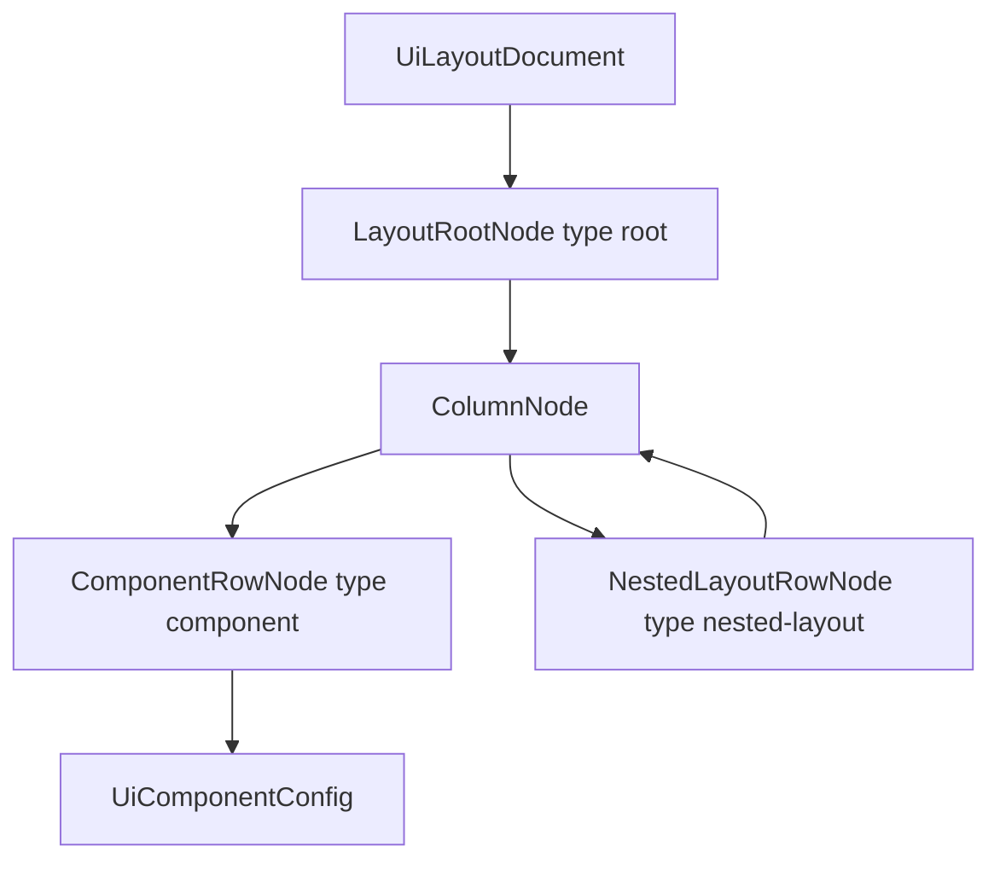

# UI Builder output JSON specification

This document describes the **exact JSON shape** produced by the UI Builder and persisted for entity **card list** layouts. It matches:

- **Validation:** [`packages/ui-builder-core/src/schema/ui-layout-schema.ts`](../packages/ui-builder-core/src/schema/ui-layout-schema.ts) (`uiLayoutDocumentSchema`)
- **Types:** [`packages/ui-builder-core/src/types/`](../packages/ui-builder-core/src/types/)
- **Storage:** `ViewConfig.layout` on entity UI overrides (Firestore `entity_ui_overrides`, validated via [`packages/entities/src/ui/validate-ui-config.ts`](../packages/entities/src/ui/validate-ui-config.ts))

A hand-written JSON file that satisfies this spec should render the same as a layout saved from the builder.

---

## Where this JSON lives

`UiLayoutDocument` JSON is stored on **entity UI overrides** (`entity_ui_overrides` collection). Top-level keys (all optional except `views` on write):

| Key | Surface | Description |
|-----|---------|-------------|
| `mainPage` | Main View (`/app/:entity`) | Toolbar, metrics, and list container slots |
| `listItem` | Item list | Canonical per-record list layout (preferred) |
| `recordDetail` | Detailed View (`/app/:entity/:id`) | Record detail page layout |
| `detail` | (read alias) | Legacy key; merged as `recordDetail` on read |
| `forms.presentation` | Forms | `"plain"` (default) or `"wizard"` |
| `forms.layout` | Forms | Shared plain form layout (copied to create + edit on merge) |
| `forms.wizard` | Forms | Wizard shell + steps (when `presentation` is `"wizard"`) |
| `forms.create` / `forms.edit` | Forms | Legacy per-mode layouts; still read if `forms.layout` is absent |
| `views[].layout` | Legacy | Card view layout; used when `listItem` is absent |
| `views[].metricStripLayout` | Metrics row | Full strip layout above the entity list (columns, rows, slots, styles; table view only) |

Example override document:

```json
{
  "entityName": "account",
  "listViewType": "card",
  "mainPage": { "root": { } },
  "listItem": { "root": { } },
  "recordDetail": { "root": { } },
  "forms": {
    "presentation": "plain",
    "layout": { "root": { } }
  },
  "views": [
    {
      "type": "table",
      "name": "default",
      "fields": ["name", "balance"]
    },
    {
      "type": "card",
      "name": "card",
      "fields": ["name", "balance", "bankId.logo"],
      "layout": { }
    }
  ],
  "updatedAt": "2026-06-03T12:00:00.000Z"
}
```

**Rendering:** list surfaces use `listItem ?? cardView.layout`. The sibling `fields` array on views remains for table column metadata; card/list item rendering uses paths inside the layout tree only.

### Expandable table view (`type: "expandableTable"`)

Replaces the legacy `compact` list presentation. Persist with `listViewType: "expandableTable"`.

| Property | Type | Required | Description |
|----------|------|----------|-------------|
| `fields` | `string[]` | yes | Flat field list for toolbar sort/filter/search |
| `columns` | `GroupedTableColumn[]` | yes | Collapsed row columns (each has `cellLayout: UiLayoutDocument`) |
| `rowExpandLayout` | `UiLayoutDocument` | yes | Full-width panel when a row is expanded |
| `showActions` | `boolean` | no | Row actions column (default true) |

```json
{
  "type": "expandableTable",
  "name": "expandable",
  "fields": ["name", "balance", "status"],
  "columns": [
    {
      "id": "summary",
      "label": "Summary",
      "cellLayout": { "root": { } }
    }
  ],
  "rowExpandLayout": { "root": { } },
  "showActions": true
}
```

---

## Metrics row (`views[].metricStripLayout`, table view)

Configured in **Design layout → Metrics row**. The strip is a full `UiLayoutDocument` (same tree model as list item / card layouts): root columns, component rows, nested layouts, style rules, and motion presets.

**Design surface:** `metricStrip`. Allowed slot kinds: `text`, `image`, `date`, `numeric`, `badge`, `metric-kpi`.

**Runtime:** `EntityViewMetricsStrip` renders the layout with `RecursiveLayoutRenderer`. `metric-kpi` slots hold `metricDefinitionId`, `groupBindings`, and `dimensionBindings`; the slot renders only the fetched value (labels/chrome are sibling slots).

### Example strip layout

```json
{
  "metricStripLayout": {
    "root": {
      "type": "root",
      "id": "metric-strip-root",
      "columnCount": 2,
      "columns": [
        {
          "id": "col_label",
          "rows": [
            {
              "type": "component",
              "id": "row_label",
              "component": {
                "kind": "text",
                "primary": { "type": "static", "value": "Total balance" },
                "styles": [{ "property": "fontWeight", "value": "bold" }]
              }
            }
          ]
        },
        {
          "id": "col_value",
          "rows": [
            {
              "type": "component",
              "id": "row_kpi",
              "component": {
                "kind": "metric-kpi",
                "metricDefinitionId": "total-balance-usd",
                "groupBindings": {
                  "currency": { "type": "listFilter", "field": "currency" }
                },
                "dimensionBindings": {}
              }
            }
          ]
        }
      ]
    }
  }
}
```

---

## Top-level document: `UiLayoutDocument`

| Property | Type | Required | Constraints | Description |
|----------|------|----------|-------------|-------------|
| `root` | `LayoutRootNode` | **yes** | — | Recursive layout tree entry point |
| `showActions` | `boolean` | no | — | When `false`, hides the card actions menu (⋯). Default in seeds: `true` |
| `cardsPerRow` | `integer` | no | `1`–`4` | How many card previews/columns appear per row on the entity list grid |

### Invariants (enforced by schema)

1. **`root.columnCount` must equal `root.columns.length`** (integer `1`–`6`). Enforced by `uiLayoutDocumentSchema.superRefine`.
2. For every **`nested-layout`** row, **`columnCount` must equal `columns.length`** (integer `1`–`6`). Not enforced by Zod today, but the renderer passes `columnCount` into the grid API — a mismatch will produce incorrect column tracks.
3. Objects are **strict**: unknown keys are rejected by validation.
4. All `id` fields: non-empty string after trim.
5. Discriminator fields (`type`, `kind`) must match the documented literals exactly.

---

## Layout tree (recursive model)



### `LayoutRootNode`

| Property | Type | Required | Constraints |
|----------|------|----------|-------------|
| `type` | `"root"` | **yes** | literal |
| `id` | `string` | **yes** | non-empty |
| `columnCount` | `integer` | **yes** | `1`–`6`, must match `columns.length` |
| `columns` | `ColumnNode[]` | **yes** | min length `1` |
| `styles` | `StyleRule[]` | no | see [Style rules](#style-rules) |

**Rendering:** `styles.gap` sets horizontal gap between root columns. [Responsive grid](#responsive-grid-layout) style rules control how many columns appear at each viewport breakpoint. Other `styles` apply to the root wrapper; `alignItems` / `justifyContent` map to the root column stack/grid alignment API.

---

### `ColumnNode`

| Property | Type | Required | Constraints |
|----------|------|----------|-------------|
| `id` | `string` | **yes** | non-empty |
| `rows` | `RowNode[]` | **yes** | may be empty `[]` |
| `stackDirection` | `"column"` \| `"row"` | no | Default `"column"` (vertical). `"row"` stacks component rows horizontally |
| `styles` | `StyleRule[]` | no | |

**Rendering:** Column shell fills the grid cell height. `stackDirection` controls whether rows in this column use a vertical or horizontal flex stack. `styles.gap` = gap between rows/slots in that stack. `alignItems` / `justifyContent` on the column drive the inner `LayoutStack`.

---

### `RowNode` (discriminated union on `type`)

#### `ComponentRowNode` — `type: "component"`

| Property | Type | Required |
|----------|------|----------|
| `type` | `"component"` | **yes** |
| `id` | `string` | **yes** |
| `component` | `UiComponentConfig` | **yes** |
| `styles` | `StyleRule[]` | no |
| `displayFrom` | `"base"` \| `"sm"` \| `"md"` \| `"lg"` \| `"xl"` | no | First breakpoint where row is visible (default: `base`) |
| `displayTo` | `"base"` \| `"sm"` \| `"md"` \| `"lg"` \| `"xl"` | no | Last breakpoint where row is visible (default: `xl`) |

**Rendering:** `row.styles` → wrapper around the slot. `component.styles` → slot text vs container (see [Style application](#style-application-at-render-time)). [Screen visibility](#screen-visibility) controls which viewport breakpoints render this row.

#### `NestedLayoutRowNode` — `type: "nested-layout"`

| Property | Type | Required | Constraints |
|----------|------|----------|-------------|
| `type` | `"nested-layout"` | **yes** | literal |
| `id` | `string` | **yes** | non-empty |
| `columnCount` | `integer` | **yes** | `1`–`6`, must match `columns.length` |
| `columns` | `ColumnNode[]` | **yes** | min length `1` |
| `styles` | `StyleRule[]` | no | |
| `displayFrom` | `"base"` \| `"sm"` \| `"md"` \| `"lg"` \| `"xl"` | no | First breakpoint where row is visible (default: `base`) |
| `displayTo` | `"base"` \| `"sm"` \| `"md"` \| `"lg"` \| `"xl"` | no | Last breakpoint where row is visible (default: `xl`) |

**Rendering:** `styles.gap` = horizontal gap between nested columns. [Responsive grid](#responsive-grid-layout) style rules control breakpoint column counts. [Screen visibility](#screen-visibility) controls which viewports render the entire nested row. Nested columns reuse the same `ColumnNode` shape (recursive).

---

## `UiComponentConfig` (discriminated union on `kind`)

### Shared base: field components (`text` | `image` | `date` | `numeric` | `badge`)

| Property | Type | Required | Description |
|----------|------|----------|-------------|
| `kind` | see below | **yes** | component discriminator |
| `primary` | `DataSource` | **yes** | main data binding |
| `fallbacks` | `DataSource[]` | no | tried in order after primary |
| `label` | `LabelConfig` | no | field label chrome |
| `styles` | `StyleRule[]` | no | slot-level styles |
| `conditionalStyles` | `ConditionalStyleRule[]` | no | **badge only** (meaningful); ignored for other kinds in practice |

### `kind: "text"`

No extra properties. Value is formatted from entity field metadata (type, display format).

### `kind: "image"`

| Property | Type | Required | Constraints |
|----------|------|----------|-------------|
| `imageSize` | `integer` | no | `24`–`96` (pixels, square box) |

**Data resolution:** Walks `primary` then `fallbacks` field paths; uses first path where an image file is present. If none, uses primary field’s `defaultImage` on the entity definition (not a layout JSON field).

### `kind: "date"`

| Property | Type | Required | Allowed values |
|----------|------|----------|----------------|
| `dateDisplayFormat` | `string` | no | `"date"` \| `"datetime"` \| `"time"` |

Default renderer behavior if omitted: `"datetime"`.

### `kind: "numeric"`

| Property | Type | Required | Allowed values |
|----------|------|----------|----------------|
| `displayFormat` | `string` | no | `"plain"` \| `"currency"` \| `"percentage"` |
| `showCurrency` | `boolean` | no | When `true`, shows currency code suffix from layout context (e.g. USD). Default: `false` |
| `showToneColors` | `boolean` | no | When `true`, positive = green, negative = red. Default: `false` |

Default `displayFormat` if omitted: `"plain"`. `"currency"` formats the number with currency symbols; `showCurrency` controls the separate code label below the amount.

### `kind: "badge"`

No extra properties. Uses `conditionalStyles` for value → color/variant mapping.

### `kind: "metric-kpi"`

Does **not** use `primary` / `fallbacks` / `label` / `conditionalStyles`.

| Property | Type | Required | Description |
|----------|------|----------|-------------|
| `metricDefinitionId` | `string` | **yes** | non-empty metric definition id |
| `groupBindings` | `Record<string, MetricBindingSource>` | **yes** | may be `{}` |
| `dimensionBindings` | `Record<string, MetricBindingSource>` | **yes** | may be `{}` |
| `label` | `string` | no | display title override |
| `styles` | `StyleRule[]` | no | |

### Form layout components

| `kind` | Surface | Notes |
|--------|---------|-------|
| `form-field` | `formPlain`, `formWizardStep` | `fieldPath` required |
| `form-section` | plain / wizard step | optional `title` |
| `form-actions` | `formPlain` only | submit/cancel row |
| `wizard-progress` | `formWizardShell` | `variant`: `"steps"` (default), `"bar"`, or `"stepper"`. Steps variant: `conditionalStyles` match `pending` \| `active` \| `completed` \| `invalid`. Bar variant: optional `stepLabel` (aggregate "Step x of N" label), `barTrackColor`, `barFillColor`. Stepper variant: horizontal circles + connectors; per-step labels from wizard step definitions styled via `stepLabel` (`position`, stylization, `fontSize`, hide); layout via optional `stepSpacing`, `circleSize`, `labelMaxWidth` (px); circle/label/connector colors via `conditionalStyles` |
| `wizard-step-host` | `formWizardShell` | mounts active step layout at runtime |
| `wizard-actions` | `formWizardShell` | footer: optional `nextLabel`, `backLabel`, `cancelLabel`, `submitCreateLabel`, `submitEditLabel` |

### Wizard override (`forms.wizard`)

Required when `forms.presentation` is `"wizard"`. Shell layout must include all three wizard slot kinds (validated on save).

```json
{
  "presentation": "wizard",
  "wizard": {
    "shellLayout": { "root": { } },
    "steps": [
      {
        "id": "step_details",
        "label": "Details",
        "subtitle": "Basic info",
        "icon": "User",
        "layout": { "root": { } }
      }
    ]
  }
}
```

| Property | Type | Required |
|----------|------|----------|
| `shellLayout` | `UiLayoutDocument` | **yes** |
| `steps` | array (min 1) | **yes** |
| `steps[].id` | `string` | **yes**, unique |
| `steps[].label` | `string` | **yes** |
| `steps[].layout` | `UiLayoutDocument` | **yes** |
| `steps[].subtitle` | `string` | no |
| `steps[].icon` | `string` | no (Lucide icon name) |

Runtime: one shared wizard for create and edit; submit label comes from `wizard-actions` config and mode (`submitCreateLabel` / `submitEditLabel`). Submit is shown only on the last step.

---

## `DataSource`

Discriminated union on `type`.

### `type: "field"`

| Property | Type | Required |
|----------|------|----------|
| `type` | `"field"` | **yes** |
| `path` | `string` | **yes** | non-empty after trim |

### `type: "static"`

| Property | Type | Required |
|----------|------|----------|
| `type` | `"static"` | **yes** |
| `value` | `string` | **yes** | any string (may be empty; empty static is skipped in resolution) |

### Field path rules (validation at save time)

Paths must be valid for the entity definition:

| Form | Example | Rule |
|------|---------|------|
| Top-level field | `"balance"` | Key exists on entity (or allowed system field) |
| System fields | `"id"`, `"createdAt"`, `"updatedAt"` | Always allowed |
| Relation subfield | `"bankId.logo"` | `bankId` (or target alias `bank`) is **many-to-one** or **one-to-one**; `logo` exists on target entity when catalog is available |

Relation paths use the **foreign key field name** on the parent entity (e.g. `bankId`), not only the target entity name.

**Not validated in layout JSON:** metric KPI bindings use separate binding types.

---

## `LabelConfig`

| Property | Type | Allowed values | Default behavior |
|----------|------|----------------|------------------|
| `show` | `boolean` | — | `false` → no label |
| `text` | `string` | — | if set, used instead of auto label from field path |
| `position` | `string` | `"above"` \| `"below"` | `"above"` |
| `bold` | `boolean` | — | |
| `thin` | `boolean` | — | |
| `italic` | `boolean` | — | |
| `underline` | `boolean` | — | |
| `color` | `string` | `"default"` \| `"muted"` \| `"primary"` \| `"success"` \| `"warning"` \| `"danger"` \| `"info"` | |
| `align` | `string` | `"left"` \| `"center"` \| `"right"` | |

If `show` is true and `text` is omitted, the renderer resolves a label from the field path and entity definitions (including relation labels like `"Bank Logo"` for `bankId.logo`).

---

## `ConditionalStyleRule` (badge)

| Property | Type | Required | Description |
|----------|------|----------|-------------|
| `matchValue` | `string` | **yes** | compared to stringified raw field value (trimmed) |
| `background` | `ThemeToken` | no | badge background token |
| `textColor` | `ThemeToken` | no | badge text token |
| `badgeVariant` | `BadgeVariant` | no | semantic badge variant |

### `BadgeVariant`

`"success"` | `"warning"` | `"danger"` | `"info"` | `"default"` | `"active"` | `"pending"` | `"closed"` | `"neutral"`

First matching rule wins (document order).

---

## `MetricBindingSource`

Discriminated union on `type`. Keys in `groupBindings` / `dimensionBindings` are metric parameter names from the metric definition.

| `type` | Fields | Value types |
|--------|--------|-------------|
| `"static"` | `value` | `string` \| `number` \| `boolean` |
| `"entityField"` | `fieldPath` | non-empty string |
| `"listFilter"` | `field` | non-empty string (list filter field name) |
| `"routeParam"` | `param` | non-empty string (route param name) |

---

## Style rules

### `StyleRule` object

| Property | Type | Required |
|----------|------|----------|
| `property` | `StylePropertyKey` | **yes** |
| `value` | `string` \| `ThemeToken` | **yes** |

Duplicate `property` entries in one `styles` array: last writer wins in the builder UI; avoid duplicates in hand-authored JSON.

### `StylePropertyKey` (all allowed `property` values)

| Property | Value kind | Accepted values | Notes |
|----------|------------|-----------------|-------|
| `marginTop` | numeric string | integer ≥ 0 (px) | Inline `marginTop` (not Tailwind) |
| `marginBottom` | numeric string | integer ≥ 0 (px) | Inline `marginBottom` |
| `marginLeft` | numeric string | integer ≥ 0 (px) | Inline `marginLeft` |
| `marginRight` | numeric string | integer ≥ 0 (px) | Inline `marginRight` |
| `paddingTop` | numeric string | integer ≥ 0 (px) | Inline `paddingTop` |
| `paddingBottom` | numeric string | integer ≥ 0 (px) | Inline `paddingBottom` |
| `paddingLeft` | numeric string | integer ≥ 0 (px) | Inline `paddingLeft` |
| `paddingRight` | numeric string | integer ≥ 0 (px) | Inline `paddingRight` |
| `padding` | numeric string | integer ≥ 0 (px) | Inline `padding` (all sides) |
| `gap` | numeric string | integer ≥ 0 (px) | **layout only:** see below |
| `gridColumns` | numeric string | `"1"`–`"6"` | **layout only:** base (mobile-first) column count |
| `gridColumnsSm` | numeric string | `"1"`–`"6"` | **layout only:** `sm` (640px+) column count |
| `gridColumnsMd` | numeric string | `"1"`–`"6"` | **layout only:** `md` (768px+) column count |
| `gridColumnsLg` | numeric string | `"1"`–`"6"` | **layout only:** `lg` (1024px+) column count |
| `gridColumnsXl` | numeric string | `"1"`–`"6"` | **layout only:** `xl` (1280px+) column count |
| `gridAutoFitMinWidth` | numeric string | integer > 0 (px) | **layout only:** auto-fit min track width |
| `gridResponsiveMode` | enum string | `"fixed"` \| `"auto"` | **layout only:** opt out of auto defaults (`fixed` = legacy fixed grid) |
| `backgroundColor` | `ThemeToken` | see tokens | |
| `color` | `ThemeToken` | see tokens | text/value color on components |
| `fontSize` | numeric string | integer > 0 (px) | Applied as inline `fontSize` on the field value (not a Tailwind class) |
| `fontWeight` | enum string | `"bold"` \| `"thin"` \| `"normal"` | |
| `fontStyle` | enum string | `"italic"` | |
| `textDecoration` | enum string | `"underline"` | |
| `textAlign` | enum string | `"left"` \| `"center"` \| `"right"` | |
| `alignItems` | enum string | `"start"` \| `"center"` \| `"end"` \| `"stretch"` | flex cross-axis |
| `justifyContent` | enum string | `"start"` \| `"center"` \| `"end"` \| `"between"` | flex main-axis |
| `alignSelf` | enum string | `"start"` \| `"center"` \| `"end"` \| `"stretch"` | flex item self-align |
| `flex` | string | e.g. `"0"`, `"1"`, `"auto"` | passed to CSS `flex-[value]` |
| `minWidth` | numeric string | integer (px) | |
| `maxWidth` | numeric string | integer (px) | |
| `borderRadius` | numeric string | integer ≥ 0 (px) | |
| `borderWidth` | numeric string | integer > 0 (px) | |
| `borderColor` | `ThemeToken` | see tokens | |

### `ThemeToken` (for token-based properties)

`"default"` | `"muted"` | `"primary"` | `"success"` | `"warning"` | `"danger"` | `"info"` | `"background"` | `"foreground"` | `"transparent"`

**Note:** `danger` maps to theme **destructive** color in the renderer (`text-destructive`, `border-destructive`, etc.).

### Where `gap` applies

| Node | `gap` effect |
|------|----------------|
| `root` | Horizontal gap between root columns |
| `nested-layout` row | Horizontal gap between nested columns |
| `column` | Vertical gap between rows in that column |

Default gap is **0** if omitted (no implicit spacing).

### Responsive grid layout

Responsive grid rules apply only to **`root.styles`** and **`nested-layout` row `styles`** (the horizontal column grid for that layout node). They do not apply to `column.styles` or component rows.

**Resolution priority** (per layout node):

1. **`gridAutoFitMinWidth`** — container-driven wrap: `repeat(auto-fit, minmax(min(100%, Xpx), 1fr))`.
2. **Explicit `gridColumns*`** — Tailwind responsive classes (`grid-cols-1 md:grid-cols-2`, etc.).
3. **Auto default** — when `columnCount >= 2`, no auto-fit rule, no explicit `gridColumns*`, and `gridResponsiveMode !== "fixed"`: stack on mobile, scale up on larger breakpoints.
4. **Legacy fixed grid** — when `columnCount === 1`, `gridResponsiveMode: "fixed"`, or no responsive rules apply: fixed `minmax(0, Nfr)` tracks from `widthPercent`.

**Auto default** (for `columnCount >= 2` with no explicit rules):

| Breakpoint | Columns |
|------------|---------|
| base | `1` |
| `sm` (640px+) | `min(2, columnCount)` |
| `lg` (1024px+) | `min(3, columnCount)` |
| `xl` (1280px+) | `columnCount` |

Each resolved count is clamped to `1..min(columnCount, slotCount, 6)`.

**Width percent:** In fixed (legacy) mode, `widthPercent` on columns drives `minmax(0, Nfr)` tracks. In responsive or auto-fit modes, tracks are equal width at each breakpoint and **`widthPercent` is ignored**.

**Example — two form fields side-by-side on tablet/desktop, stacked on mobile** (auto default; no extra rules required):

```json
{
  "type": "nested-layout",
  "id": "row_contract_fields",
  "columnCount": 2,
  "styles": [{ "property": "gap", "value": "20" }],
  "columns": []
}
```

Explicit override (stack until `md`, then two columns):

```json
"styles": [
  { "property": "gap", "value": "20" },
  { "property": "gridColumns", "value": "1" },
  { "property": "gridColumnsMd", "value": "2" }
]
```

Prefer responsive grid over legacy `flexWrap` for side-by-side fields; `flexWrap` with `gap` often wraps immediately when column widths plus gap exceed 100%.

### Screen visibility

`displayFrom` and `displayTo` on **`component`** and **`nested-layout`** rows control which viewport breakpoints render that row. Omitted fields mean **all screens** (`base` through `xl`).

Breakpoints match Tailwind defaults:

| Value | Viewport |
|-------|----------|
| `base` | Mobile (default, &lt; 640px) |
| `sm` | 640px+ |
| `md` | 768px+ (tablet) |
| `lg` | 1024px+ (desktop) |
| `xl` | 1280px+ |

The range is **inclusive**. Rows outside the range use `display: none` and do not occupy layout space.

**Example — field visible on tablet and desktop only:**

```json
{
  "type": "component",
  "id": "row_category",
  "displayFrom": "md",
  "displayTo": "xl",
  "component": { "kind": "form-field", "fieldPath": "categoryId" }
}
```

**Example — mobile-only row:**

```json
{
  "type": "component",
  "displayFrom": "base",
  "displayTo": "base",
  "component": { "kind": "text", "primary": { "type": "static", "value": "Compact hint" } }
}
```

### Style application at render time

| Attachment point | Container styles | Text/value styles | Flex layout (`alignItems`, `justifyContent`, `alignSelf`) |
|------------------|------------------|-------------------|-----------------------------------------------------------|
| `component.styles` | padding, background, border, size, etc. | `color`, `fontSize`, `fontWeight`, `textAlign`, … | `alignSelf`, `alignItems`, `justifyContent` on slot wrapper |
| `row.styles` (component row) | merged on row wrapper | — | |
| `column.styles` | column shell | — | stack align/justify |
| `root.styles` | root wrapper | — | root grid align/justify via `gap`; responsive grid column counts |

---

## Data resolution (field components)

Order of operations in [`resolveFieldChain`](../packages/ui-builder-core/src/resolver/data-source.ts):

1. If any `static` primary/fallback has non-empty `value` → use that string (no field path).
2. Else walk field paths: **primary**, then **fallbacks** in order.
3. For each path, load value from the record (and relation targets for nested paths).
4. **Presence:**
   - **image:** file reference with URL, or resolvable download target
   - **other kinds:** non-null, non-empty string, or other non-null values
5. If no path is “present”, the **last** path in the chain is still used for display (may show empty / default image).

---

## Minimal valid example

```json
{
  "root": {
    "type": "root",
    "id": "root_1",
    "columnCount": 1,
    "columns": [
      {
        "id": "col_1",
        "rows": [
          {
            "type": "component",
            "id": "row_1",
            "component": {
              "kind": "text",
              "primary": { "type": "field", "path": "name" }
            }
          }
        ]
      }
    ]
  }
}
```

---

## Full example (account card seed)

This matches [`createAccountCardSeedLayout()`](../packages/ui-builder-core/src/builder/defaults.ts) — suitable as a reference implementation.

```json
{
  "showActions": true,
  "root": {
    "type": "root",
    "id": "root_seed",
    "columnCount": 3,
    "columns": [
      {
        "id": "col_logo",
        "rows": [
          {
            "type": "component",
            "id": "row_logo",
            "component": {
              "kind": "image",
              "primary": { "type": "field", "path": "bankId.logo" },
              "styles": [
                { "property": "alignItems", "value": "center" },
                { "property": "justifyContent", "value": "center" }
              ]
            }
          }
        ]
      },
      {
        "id": "col_info",
        "rows": [
          {
            "type": "component",
            "id": "row_name",
            "component": {
              "kind": "text",
              "primary": { "type": "field", "path": "name" },
              "styles": [{ "property": "fontSize", "value": "16" }]
            }
          },
          {
            "type": "component",
            "id": "row_type",
            "component": {
              "kind": "text",
              "primary": { "type": "field", "path": "accountTypeId" },
              "styles": [{ "property": "color", "value": "muted" }]
            }
          },
          {
            "type": "component",
            "id": "row_currency",
            "component": {
              "kind": "text",
              "primary": { "type": "field", "path": "currencyId" },
              "label": { "show": true, "text": "Currency" }
            }
          },
          {
            "type": "component",
            "id": "row_balance_label",
            "component": {
              "kind": "text",
              "primary": { "type": "field", "path": "balance" },
              "label": { "show": true, "text": "Balance" }
            }
          }
        ]
      },
      {
        "id": "col_amount",
        "styles": [{ "property": "alignItems", "value": "end" }],
        "rows": [
          {
            "type": "component",
            "id": "row_amount",
            "component": {
              "kind": "numeric",
              "primary": { "type": "field", "path": "balance" },
              "displayFormat": "plain"
            }
          },
          {
            "type": "component",
            "id": "row_created",
            "component": {
              "kind": "text",
              "primary": { "type": "field", "path": "createdAt" },
              "label": { "show": true, "text": "Created" }
            }
          },
          {
            "type": "component",
            "id": "row_updated",
            "component": {
              "kind": "text",
              "primary": { "type": "field", "path": "updatedAt" },
              "label": { "show": true, "text": "Updated" }
            }
          }
        ]
      }
    ]
  }
}
```

---

## Nested layout example

```json
{
  "root": {
    "type": "root",
    "id": "root_1",
    "columnCount": 1,
    "columns": [
      {
        "id": "col_1",
        "rows": [
          {
            "type": "nested-layout",
            "id": "row_nested_1",
            "columnCount": 2,
            "styles": [{ "property": "gap", "value": "12" }],
            "columns": [
              {
                "id": "col_left",
                "rows": [
                  {
                    "type": "component",
                    "id": "row_a",
                    "component": {
                      "kind": "text",
                      "primary": { "type": "field", "path": "name" }
                    }
                  }
                ]
              },
              {
                "id": "col_right",
                "styles": [{ "property": "backgroundColor", "value": "muted" }],
                "rows": [
                  {
                    "type": "component",
                    "id": "row_b",
                    "component": {
                      "kind": "numeric",
                      "primary": { "type": "field", "path": "balance" },
                      "displayFormat": "plain"
                    }
                  }
                ]
              }
            ]
          }
        ]
      }
    ]
  }
}
```

---

## Badge with conditional styles

```json
{
  "kind": "badge",
  "primary": { "type": "field", "path": "status" },
  "conditionalStyles": [
    {
      "matchValue": "active",
      "badgeVariant": "success",
      "textColor": "success"
    },
    {
      "matchValue": "closed",
      "badgeVariant": "neutral",
      "textColor": "muted"
    }
  ]
}
```

---

## Metric KPI component

```json
{
  "kind": "metric-kpi",
  "metricDefinitionId": "total-balance-usd",
  "groupBindings": {
    "currency": { "type": "entityField", "fieldPath": "currencyId" }
  },
  "dimensionBindings": {
    "accountId": { "type": "entityField", "fieldPath": "id" }
  },
  "label": "Balance KPI",
  "styles": [{ "property": "color", "value": "primary" }]
}
```

---

## Validating hand-authored JSON

**Runtime (TypeScript):**

```ts
import { uiLayoutDocumentSchema } from "@repo/ui-builder-core";

const result = uiLayoutDocumentSchema.safeParse(json);
```

**With entity field checks** (after Zod passes):

```ts
import { assertLayoutFieldPaths } from "@repo/ui-builder-core";

assertLayoutFieldPaths(entityDefinition, layout, "card view");
```

---

## Related documentation

- [UIBuilder.md](./UIBuilder.md) — product architecture
- [UIBuilderStructure.md](./UIBuilderStructure.md) — builder UX structure
- Source of truth when this doc drifts: `uiLayoutDocumentSchema` in `@repo/ui-builder-core`

---

## Version note

Document generated against the current monorepo schema. If validation fails after an upgrade, compare your JSON to the latest `ui-layout-schema.ts` export.
