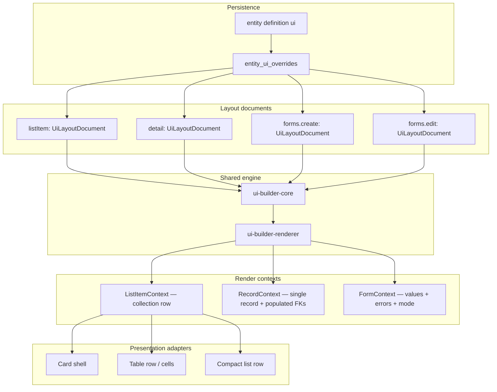

# UI Builder — Phase 2 Master Plan

**Status:** Planning input for implementation phases (post legacy-layout purge)  
**Audience:** Engineers implementing Design layout **Page**, **Forms**, and a unified **list item** model with motion  
**Related docs:** [UIBuilder.md](./UIBuilder.md), [UIBuilderOutputJSON.md](./UIBuilderOutputJSON.md), [UIBuilderStructure.md](./UIBuilderStructure.md), [UIMasterPlan.md](./UIMasterPlan.md)

---

## 1. Executive summary

Phase 1 delivered a **recursive layout JSON** (`UiLayoutDocument`), a **shared render engine** (`RecursiveLayoutRenderer`), and an admin surface for entity list configuration: **Settings → Design layout → Item list**. That legacy monolithic editor has been **replaced** by the tabbed **Item List Designer** (`apps/web/app/features/item-list-designer/`) at `/settings/design-layout/list/:entityName`, covering table columns, expandable table (grouped columns + expanded row), and card layout with structure trees and preview.

Phase 2 extends the same platform to:

1. **Entity main page (detail)** — replace the hardcoded `EntityRecordDetail` field grid with designed layouts.
2. **Create / edit forms** — replace section-based `FormLayout` with the recursive builder (or a form-specialized variant of it).
3. **Unified list item** — one designed “item” that can be **presented** as card, table row, compact row, or future shells—not a separate card-only document.
4. **Motion layer** — declarative effects, transitions, and entrance/hover presets applied at layout/component boundaries.

The guiding principle: **one schema-driven layout model, multiple render contexts and presentation adapters**, not three unrelated builders.

---

## 2. Current baseline (what ships today)

### 2.1 Design layout routes

| Route | Path | State |
|-------|------|--------|
| Item list | `/settings/design-layout/list/:entityName` | **Live** — Item List Designer (`ItemListDesignerView`), save via `putEntityUiOverride` |
| Main View | `/settings/design-layout/main/:entityName` | **Live** — `MainViewDesignerView` (`main-view-designer/`), saves `mainPage` |
| Detailed View | `/settings/design-layout/detail/:entityName` | **Live** — `DetailViewDesignerView` (`detail-view-designer/`), saves `recordDetail` |
| Forms | `/settings/design-layout/forms/:entityName` | **Live** — Form Designer (`FormDesignerView`) |
| Legacy redirect | `/settings/design-layout/page/:entityName` | Redirects to `main` |

Permissions: `entityUiOverride.read` / `entityUiOverride.update` (+ per-entity `.read` for nav). Entity list header **Design layout** button deep-links to the list editor only.

### 2.2 Persistence (`entity_ui_overrides`)

Firestore document per entity (`EntityUiOverride`):

- `views[]` — `ViewConfig` with `type: "table" | "card"`, `fields[]`, optional `layout` (`UiLayoutDocument`), optional `metricWidgets`
- `listViewType` — `"table" | "card"`

**Not in overrides today:** `forms`, `detail`, nav, or field-level UI. Those still come from the **entity definition** in the catalog (`EntityUIConfig.forms`, `EntityUIConfig.detail`).

`mergeEntityViewOverrides()` only merges **table + card views** and `listViewType`; forms/detail are unchanged by overrides.

### 2.3 Runtime surfaces

| Surface | Component | Layout source |
|---------|-----------|----------------|
| List (card) | `EntityLayoutCardView` → `RecursiveLayoutRenderer` | `card` view `layout` |
| List (table) | Column descriptors from `fields[]` | No `UiLayoutDocument` |
| Detail page | `EntityRecordDetail` | All schema fields in a fixed `<dl>` grid |
| Create/edit | `EntityForm` | `@repo/ui-builder` `FormLayout` sections |
| Metrics strip | `EntityViewMetricsStrip` | `metricWidgets` on active list view |

### 2.4 Packages (unchanged roles)

- `@repo/ui-builder-core` — types, Zod, mutations, style resolution, field-path validation
- `@repo/ui-builder-renderer` — production/preview render
- `@repo/ui-builder-react` — structure panel, component editors (`UiLayoutStructurePanel`)
- `@repo/ui-builder` — **legacy form/table helpers** (`resolveCreateForm`, `getFormSections`) — target for migration
- `apps/web/app/features/ui-builder/` — entity adapters, list editor hook, card preview

### 2.5 Component catalog (read-only context)

Kinds today: `text`, `image`, `date`, `numeric`, `badge`, `metric-kpi`.  
Form inputs are **not** layout components yet; they live in `EntityField` driven by `FieldUIConfig.component`.

---

## 3. Target vision



**Admin UX:** Three Design layout tabs remain, but **Item list** becomes **“List item”** (layout + presentation + metrics), not “card layout only.”

---

## 4. Domain model evolution

### 4.1 Extend `EntityUiOverride` (recommended)

Add optional top-level keys (validated in `validate-ui-config.ts` and `putEntityUiOverrideInputSchema`):

```ts
interface EntityUiOverride {
  entityName: string;
  views: readonly ViewConfig[];           // evolve — see 4.2
  listViewType?: EntityListViewType;      // evolve — see 4.3
  listItem?: UiLayoutDocument;            // NEW — canonical list item layout
  detail?: UiLayoutDocument;              // NEW — record page layout
  forms?: {
    create?: UiLayoutDocument;
    edit?: UiLayoutDocument;
  };
  updatedAt: string;
}
```

**Migration strategy:**

- Phase 2a: Write `listItem` from editor; **read** `listItem ?? cardView.layout` in runtime.
- Phase 2b: Stop writing `cardView.layout`; deprecate duplicate storage in `UIBuilderOutputJSON.md`.
- Keep `views[].fields` for table column order until table uses layout-driven cells (Phase C).

### 4.2 List views refactor

**Today:** Two view records (`table`, `card`) with overlapping concerns.

**Target:**

| Concept | Storage | Purpose |
|---------|---------|---------|
| **List item layout** | `listItem` (or shared `UiLayoutDocument`) | What to show per record |
| **List presentation** | `listViewType` → rename/extend to `listPresentation` | How items are arranged (table, card grid, future) |
| **Table columns** | `tableView.fields` until Phase C2 | Sort/filter/column metadata |
| **Metrics** | `metricWidgets` on list scope | Unchanged; not tied to card-only |

Optional: single `views` entry `type: "list"` instead of split table/card—**defer** until table renderer consumes `listItem` (avoid big-bang).

### 4.3 Presentation enum (list)

```ts
type ListPresentation = "table" | "expandableTable" | "card" | "kanban"; // expandableTable replaces compact; kanban = future
```

- **card** — current `EntityLayoutCardView` grid (`cardsPerRow`, actions menu).
- **table** — rows built from `listItem` layout mapped into row/cell chrome (Phase C).
- **expandableTable** — grouped columns with designed cell layouts; row expands to `rowExpandLayout` (replaces compact).
- **kanban** — column grouping field + card shell (later).

Presentation affects **shell CSS and interaction**, not the underlying component tree.

### 4.4 Detail and forms on definition vs override

| Config | Default source | Override source |
|--------|----------------|-----------------|
| `detail` | `EntityUIConfig.detail.fields[]` (legacy) | `EntityUiOverride.detail` (`UiLayoutDocument`) |
| `forms.create/edit` | `EntityUIConfig.forms` (`FormLayout`) | `EntityUiOverride.forms.*` |

`mergeEntityViewOverrides()` (or renamed `mergeEntityUiOverrides()`) must merge **detail + forms** the same way as views.

### 4.5 Form-specific layout components (new kinds)

Extend `UiComponentKind` with schema-aware **editable** components:

| Kind | Maps to | Notes |
|------|---------|--------|
| `form-field` | `EntityField` | Wraps existing field widgets; bindings = field path |
| `form-section` | — | Optional titled group node (row or column meta) |
| `form-actions` | Submit/cancel | Placement in layout (footer slot) |
| `related-records` | `RelatedRecords` | Detail page only; config: child entity + FK |

Read-only detail keeps current kinds (`text`, `numeric`, …). Builder **palette** depends on `DesignSurface: "listItem" | "detail" | "form"`.

### 4.6 Motion and effects (new sub-schema)

Add optional `motion` on `UiLayoutDocument`, `ColumnNode`, `RowNode`, or `ComponentNode`:

```ts
interface MotionPreset {
  readonly entrance?: "none" | "fade" | "slide-up" | "scale";
  readonly durationMs?: number;
  readonly delayMs?: number;
  readonly staggerIndex?: boolean;  // list: index * stagger
  readonly hover?: "none" | "lift" | "glow";
  readonly transition?: "none" | "layout" | "all";
}
```

**Implementation constraints:**

- Store **tokens**, not arbitrary CSS animation strings (same rule as `StyleRule`).
- Renderer maps presets → `@repo/ui` primitives or a thin `motion` package (prefer CSS `@media (prefers-reduced-motion)` respect).
- Builder preview uses the same mapping as production.

**List-specific:** `staggerIndex` applies per row in card grid / compact list. **Detail:** page-level entrance once. **Forms:** subtle field focus transitions only in v1.

---

## 5. Shared platform work (do first)

These unlock Page, Forms, and unified list work in parallel.

### 5.1 `DesignSurface` context

Introduce in `ui-builder-core` / `ui-builder-react`:

```ts
type DesignSurface = "listItem" | "detail" | "formCreate" | "formEdit";
```

- Component registry filtered per surface.
- Field-path validation uses surface rules (form: writable fields only; detail: include relations).

### 5.2 Render context generalization

Today: `createEntityLayoutRenderContext` (list/card, metric bindings).

Split or extend to:

| Context | Data | Special renderers |
|---------|------|-------------------|
| `ListItemRenderContext` | One record, list filters, route params, currency | Actions menu, metric-kpi |
| `RecordRenderContext` | One record, `_populated`, permissions | Links to FK targets, related-records block |
| `FormRenderContext` | `values`, `setValue`, `errors`, `mode`, field access | `form-field` → `EntityField` |

`RecursiveLayoutRenderer` stays; `renderUiComponent` dispatches by kind + context type.

### 5.3 Editor shell abstraction

Extract shared editor shell patterns (used by main/detail/metrics list editors):

- Metrics row designer (`MetricsRowDesigner`) — widgets + row layout tabs; persists `metricWidgets` and `metricRowLayout`
- Dedicated layout editor hooks per surface (`useEntityRecordDetailLayoutEditor`, `useEntityMainPageLayoutEditor`, …)

Replace duplicated route placeholders in `page.tsx` / `forms.tsx` with real editors.

### 5.4 API and merge

- Extend `putEntityUiOverrideInputSchema` + API handler validation.
- Extend `mergeEntityViewOverrides` → `mergeEntityUiOverrides` for `detail`, `forms`, `listItem`.
- Catalog refresh after save (already invalidates entity catalog query).

### 5.5 Documentation deliverables per phase

- Update [UIBuilderOutputJSON.md](./UIBuilderOutputJSON.md) for each new document root.
- Keep [UIMasterPlan.md](./UIMasterPlan.md) as index linking phase docs.

---

## 6. Phase A — Entity main page (detail)

**Goal:** `/settings/design-layout/page/:entityName` designs `/app/:entity/:id` content.

### A.1 Runtime

1. Add `EntityLayoutDetailView` (parallel to `EntityLayoutCardView`).
2. `EntityRecordDetail` renders designed layout when `detail` override (or merged layout) exists; else legacy `<dl>` fallback with CTA to Design layout (same pattern as missing card layout).
3. Reuse `RecursiveLayoutRenderer` + `RecordRenderContext`; wire relation fields to `Link` + populated labels.

### A.2 Builder

1. `DetailViewDesignerView` on `design-layout/detail.tsx` (`detail-view-designer/`).
2. Preview: load record by id selector (pick from recent list) or synthetic fixture from schema.
3. Palette: read-only components + `related-records` + section titles.
4. Save: `putEntityUiOverride({ recordDetail: layout })` (`detail` read alias only).

### A.3 Header affordances

- **Design layout** on detail page (permission-gated) → `designLayoutEntityPath("page", entityName)`.

### A.4 Acceptance criteria

- [ ] Designed detail saves and reloads from Firestore.
- [ ] FK fields render as links when populated.
- [ ] Missing layout shows admin CTA, not broken page.
- [ ] `pnpm --filter web typecheck` + renderer unit tests for detail context.

### A.5 Estimated touchpoints

- `apps/web/app/components/entity/EntityRecordDetail.tsx`
- `apps/web/app/routes/settings/design-layout/page.tsx`
- `apps/web/app/features/ui-builder/` (new editor + hook)
- `packages/entities/src/ui/types.ts`, `validate-ui-config.ts`, `merge-entity-view-overrides.ts`
- `packages/ui-builder-renderer/src/engine/render-component.ts`
- `apps/api/src/entities/register-entity-ui-override-routes.ts`

---

## 7. Phase B — Create and edit forms

**Goal:** `/settings/design-layout/forms/:entityName` designs modals and full-page forms.

### B.1 Runtime

1. `EntityForm` checks merged `forms.create` / `forms.edit` for `UiLayoutDocument`.
2. If present: render via `RecursiveLayoutRenderer` + `FormRenderContext`; submit still uses `splitEntityFormPayload` and field registry.
3. If absent: existing `getFormSections` path (`@repo/ui-builder`).

### B.2 Form components

1. Implement `form-field` renderer wrapping `EntityField` (props from layout node + `FieldUIConfig`).
2. Support `visible` / `editable` / field-access from layout metadata or schema defaults.
3. `form-actions` row: optional; respect `hideActions` on modal embed.

### B.3 Builder

1. `EntityFormLayoutDesignEditor` with tabs: **Create** | **Edit** (separate documents).
2. Preview: interactive dummy form state (no API submit).
3. Palette: all `form-field` kinds per schema type; relation pickers; image/document.

### B.4 Sync with data model editor

When entity definition adds/removes fields, run **layout sync** (like `augmentFormLayoutWithFieldNames`):

- New field → append to default section/row in draft layouts (configurable policy).
- Removed field → prune from layout with validation warning in builder.

### B.5 Acceptance criteria

- [ ] Create and edit layouts save independently.
- [ ] Modal create on list page uses designed create layout.
- [ ] Edit via `?edit=` uses designed edit layout.
- [ ] Validation errors map to field paths in layout.
- [ ] Zod validation rejects invalid field paths in form layouts.

### B.6 Deprecation

- Mark `FormLayout` / `FormSection` as deprecated in `packages/entities` once overrides cover all tenants.
- Keep `resolveCreateForm` as shim reading flattened field list from `UiLayoutDocument` until migration complete.

---

## 8. Phase C — Unified list item (not card-only)

**Goal:** Item list designer builds **one item template** used by every list presentation.

### C.1 Product / UX

Rename UI copy: **Item list** → **List item** (i18n keys can alias for compatibility).

Editor sections (top to bottom):

1. **Metrics** — unchanged (`MetricWidgetsBuilderSection`).
2. **Presentation** — segmented control: Table | Card | Compact (Kanban disabled/coming soon).
3. **List item layout** — structure panel (always visible; not hidden when table selected).
4. **Presentation options** — e.g. `cardsPerRow`, `showActions` (card only), table column mode (which layout columns map to which table columns).

Remove implication that “table mode = no layout.”

### C.2 Persistence

1. Introduce `listItem: UiLayoutDocument` on override.
2. Editor saves `listItem` + `listPresentation` + view-level metrics.
3. Migration: copy `card.layout` → `listItem` on read if `listItem` missing.

### C.3 Table presentation adapter

**Problem:** Tables need column boundaries; free-form multi-column card layout does not map 1:1.

**Approach (incremental):**

| Sub-phase | Behavior |
|-----------|----------|
| C3a | **Hybrid:** Table keeps `fields[]` for headers/sort; optional “primary cell” renders `listItem` root column 1 only. |
| C3b | **Layout-driven columns:** Each root column in `listItem` maps to a table column; header labels from layout labels. |
| C3c | **Row template:** Entire row is one `RecursiveLayoutRenderer` pass with horizontal scroll for wide layouts. |

Recommend **C3b** as the target; ship **C3a** first for low risk.

### C.4 Card / compact adapters

- Card: current `EntityLayoutCardView` reads `listItem` instead of `cardView.layout`.
- Compact: single-column stack, same `listItem`, different outer shell (no grid).

### C.5 Item List Designer (done)

- Implemented as `apps/web/app/features/item-list-designer/` (`ItemListDesignerView`).
- Settings tab: presentation (table / expandable table / card).
- Columns tab: grouped columns + expanded row (expandable table).
- Layout tab: card layout with structure tree + preview.

### C.6 Acceptance criteria

- [ ] Same `listItem` JSON renders in card and compact without resaving.
- [ ] Switching presentation does not wipe layout.
- [ ] Table mode shows layout-driven content per C3a minimum.
- [ ] Grep/docs no longer say “card layout only” for list design.

---

## 9. Phase D — Effects, transitions, and motion

**Goal:** Declarative motion on layout nodes; list stagger; reduced-motion safe.

### D.1 Schema (`ui-builder-core`)

1. Add `MotionPreset` Zod schema; attach to nodes.
2. Validate `durationMs` / `delayMs` caps (e.g. max 2000ms).
3. Document in `UIBuilderOutputJSON.md`.

### D.2 Renderer

1. `resolveMotionPreset(preset, index?)` → className or inline style bundle.
2. List container applies stagger to children when `staggerIndex` on item root.
3. `prefers-reduced-motion: reduce` disables nonessential motion.

### D.3 Builder

1. Motion section in `StyleRulesEditor` or per-node “Effects” collapsible.
2. Preview animates (toggle “Reduce motion” in preview toolbar).

### D.4 Performance guardrails

- No layout-thrashing animations on table virtualisation (if added later).
- Memoize row renders; motion classes only on leaf wrappers.

### D.5 Acceptance criteria

- [ ] Entrance preset visible in preview and production card list.
- [ ] No motion required for functional correctness.
- [ ] Schema rejects unknown preset ids.

---

## 10. Implementation sequence (recommended)

| Order | Phase | Rationale |
|-------|--------|-----------|
| 1 | **5 — Shared platform** | `DesignSurface`, contexts, override merge, editor shell |
| 2 | **A — Detail page** | Smallest new surface; read-only components reuse list work |
| 3 | **C3a + C1 — List item storage** | Decouple layout from card; hybrid table |
| 4 | **B — Forms** | New component kinds; depends on form context |
| 5 | **C3b — Table layout columns** | Requires stable `listItem` |
| 6 | **D — Motion** | Cross-cutting; easiest once node model stable |

Parallelization: **A** and **C1** can split across two engineers after step 1.

---

## 11. Testing and quality strategy

| Layer | What to test |
|-------|----------------|
| `ui-builder-core` | New Zod schemas, motion validation, layout sync for forms, `listItem` migration helper |
| `ui-builder-renderer` | Context-specific component render snapshots; reduced-motion class toggles |
| `entities` | `mergeEntityUiOverrides` for detail/forms/listItem |
| `apps/web` | Editor hooks save payload; `EntityForm` / `EntityRecordDetail` integration tests |
| E2E (manual) | Design layout save → list/detail/form reflect changes |

**Regression grep targets:** `cardView.layout`-only assumptions, legacy list editor branches, `FormLayout`-only tests.

---

## 12. Permissions, security, and performance

- Same permissions as today: `entityUiOverride.update` to save; read for preview.
- Form layouts must not expose fields the user cannot write (`fieldAccess` + RBAC).
- Detail layouts must respect field-level read access (hide or mask sensitive fields).
- Layout JSON size limits: consider Firestore doc size if layouts grow (compress repeated style rules in a future optimization).

---

## 13. Out of scope (Phase 2)

- **Kanban** presentation (schema hook only).
- **Page builder** for non-entity routes (dashboards, settings pages).
- **Conditional visibility** logic engine (show-if expressions) — spec’d in [UIBuilder.md](./UIBuilder.md) but not Phase 2 unless scoped explicitly.
- **Hand-authored JSON import/export** UI (document format exists; tooling later).
- **UiLayoutBuilder** full wrapper removal ([UIMasterPlan.md](./UIMasterPlan.md) optional cleanup).
- Replacing `@repo/ui-builder` table/query engine (separate product surface).

---

## 14. Open decisions (resolve before coding)

| # | Question | Options |
|---|----------|---------|
| 1 | Store `listItem` top-level vs `views[].layout`? | **Recommended:** top-level `listItem` + migration from card view |
| 2 | Single metrics array vs per-presentation? | **Recommended:** single list-scoped `metricWidgets` |
| 3 | Form layout: same tree as detail or form-specific row types? | **Recommended:** same `UiLayoutDocument`; different component kinds |
| 4 | Motion implementation | CSS classes in `@repo/ui` vs optional `framer-motion` peer |
| 5 | Override entire `forms` in definition catalog vs only Firestore | **Recommended:** override wins; definition remains fallback seed |

---

## 15. Success metrics (Phase 2 complete)

- All three Design layout routes are **functional** (no `comingSoon` on page/forms).
- Admins configure list, detail, and forms without developer deploys.
- **One** `listItem` layout drives card and at least one non-card presentation.
- Motion presets available on list item root without breaking reduced-motion.
- Docs: `UIBuilderOutputJSON.md`, `UIMasterPlan.md`, entity README, and metrics guides reference new surfaces only.

---

## 16. File map (expected new / major edits)

```
packages/ui-builder-core/
  src/types/motion.ts
  src/schema/motion-schema.ts
  src/types/design-surface.ts

packages/ui-builder-renderer/
  src/context/list-item-context.ts
  src/context/record-context.ts
  src/context/form-context.ts
  src/motion/resolve-motion.ts

packages/entities/src/ui/
  types.ts                          # override shape
  merge-entity-ui-overrides.ts      # rename + detail/forms/listItem
  validate-ui-config.ts

apps/web/app/features/ui-builder/
  use-entity-record-detail-layout-editor.ts

apps/web/app/features/detail-view-designer/
  DetailViewDesignerView.tsx

apps/web/app/components/entity/
  EntityLayoutDetailView.tsx
  EntityRecordDetail.tsx              # consume layout
  EntityForm.tsx                      # consume layout
  EntityLayoutCardView.tsx            # listItem + presentation
  EntityTableView.tsx                 # new or evolved — layout-aware rows

apps/web/app/routes/settings/design-layout/
  page.tsx                            # wire editor
  forms.tsx                           # wire editor
  list.tsx                            # wire renamed editor
```

---

## 17. References (implementation anchors)

- List designer: `apps/web/app/features/item-list-designer/ItemListDesignerView.tsx`
- Override hook: `apps/web/app/features/ui-builder/use-entity-list-layout-editor.ts`
- Card render: `apps/web/app/components/entity/EntityLayoutCardView.tsx`
- Detail (legacy): `apps/web/app/components/entity/EntityRecordDetail.tsx`
- Form (legacy): `apps/web/app/components/entity/EntityForm.tsx`
- Merge: `packages/entities/src/ui/merge-entity-view-overrides.ts`
- JSON spec: `docs/UIBuilderOutputJSON.md`

---

*This document is the authoritative planning input for Phase 2. Implementation PRs should link to the phase section (A/B/C/D) they satisfy and update acceptance checkboxes in follow-up PR descriptions.*
