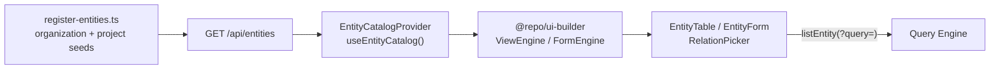

# Advanced UI Builder Guide

Registry-driven entity UI for the web app. Entity definitions (including optional `ui` metadata) are served by `GET /api/entities`; the web app never imports business models from `@repo/shared-types`.

**Workstream:** [10.2 ADVANCED UI BUILDER](<../Ecosystem%20Plan/v2/Key%20Capabilitues/10.2%20ADVANCED%20UI%20BUILDER.md>)

---

## Architecture



| Layer | Package / path | Role |
| --- | --- | --- |
| Definition | `@repo/entities` | `EntityUIConfig`, validation, default UI fallback |
| Serialization | `serializeEntityDefinition()` | Strips Zod; exposes fields + `ui` to clients |
| Catalog API | `apps/api/src/entities/list-entities.route.ts` | Auth + `*.read` gate; filters by entity read permission |
| Interpretation | `@repo/ui-builder` | Columns, forms, filters, query config, permissions |
| Web | `apps/web/app/components/entity/` | React components + component registry |
| Data | `useEntity` + `api-client` | List reads via Query Engine `?query=` JSON |

---

## UI metadata reference

Attach an optional `ui` block to `defineEntity()`:

```ts
export const Organization = defineEntity({
  name: "organization",
  fields: { /* ... */ },
  ui: {
    nav: { label: "Organizations", icon: "building" },
    views: [
      {
        type: "table",
        name: "default",
        fields: ["name", "email", "isActive"],
        defaultSort: { field: "name", direction: "asc" },
      },
    ],
    forms: {
      create: { sections: [{ title: "Details", fields: ["name", "email"] }] },
      edit: { sections: [{ title: "Details", fields: ["name", "email"] }] },
    },
    fields: {
      name: { label: "Name", component: "input", placeholder: "Acme Inc." },
      isActive: { label: "Active", component: "toggle" },
    },
  },
});
```

### `EntityUIConfig`

| Key | Description |
| --- | --- |
| `nav.label` | Sidebar label (fallback: formatted entity name) |
| `nav.icon` | Icon key mapped in `use-entity-nav-items.ts` (`building`, `folder`, …) |
| `views[]` | List layouts (`table` or `card`) |
| `forms.create` / `forms.edit` | Sectioned form layouts |
| `fields` | Per-field labels, component overrides, placeholders |
| `detail` | Optional detail field list (extension point) |

### View config

| Field | Description |
| --- | --- |
| `type` | `table` or `card` |
| `name` | View identifier (default: first view) |
| `fields` | Columns / card fields (must exist on entity) |
| `filters` | Filter bar definitions → Query Engine filters |
| `defaultSort` | Initial sort passed to `useEntity` |

### Field components

| `component` | Used for types | Web component |
| --- | --- | --- |
| `input` | `string` | Text input |
| `number` | `number` | Number input |
| `toggle` | `boolean` | Checkbox |
| `date` | `date` | Datetime-local input |
| `relation` | `relation` | `RelationPicker` (async list of target entity) |

When `ui` is omitted, `getDefaultEntityUI()` generates a single table view and basic create/edit forms from editable fields.

Validation: `validateEntityUIConfig()` (Zod + field ref checks). Invalid field references throw at definition time when `ui` is provided.

---

## `@repo/ui-builder`

Pure interpretation helpers (no React):

| Module | Exports |
| --- | --- |
| `view-engine` | `resolveActiveView`, `getTableColumns`, `getViewFilters`, `getDefaultSort` |
| `form-engine` | `resolveCreateForm`, `resolveEditForm`, `buildInitialValues` |
| `layout-engine` | `getFormSections` |
| `permission-adapter` | `resolveEntityActionPermissions`, `isFieldVisible`, `isFieldEditable` |
| `query-config-builder` | `buildListQueryConfig`, `getDefaultFilterOperator` |
| `component-registry` | `resolveComponentId`, `registerComponent` |

---

## Web integration

### Entity catalog

- `EntityCatalogProvider` (private layout) fetches `GET /api/entities` on mount.
- `useEntityCatalog()` — `items`, `getDefinition`, `isKnownEntity`.
- Route guards use `isKnownEntity` for `/app/:entity` param validation.
- Sidebar: `useEntityNavItems()` + `useAccessibleNavItems()` (RBAC-filtered).

### List views

- `EntityPage` owns `useEntity(entityName, { queryConfig })`.
- `EntityTable` / `EntityCardView` build filters/sort → `buildListQueryConfig` → parent refresh.
- Column headers toggle sort; filter inputs map to Query Engine equality/range operators by field type.
- All list reads go through Query Engine (no hardcoded fetch paths).

### Forms

- `EntityForm` resolves sections from `FormEngine`; `EntityField` reads field UI metadata.
- `RelationPicker` loads target entity options via `listEntity(target, { query })`.
- Validation errors come from API responses (`fieldErrors` on `useEntity`).

### Extending components

Register overrides in `apps/web/app/components/entity/component-registry.tsx`:

```ts
registerComponent("custom-widget", CustomWidget);
```

Map field metadata `component: "custom-widget"` after registering the key.

---

## Query Engine client

`api-client.listEntity(name, { limit, cursor, query })` serializes `query` as a JSON search param (matches API `parseListQueryInput`).

Example filter from UI filter bar (`organizationId` on projects):

```http
GET /api/project?query={"filter":[{"field":"organizationId","operator":"==","value":"org_123"}],"sort":[{"field":"name","direction":"asc"}],"pagination":{"limit":20}}
```

---

## Security

- `GET /api/entities` requires authentication, tenant context, and any `*.read` permission.
- Response includes only entities the caller may read (`{entity}.read` or superadmin).
- UI hides actions via `useEntityPermissions`; API enforces RBAC on mutations.

---

## Seed entities (dev/test)

| Entity | Relation | Purpose |
| --- | --- | --- |
| `organization` | — | Generic tenant-scoped record |
| `project` | `organizationId` → `organization` | Exercises relation picker + FK filters |

These replace the former Customer/Order pilot fixtures. Product domain entities will be added via registry (later: Firestore-published definitions) without rewriting the UI Builder.

---

## Related

- [Entity System Guide](./entity-system-guide.md)
- [Query Engine Guide](./query-engine-guide.md)
- [Relational Data System Guide](./relational-data-system-guide.md)
- [Web entity components README](../apps/web/app/components/entity/README.md)
