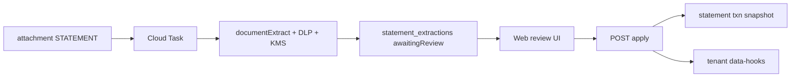

# 07 — Document / Statement Extraction

Tenant-only statement ingestion via multimodal Vertex Gemini, DLP, KMS envelope encryption, and a human review step before business entities are written. Global platform code handles upload → extract → redact → encrypt → stage; **all finance / rate / institution logic lives in tenant JSON** (templates, data hooks, formulas).

Related: [Architecture](./01-architecture.md) · [Integrating features](./06-integrating-new-features.md) · [API / worker surfaces](./05-api-worker-ui.md)

---

## Goals

1. Extract structured data (balances, dates, transactions, installments, interest/principal) from STATEMENT PDFs/images.
2. Keep institution-specific schemas and post-apply math in tenant catalogs.
3. Defense in depth for confidential data (PAN, SSN, account numbers).
4. Human confirmation before mutating `statement` / `transaction` / `paymentSchedule` / `balanceSnapshot`.

---

## End-to-end flow

```text
1. User (or Gmail import) creates attachment with documentType=STATEMENT + PDF in GCS
2. API/worker enqueues Cloud Task → /tasks/process-document-extraction
3. Worker:
   a. Resolve template (matchHints on financialItem / Flash classify)
   b. runAiRequest(feature=documentExtract, fileParts=[{fileUri: gs://…}])
   c. Parse JSON + DLP inspect/deidentify
   d. KMS envelope-encrypt full payload; store preview + ciphertext on statement_extractions
4. Web /ai/statement-extractions — user reviews preview, optional edits
5. POST …/apply → decrypt → write statement + transactions + balanceSnapshot → mark applied
6. Tenant statement.create hooks may patch payment schedules (rate math stays in formulas)
```



---

## Platform pieces (global)

| Layer | Location |
|---|---|
| Multimodal `fileParts` | `@repo/ai-engine` controller + Vertex client (`fileData` GCS URIs preferred) |
| Feature | `AiFeature.documentExtract` · permission `ai.documentExtract.run` / `.read` |
| Jobs | `ai_jobs` input kind `documentExtract` (pointers only — never raw PDF/PII) |
| Staging collection | `tenants/{tid}/statement_extractions/{id}` |
| Templates collection | `tenants/{tid}/__document_extraction_templates/{id}` |
| Worker | `/tasks/process-document-extraction` · workload `worker:process-document-extraction` |
| Queue | `queue:document-extraction` (Terraform) |
| DLP | `@repo/document-extraction-dlp` (GCP DLP + mock regex client) |
| KMS envelope | `@repo/encryption` `encryptEnvelope` / `decryptEnvelope` |
| API | `GET/POST /api/statement-extractions*` |
| UI | `/ai/statement-extractions` |

### Controller invariant

All model calls still go through `createAiController` → `runAiRequest`. Document bytes are passed as `fileParts: [{ fileUri: "gs://…", mimeType }]` so raw content is **not** stored on `ai_jobs.input`.

### Auto-enqueue triggers

1. Gmail attachment import when `documentType === "STATEMENT"`
2. Entity CRUD create on `attachment` with `documentType === "STATEMENT"`

---

## Tenant JSON (finance / rates)

| Catalog | Path | Role |
|---|---|---|
| Templates | `.local/tenant-import/catalogs/document-extraction-templates/*.json` | Institution schema, matchHints, extractionInstructions, `onConfirmHookId` |
| Apply hooks | `catalogs/data-hooks/apply-statement-extraction-*.json` | Post-statement enrichment (e.g. schedule patch) |
| Formulas | `catalogs/formula-definitions/*` | Interest / principal / amortization (unchanged) |
| Entities | `statement`, `transaction`, `financialItem`, `account`, `attachment` | Field shapes incl. sensitive + installment fields |

Sample templates shipped with the local tenant seed:

- `davivienda-visa-statement` (credit card)
- `bancolombia-savings-statement` (savings)
- `generic-loan-statement` (loan)

**Do not** hardcode bank names, rate formulas, or installment math in `apps/` / `packages/`.

---

## Security layers

| Layer | Mechanism |
|---|---|
| Transport | HTTPS + Firebase Auth |
| Prompt hygiene | GCS `fileData` only in model call; job input = attachment/template ids |
| Field encryption | Entity fields with `sensitive: true` → existing per-tenant AES (`@repo/encryption`) |
| Envelope encryption | KMS-wrapped DEK; AES-256-GCM; AAD = `tenantId\|attachmentId\|extractionId` |
| DLP | Inspect + deidentify before preview; findings retained for audit |
| Review gate | `awaitingReview` until user Apply |
| RBAC | `ai.documentExtract.read` / `.run` |
| Logs | Prefer no raw extracted PII in traces; `AI_STEP_TRACE_ENABLED` off in prod |

Local / test: `createLocalKmsEnvelopeClient` + `createMockDlpClient`. Production: `createGcpKmsEnvelopeClient` + `createGcpDlpClient` (env: `DOCUMENT_EXTRACTION_KMS_KEY_NAME`, GCP project).

---

## Apply semantics (v1)

`POST /api/statement-extractions/:id/apply`:

1. Permission `ai.documentExtract.run`
2. Decrypt envelope with KMS client
3. Merge optional `edits` from body
4. Create `statement` with `source: "documentExtract"`
5. Create `transaction` rows (installment / interest / principal fields when present)
6. Create `balanceSnapshot` for closing balance when present
7. Link `attachment.statementId`; optionally update product/account last4 + encrypted fields
8. Mark extraction `applied`

Tenant `statement.create` hooks (condition on `source == documentExtract`) may then patch open `paymentSchedule` rows. Regenerating amortization plans still uses existing formula definitions.

---

## Adding a new institution template

1. Add `.local/tenant-import/catalogs/document-extraction-templates/{id}.json`
2. Optionally add `data-hooks/apply-statement-extraction-{….}.json`
3. Seed catalogs (`pnpm seed:database` / component selection including document-extraction-templates)
4. No platform code change if schema fits existing apply writer

---

## Testing checklist

- [ ] `runAiRequest` passes `fileParts` through to Vertex client
- [ ] Mock Vertex returns document-extract JSON for classify + extract prompts
- [ ] Processor writes `awaitingReview` with non-empty preview and real ciphertext (not plaintext PAN in preview)
- [ ] Apply without permission → 403
- [ ] Apply happy path creates statement + transactions
- [ ] `pnpm check:workload-coverage`
- [ ] Workload registry includes `queue:document-extraction` + `worker:process-document-extraction`

---

## Non-goals (v1)

- Document AI Bank Statement Parser / OCR fallback
- Auto-apply without review
- Cross-tenant template sharing
- Storing PDF bytes outside entity-files GCS paths

---

## Password-protected PDFs

Some bank statements are encrypted. Passwords are **per financial item, per `attachment.documentType`** (e.g. STATEMENT vs INVOICE), set once in the UI, and reused for every matching attachment.

### Where to set

1. Open the financial item detail page.
2. Use the **Document passwords** panel.
3. Set / update / remove the password for a document type.

Passwords are write-only: the API never returns plaintext. Storage is the sensitive field `financialItem.documentPasswords` (AES via the existing tenant field-encryption pipeline).

### Worker unlock path

When an extraction runs and a password exists for the attachment’s `documentType`:

1. Download the PDF from GCS into worker memory.
2. If the PDF is encrypted, unlock it with `qpdf` (`@repo/pdf-unlock`).
3. Send unlocked bytes to Vertex as `inlineData` (never written back to GCS).
4. If no password is set, or the PDF is not encrypted, keep the normal `gs://` `fileUri` path.

Wrong / missing password → extraction `status: failed` with  
`PDF is password-protected and provided password did not unlock it.`  
Fix the password on the financial item, then **Rerun** from `/ai/statement-extractions`.

### Local / Docker

- Production & Cloud Run worker image: `qpdf` is installed in the worker Dockerfile.
- Dev container: `apps/worker-service/Dockerfile.dev` also installs `qpdf`.
- Host-only runs: `brew install qpdf` (macOS) so the worker binary is on `PATH`.
