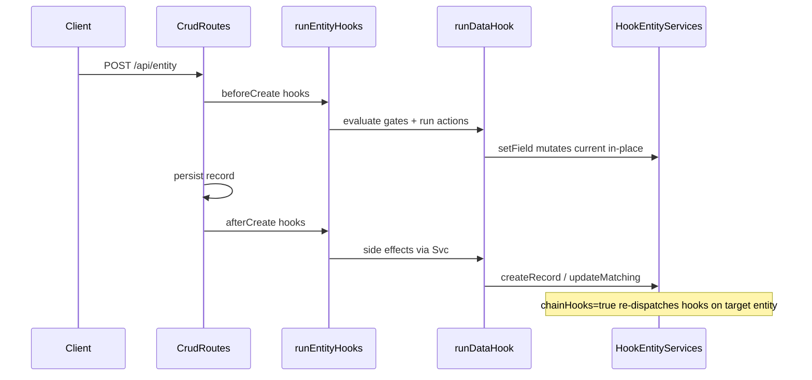

# Data Hook definition JSON specification

This document is the **authoritative, self-contained reference for Data Hooks (Automation)**. It defines every supported trigger, condition, action, and expression so a data team or implementer can author tenant automation hooks outside the UI and import them successfully.

**Validation (source of truth in code):**

- Definition schema: [`packages/hooks/src/data-hook-definition.ts`](../packages/hooks/src/data-hook-definition.ts)
- Expression AST and functions: [`packages/hooks/src/expression.ts`](../packages/hooks/src/expression.ts)
- Runtime interpreter: [`packages/hooks/src/interpret-data-hook.ts`](../packages/hooks/src/interpret-data-hook.ts)
- Portable JSON envelopes: [`packages/hooks/src/data-hook-definition-json.ts`](../packages/hooks/src/data-hook-definition-json.ts)
- API routes: [`apps/api/src/hooks/register-hook-routes.ts`](../apps/api/src/hooks/register-hook-routes.ts)

**Related docs (different concerns):**

| Document | Purpose |
|----------|---------|
| [data-hooks.md](./data-hooks.md) | Product overview and phasing summary |
| [hooks-system-guide.md](./hooks-system-guide.md) | Hook dispatch architecture (system + dynamic hooks) |
| [entity-definition-json.md](./entity-definition-json.md) | Entity catalog JSON — hooks reference entity and field names |
| Tenant bundle (`hooks[]`) | Admin full records — portable envelopes below are the import format |

---

## Table of contents

1. [Quick start](#1-quick-start)
2. [Execution model](#2-execution-model)
3. [Hook definition schema](#3-hook-definition-schema)
4. [Triggers](#4-triggers)
5. [Conditions](#5-conditions)
6. [Actions](#6-actions)
7. [Expression language](#7-expression-language)
8. [Portable JSON envelopes](#8-portable-json-envelopes)
9. [API and permissions](#9-api-and-permissions)
10. [UI surfaces](#10-ui-surfaces)
11. [Cookbook](#11-cookbook)
12. [Migration from legacy hooks](#12-migration-from-legacy-hooks)
13. [Not yet supported](#13-not-yet-supported)
14. [Checklist before import](#14-checklist-before-import)

---

## 1. Quick start

**Recommended workflow:**

1. Import or define **entities** first ([entity-definition-json.md](./entity-definition-json.md)).
2. Author hook definitions as portable JSON (single hook or catalog envelope).
3. Import in the app: **Automation → select entity → Import JSON** (catalog) or use the settings-panel JSON toolbar (single hook).
4. Test with a dev tenant before promoting to production.

**Identity key:** Each hook is uniquely identified within a tenant by **`entity` + `name`**. Catalog replace operations match on this pair (`entity\0name` internally). The same hook name may exist on different entities.

**Do not include in portable JSON** (server-managed):

- `id`, `tenantId`, `createdAt`, `updatedAt`

Use **View JSON** in the Automation UI to export a valid template.

---

## 2. Execution model

Data Hooks run in response to entity CRUD lifecycle events. They reuse the generic hook dispatch layer (`runEntityHooks`, registry, tenant runtime context) and are stored per tenant in the `__data_hooks` collection.

### Event naming

Canonical event format:

```
{entity}.{phase}{Operation}
```

| Event | When |
|-------|------|
| `{entity}.beforeCreate` | Before POST validation/persist |
| `{entity}.afterCreate` | After successful create |
| `{entity}.beforeUpdate` | Before PUT persist |
| `{entity}.afterUpdate` | After successful update |
| `{entity}.beforeDelete` | After relation checks, before delete |
| `{entity}.afterDelete` | After successful delete |

Examples: `loan.beforeCreate`, `payment.afterUpdate`.

The hook definition stores `entity`, `phase` (`before` | `after`), and `trigger.operation` (`create` | `update` | `delete`) separately; the runtime composes the event string.

### Lifecycle



### Phase semantics

| Phase | On failure | Mutations |
|-------|------------|-----------|
| `before` | Blocks CRUD (400) | `setField` mutates `context.current` in place; persisted record includes the change |
| `after` | Logged; CRUD succeeds | Side effects via entity services (`setField`, `createRecord`, etc.) |

Relation validation runs before hook `beforeDelete`.

### Activation gates (evaluated in order)

1. **`updateFields` gate** (update triggers only): If `trigger.updateFields` is a non-empty array, the hook runs only when at least one listed field changed between `previous` and `current`. Empty or omitted means any field change.
2. **Condition gate**: If `condition` is set, the recursive boolean tree must evaluate to `true`. Omitted or `null` means always run.
3. **Depth gate**: If `context.depth > 5`, the hook is skipped (logged).
4. **Visited gate**: If the hook's `id` is already in `visitedHookIds`, the hook is skipped (cycle prevention).

### Execution mode

| Value | Applies to | Behavior |
|-------|------------|----------|
| `sync` (default) | All phases | Hook runs inline in the request path |
| `deferred` | `after` phase only | Hook runs in-process fire-and-forget; errors are logged, CRUD already succeeded |
| `queued` | `after` phase only | Hook is enqueued to Cloud Tasks; worker-service runs it asynchronously; CRUD already succeeded |

`queued` requires worker-service and Cloud Tasks (or local dispatch in dev). When the enqueue service is unavailable, `queued` falls back to `deferred` behavior with a warning log.

### Chained hooks (`chainHooks`)

When `chainHooks: true`, entity writes from this hook's actions (`createRecord`, `createRecords`, `updateMatching`, after-phase `setField`) may trigger hooks on the **target entity**. Chaining is **opt-in** per hook definition.

- Depth increments on each chained dispatch (`MAX_HOOK_DEPTH = 5`).
- Visited hook IDs accumulate to prevent cycles.
- Hook-initiated creates inherit `ownerId` and `accessUserIds` from the triggering user so records appear in list queries.

### Runtime limits

| Limit | Value | Applies to |
|-------|-------|------------|
| Max loop iterations | 1,000 | `createRecords` count |
| Max matching records | 500 | `updateMatching` list query |
| Max hook depth | 5 | Chained dispatch |
| Max call arguments | 16 | Expression `call` nodes |

---

## 3. Hook definition schema

Portable hook shape (same as `POST /api/data-hooks` body minus server fields):

```json
{
  "name": "Set pending status",
  "description": "Optional human-readable summary",
  "entity": "loan",
  "phase": "before",
  "trigger": { "operation": "create" },
  "condition": null,
  "actions": [
    {
      "type": "setField",
      "field": "status",
      "value": { "kind": "literal", "value": "Pending" }
    }
  ],
  "enabled": true,
  "order": 0,
  "chainHooks": false,
  "execution": "sync"
}
```

### Field reference

| Field | Type | Required | Default | Description |
|-------|------|----------|---------|-------------|
| `name` | string | yes | — | Display name; unique per `entity` within tenant |
| `description` | string | no | — | Optional notes |
| `entity` | string | yes | — | Trigger entity (camelCase name from entity catalog) |
| `phase` | `"before"` \| `"after"` | yes | — | When relative to persist |
| `trigger` | object | yes | — | See [§4](#4-triggers) |
| `condition` | condition node \| `null` | no | `null` | Activation guard; see [§5](#5-conditions) |
| `actions` | array (min 1) | yes | — | Ordered action list; see [§6](#6-actions) |
| `enabled` | boolean | yes | — | Disabled hooks are stored but not registered |
| `order` | integer | yes | — | Sort order within same entity+event (ascending) |
| `chainHooks` | boolean | no | `false` | Opt-in chained dispatch for action writes |
| `execution` | `"sync"` \| `"deferred"` \| `"queued"` | no | `"sync"` | After-phase only for `deferred` and `queued` |

Action target entities (`createRecord`, `createRecords`, `updateMatching`) must exist in the tenant catalog at create/update time.

---

## 4. Triggers

```json
{
  "operation": "create",
  "updateFields": ["status", "amount"]
}
```

| Property | Type | Required | Description |
|----------|------|----------|-------------|
| `operation` | `"create"` \| `"update"` \| `"delete"` | yes | CRUD operation that fires the hook |
| `updateFields` | string[] | no | Update only: run when any listed field changed; omit for any change |

---

## 5. Conditions

Conditions are an optional **activation guard** on the trigger record. They use a recursive boolean tree distinct from entity query filters.

### Group node

```json
{
  "type": "group",
  "combinator": "and",
  "children": []
}
```

| Property | Values | Description |
|----------|--------|-------------|
| `type` | `"group"` | Discriminator |
| `combinator` | `"and"` \| `"or"` | `and`: all children must match; `or`: any child may match |
| `children` | array | Nested group or condition nodes |

An **empty group** evaluates to `true` (hook runs).

### Condition leaf

```json
{
  "type": "condition",
  "field": "amount",
  "operator": ">=",
  "value": { "kind": "field", "source": "current", "path": "commitmentAmount" }
}
```

| Property | Type | Required | Description |
|----------|------|----------|-------------|
| `type` | `"condition"` | yes | Discriminator |
| `field` | string | yes | Field on trigger record (`current`) |
| `operator` | see below | yes | Comparison operator |
| `value` | expression | no | Right-hand side; omitted for valueless operators |

### Operators

| Operator | `value` required | Semantics |
|----------|------------------|-----------|
| `==` | yes | Loose equality (numbers coerced) |
| `!=` | yes | Negated loose equality |
| `>`, `<`, `>=`, `<=` | yes | Ordered comparison (numbers or strings) |
| `in` | yes | Field value equals any element of expression array |
| `notIn` | yes | Field value equals none of array elements |
| `isEmpty` | no | Field is `null` or `""` |
| `isNotEmpty` | no | Field is not empty |
| `changed` | no | Field differs between `previous` and `current` (update context) |

### Legacy bare leaf

Objects `{ field, operator, value? }` **without** `type` are accepted and normalized to `type: "condition"`.

### `updateMatching.where` (different shape)

The `updateMatching` action uses a **typeless single-field lookup leaf** (no `type` discriminator):

```json
{
  "field": "contractId",
  "operator": "==",
  "value": { "kind": "field", "source": "current", "path": "id" }
}
```

This is a query lookup, not a boolean guard tree.

---

## 6. Actions

Actions run in array order after all gates pass. Every computed value is an **expression** ([§7](#7-expression-language)).

### `setField`

Set a field on the trigger record.

```json
{
  "type": "setField",
  "field": "status",
  "value": { "kind": "literal", "value": "COMPLETE" }
}
```

| Phase | Behavior |
|-------|----------|
| `before` | Mutates `context.current[field]` in place; CRUD persists the value |
| `after` | Calls entity service `update` on trigger record; requires `current.id` |

### `createRecord`

Create one related record.

```json
{
  "type": "createRecord",
  "entity": "payment",
  "data": {
    "loanId": { "kind": "field", "source": "current", "path": "id" },
    "amount": { "kind": "field", "source": "current", "path": "amount" }
  }
}
```

| Property | Description |
|----------|-------------|
| `entity` | Target entity name |
| `data` | Map of field name → expression evaluated against trigger scope |

Typically used in `after` phase. Enforces RBAC create + field write permissions for the triggering user.

### `createRecords`

Loop `count` times, creating one record per iteration.

```json
{
  "type": "createRecords",
  "entity": "paymentSchedule",
  "count": { "kind": "field", "source": "current", "path": "periods" },
  "data": {
    "sequence": { "kind": "var", "name": "loopIndex" },
    "dueDate": {
      "kind": "call",
      "fn": "dateAdd",
      "args": [
        { "kind": "field", "source": "current", "path": "startDate" },
        {
          "kind": "binary",
          "op": "*",
          "left": { "kind": "var", "name": "loopIndex" },
          "right": { "kind": "literal", "value": 30 }
        },
        { "kind": "literal", "value": "DAY" }
      ]
    }
  }
}
```

| Property | Description |
|----------|-------------|
| `count` | Expression → non-negative integer (truncated); max 1,000 |
| `data` | Field map; `loopIndex` variable available (0-based) |

### `updateMatching`

Find records on another entity and apply field updates.

```json
{
  "type": "updateMatching",
  "entity": "commitment",
  "where": {
    "field": "contractId",
    "operator": "==",
    "value": { "kind": "field", "source": "current", "path": "id" }
  },
  "set": {
    "isActive": { "kind": "literal", "value": false }
  }
}
```

| Property | Description |
|----------|-------------|
| `where` | Single-field lookup leaf; value resolved against **trigger** scope |
| `set` | Field map; expressions see **matched record** as `current`, **trigger** as `previous` |

List query returns up to 500 candidates filtered by field equality; each match is re-checked with the operator.

### `sendNotification`

Log a computed message (no real notification infrastructure yet).

```json
{
  "type": "sendNotification",
  "message": {
    "kind": "call",
    "fn": "concat",
    "args": [
      { "kind": "literal", "value": "Loan " },
      { "kind": "field", "source": "current", "path": "id" },
      { "kind": "literal", "value": " created" }
    ]
  }
}
```

Writes to the hook logger at `info` level with entity, event, and tenant context.

### RBAC and chaining

- All entity service calls enforce entity-level and field-level permissions for the **triggering user**.
- Chained hook dispatch occurs only when the **source hook** has `chainHooks: true`.

---

## 7. Expression language

Expressions are stored as a **JSON AST** (not parsed from text). They are evaluated deterministically with **no I/O**.

Primitive values (`ExpressionValue`): `string | number | boolean | null`. Dates are ISO-8601 strings.

### Scope

| Binding | Source |
|---------|--------|
| `current` | Trigger record (or matched record in `updateMatching.set`) |
| `previous` | Prior record on update/delete; trigger record in `updateMatching.set` |
| `now` | Evaluation timestamp (`Date`) |
| `userId` | Triggering user's UID |
| `loopIndex` | 0-based iteration index in `createRecords` |

### AST node kinds

#### `literal`

```json
{ "kind": "literal", "value": "Pending" }
```

#### `field`

```json
{ "kind": "field", "source": "current", "path": "amount" }
```

Dotted paths supported (`"path": "customer.name"`).

#### `var`

```json
{ "kind": "var", "name": "loopIndex" }
```

Names: `now`, `loopIndex`, `userId`. (`now` as var returns ISO string; prefer `call`/`var` consistently — `var: now` and scope `now` are equivalent in practice.)

#### `unary`

```json
{ "kind": "unary", "op": "!", "operand": { "kind": "literal", "value": false } }
```

Operators: `-` (negate number), `!` (logical not).

#### `binary`

```json
{
  "kind": "binary",
  "op": "+",
  "left": { "kind": "literal", "value": "Hello " },
  "right": { "kind": "field", "source": "current", "path": "name" }
}
```

| Category | Operators |
|----------|-----------|
| Arithmetic | `+` `-` `*` `/` `%` (`+` concatenates if either operand is string) |
| Comparison | `==` `!=` `>` `<` `>=` `<=` (loose equality for `==`/`!=`) |
| Logical | `&&` `||` (returns boolean) |

Division/modulo by zero throws `ExpressionEvaluationError`.

#### `call`

```json
{
  "kind": "call",
  "fn": "if",
  "args": [
    { "kind": "binary", "op": ">", "left": { "kind": "field", "source": "current", "path": "amount" }, "right": { "kind": "literal", "value": 0 } },
    { "kind": "literal", "value": "ACTIVE" },
    { "kind": "literal", "value": "INACTIVE" }
  ]
}
```

Max 16 arguments per call.

### Functions reference

| Function | Args | Returns | Description |
|----------|------|---------|-------------|
| `now` | 0 | ISO string | Current timestamp from scope |
| `dateAdd` | date, amount, unit | ISO string | Add amount of unit to date |
| `dateDiff` | from, to, unit | number | Difference in units |
| `year` | date | number | UTC full year |
| `month` | date | number | UTC month 1–12 |
| `day` | date | number | UTC day of month |
| `abs` | n | number | Absolute value |
| `round` | n | number | Round to nearest integer |
| `floor` | n | number | Floor |
| `ceil` | n | number | Ceiling |
| `min` | n… | number | Minimum of arguments |
| `max` | n… | number | Maximum of arguments |
| `coalesce` | v… | value | First non-null argument |
| `concat` | v… | string | String join (null → "") |
| `toNumber` | v | number | Coerce to number |
| `toText` | v | string | Coerce to string |
| `dateParse` | v | ISO string | Parse/coerce to date |
| `isEmpty` | v | boolean | `null` or `""` |
| `if` | cond, then, else | value | Conditional (truthy: non-zero number, non-empty string, `true`) |
| `length` | text | number | String length (`null` → 0) |
| `substring` | text, start, end? | string | JS substring semantics |
| `trim` | text | string | Trim whitespace |
| `upper` | text | string | Uppercase |
| `lower` | text | string | Lowercase |
| `startsWith` | text, prefix | boolean | Prefix test |
| `endsWith` | text, suffix | boolean | Suffix test |
| `includes` | text, search | boolean | Substring test |

**Date units** (for `dateAdd` / `dateDiff`): `MILLISECOND`, `SECOND`, `MINUTE`, `HOUR`, `DAY`, `WEEK`, `MONTH`, `YEAR`.

### UI authoring note

The Automation **ExpressionEditor** supports simple modes (literal, field, now, loopIndex) plus **Advanced JSON** for `call`, `binary`, and `unary` nodes. Complex expressions are authored via Advanced JSON or external tooling.

---

## 8. Portable JSON envelopes

Every import file is a **versioned envelope** with a `kind` discriminator.

### Single hook (`kind: "data-hook-definition"`)

```json
{
  "kind": "data-hook-definition",
  "version": 1,
  "data": {
    "name": "Set pending status",
    "entity": "loan",
    "phase": "before",
    "trigger": { "operation": "create" },
    "actions": [
      {
        "type": "setField",
        "field": "status",
        "value": { "kind": "literal", "value": "Pending" }
      }
    ],
    "enabled": true,
    "order": 0
  }
}
```

### Catalog (`kind: "data-hooks-catalog"`)

```json
{
  "kind": "data-hooks-catalog",
  "version": 1,
  "exportedAt": "2026-07-01T13:00:00.000Z",
  "dataHooks": [
    {
      "name": "Set pending status",
      "entity": "loan",
      "phase": "before",
      "trigger": { "operation": "create" },
      "actions": [
        {
          "type": "setField",
          "field": "status",
          "value": { "kind": "literal", "value": "Pending" }
        }
      ],
      "enabled": true,
      "order": 0
    }
  ]
}
```

| Property | Required | Description |
|----------|----------|-------------|
| `kind` | yes | `"data-hooks-catalog"` |
| `version` | yes | `1` |
| `exportedAt` | yes | ISO datetime (informational) |
| `dataHooks` | yes | At least one portable hook (§3 shape) |

Duplicate `entity` + `name` pairs within a catalog are rejected.

### Catalog replace semantics

`PUT /api/data-hooks/catalog`:

| Query | Behavior |
|-------|----------|
| `?entity=loan` | Replace only hooks whose `entity` is `loan`; hooks on other entities untouched |
| (no query) | Full tenant replace — hooks not in import are deleted |

Requires `hook.create`, `hook.update`, and `hook.delete` permissions.

Seed catalog: [`apps/api/src/admin/rates-tenant/catalogs/rates-data-hooks.json`](../apps/api/src/admin/rates-tenant/catalogs/rates-data-hooks.json).

---

## 9. API and permissions

Base path: **`/api/data-hooks`**

| Method | Path | Permission | Description |
|--------|------|------------|-------------|
| GET | `/api/data-hooks?entity=<name>` | `hook.read` | List hooks (optional entity filter) |
| GET | `/api/data-hooks/:id` | `hook.read` | Get one hook |
| POST | `/api/data-hooks` | `hook.create` | Create hook |
| PATCH | `/api/data-hooks/:id` | `hook.update` | Update hook |
| DELETE | `/api/data-hooks/:id` | `hook.delete` | Delete hook |
| PUT | `/api/data-hooks/catalog?entity=<name>` | `hook.create` + `hook.update` + `hook.delete` | Replace catalog |

Tenant `admin` role (`*` grant) includes all hook permissions.

Storage: `tenants/{tenantId}/__data_hooks/{hookId}`

---

## 10. UI surfaces

| Surface | Location | Capability |
|---------|----------|------------|
| Hook list | Automation sidebar → entity | List, select, create, delete hooks |
| Settings panel | Right pane | Edit name, phase, trigger, condition tree, actions, `chainHooks`, `execution` |
| Single JSON | List panel toolbar | View/import one definition |
| Catalog JSON | List panel header | View/import entity-scoped catalog |
| Condition editor | Settings panel | Recursive AND/OR tree with expression leaves |
| Actions editor | Settings panel | Ordered action list with expression fields |

Route pattern: `/automation/:entityName`

---

## 11. Cookbook

Complete portable hook definitions (import via catalog or `POST /api/data-hooks`).

### 11.1 Default field on create

`before` + `setField` — set status when a loan is created.

```json
{
  "name": "Set pending status",
  "entity": "loan",
  "phase": "before",
  "trigger": { "operation": "create" },
  "condition": null,
  "actions": [
    {
      "type": "setField",
      "field": "status",
      "value": { "kind": "literal", "value": "Pending" }
    }
  ],
  "enabled": true,
  "order": 0
}
```

### 11.2 Conditional completion

Condition tree + `setField` — complete loan when amount meets commitment.

```json
{
  "name": "Complete when funded",
  "entity": "loan",
  "phase": "before",
  "trigger": { "operation": "create" },
  "condition": {
    "type": "group",
    "combinator": "and",
    "children": [
      {
        "type": "condition",
        "field": "amount",
        "operator": ">=",
        "value": { "kind": "field", "source": "current", "path": "commitmentAmount" }
      }
    ]
  },
  "actions": [
    {
      "type": "setField",
      "field": "status",
      "value": { "kind": "literal", "value": "COMPLETE" }
    }
  ],
  "enabled": true,
  "order": 1
}
```

### 11.3 Related record create

`after` + `createRecord` — create payment when loan is created.

```json
{
  "name": "Create payment on loan",
  "entity": "loan",
  "phase": "after",
  "trigger": { "operation": "create" },
  "condition": null,
  "actions": [
    {
      "type": "createRecord",
      "entity": "payment",
      "data": {
        "loanId": { "kind": "field", "source": "current", "path": "id" },
        "amount": { "kind": "field", "source": "current", "path": "amount" }
      }
    }
  ],
  "enabled": true,
  "order": 2
}
```

### 11.4 Payment schedule generation

`createRecords` + `loopIndex` + `dateAdd`.

```json
{
  "name": "Generate payment schedule",
  "entity": "loanDetails",
  "phase": "after",
  "trigger": { "operation": "create" },
  "condition": null,
  "actions": [
    {
      "type": "createRecords",
      "entity": "paymentSchedule",
      "count": { "kind": "field", "source": "current", "path": "periods" },
      "data": {
        "sequence": { "kind": "var", "name": "loopIndex" },
        "dueDate": {
          "kind": "call",
          "fn": "dateAdd",
          "args": [
            { "kind": "field", "source": "current", "path": "startDate" },
            {
              "kind": "binary",
              "op": "*",
              "left": { "kind": "var", "name": "loopIndex" },
              "right": { "kind": "literal", "value": 30 }
            },
            { "kind": "literal", "value": "DAY" }
          ]
        }
      }
    }
  ],
  "enabled": true,
  "order": 3
}
```

### 11.5 Cascade update

`updateMatching` — deactivate commitments when loan updates.

```json
{
  "name": "Deactivate commitments",
  "entity": "loan",
  "phase": "after",
  "trigger": { "operation": "update", "updateFields": ["status"] },
  "condition": {
    "type": "condition",
    "field": "status",
    "operator": "==",
    "value": { "kind": "literal", "value": "CLOSED" }
  },
  "actions": [
    {
      "type": "updateMatching",
      "entity": "commitment",
      "where": {
        "field": "contractId",
        "operator": "==",
        "value": { "kind": "field", "source": "current", "path": "id" }
      },
      "set": {
        "isActive": { "kind": "literal", "value": false }
      }
    }
  ],
  "enabled": true,
  "order": 4
}
```

### 11.6 Chained automation

Loan `afterCreate` creates payment; payment `beforeCreate` hook runs because `chainHooks: true`.

**Hook A — loan (chained):**

```json
{
  "name": "Create payment",
  "entity": "loan",
  "phase": "after",
  "trigger": { "operation": "create" },
  "chainHooks": true,
  "condition": null,
  "actions": [
    {
      "type": "createRecord",
      "entity": "payment",
      "data": {
        "loanId": { "kind": "field", "source": "current", "path": "id" }
      }
    }
  ],
  "enabled": true,
  "order": 5
}
```

**Hook B — payment (target):**

```json
{
  "name": "Tag payment",
  "entity": "payment",
  "phase": "before",
  "trigger": { "operation": "create" },
  "condition": null,
  "actions": [
    {
      "type": "setField",
      "field": "note",
      "value": { "kind": "literal", "value": "from payment hook" }
    }
  ],
  "enabled": true,
  "order": 0
}
```

### 11.7 Deferred after-hook

Log notification outside the request critical path.

```json
{
  "name": "Log transaction create",
  "entity": "transaction",
  "phase": "after",
  "trigger": { "operation": "create" },
  "execution": "deferred",
  "condition": null,
  "actions": [
    {
      "type": "sendNotification",
      "message": { "kind": "literal", "value": "Transaction created" }
    }
  ],
  "enabled": true,
  "order": 0
}
```

### 11.8 Queued after-hook

Production async path via Cloud Tasks → worker-service. Use when side effects must not block the CRUD response but should survive process restarts (unlike in-process `deferred`).

```json
{
  "name": "Log transaction create (queued)",
  "entity": "transaction",
  "phase": "after",
  "trigger": { "operation": "create" },
  "execution": "queued",
  "condition": null,
  "actions": [
    {
      "type": "sendNotification",
      "message": { "kind": "literal", "value": "Transaction created" }
    }
  ],
  "enabled": true,
  "order": 0
}
```

---

## 12. Migration from legacy hooks

Legacy hooks lived in the `hooks` collection with static action config. Migration script: [`apps/api/src/admin/migrate-data-hooks.ts`](../apps/api/src/admin/migrate-data-hooks.ts).

| Legacy | Data Hook |
|--------|-----------|
| `config.actions[].type: "updateField"` | `setField` |
| `config.actions[].type: "createRecord"` | `createRecord` (literals → expressions) |
| `config.actions[].type: "sendNotification"` | `sendNotification` (message → expression) |
| `event: "loan.beforeCreate"` | `phase: "before"`, `trigger: { operation: "create" }` |
| Static `value` | `{ kind: "literal", value: ... }` |

Legacy documents are left in place (non-destructive). New hooks use `__data_hooks`.

---

## 13. Not yet supported

Do **not** assume these features exist:

| Feature | Status |
|---------|--------|
| BullMQ / Redis queue | Not implemented — use `execution: "queued"` with Cloud Tasks |
| `callWebhook` action | Not implemented |
| Real email/push notifications | `sendNotification` logs only |
| Aggregate/list expression functions | Not implemented (would require I/O) |
| Sandboxed script hooks | Deferred |
| System events (`user.login`, etc.) | Future |
| Visual builder for `call` / binary / unary nodes | Advanced JSON only |

---

## 14. Checklist before import

- [ ] All referenced **entities** exist in the tenant catalog (`entity`, action targets).
- [ ] All **field names** match the entity schema (camelCase).
- [ ] **Expressions** use valid AST (`kind` discriminator on every node).
- [ ] **Condition** nodes use `type: "group"` or `type: "condition"` (or legacy bare leaf).
- [ ] **`updateMatching.where`** uses the typeless lookup shape (not a group node).
- [ ] **`chainHooks`** is enabled only when downstream hooks on target entities are intended.
- [ ] **`execution: "deferred"`** or **`execution: "queued"`** is used only on `after` phase hooks.
- [ ] Hook **`name`** is unique per **`entity`** within the catalog.
- [ ] Test in a **dev tenant** before production import.
- [ ] For destructive catalog replace, **export current catalog** first (View JSON).
