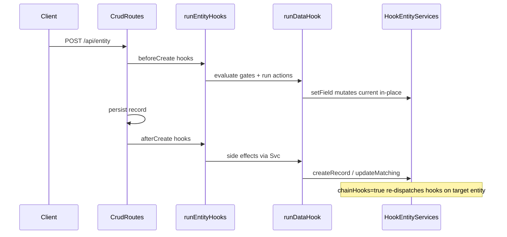

# Data Hook definition JSON specification

This document is the **authoritative, self-contained reference for Data Hooks (Automation)**. It defines every supported trigger, condition, action, and expression so a data team or implementer can author tenant automation hooks outside the UI and import them successfully.

**Validation (source of truth in code):**

- Definition schema: [`packages/hooks/src/data-hook-definition.ts`](../packages/hooks/src/data-hook-definition.ts)
- Expression AST and functions: [`packages/hooks/src/expression.ts`](../packages/hooks/src/expression.ts)
- Runtime interpreter: [`packages/hooks/src/interpret-data-hook.ts`](../packages/hooks/src/interpret-data-hook.ts)
- Portable JSON envelopes: [`packages/hooks/src/data-hook-definition-json.ts`](../packages/hooks/src/data-hook-definition-json.ts)
- API routes: [`apps/api/src/hooks/register-hook-routes.ts`](../apps/api/src/hooks/register-hook-routes.ts)

**Related docs (different concerns):**

| Document | Purpose |
|----------|---------|
| [data-hooks.md](./data-hooks.md) | Product overview and phasing summary |
| [hooks-system-guide.md](./hooks-system-guide.md) | Hook dispatch architecture (system + dynamic hooks) |
| [entity-definition-json.md](./entity-definition-json.md) | Entity catalog JSON — hooks reference entity and field names |
| Tenant bundle (`hooks[]`) | Admin full records — portable envelopes below are the import format |

---

## Table of contents

1. [Quick start](#1-quick-start)
2. [Execution model](#2-execution-model)
3. [Hook definition schema](#3-hook-definition-schema)
4. [Triggers](#4-triggers)
5. [Conditions](#5-conditions)
6. [Actions](#6-actions)
7. [Expression language](#7-expression-language)
8. [Portable JSON envelopes](#8-portable-json-envelopes)
9. [API and permissions](#9-api-and-permissions)
10. [UI surfaces](#10-ui-surfaces)
11. [Cookbook](#11-cookbook)
12. [Migration from legacy hooks](#12-migration-from-legacy-hooks)
13. [Not yet supported](#13-not-yet-supported)
14. [Checklist before import](#14-checklist-before-import)

---

## 1. Quick start

**Recommended workflow:**

1. Import or define **entities** first ([entity-definition-json.md](./entity-definition-json.md)).
2. Author hook definitions as portable JSON (single hook or catalog envelope).
3. Import in the app: **Automation → select entity → Import JSON** (catalog) or use the settings-panel JSON toolbar (single hook).
4. Test with a dev tenant before promoting to production.

**Identity key:** Each hook is uniquely identified within a tenant by **`entity` + `name`**. Catalog replace operations match on this pair (`entity\0name` internally). The same hook name may exist on different entities.

**Do not include in portable JSON** (server-managed):

- `id`, `tenantId`, `createdAt`, `updatedAt`

Use **View JSON** in the Automation UI to export a valid template.

---

## 2. Execution model

Data Hooks run in response to entity CRUD lifecycle events. They reuse the generic hook dispatch layer (`runEntityHooks`, registry, tenant runtime context) and are stored per tenant in the `__data_hooks` collection.

### Event naming

Canonical event format:

```
{entity}.{phase}{Operation}
```

| Event | When |
|-------|------|
| `{entity}.beforeCreate` | Before POST validation/persist |
| `{entity}.afterCreate` | After successful create |
| `{entity}.beforeUpdate` | Before PUT persist |
| `{entity}.afterUpdate` | After successful update |
| `{entity}.beforeDelete` | After relation checks, before delete |
| `{entity}.afterDelete` | After successful delete |
| `{entity}.afterSchedule` | Scheduled tick (time-based trigger) |

Examples: `loan.beforeCreate`, `payment.afterUpdate`, `paymentSchedule.afterSchedule`.

The hook definition stores `entity`, `phase` (`before` | `after`), and `trigger` separately; the runtime composes the event string. CRUD hooks use `trigger.kind: "crud"` (or legacy `{ "operation": "create" }`) with `trigger.operation`. Scheduled hooks use `trigger.kind: "schedule"`.

### Lifecycle



### Phase semantics

| Phase | On failure | Mutations |
|-------|------------|-----------|
| `before` | Blocks CRUD (400) | `setField` mutates `context.current` in place; persisted record includes the change |
| `after` | Logged; CRUD succeeds | Side effects via entity services (`setField`, `createRecord`, etc.) |

Relation validation runs before hook `beforeDelete`.

### Activation gates (evaluated in order)

1. **`updateFields` gate** (update triggers only): If `trigger.updateFields` is a non-empty array, the hook runs only when at least one listed field changed between `previous` and `current`. Empty or omitted means any field change.
2. **Condition gate**: If `condition` is set, the recursive boolean tree must evaluate to `true`. Omitted or `null` means always run.
3. **Depth gate**: If `context.depth > 5`, the hook is skipped (logged).
4. **Visited gate**: If the hook's `id` is already in `visitedHookIds`, the hook is skipped (cycle prevention).

### Execution mode

| Value | Applies to | Behavior |
|-------|------------|----------|
| `sync` (default) | All phases | Hook runs inline in the request path |
| `deferred` | `after` phase only | Hook runs in-process fire-and-forget; errors are logged, CRUD already succeeded |
| `queued` | `after` phase only | Hook is enqueued to Cloud Tasks; worker-service runs it asynchronously; CRUD already succeeded |

`queued` requires worker-service and Cloud Tasks (or local dispatch in dev). When the enqueue service is unavailable, `queued` falls back to `deferred` behavior with a warning log.

### Chained hooks (`chainHooks`)

When `chainHooks: true`, entity writes and deletes from this hook's actions (`createRecord`, `createRecords`, `updateMatching`, `deleteMatching`, `deleteRecord`, after-phase `setField`) may trigger hooks on the **target entity**. Chaining is **opt-in** per hook definition.

- Depth increments on each chained dispatch (`MAX_HOOK_DEPTH = 5`).
- Visited hook IDs accumulate to prevent cycles.
- Hook-initiated creates inherit `ownerId` and `accessUserIds` from the triggering user so records appear in list queries.

### Runtime limits

| Limit | Value | Applies to |
|-------|-------|------------|
| Max `createRecords` (sync) | 1,000 (`MAX_CREATE_RECORDS`) | `before` phase; `after` + `sync` or `deferred` |
| Max `createRecords` (queued) | 5,000 (`MAX_CREATE_RECORDS_QUEUED`) | `after` + `execution: "queued"` only |
| Max matching records | 500 | `updateMatching` / `deleteMatching` / scheduled `eachRecord` fan-out |
| Max scheduled records per tick | 500 | `eachRecord` scope per hook per tick |
| Max loaded records | 8 | `getRecord` / `getOrCreateRecord` / `matchRelatedRecord` actions per hook |
| Max aggregate actions | 8 | `aggregateMatching` actions per hook |
| Max hook depth | 5 | Chained dispatch |
| Max call arguments | 16 | Expression `call` nodes |

---

## 3. Hook definition schema

Portable hook shape (same as `POST /api/data-hooks` body minus server fields):

```json
{
  "name": "Set pending status",
  "description": "Optional human-readable summary",
  "entity": "loan",
  "phase": "before",
  "trigger": { "operation": "create" },
  "condition": null,
  "actions": [
    {
      "type": "setField",
      "field": "status",
      "value": { "kind": "literal", "value": "Pending" }
    }
  ],
  "enabled": true,
  "order": 0,
  "chainHooks": false,
  "execution": "sync"
}
```

### Field reference

| Field | Type | Required | Default | Description |
|-------|------|----------|---------|-------------|
| `name` | string | yes | — | Display name; unique per `entity` within tenant |
| `description` | string | no | — | Optional notes |
| `entity` | string | yes | — | Trigger entity (camelCase name from entity catalog) |
| `phase` | `"before"` \| `"after"` | yes | — | When relative to persist |
| `trigger` | object | yes | — | See [§4](#4-triggers) |
| `condition` | condition node \| `null` | no | `null` | Activation guard; see [§5](#5-conditions) |
| `actions` | array (min 1) | yes | — | Ordered action list; see [§6](#6-actions) |
| `enabled` | boolean | yes | — | Disabled hooks are stored but not registered |
| `order` | integer | yes | — | Sort order within same entity+event (ascending) |
| `chainHooks` | boolean | no | `false` | Opt-in chained dispatch for action writes |
| `execution` | `"sync"` \| `"deferred"` \| `"queued"` | no | `"sync"` | After-phase only for `deferred` and `queued` |

Action target entities (`createRecord`, `createRecords`, `updateMatching`) must exist in the tenant catalog at create/update time.

---

## 4. Triggers

Triggers are a discriminated union on `kind`: **`crud`** (default) or **`schedule`**. Legacy definitions omit `kind` and are treated as CRUD when `operation` is present.

### CRUD trigger (`kind: "crud"`)

```json
{
  "kind": "crud",
  "operation": "create",
  "updateFields": ["status", "amount"]
}
```

Legacy (still valid):

```json
{ "operation": "create" }
```

| Property | Type | Required | Description |
|----------|------|----------|-------------|
| `kind` | `"crud"` | no | Defaults to CRUD when omitted and `operation` is set |
| `operation` | `"create"` \| `"update"` \| `"delete"` | yes | CRUD operation that fires the hook |
| `updateFields` | string[] | no | Update only: run when any listed field changed; omit for any change |

### Schedule trigger (`kind: "schedule"`)

Time-based hooks run on a cron schedule via worker-service (`POST /tasks/schedule-tick`), typically invoked every minute by Cloud Scheduler.

```json
{
  "kind": "schedule",
  "cron": "0 6 * * *",
  "timezone": "UTC",
  "scope": "once"
}
```

| Property | Type | Required | Description |
|----------|------|----------|-------------|
| `kind` | `"schedule"` | yes | Discriminator |
| `cron` | string | yes | Five-field cron expression |
| `timezone` | string | no | IANA timezone (default `UTC`) |
| `scope` | `"once"` \| `"eachRecord"` | no | Default `once` |
| `eachRecordWhere` | condition tree | when `scope` is `eachRecord` | Same shape as hook conditions; requires at least one `==` leaf for indexed lookup |

**Schedule constraints:**

- `phase` must be `after` (before-phase scheduled hooks are rejected).
- `scope: "once"` runs the hook once per tick with a synthetic trigger record (`id: "__scheduled__"`). Use batch actions such as `updateMatching`, `deleteMatching`, or `aggregateMatching`.
- `scope: "eachRecord"` lists up to 500 matching entity rows per tick and runs the hook once per row (`current` = record). Use for per-row `setField`, notifications, etc.
- Scheduled hooks do not fire on CRUD events (`{entity}.afterSchedule` is separate from `{entity}.afterUpdate`).
- Design hooks to be **idempotent** — the same cron minute may be evaluated more than once during deploys or retries.
- `execution: "queued"` is recommended for long-running scheduled hooks; the tick runner invokes `runDataHook` directly on worker-service (no re-enqueue loop).

**Infrastructure:** set `SCHEDULED_HOOK_USER_UID` on worker-service to a user with tenant admin (or equivalent) permissions for hook actions. Cloud Scheduler should POST to `{WORKER_SERVICE_URL}/tasks/schedule-tick` every minute with OIDC from `TASKS_SA_EMAIL`.

---

## 5. Conditions

Conditions are an optional **activation guard** on the trigger record. They use a recursive boolean tree distinct from entity query filters.

### Group node

```json
{
  "type": "group",
  "combinator": "and",
  "children": []
}
```

| Property | Values | Description |
|----------|--------|-------------|
| `type` | `"group"` | Discriminator |
| `combinator` | `"and"` \| `"or"` | `and`: all children must match; `or`: any child may match |
| `children` | array | Nested group or condition nodes |

An **empty group** evaluates to `true` (hook runs).

### Condition leaf

```json
{
  "type": "condition",
  "field": "amount",
  "operator": ">=",
  "value": { "kind": "field", "source": "current", "path": "commitmentAmount" }
}
```

| Property | Type | Required | Description |
|----------|------|----------|-------------|
| `type` | `"condition"` | yes | Discriminator |
| `field` | string | yes | Field on trigger record (`current`) |
| `operator` | see below | yes | Comparison operator |
| `value` | expression | no | Right-hand side; omitted for valueless operators |

### Operators

| Operator | `value` required | Semantics |
|----------|------------------|-----------|
| `==` | yes | Loose equality (numbers coerced) |
| `!=` | yes | Negated loose equality |
| `>`, `<`, `>=`, `<=` | yes | Ordered comparison (numbers or strings) |
| `in` | yes | Field value equals any element of expression array |
| `notIn` | yes | Field value equals none of array elements |
| `isEmpty` | no | Field is `null` or `""` |
| `isNotEmpty` | no | Field is not empty |
| `changed` | no | Field differs between `previous` and `current` (update context) |

For `in` and `notIn`, the `value` expression may be a **flat array literal** (1–32 scalar items). This replaces long OR chains of `==` / `!=` comparisons:

```json
{
  "type": "condition",
  "field": "itemType",
  "operator": "in",
  "value": {
    "kind": "literal",
    "value": ["MORTGAGE", "LOAN", "CREDIT_CARD"]
  }
}
```

Array literals are only valid on `in`/`notIn` condition values (not in action expressions or other operators). Elements are scalars: `string`, `number`, `boolean`, or `null`.

### Legacy bare leaf

Objects `{ field, operator, value? }` **without** `type` are accepted and normalized to `type: "condition"`.

### `updateMatching.where`

The `updateMatching` action uses the same **AND/OR condition tree** as hook conditions (`type: "group"` / `type: "condition"`), or a legacy **typeless single leaf** (no `type` discriminator):

```json
{
  "type": "group",
  "combinator": "and",
  "children": [
    {
      "type": "condition",
      "field": "financialItemId",
      "operator": "==",
      "value": { "kind": "field", "source": "current", "path": "id" }
    },
    {
      "type": "condition",
      "field": "status",
      "operator": "==",
      "value": { "kind": "literal", "value": "UPCOMING" }
    }
  ]
}
```

Legacy single-leaf lookups remain valid:

```json
{
  "field": "contractId",
  "operator": "==",
  "value": { "kind": "field", "source": "current", "path": "id" }
}
```

Leaf **field** names refer to the **target entity** being matched. Leaf **value** expressions resolve against the **trigger** scope. At least one `==` leaf with a `value` expression is required — the first such leaf (depth-first) drives the indexed `findByField` query; the full tree is re-evaluated per candidate (matched record as `current`, trigger as `previous`).

---

## 6. Actions

Actions run in array order after all gates pass. Every computed value is an **expression** ([§7](#7-expression-language)).

### `setField`

Set a field on the trigger record.

```json
{
  "type": "setField",
  "field": "status",
  "value": { "kind": "literal", "value": "COMPLETE" }
}
```

| Phase | Behavior |
|-------|----------|
| `before` | Mutates `context.current[field]` in place; CRUD persists the value |
| `after` | Calls entity service `update` on trigger record; requires `current.id` |

### `createRecord`

Create one related record.

```json
{
  "type": "createRecord",
  "entity": "payment",
  "data": {
    "loanId": { "kind": "field", "source": "current", "path": "id" },
    "amount": { "kind": "field", "source": "current", "path": "amount" }
  }
}
```

| Property | Description |
|----------|-------------|
| `entity` | Target entity name |
| `data` | Map of field name → expression evaluated against trigger scope |

Typically used in `after` phase. Enforces RBAC create + field write permissions for the triggering user.

### `createRecords`

Loop `count` times, creating one record per iteration. Optional `startIndex` offsets the `loopIndex` variable (absolute index = `startIndex + iteration`).

```json
{
  "type": "createRecords",
  "entity": "paymentSchedule",
  "count": { "kind": "field", "source": "current", "path": "periods" },
  "startIndex": { "kind": "literal", "value": 0 },
  "data": {
    "sequence": { "kind": "var", "name": "loopIndex" },
    "dueDate": {
      "kind": "call",
      "fn": "dateAdd",
      "args": [
        { "kind": "field", "source": "current", "path": "startDate" },
        {
          "kind": "binary",
          "op": "*",
          "left": { "kind": "var", "name": "loopIndex" },
          "right": { "kind": "literal", "value": 30 }
        },
        { "kind": "literal", "value": "DAY" }
      ]
    }
  }
}
```

| Property | Description |
|----------|-------------|
| `count` | Expression → non-negative integer (truncated); tier limit applies (see runtime limits) |
| `startIndex` | Optional expression → non-negative integer; defaults to `0`. Sets the initial `loopIndex` for the first iteration. |
| `data` | Field map; `loopIndex` and optional `loopState` variables available (absolute index when `startIndex` is set) |

**Loop state:** set `data.__loopState` to an expression; its evaluated value becomes `loopState` on the next iteration. Fields whose names start with `__` are stripped before the entity write.

**Tier limits:** literal `count` above `MAX_CREATE_RECORDS` (1,000) requires `after` phase with `execution: "queued"` (up to `MAX_CREATE_RECORDS_QUEUED` = 5,000). Hard ceiling: 5,000 literal count. Dynamic counts are enforced at runtime with the same rules.

**Rolling horizon:** for horizons longer than one batch, create an initial slice on create (`startIndex: 0`, `count = min(horizon, MAX)`), then extend on a schedule with `aggregateMatching` (count existing rows) + `createRecords` (`startIndex = aggregate`, `count = remaining batch`). See cookbook §11.

### `updateMatching`

Find records on another entity and apply field updates.

```json
{
  "type": "updateMatching",
  "entity": "paymentSchedule",
  "where": {
    "type": "group",
    "combinator": "and",
    "children": [
      {
        "type": "condition",
        "field": "financialItemId",
        "operator": "==",
        "value": { "kind": "field", "source": "current", "path": "id" }
      },
      {
        "type": "condition",
        "field": "status",
        "operator": "==",
        "value": { "kind": "literal", "value": "UPCOMING" }
      }
    ]
  },
  "set": {
    "status": { "kind": "literal", "value": "SKIPPED" }
  }
}
```

| Property | Description |
|----------|-------------|
| `where` | AND/OR condition tree (or legacy typeless leaf). Value expressions use **trigger** scope; field names refer to the **target** entity. Requires at least one `==` leaf with a `value` expression for indexed lookup. |
| `set` | Field map; expressions see **matched record** as `current`, **trigger** as `previous` |

The runtime uses the first `==` leaf (depth-first) for `findByField`, then post-filters up to 500 candidates with the full `where` tree.

### `deleteMatching`

Delete records on another entity matching a compound `where` clause. **After phase only.** Uses the same `where` shape and lookup semantics as `updateMatching`.

```json
{
  "type": "deleteMatching",
  "entity": "paymentSchedule",
  "where": {
    "type": "group",
    "combinator": "and",
    "children": [
      {
        "type": "condition",
        "field": "financialItemId",
        "operator": "==",
        "value": { "kind": "field", "source": "current", "path": "id" }
      },
      {
        "type": "condition",
        "field": "status",
        "operator": "==",
        "value": { "kind": "literal", "value": "UPCOMING" }
      }
    ]
  }
}
```

Requires `${entity}.delete` permission on the hook runner. Respects `chainHooks` for `beforeDelete` / `afterDelete` on each removed record.

### `deleteRecord`

Delete one record on another entity by id. **After phase only.**

```json
{
  "type": "deleteRecord",
  "entity": "paymentSchedule",
  "id": { "kind": "field", "source": "current", "path": "paymentScheduleId" }
}
```

The `id` expression is evaluated against the **trigger** scope and must produce a non-empty string.

### `getRecord`

Load one record from another entity into hook scope (read-only). Allowed in **before** and **after** phases. Does not trigger chained hooks.

```json
{
  "type": "getRecord",
  "entity": "financialItem",
  "id": { "kind": "field", "source": "current", "path": "financialItemId" },
  "as": "parent"
}
```

- `entity` (required): target entity name
- `id` (required): expression evaluating to a non-empty record id (uses cumulative scope including prior loads in the same hook run)
- `as` (required): alias name (`/^[a-zA-Z][a-zA-Z0-9_]{0,31}$/`); must be unique within the hook

Requires `${entity}.read` permission. Missing records fail the hook. Later actions reference loaded fields with:

```json
{ "kind": "field", "source": "loaded", "alias": "parent", "path": "frequency" }
```

Maximum **8** `getRecord` / `getOrCreateRecord` / `matchRelatedRecord` actions per hook definition (combined).

### `getOrCreateRecord`

Find the first record matching a compound `where` tree (same shape as `updateMatching`). If none match, create one from `data` and load the created record (unless `createIfMissing` is `false`). Allowed in **before** and **after** phases. Create uses the same `chainHooks` write options as `createRecord`.

```json
{
  "type": "getOrCreateRecord",
  "entity": "category",
  "where": {
    "type": "condition",
    "field": "name",
    "operator": "==",
    "value": { "kind": "field", "source": "current", "path": "__extracted.fields.categoryName" }
  },
  "data": {
    "name": { "kind": "field", "source": "current", "path": "__extracted.fields.categoryName" },
    "kind": { "kind": "literal", "value": "EXPENSE" }
  },
  "as": "category"
}
```

Find-only (no create on miss):

```json
{
  "type": "getOrCreateRecord",
  "entity": "financialItem",
  "createIfMissing": false,
  "where": {
    "type": "group",
    "combinator": "and",
    "children": [
      {
        "type": "condition",
        "field": "name",
        "operator": "==",
        "value": { "kind": "field", "source": "current", "path": "__extracted.fields.matchedSubscriptionName" }
      },
      {
        "type": "condition",
        "field": "parentFinancialItemId",
        "operator": "==",
        "value": { "kind": "field", "source": "current", "path": "id" }
      }
    ]
  },
  "as": "subscription"
}
```

- `entity` (required): target entity name
- `where` (required): condition tree with at least one `==` lookup leaf
- `createIfMissing` (optional, default `true`): when `false`, set `loaded.{as}` to `null` if no match instead of creating
- `data` (required when `createIfMissing` is true/omitted): field expressions used **only when creating**; optional when `createIfMissing` is `false`
- `as` (required): alias name; unique among all loaded / aggregate aliases in the hook

If the lookup `==` value evaluates to `null` or an empty string, the action sets `loaded.{as}` to `null` and does **not** create a record. Later actions can fall back with `coalesce`:

```json
{
  "kind": "call",
  "fn": "coalesce",
  "args": [
    { "kind": "field", "source": "loaded", "alias": "category", "path": "id" },
    { "kind": "field", "source": "current", "path": "categoryId" }
  ]
}
```

Requires `${entity}.read` (and `${entity}.create` when creating — skipped when `createIfMissing` is `false`). Later actions reference loaded fields the same way as `getRecord`.

### `matchRelatedRecord`

Find-only: list candidates with a compound `where` tree (same shape and lookup semantics as `getOrCreateRecord` / `updateMatching`), then pick the best match by scoring a **haystack** expression against each candidate’s **alias field**. Prefer case-insensitive exact alias equality; otherwise prefer the longest alias that is a substring of the haystack (stable candidate order on ties). Allowed in **before** and **after** phases. Never creates a record.

```json
{
  "type": "matchRelatedRecord",
  "entity": "financialItem",
  "where": {
    "type": "group",
    "combinator": "and",
    "children": [
      {
        "type": "condition",
        "field": "parentFinancialItemId",
        "operator": "==",
        "value": { "kind": "field", "source": "current", "path": "id" }
      },
      {
        "type": "condition",
        "field": "status",
        "operator": "==",
        "value": { "kind": "literal", "value": "ACTIVE" }
      }
    ]
  },
  "haystack": {
    "kind": "call",
    "fn": "coalesce",
    "args": [
      { "kind": "field", "source": "current", "path": "__extracted.fields.description" },
      { "kind": "field", "source": "current", "path": "__email.subject" },
      { "kind": "literal", "value": "" }
    ]
  },
  "aliasField": "billingAliases",
  "as": "subscription"
}
```

- `entity` (required): target entity name
- `where` (required): condition tree with at least one `==` lookup leaf
- `haystack` (required): expression evaluated to text; trimmed and upper-cased for matching. Empty / missing → `loaded.{as}` is `null` (no list)
- `aliasField` (required): field on candidates holding a `string` or `string[]` of aliases
- `as` (required): alias name; unique among all loaded / aggregate aliases in the hook

Requires `${entity}.read`. Counts toward the max loaded-record limit with `getRecord` / `getOrCreateRecord`.

### `aggregateMatching`

Compute a scalar over records matching a compound `where` tree (same shape as `updateMatching`). Read-only; allowed in **before** and **after** phases. Does not trigger chained hooks.

```json
{
  "type": "aggregateMatching",
  "entity": "childRow",
  "where": {
    "type": "group",
    "combinator": "and",
    "children": [
      {
        "type": "condition",
        "field": "parentId",
        "operator": "==",
        "value": { "kind": "field", "source": "current", "path": "id" }
      },
      {
        "type": "condition",
        "field": "status",
        "operator": "==",
        "value": { "kind": "literal", "value": "ACTIVE" }
      }
    ]
  },
  "op": "min",
  "field": "dueDate",
  "as": "nextDue"
}
```

- `entity` (required): target entity name
- `where` (required): condition tree with at least one `==` lookup leaf (max 500 matched rows)
- `op` (required): `count` | `sum` | `min` | `max` | `avg`
- `field` (required when `op` is not `count`): field name on matched records to reduce
- `as` (required): alias for the result; unique among all `getRecord` / `getOrCreateRecord` / `matchRelatedRecord` / `aggregateMatching` actions in the hook

Requires `${entity}.read` permission. Later actions reference the result with:

```json
{ "kind": "field", "source": "aggregate", "alias": "nextDue" }
```

| Op | Empty matches | Result type |
|----|---------------|-------------|
| `count` | `0` | number |
| `sum` | `0` | number (numeric field required) |
| `min` / `max` | `null` | number or string (ISO dates compare lexicographically) |
| `avg` | `null` | number (numeric field required) |

Maximum **8** `aggregateMatching` actions per hook definition.

### 6.1 Query and bulk-read patterns (no `list` action)

There is **no** `list` action in the data hooks engine. Expressions cannot perform I/O; use actions to read or mutate related data instead.

| Need | Supported pattern |
|------|-------------------|
| Fetch one related row | `getRecord` → reference with `{ "kind": "field", "source": "loaded", "alias": "…" }` |
| Find by field or create | `getOrCreateRecord` → same `loaded` references; empty lookup loads `null` |
| Match related by alias text | `matchRelatedRecord` → score haystack vs alias field on candidates; loads `null` if no match |
| Count / sum / min / max / avg over matches | `aggregateMatching` → `{ "kind": "field", "source": "aggregate", "alias": "…" }` |
| Update or delete many rows | `updateMatching` / `deleteMatching` with compound `where` (AND/OR tree) |
| List rows inside an expression | **Not supported** — use aggregates or side-effect actions |

Rolling horizons combine `aggregateMatching` (`count`) with `createRecords` and `startIndex`; see [§11.4.1](#1141-rolling-schedule-horizon).

### `sendNotification`

Log a computed message (no real notification infrastructure yet).

```json
{
  "type": "sendNotification",
  "message": {
    "kind": "call",
    "fn": "concat",
    "args": [
      { "kind": "literal", "value": "Loan " },
      { "kind": "field", "source": "current", "path": "id" },
      { "kind": "literal", "value": " created" }
    ]
  }
}
```

Writes to the hook logger at `info` level with entity, event, and tenant context.

### `callWebhook`

POST JSON to an external HTTPS URL.

```json
{
  "type": "callWebhook",
  "url": {
    "kind": "literal",
    "value": "https://example.com/hooks/loan-created"
  },
  "body": {
    "kind": "literal",
    "value": {
      "loanId": { "kind": "field", "source": "current", "path": "id" }
    }
  }
}
```

- `url` (required): expression evaluating to a non-empty string
- `body` (optional): expression evaluating to a JSON object; when omitted, the runtime sends a default envelope with `tenantId`, `entityName`, `event`, `current`, optional `previous`, and `user`
- Method is always **POST**; non-2xx responses fail the action
- HTTPS required in production; SSRF guards block private/local hosts

### Execution logs

When the runtime provides a log recorder, each hook run writes a document to tenant collection `__data_hook_executions` with status `success`, `error`, or `skipped`. List recent entries via `GET /api/data-hooks/:id/executions` (cursor-paginated with `nextCursor`).

**Executions vs records created:** one execution is one run of one hook for one trigger context. Actions such as `createRecords` may create many child documents inside that single execution. The debugger and execution list show **runs**, not one row per child document.

Each execution document includes:

| Field | Meaning |
|-------|---------|
| `hookId`, `hookName`, `entityName`, `event`, `phase`, `operation` | Trigger context |
| `recordId` | Trigger record id (not children created) |
| `chainDepth` | Nesting depth when chained hooks fire |
| `durationMs`, `status`, `error`, `executionMode` | Outcome and cost |
| `writesCreated`, `writesUpdated`, `writesDeleted` | Total writes during the run |
| `writesByEntity` | Per-entity write breakdown |
| `actionTrace` | Per-action timing (capped at 50 entries); `createRecords` includes evaluated `count` |

Use the debugger **Hook executions** source for paginated history, write totals in list subtitles, and per-run detail (writes breakdown, action trace). Per-hook **Recent executions** appears in Data Hook settings.

### RBAC and chaining

- All entity service calls enforce entity-level and field-level permissions for the **triggering user**.
- Chained hook dispatch occurs only when the **source hook** has `chainHooks: true`.

---

## 7. Expression language

Expressions are stored as a **JSON AST** (not parsed from text). They are evaluated deterministically with **no I/O**.

Primitive values (`ExpressionValue`): `string | number | boolean | null`. Dates are ISO-8601 strings.

### Scope

| Binding | Source |
|---------|--------|
| `current` | Trigger record (or matched record in `updateMatching.set`) |
| `previous` | Prior record on update/delete; trigger record in `updateMatching.set` |
| `now` | Evaluation timestamp (`Date`) |
| `userId` | Triggering user's UID |
| `loopIndex` | Iteration index in `createRecords` (`startIndex + offset`; default `startIndex` 0) |
| `loopState` | Carried value from the prior iteration's `data.__loopState` in `createRecords` (undefined on first iteration) |
| `loaded.{alias}` | Record fetched by a prior `getRecord` action in the same run (via `source: "loaded"` field nodes) |
| `aggregates.{alias}` | Scalar from a prior `aggregateMatching` action (via `source: "aggregate"` field nodes) |
| `inputs.{name}` | Formula input bindings (only inside formula bodies; see `input` node) |

### AST node kinds

#### `literal`

```json
{ "kind": "literal", "value": "Pending" }
```

#### `field`

```json
{ "kind": "field", "source": "current", "path": "amount" }
```

Dotted paths supported (`"path": "customer.name"`).

Loaded record fields:

```json
{ "kind": "field", "source": "loaded", "alias": "parent", "path": "frequency" }
```

Aggregate scalar:

```json
{ "kind": "field", "source": "aggregate", "alias": "nextDue" }
```

#### `var`

```json
{ "kind": "var", "name": "loopIndex" }
```

Names: `now`, `loopIndex`, `loopState`, `userId`. (`now` as var returns ISO string; prefer `call`/`var` consistently — `var: now` and scope `now` are equivalent in practice.)

#### `unary`

```json
{ "kind": "unary", "op": "!", "operand": { "kind": "literal", "value": false } }
```

Operators: `-` (negate number), `!` (logical not).

#### `binary`

```json
{
  "kind": "binary",
  "op": "+",
  "left": { "kind": "literal", "value": "Hello " },
  "right": { "kind": "field", "source": "current", "path": "name" }
}
```

| Category | Operators |
|----------|-----------|
| Arithmetic | `+` `-` `*` `/` `%` (`+` concatenates if either operand is string) |
| Comparison | `==` `!=` `>` `<` `>=` `<=` (loose equality for `==`/`!=`) |
| Logical | `&&` `||` (returns boolean) |

Division/modulo by zero throws `ExpressionEvaluationError`.

#### `call`

```json
{
  "kind": "call",
  "fn": "if",
  "args": [
    { "kind": "binary", "op": ">", "left": { "kind": "field", "source": "current", "path": "amount" }, "right": { "kind": "literal", "value": 0 } },
    { "kind": "literal", "value": "ACTIVE" },
    { "kind": "literal", "value": "INACTIVE" }
  ]
}
```

Max 16 arguments per call.

#### `switch`

Flat key→value lookup node. Evaluates `input`, then returns the `then` value of the **first** case whose `when` equals the input (loose equality, same rules as `==`). If no case matches, evaluates and returns `default`. Both `when` and `then` are full expression nodes (typically `when` is a literal).

```json
{
  "kind": "switch",
  "input": { "kind": "field", "source": "current", "path": "itemType" },
  "cases": [
    {
      "when": { "kind": "literal", "value": "MORTGAGE" },
      "then": { "kind": "literal", "value": "LIABILITY" }
    },
    {
      "when": { "kind": "literal", "value": "INVESTMENT" },
      "then": { "kind": "literal", "value": "ASSET" }
    }
  ],
  "default": { "kind": "literal", "value": "NONE" }
}
```

Limits: at least **1** case, at most **32** cases (`MAX_SWITCH_CASES`). Prefer `switch` over deeply nested `call`/`if` trees when mapping many keys — case rows stay in a shallow array instead of nesting each branch as a child object (important for Firestore document depth).

#### `formula`

Invoke a named reusable formula definition (platform library or tenant-defined). Tenant formulas override platform names with the same name.

```json
{
  "kind": "formula",
  "name": "schedulePrincipalPortion",
  "inputs": {}
}
```

With explicit input wiring:

```json
{
  "kind": "formula",
  "name": "monthlyRateFromQuote",
  "inputs": {
    "rate": { "kind": "field", "source": "current", "path": "interestRate" },
    "quote": { "kind": "field", "source": "current", "path": "interestRateQuote" }
  }
}
```

Resolution order: tenant formula by name → platform library → evaluation error. Formulas may call other formulas (composition). Max depth 16; circular references are rejected at catalog import and runtime.

#### `input`

Reference a formula input binding. Valid only inside formula bodies (not in hook expressions directly).

```json
{ "kind": "input", "name": "rate" }
```

Outer hook scope (`current`, `loaded.*`, `loopState`, etc.) remains visible inside formulas unless shadowed by an input name.

### Functions reference

| Function | Args | Returns | Description |
|----------|------|---------|-------------|
| `now` | 0 | ISO string | Current timestamp from scope |
| `dateAdd` | date, amount, unit | ISO string | Add amount of unit to date |
| `dateDiff` | from, to, unit | number | Difference in units |
| `year` | date | number | UTC full year |
| `month` | date | number | UTC month 1–12 |
| `day` | date | number | UTC day of month |
| `abs` | n | number | Absolute value |
| `round` | n | number | Round to nearest integer |
| `floor` | n | number | Floor |
| `ceil` | n | number | Ceiling |
| `min` | n… | number | Minimum of arguments |
| `max` | n… | number | Maximum of arguments |
| `coalesce` | v… | value | First non-null argument |
| `concat` | v… | string | String join (null → "") |
| `toNumber` | v | number | Coerce to number |
| `toText` | v | string | Coerce to string |
| `dateParse` | v | ISO string | Parse/coerce to date |
| `isEmpty` | v | boolean | `null` or `""` |
| `if` | cond, then, else | value | Conditional (truthy: non-zero number, non-empty string, `true`) |
| `length` | text | number | String length (`null` → 0) |
| `substring` | text, start, end? | string | JS substring semantics |
| `trim` | text | string | Trim whitespace |
| `upper` | text | string | Uppercase |
| `lower` | text | string | Lowercase |
| `startsWith` | text, prefix | boolean | Prefix test |
| `endsWith` | text, suffix | boolean | Suffix test |
| `includes` | text, search | boolean | Substring test |

**Date units** (for `dateAdd` / `dateDiff`): `MILLISECOND`, `SECOND`, `MINUTE`, `HOUR`, `DAY`, `WEEK`, `MONTH`, `YEAR`.

### UI authoring note

The Automation **ExpressionEditor** supports simple modes (literal, field, now, loopIndex), structured visual builders for **binary** (operator + left/right operands), **unary** (operator + operand), **call** (function + arguments with nested editors), **switch** (input + when/then case rows + default), plus **Advanced JSON** as a fallback for edge cases and import/debug. Complex trees are built recursively in the UI; Advanced JSON remains available for power users.

---

## 8. Portable JSON envelopes

Every import file is a **versioned envelope** with a `kind` discriminator.

### Single hook (`kind: "data-hook-definition"`)

```json
{
  "kind": "data-hook-definition",
  "version": 1,
  "data": {
    "name": "Set pending status",
    "entity": "loan",
    "phase": "before",
    "trigger": { "operation": "create" },
    "actions": [
      {
        "type": "setField",
        "field": "status",
        "value": { "kind": "literal", "value": "Pending" }
      }
    ],
    "enabled": true,
    "order": 0
  }
}
```

### Catalog (`kind: "data-hooks-catalog"`)

```json
{
  "kind": "data-hooks-catalog",
  "version": 1,
  "exportedAt": "2026-07-01T13:00:00.000Z",
  "dataHooks": [
    {
      "name": "Set pending status",
      "entity": "loan",
      "phase": "before",
      "trigger": { "operation": "create" },
      "actions": [
        {
          "type": "setField",
          "field": "status",
          "value": { "kind": "literal", "value": "Pending" }
        }
      ],
      "enabled": true,
      "order": 0
    }
  ]
}
```

| Property | Required | Description |
|----------|----------|-------------|
| `kind` | yes | `"data-hooks-catalog"` |
| `version` | yes | `1` |
| `exportedAt` | yes | ISO datetime (informational) |
| `dataHooks` | yes | At least one portable hook (§3 shape) |

Duplicate `entity` + `name` pairs within a catalog are rejected.

### Catalog replace semantics

`PUT /api/data-hooks/catalog`:

| Query | Behavior |
|-------|----------|
| `?entity=loan` | Replace only hooks whose `entity` is `loan`; hooks on other entities untouched |
| (no query) | Full tenant replace — hooks not in import are deleted |

Requires `hook.create`, `hook.update`, and `hook.delete` permissions.

Seed catalog: [`apps/api/src/admin/rates-tenant/catalogs/rates-data-hooks.json`](../apps/api/src/admin/rates-tenant/catalogs/rates-data-hooks.json). Platform gaps: [data-hooks-platform-gaps.md](./data-hooks-platform-gaps.md). Rates backlog: [rates-data-hooks-gap-analysis.md](./rates-data-hooks-gap-analysis.md).

---

## 9. API and permissions

Base path: **`/api/data-hooks`**

| Method | Path | Permission | Description |
|--------|------|------------|-------------|
| GET | `/api/data-hooks?entity=<name>` | `hook.read` | List hooks (optional entity filter) |
| GET | `/api/data-hooks/:id` | `hook.read` | Get one hook |
| POST | `/api/data-hooks` | `hook.create` | Create hook |
| PATCH | `/api/data-hooks/:id` | `hook.update` | Update hook |
| DELETE | `/api/data-hooks/:id` | `hook.delete` | Delete hook |
| PUT | `/api/data-hooks/catalog?entity=<name>` | `hook.create` + `hook.update` + `hook.delete` | Replace catalog |

Tenant `admin` role (`*` grant) includes all hook permissions.

Storage: `tenants/{tenantId}/__data_hooks/{hookId}`

---

## 10. UI surfaces

| Surface | Location | Capability |
|---------|----------|------------|
| Hook list | Automation sidebar → entity | List, select, create, delete hooks |
| Settings panel | Right pane | Edit name, phase, trigger, condition tree, actions, `chainHooks`, `execution` |
| Single JSON | List panel toolbar | View/import one definition |
| Catalog JSON | List panel header | View/import entity-scoped catalog |
| Condition editor | Settings panel | Recursive AND/OR tree with expression leaves |
| Actions editor | Settings panel | Ordered action list with expression fields |

Route pattern: `/automation/:entityName`

---

## 11. Cookbook

Complete portable hook definitions (import via catalog or `POST /api/data-hooks`).

### 11.1 Default field on create

`before` + `setField` — set status when a loan is created.

```json
{
  "name": "Set pending status",
  "entity": "loan",
  "phase": "before",
  "trigger": { "operation": "create" },
  "condition": null,
  "actions": [
    {
      "type": "setField",
      "field": "status",
      "value": { "kind": "literal", "value": "Pending" }
    }
  ],
  "enabled": true,
  "order": 0
}
```

### 11.2 Conditional completion

Condition tree + `setField` — complete loan when amount meets commitment.

```json
{
  "name": "Complete when funded",
  "entity": "loan",
  "phase": "before",
  "trigger": { "operation": "create" },
  "condition": {
    "type": "group",
    "combinator": "and",
    "children": [
      {
        "type": "condition",
        "field": "amount",
        "operator": ">=",
        "value": { "kind": "field", "source": "current", "path": "commitmentAmount" }
      }
    ]
  },
  "actions": [
    {
      "type": "setField",
      "field": "status",
      "value": { "kind": "literal", "value": "COMPLETE" }
    }
  ],
  "enabled": true,
  "order": 1
}
```

### 11.3 Related record create

`after` + `createRecord` — create payment when loan is created.

```json
{
  "name": "Create payment on loan",
  "entity": "loan",
  "phase": "after",
  "trigger": { "operation": "create" },
  "condition": null,
  "actions": [
    {
      "type": "createRecord",
      "entity": "payment",
      "data": {
        "loanId": { "kind": "field", "source": "current", "path": "id" },
        "amount": { "kind": "field", "source": "current", "path": "amount" }
      }
    }
  ],
  "enabled": true,
  "order": 0
}
```

### 11.3b Get or create related record

`after` + `getOrCreateRecord` — resolve a category by name (create if missing), then use its id.

```json
{
  "name": "Ensure category then create transaction",
  "entity": "financialItem",
  "phase": "after",
  "trigger": { "kind": "email" },
  "condition": null,
  "actions": [
    {
      "type": "getOrCreateRecord",
      "entity": "category",
      "where": {
        "type": "condition",
        "field": "name",
        "operator": "==",
        "value": {
          "kind": "field",
          "source": "current",
          "path": "__extracted.fields.categoryName"
        }
      },
      "data": {
        "name": {
          "kind": "field",
          "source": "current",
          "path": "__extracted.fields.categoryName"
        },
        "kind": { "kind": "literal", "value": "EXPENSE" }
      },
      "as": "category"
    },
    {
      "type": "createRecord",
      "entity": "transaction",
      "data": {
        "categoryId": {
          "kind": "call",
          "fn": "coalesce",
          "args": [
            {
              "kind": "field",
              "source": "loaded",
              "alias": "category",
              "path": "id"
            },
            { "kind": "field", "source": "current", "path": "categoryId" }
          ]
        },
        "amount": {
          "kind": "field",
          "source": "current",
          "path": "__extracted.fields.amount"
        }
      }
    }
  ],
  "enabled": true,
  "order": 0
}
```

### 11.4 Payment schedule generation

`createRecords` + `loopIndex` + `dateAdd`.

```json
{
  "name": "Generate payment schedule",
  "entity": "loanDetails",
  "phase": "after",
  "trigger": { "operation": "create" },
  "condition": null,
  "actions": [
    {
      "type": "createRecords",
      "entity": "paymentSchedule",
      "count": { "kind": "field", "source": "current", "path": "periods" },
      "data": {
        "sequence": { "kind": "var", "name": "loopIndex" },
        "dueDate": {
          "kind": "call",
          "fn": "dateAdd",
          "args": [
            { "kind": "field", "source": "current", "path": "startDate" },
            {
              "kind": "binary",
              "op": "*",
              "left": { "kind": "var", "name": "loopIndex" },
              "right": { "kind": "literal", "value": 30 }
            },
            { "kind": "literal", "value": "DAY" }
          ]
        }
      }
    }
  ],
  "enabled": true,
  "order": 3
}
```

### 11.4.1 Rolling schedule horizon

For horizons longer than one batch, seed rows on create then extend on a schedule using `startIndex` + `aggregateMatching`:

**Hook A — initial batch (`beforeCreate`):** `count = min(scheduleHorizonMonths, 1000)`, `startIndex = 0`.

**Hook B — monthly extension (`after` + `execution: "queued"` + schedule):** `aggregateMatching` count → `createRecords` with `startIndex = existingCount`, `count = min(batchSize, scheduleHorizonMonths - existingCount)`.

See cookbook fixtures `Seed schedule horizon` and `Extend schedule horizon` in the hooks package tests.

### 11.5 Cascade update

`updateMatching` — deactivate commitments when loan updates.

```json
{
  "name": "Deactivate commitments",
  "entity": "loan",
  "phase": "after",
  "trigger": { "operation": "update", "updateFields": ["status"] },
  "condition": {
    "type": "condition",
    "field": "status",
    "operator": "==",
    "value": { "kind": "literal", "value": "CLOSED" }
  },
  "actions": [
    {
      "type": "updateMatching",
      "entity": "commitment",
      "where": {
        "field": "contractId",
        "operator": "==",
        "value": { "kind": "field", "source": "current", "path": "id" }
      },
      "set": {
        "isActive": { "kind": "literal", "value": false }
      }
    }
  ],
  "enabled": true,
  "order": 4
}
```

### 11.6 Chained automation

Loan `afterCreate` creates payment; payment `beforeCreate` hook runs because `chainHooks: true`.

**Hook A — loan (chained):**

```json
{
  "name": "Create payment",
  "entity": "loan",
  "phase": "after",
  "trigger": { "operation": "create" },
  "chainHooks": true,
  "condition": null,
  "actions": [
    {
      "type": "createRecord",
      "entity": "payment",
      "data": {
        "loanId": { "kind": "field", "source": "current", "path": "id" }
      }
    }
  ],
  "enabled": true,
  "order": 5
}
```

**Hook B — payment (target):**

```json
{
  "name": "Tag payment",
  "entity": "payment",
  "phase": "before",
  "trigger": { "operation": "create" },
  "condition": null,
  "actions": [
    {
      "type": "setField",
      "field": "note",
      "value": { "kind": "literal", "value": "from payment hook" }
    }
  ],
  "enabled": true,
  "order": 0
}
```

### 11.7 Deferred after-hook

Log notification outside the request critical path.

```json
{
  "name": "Log transaction create",
  "entity": "transaction",
  "phase": "after",
  "trigger": { "operation": "create" },
  "execution": "deferred",
  "condition": null,
  "actions": [
    {
      "type": "sendNotification",
      "message": { "kind": "literal", "value": "Transaction created" }
    }
  ],
  "enabled": true,
  "order": 0
}
```

### 11.8 Queued after-hook

Production async path via Cloud Tasks → worker-service. Use when side effects must not block the CRUD response but should survive process restarts (unlike in-process `deferred`).

```json
{
  "name": "Log transaction create (queued)",
  "entity": "transaction",
  "phase": "after",
  "trigger": { "operation": "create" },
  "execution": "queued",
  "condition": null,
  "actions": [
    {
      "type": "sendNotification",
      "message": { "kind": "literal", "value": "Transaction created" }
    }
  ],
  "enabled": true,
  "order": 0
}
```

### 11.9 Webhook after-hook

Notify an external system when a loan is created. Execution is logged to `__data_hook_executions`.

```json
{
  "name": "Notify CRM on loan create",
  "entity": "loan",
  "phase": "after",
  "trigger": { "operation": "create" },
  "execution": "sync",
  "condition": null,
  "actions": [
    {
      "type": "callWebhook",
      "url": {
        "kind": "literal",
        "value": "https://example.com/hooks/loan-created"
      }
    }
  ],
  "enabled": true,
  "order": 0
}
```

---

## 12. Migration from legacy hooks

Legacy hooks lived in the `hooks` collection with static action config. Migration script: [`apps/api/src/admin/migrate-data-hooks.ts`](../apps/api/src/admin/migrate-data-hooks.ts).

| Legacy | Data Hook |
|--------|-----------|
| `config.actions[].type: "updateField"` | `setField` |
| `config.actions[].type: "createRecord"` | `createRecord` (literals → expressions) |
| `config.actions[].type: "sendNotification"` | `sendNotification` (message → expression) |
| `event: "loan.beforeCreate"` | `phase: "before"`, `trigger: { operation: "create" }` |
| Static `value` | `{ kind: "literal", value: ... }` |

Legacy documents are left in place (non-destructive). New hooks use `__data_hooks`.

---

## 13. Not yet supported

Do **not** assume these features exist:

| Feature | Status |
|---------|--------|
| Real email/push notifications | `sendNotification` logs only |
| Aggregate/list expression functions | **Done** — use `aggregateMatching` action + `aggregate` field source (no I/O in expressions) |
| Sandboxed script hooks | Deferred |
| System events (`user.login`, etc.) | Future |

---

## 14. Checklist before import

- [ ] All referenced **entities** exist in the tenant catalog (`entity`, action targets).
- [ ] All **field names** match the entity schema (camelCase).
- [ ] **Expressions** use valid AST (`kind` discriminator on every node).
- [ ] **Condition** nodes use `type: "group"` or `type: "condition"` (or legacy bare leaf).
- [ ] **`aggregateMatching`** aliases are unique (including vs `getRecord` / `getOrCreateRecord` / `matchRelatedRecord`); `count` omits `field`; other ops require `field`.
- [ ] **`getRecord` / `getOrCreateRecord` / `matchRelatedRecord`** aliases are unique; loaded field references use only aliases from prior actions in the same hook.
- [ ] **`deleteMatching` / `deleteRecord`** are used only on **after** phase hooks.
- [ ] **`updateMatching.where`** is a condition tree or legacy typeless leaf, and includes at least one `==` leaf with a value expression for lookup.
- [ ] **`chainHooks`** is enabled only when downstream hooks on target entities are intended.
- [ ] **`execution: "deferred"`** or **`execution: "queued"`** is used only on `after` phase hooks.
- [ ] Hook **`name`** is unique per **`entity`** within the catalog.
- [ ] Test in a **dev tenant** before production import.
- [ ] For destructive catalog replace, **export current catalog** first (View JSON).
