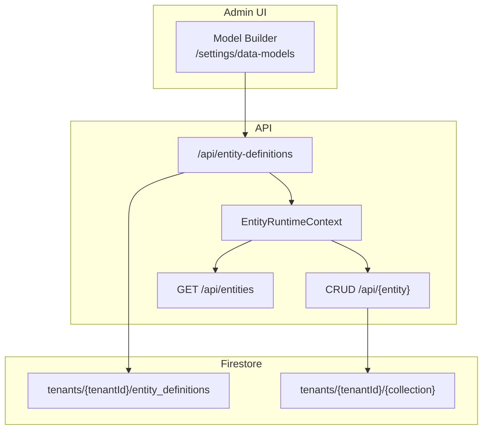

# Dynamic Entity Builder Guide

Runtime tenant-defined entity models that behave like static module entities — catalog, CRUD, Query Engine, RBAC, and UI Builder — without redeploying the API.

**Workstream:** [10.8 DYNAMIC ENTITY BUILDER](<../Ecosystem%20Plan/v2/Key%20Capabilitues/10.8%20DYNAMIC%20ENTITY%20BUILDER.md>)

---

## Architecture



| Package / path | Role |
| --- | --- |
| `@repo/dynamic-entities` | Stored definition schema, `defineEntityFromRecord()`, tenant cache, evolution rules |
| `@repo/firestore-converters` | `EntityDefinitionRepository` contract + in-memory implementation |
| `@repo/gcp-firebase` | `createFirestoreAdminEntityDefinitionRepository()` |
| `apps/api/src/entities/entity-runtime-context.ts` | Tenant-aware entity/repo/query resolution, lazy CRUD route registration |
| `apps/api/src/entities/register-entity-definition-routes.ts` | Definition CRUD API |
| `apps/web/app/components/data-models/` | Model Builder wizard UI |

Static entities from modules are unchanged. Dynamic entities are merged at runtime per tenant.

---

## Storage

Definitions are stored at:

```
tenants/{tenantId}/entity_definitions/{definitionId}
```

Entity **data** uses the same tenant path pattern as static entities (`tenants/{tenantId}/{collection}/{docId}`), with collection names derived from `defineEntity` pluralization (for example `loan` → `loans`).

---

## Permissions

| Permission | Purpose |
| --- | --- |
| `entityDefinition.read` | List and view definitions |
| `entityDefinition.create` | Create new models |
| `entityDefinition.update` | Patch models (add optional fields, UI metadata) |

Each dynamic entity also exposes standard CRUD permissions (`{name}.read`, `{name}.create`, …). Tenant admins with the `admin` role (`*` grant) receive all permissions automatically.

Platform superadmins can manage definitions for any tenant via `tenantId` query/body on the definition API and `/settings/admin/data-models`.

---

## Model Builder UI

| Route | Audience |
| --- | --- |
| `/settings/data-models` | Tenant admin — own tenant |
| `/settings/admin/data-models` | Platform superadmin — tenant picker |

The wizard flow:

1. **Basic info** — entity name (camelCase) and display label
2. **Fields** — type picker, required toggle, enum values, relation target
3. **Review** — confirm schema, then create

After save, `useEntityCatalog().refresh()` runs so the new entity appears in the sidebar without a page reload.

---

## Field types (v1)

| Type | Notes |
| --- | --- |
| `string` | Text input |
| `number` | Numeric input |
| `boolean` | Checkbox |
| `date` | Date input |
| `enum` | Requires `enumValues: string[]`; renders as select |
| `relation` | Requires `relation.target` and `relation.type`; target must exist in tenant catalog |

---

## Schema evolution (v1)

On PATCH, the API allows:

- Adding new **optional** fields
- Updating label and UI metadata

The API rejects:

- Renaming or deleting fields
- Changing field types
- Renaming the entity

---

## API reference

| Method | Path | Description |
| --- | --- | --- |
| `GET` | `/api/entity-definitions` | List definitions for tenant |
| `POST` | `/api/entity-definitions` | Create definition + register runtime entity |
| `GET` | `/api/entity-definitions/:id` | Get one definition |
| `PATCH` | `/api/entity-definitions/:id` | Evolve definition (add fields only) |

Superadmin cross-tenant: pass `tenantId` as query or body parameter.

---

## Programmatic usage

```ts
import {
  registerDynamicEntity,
  resolveEntity,
  getEntitiesForTenant,
} from "@repo/dynamic-entities";

// After loading a record from Firestore:
registerDynamicEntity(tenantId, record);

// Per-request resolution in CRUD handlers:
const entity = resolveEntity("loan", tenantId);

// Catalog merge:
const entities = getEntitiesForTenant(tenantId);
```

---

## Deferred (not in v1)

- Field-level permissions UI
- Schema templates / cloning
- Cross-tenant templates
- Migration engine / data backfill tooling
- Field rename or delete (soft-deprecate only)

---

## Related guides

- [Entity System Guide](./entity-system-guide.md) — static vs dynamic entities
- [Module Extension Guide](./module-extension-guide.md) — compile-time modules complement runtime models
- [Advanced UI Builder Guide](./advanced-ui-builder-guide.md) — catalog-driven UI for dynamic entities
