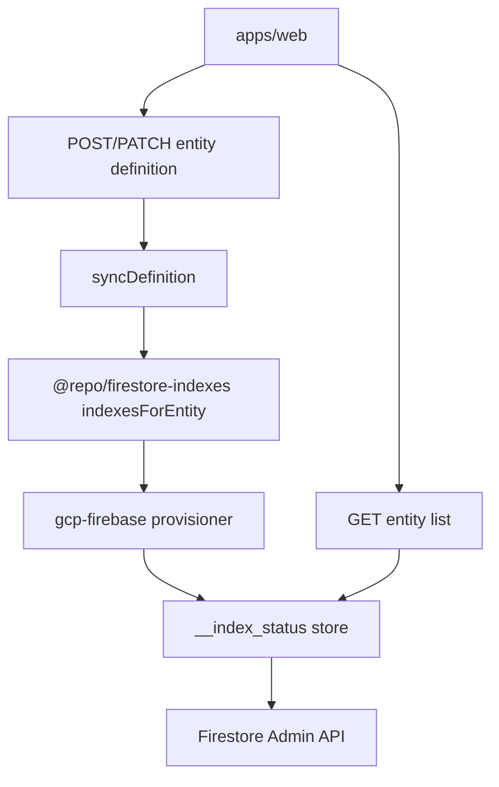

# Dynamic Firestore index provisioning

## Problem

Firestore requires composite indexes to exist **before** queries run. This platform allows:

- Dynamic entity definitions (Model Builder)
- Relations between entities
- Immediate list/query after creation

Every ownership-scoped list query includes `accessUserIds array-contains` (see [`ownership-query-injector.ts`](../apps/api/src/access/ownership-query-injector.ts)) and defaults to `orderBy id` (see [`parse-query-config.ts`](../packages/query-engine/src/parse-query-config.ts)). That combination requires a composite index per collection—not only entities with relations.

## Architecture



### Monorepo map

| Concern | Location |
| -------- | -------- |
| Index specs | [`packages/firestore-indexes`](../packages/firestore-indexes) |
| Entity metadata / FK detection | [`packages/entities`](../packages/entities), [`packages/dynamic-entities`](../packages/dynamic-entities) |
| Runtime `createIndex` | [`packages/gcp-firebase/src/firestore-index-provisioner.ts`](../packages/gcp-firebase/src/firestore-index-provisioner.ts) |
| Index status | [`packages/gcp-firebase/src/firestore-index-status.ts`](../packages/gcp-firebase/src/firestore-index-status.ts) |
| API wiring | [`apps/api/src/entities/entity-runtime-context.ts`](../apps/api/src/entities/entity-runtime-context.ts), [`apps/api/src/server.ts`](../apps/api/src/server.ts) |
| Index routes / guard | [`apps/api/src/indexes/`](../apps/api/src/indexes/) |
| Async worker (optional) | [`apps/worker-indexer`](../apps/worker-indexer) |
| IaC indexes | [`firestore.indexes.json`](../firestore.indexes.json), [`packages/infrastructure/terraform/firestore.tf`](../packages/infrastructure/terraform/firestore.tf) |
| Generator | [`scripts/generate-firestore-indexes.ts`](../scripts/generate-firestore-indexes.ts) |

The query engine is intentionally **not** modified for index provisioning; see [Advanced Query Engine workstream](../Ecosystem%20Plan/Phase%202/workstream/3.%20ADVANCED%20QUERY%20ENGINE.md).

## When indexes are provisioned

Runtime `createIndex` runs **only** when an entity model is created or updated:

- [`syncDefinition`](apps/api/src/entities/entity-runtime-context.ts) on POST/PATCH entity definitions
- [`reconcileIndexesForDefinitionChange`](packages/gcp-firebase/src/firestore-index-reconciler.ts) on PATCH (add new indexes, delete orphans tenant-safely)

It does **not** run on list filter/sort, record create, tenant definition cache reload, or API boot.

Missing-index errors on list still return `COMPOSITE_INDEX_REQUIRED` with a Firebase console link; the API logs the hint but does **not** call `createIndex` reactively. Use `POST /api/indexes/provision` for manual recovery.

## Index catalog (curated)

[`indexesForEntity`](packages/firestore-indexes/src/build-indexes.ts) and [`planIndexesForEntity`](packages/firestore-indexes/src/index-plan.ts) build a **curated** set from entity UI metadata (no filter×sort cartesian):

| Category | Indexes | Purpose |
| -------- | ------- | ------- |
| **ownershipBaseline** | 1 | `accessUserIds` + `id` |
| **ownershipFk** | 1 per FK relation | ownership + FK + `id` |
| **findByField** | 1 per FK relation | `{fk}` + `id` (relation validation) |
| **sortOnly** | 2 × sortable field | ownership + sort + `id` (asc/desc) |
| **filterOnly** | 2 × filterable field | ownership + equality filter + `id` (asc/desc; sort is `id` only) |

For a contract-like model (8 filterable, 8 sortable, 2 FKs), expect **~37** planned indexes instead of **~146** with the old cartesian.

Sortable/filterable fields come from `ui.fields` (`filterable` / `sortable` default true in Model Builder), view `defaultSort`, and view `filters`. Non-queryable types (encrypted, image, document, non-FK relations) are skipped.

`tenantWideRead` entities use the same patterns **without** `accessUserIds`.

### Small collections (`inMemoryListQueries`)

When **`inMemoryListQueries`** is enabled on an entity definition (Model Builder checkbox):

- **Provisioning**: only baseline + FK / findByField indexes; **no** sort-only or filter-only composites.
- **List queries** (filter, text search `q`, and sort): one **server-side** pipeline via [`executeInMemoryListQuery`](packages/gcp-firebase/src/firestore-entity-query-executor.ts) — baseline Firestore load, then in-memory filter, normalized substring search across all searchable string fields, and sort. Capped by `CLIENT_QUERY_FALLBACK_MAX_DOCS` (default **1000**). The web app still sends normal list API requests; no browser-side data logic. These entities do **not** persist `{field}SearchTokens` mirrors on write.
- **Snapshot cache**: loaded rows are cached in-process per tenant + collection + ownership scope for `CACHE_TTL_MS` (default **60s**, same as other API caches). Cleared when the entity model is saved (PATCH).
- **Field UI**: `filterable` / `sortable` on fields stay enabled for list views.
- **PATCH** toggling the flag runs reconcile and drops sort/filter indexes that are no longer in the plan (tenant-safe).

### Tenant vs project scope

- **Model Builder KPIs** sum `planIndexesForTenant` for the **current tenant’s** definitions.
- **GCP composite indexes** are **project-wide per collection group**: the union of all tenants’ planned signatures for that collection ([`computeDesiredIndexesFromRepository`](packages/gcp-firebase/src/firestore-index-reconciler.ts)). Identical collection shapes across tenants do **not** multiply index count.

### List queries without a dedicated composite index

When a list query’s filter+sort shape does not match a planned index (or the entity has `inMemoryListQueries`), the API uses **server-side fallback**: baseline Firestore query (ownership + `id`), load up to `CLIENT_QUERY_FALLBACK_MAX_DOCS` (default **1000**), then filter/sort in memory. Larger collections still return `COMPOSITE_INDEX_REQUIRED`.

## Configuration

| Variable | Default | Purpose |
| -------- | ------- | -------- |
| `ENSURE_FIRESTORE_INDEXES` | `true` in dev, `false` in production | Call Firestore Admin `createIndex` on model sync |
| `CLIENT_QUERY_FALLBACK_MAX_DOCS` | `1000` | Max docs loaded for in-memory list pipeline (`inMemoryListQueries` and non-flag fallback) |
| `CACHE_TTL_MS` | `60000` | TTL for in-memory list snapshot cache (API process) |
| `INDEX_PROVISIONING_PUBSUB` | `false` | Publish index jobs to Pub/Sub for worker |
| Terraform `enable_index_provisioning_pubsub` | `false` | Create Pub/Sub topic + backend pub/sub IAM ([`pubsub-index-provisioning.tf`](../packages/infrastructure/terraform/pubsub-index-provisioning.tf)) |

Backend SA needs `roles/datastore.indexAdmin` (in addition to `datastore.user`) when runtime provisioning is enabled.

### MVP deploy (CI/CD)

By default, **no Pub/Sub resources** are created in Terraform (`enable_index_provisioning_pubsub = false`). Indexes also ship via committed [`firestore.indexes.json`](../firestore.indexes.json) and [`firestore.tf`](../packages/infrastructure/terraform/firestore.tf). Cloud Run sets **`ENSURE_FIRESTORE_INDEXES=true`** per workspace in [`workspaces.tf`](../packages/infrastructure/terraform/workspaces.tf) / [`cloudrun.tf`](../packages/infrastructure/terraform/cloudrun.tf), so the API calls Firestore Admin `createIndex` on entity model sync. Backend SA needs `roles/datastore.indexAdmin` (see [`iam.tf`](../packages/infrastructure/terraform/iam.tf)).

### Enabling async index provisioning (Phase C)

1. Set `enable_index_provisioning_pubsub = true` in Terraform (workspace `terraform.tfvars` or CI variable).
2. Add `roles/pubsub.admin` to `DEPLOYER_ROLES` in [`scripts/setup-github-wif.sh`](../scripts/setup-github-wif.sh) and re-run `bash scripts/setup-github-wif.sh entitysystem` so GitHub Actions can create topics (see [github-wif-setup.md](infrastructure/github-wif-setup.md)).
3. Optionally add `pubsub.googleapis.com` to `BOOTSTRAP_APIS` in the same script so the API is enabled before the first gated apply.
4. Add a Pub/Sub subscription (Terraform or console), deploy [`apps/worker-indexer`](../apps/worker-indexer), and set `INDEX_PROVISIONING_PUBSUB=true` on the API service.

## Operational runbook (Development)

1. **Generate** `firestore.indexes.json`:
   ```bash
   export GCP_PROJECT_ID=entitysystem-development
   pnpm generate:firestore-indexes -- --dynamic-from-firestore --tenant-id tenant_dev_1
   # Or explicit collections:
   pnpm generate:firestore-indexes -- --collections accounts
   ```
2. **Deploy** indexes: `firebase deploy --only firestore:indexes --project entitysystem-development` or Terraform apply.
3. Wait until each index is **Enabled** in Firebase Console (often 5–15+ minutes).
4. Check API logs for `Ensured Firestore composite index` or `Failed to ensure`.
5. **Query status**: `GET /api/indexes/status?collection=accounts`

After changing a model in Model Builder, wait for indexes to reach **Enabled** before relying on new filter/sort columns.

If lists fail with `COMPOSITE_INDEX_REQUIRED`, PATCH the entity definition again (re-provisions the catalog) or call `POST /api/indexes/provision` with `{ "collection": "accounts" }`.

## API endpoints

| Method | Path | Description |
| ------ | ---- | ----------- |
| `GET` | `/api/indexes/status` | Aggregate status for a collection (`phase`, counts, `records`) or single record when `signature` is set |
| `GET` | `/api/indexes/plan` | Per-tenant planned index totals and per-entity breakdown (`planIndexesForTenant`) |
| `POST` | `/api/indexes/provision` | Trigger provisioning for a collection (admin) |

When indexes are `CREATING`, list queries return `503` with `INDEX_CREATING` and `Retry-After`. When provisioning fails, lists return `503` with `INDEX_PROVISIONING_FAILED` and per-index error details.

## Web UX

### Model Builder index KPIs

[`TenantIndexPlanKpiCard`](../apps/web/app/components/data-models/TenantIndexPlanKpiCard.tsx) and [`EntityIndexPlanSummaryCard`](../apps/web/app/components/data-models/EntityIndexPlanSummaryCard.tsx) use [`plan-entity-indexes.ts`](../apps/web/app/components/data-models/plan-entity-indexes.ts) (`@repo/firestore-indexes` + `@repo/dynamic-entities`) to show live planned index counts with category breakdown on the Data Model Builder list, wizard review, and entity editor. The field table shows per-field filterable/sortable flags and marginal index impact.

### Entity lists

[`IndexProvisioningPanel`](../apps/web/app/components/entity/IndexProvisioningPanel.tsx) shows a spinner while `GET /api/indexes/status` reports `building` or `error` for the collection—typically after saving a model. [`useIndexProvisioningStatus`](../apps/web/app/hooks/useIndexProvisioningStatus.ts) polls every 5s (`building`) or 15s (`error`) and refetches the entity list when `phase` becomes `ready`. `INDEX_CREATING` on the list API also keeps the panel visible. `COMPOSITE_INDEX_REQUIRED` shows a normal list error (not the provisioning panel) unless client fallback applies.

## Bidirectional index sync

On entity definition **PATCH**, [`reconcileIndexesForDefinitionChange`](../packages/gcp-firebase/src/firestore-index-reconciler.ts):

1. Ensures indexes required by the new definition (`createIndex`).
2. Deletes composite indexes removed from that definition **only if** no other tenant’s entity definitions still need the same index signature (project-wide collection group).

Status documents in `__index_status` are removed when an index is deleted. **POST** (create model) only creates indexes; it does not delete orphans.

## Implemented vs planned

### MVP (shipped)

- [x] `@repo/firestore-indexes` spec generator
- [x] In-process Firestore Admin provisioner
- [x] Hook on `syncDefinition` + reconcile on PATCH
- [x] Curated index catalog (sort-only + filter-only; no filter×sort cartesian)
- [x] Client query fallback for small collections
- [x] Batched index provisioning (limited concurrency)
- [x] Model Builder index plan KPIs
- [x] `COMPOSITE_INDEX_REQUIRED` + console link (no reactive `createIndex`)
- [x] Terraform `array_config` for composite indexes
- [x] `pnpm generate:firestore-indexes`
- [x] `__index_status` persistence + status API
- [x] Query guard (`INDEX_CREATING`, `INDEX_PROVISIONING_FAILED`)
- [x] Web index provisioning panel with live polling
- [x] Bidirectional reconcile on definition PATCH (tenant-safe deletes)

### Target architecture (future)

- [ ] Full observability (metrics, alerts on stuck `CREATING`)
- [ ] Inequality-filter index catalog
- [ ] Index cleanup / cost optimization
- [ ] Hybrid query engine

Async provisioning (Pub/Sub + dedicated worker) is partially implemented via [`apps/worker-indexer`](../apps/worker-indexer) and optional `INDEX_PROVISIONING_PUBSUB`. IaC for the topic is **gated off by default** so CI does not require `pubsub.topics.create` on the GitHub deployer.

## Definition of done

**Development usable**

- Composite indexes **Enabled** for all collections used in `tenant_dev_1`
- List APIs succeed for filter/sort combinations allowed by the model without `COMPOSITE_INDEX_REQUIRED`
- `firestore.indexes.json` committed and deployed

**Full vision**

- Above plus async worker at scale and metrics for stuck `CREATING`
