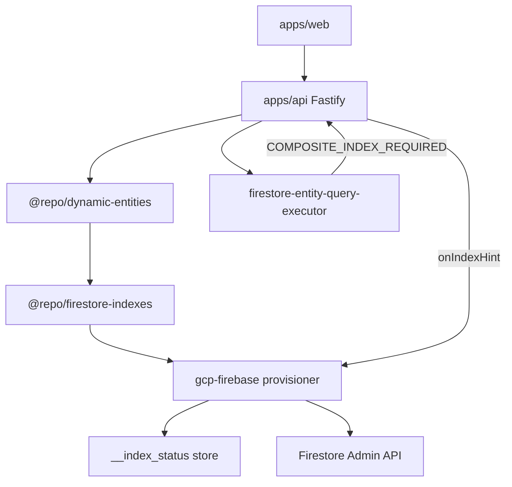

# Dynamic Firestore index provisioning

## Problem

Firestore requires composite indexes to exist **before** queries run. This platform allows:

- Dynamic entity definitions (Model Builder)
- Relations between entities
- Immediate list/query after creation

Every ownership-scoped list query includes `accessUserIds array-contains` (see [`ownership-query-injector.ts`](../apps/api/src/access/ownership-query-injector.ts)) and defaults to `orderBy id` (see [`parse-query-config.ts`](../packages/query-engine/src/parse-query-config.ts)). That combination requires a composite index per collection—not only entities with relations.

## MVP architecture (implemented)



### Monorepo map

| Concern | Location |
| -------- | -------- |
| Index specs | [`packages/firestore-indexes`](../packages/firestore-indexes) |
| Entity metadata / FK detection | [`packages/entities`](../packages/entities), [`packages/dynamic-entities`](../packages/dynamic-entities) |
| Runtime `createIndex` | [`packages/gcp-firebase/src/firestore-index-provisioner.ts`](../packages/gcp-firebase/src/firestore-index-provisioner.ts) |
| Index status | [`packages/gcp-firebase/src/firestore-index-status.ts`](../packages/gcp-firebase/src/firestore-index-status.ts) |
| API wiring | [`apps/api/src/entities/entity-runtime-context.ts`](../apps/api/src/entities/entity-runtime-context.ts), [`apps/api/src/server.ts`](../apps/api/src/server.ts) |
| Index routes / guard | [`apps/api/src/indexes/`](../apps/api/src/indexes/) |
| Async worker (optional) | [`apps/worker-indexer`](../apps/worker-indexer) |
| IaC indexes | [`firestore.indexes.json`](../firestore.indexes.json), [`packages/infrastructure/terraform/firestore.tf`](../packages/infrastructure/terraform/firestore.tf) |
| Generator | [`scripts/generate-firestore-indexes.ts`](../scripts/generate-firestore-indexes.ts) |
| Query errors (reactive) | [`packages/gcp-firebase/src/firestore-entity-query-executor.ts`](../packages/gcp-firebase/src/firestore-entity-query-executor.ts) |

The query engine is intentionally **not** modified for index provisioning; see [Advanced Query Engine workstream](../Ecosystem%20Plan/Phase%202/workstream/3.%20ADVANCED%20QUERY%20ENGINE.md).

## Index catalog (current)

For each non-`tenantWideRead` entity collection:

1. **Baseline list**: `accessUserIds` (CONTAINS) + `id` (ASC)
2. **FK list** (per foreign-key relation field): `accessUserIds` + `{fk}` + `id`
3. **Default sort** (when UI `defaultSort` uses `createdAt`): `accessUserIds` + `createdAt` + `id`
4. **findByField** (relation validation): `{fk}` + `id` (no ownership filter)

## Configuration

| Variable | Default | Purpose |
| -------- | ------- | -------- |
| `ENSURE_FIRESTORE_INDEXES` | `true` in dev, `false` in production | Call Firestore Admin `createIndex` on sync/boot |
| `INDEX_PROVISIONING_PUBSUB` | `false` | Publish index jobs to Pub/Sub for worker |
| Terraform `enable_index_provisioning_pubsub` | `false` | Create Pub/Sub topic + backend pub/sub IAM ([`pubsub-index-provisioning.tf`](../packages/infrastructure/terraform/pubsub-index-provisioning.tf)) |

Backend SA needs `roles/datastore.indexAdmin` (in addition to `datastore.user`) when runtime provisioning is enabled.

### MVP deploy (CI/CD)

By default, **no Pub/Sub resources** are created in Terraform (`enable_index_provisioning_pubsub = false`). Indexes ship via committed [`firestore.indexes.json`](../firestore.indexes.json) and [`firestore.tf`](../packages/infrastructure/terraform/firestore.tf). Cloud Run sets `NODE_ENV=production` and does not set `ENSURE_FIRESTORE_INDEXES`, so runtime `createIndex` on sync/boot is **off** in deployed environments unless you add that env var in [`cloudrun.tf`](../packages/infrastructure/terraform/cloudrun.tf).

### Enabling async index provisioning (Phase C)

1. Set `enable_index_provisioning_pubsub = true` in Terraform (workspace `terraform.tfvars` or CI variable).
2. Add `roles/pubsub.admin` to `DEPLOYER_ROLES` in [`scripts/setup-github-wif.sh`](../scripts/setup-github-wif.sh) and re-run `bash scripts/setup-github-wif.sh entitysystem` so GitHub Actions can create topics (see [github-wif-setup.md](infrastructure/github-wif-setup.md)).
3. Optionally add `pubsub.googleapis.com` to `BOOTSTRAP_APIS` in the same script so the API is enabled before the first gated apply.
4. Add a Pub/Sub subscription (Terraform or console), deploy [`apps/worker-indexer`](../apps/worker-indexer), and set `INDEX_PROVISIONING_PUBSUB=true` on the API service.

## Operational runbook (Development)

1. **Generate** `firestore.indexes.json`:
   ```bash
   export GCP_PROJECT_ID=entitysystem-development
   pnpm generate:firestore-indexes -- --dynamic-from-firestore --tenant-id tenant_dev_1
   # Or explicit collections:
   pnpm generate:firestore-indexes -- --collections accounts
   ```
2. **Deploy** indexes: `firebase deploy --only firestore:indexes --project entitysystem-development` or Terraform apply.
3. Wait until each index is **Enabled** in Firebase Console (often 5–15+ minutes).
4. Check API logs for `Ensured Firestore composite index` or `Failed to ensure`.
5. **Query status**: `GET /api/indexes/status?collection=accounts`

If lists still fail with `COMPOSITE_INDEX_REQUIRED`, use the Firebase link in the error or call `POST /api/indexes/provision` with `{ "collection": "accounts" }`.

## API endpoints

| Method | Path | Description |
| ------ | ---- | ----------- |
| `GET` | `/api/indexes/status` | Status for one index (`collection`, optional `signature`) or all for a collection |
| `POST` | `/api/indexes/provision` | Trigger provisioning for a collection (admin) |

When indexes are `CREATING`, list queries may return `503` with `INDEX_CREATING` and `Retry-After`.

## Implemented vs planned

### MVP (shipped)

- [x] `@repo/firestore-indexes` spec generator
- [x] In-process Firestore Admin provisioner
- [x] Hook on `syncDefinition`, boot catalog ensure, `onIndexHint` recovery
- [x] `COMPOSITE_INDEX_REQUIRED` + console link
- [x] Terraform `array_config` for composite indexes
- [x] `pnpm generate:firestore-indexes`
- [x] `__index_status` persistence + status API
- [x] Query guard (`INDEX_CREATING`)
- [x] Web message for index-building errors

### Target architecture (future)

- [ ] Full observability (metrics, alerts on stuck `CREATING`)
- [ ] Predictive indexes for all filter/sort combinations
- [ ] Index cleanup / cost optimization
- [ ] Hybrid query engine

Async provisioning (Pub/Sub + dedicated worker) is partially implemented via [`apps/worker-indexer`](../apps/worker-indexer) and optional `INDEX_PROVISIONING_PUBSUB`. IaC for the topic is **gated off by default** so CI does not require `pubsub.topics.create` on the GitHub deployer.

## Definition of done

**Development usable**

- Composite indexes **Enabled** for all collections used in `tenant_dev_1`
- List APIs succeed for default sort/filter without `COMPOSITE_INDEX_REQUIRED`
- `firestore.indexes.json` committed and deployed

**Full vision**

- Above plus async worker at scale, metrics, and UI “optimizing query…” states with live status polling
