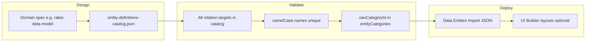

# Entity definition JSON specification

This document is the **authoritative reference for Data Entity JSON** used by the Model Builder (Settings → Data Entities). It is intended for data teams, solution architects, and implementers who author tenant schemas outside the UI and import them via **View JSON** / **Import JSON**.

**Validation (source of truth in code):**

- Envelopes and import helpers: [`packages/dynamic-entities/src/entity-definition-json.ts`](../packages/dynamic-entities/src/entity-definition-json.ts)
- Field and entity schemas: [`packages/dynamic-entities/src/types.ts`](../packages/dynamic-entities/src/types.ts)

A hand-written JSON file that satisfies this spec should import successfully in the Model Builder (subject to evolution rules on update and catalog replace semantics).

**Related docs (different concerns):**

| Document | Purpose |
|----------|---------|
| [dynamic-entity-builder-guide.md](./dynamic-entity-builder-guide.md) | Model Builder UI, permissions, evolution rules overview |
| [rates-data-model.md](./rates-data-model.md) | Rates tenant domain model (business semantics, not JSON envelopes) |
| [UIBuilderOutputJSON.md](./UIBuilderOutputJSON.md) | **UI layout** overrides per entity — not entity definitions |
| [relational-data-system-guide.md](./relational-data-system-guide.md) | How relation fields behave at runtime |

---

## Table of contents

1. [Quick start for data teams](#1-quick-start-for-data-teams)
2. [Where to import in the UI](#2-where-to-import-in-the-ui)
3. [Envelope format (all imports)](#3-envelope-format-all-imports)
4. [Field definition (`kind: "field-definition"`)](#4-field-definition-kind-field-definition)
5. [Entity definition (`kind: "entity-definition"`)](#5-entity-definition-kind-entity-definition)
6. [Entity catalog (`kind: "entity-definitions-catalog"`)](#6-entity-catalog-kind-entity-definitions-catalog)
7. [Relation fields](#7-relation-fields)
8. [File fields (image / document)](#8-file-fields-image--document)
9. [Navigation and display metadata](#9-navigation-and-display-metadata)
10. [Validation rules](#10-validation-rules)
11. [Schema evolution (updates)](#11-schema-evolution-updates)
12. [Catalog replace semantics](#12-catalog-replace-semantics)
13. [Multi-entity authoring workflow](#13-multi-entity-authoring-workflow)
14. [API and CLI alternatives](#14-api-and-cli-alternatives)
15. [Complete catalog example](#15-complete-catalog-example)

---

## 1. Quick start for data teams

**Recommended workflow for a new tenant model:**

1. Design entities and relations on paper or in [rates-data-model.md](./rates-data-model.md) (domain spec).
2. Author a single **`entity-definitions-catalog`** JSON file containing **all** entities for the tenant (see [§15](#15-complete-catalog-example)).
3. Ensure every `relation.target` names another entity in the same `entityDefinitions` array.
4. Use **camelCase** entity names (`loan`, `financialItem`, `paymentSchedule`).
5. In the app: **Settings → Data Entities → Import JSON** → paste or upload → confirm replace.
6. Configure UI layouts separately via the UI Builder ([UIBuilderOutputJSON.md](./UIBuilderOutputJSON.md)) if needed.

**Naming rules:**

| Item | Rule | Example |
|------|------|---------|
| Entity `name` | camelCase, starts with lowercase letter | `loan`, `workOrder` |
| Field `name` | camelCase identifier | `amount`, `customerId` |
| Relation `target` | Exact **entity** `name` (not label, not collection) | `"customer"` |

**Do not include in portable JSON** (server-managed):

- `id`, `tenantId`, `version`, `createdAt`, `updatedAt`

Use **View JSON** in the UI to export a valid template from an existing tenant.

---

## 2. Where to import in the UI

| Surface | Route / context | Envelope `kind` | Apply behavior |
|---------|-----------------|-----------------|----------------|
| **Field modal** | Add/Edit field (details step) | `field-definition` | Updates field draft only; save field to keep |
| **Create entity wizard** | Settings → Data Entities → Create | `entity-definition` | Fills wizard form; finish wizard to create |
| **Edit entity** | Settings → Data Entities → Edit | `entity-definition` | Fills editor form; **Save** to persist. `data.name` must match existing entity |
| **Entity list** | Settings → Data Entities (list header) | `entity-definitions-catalog` | **Replaces** full tenant catalog (destructive; see [§12](#12-catalog-replace-semantics)) |

**Permissions:**

| Action | Permission |
|--------|------------|
| View JSON | `entityDefinition.read` |
| Import field / entity form | `entityDefinition.create` (wizard) or `entityDefinition.update` (edit) |
| Import catalog | `entityDefinition.create` **and** `entityDefinition.update` |

---

## 3. Envelope format (all imports)

Every import file is a **versioned envelope** with a `kind` discriminator:

```json
{
  "kind": "<envelope-kind>",
  "version": 1,
  "...": "kind-specific payload"
}
```

| `kind` | `version` | Purpose |
|--------|-----------|---------|
| `field-definition` | `1` | Single field |
| `entity-definition` | `1` | One entity (wizard/editor form) |
| `entity-definitions-catalog` | `1` | Full tenant entity set |

Invalid JSON, wrong `kind`, or schema violations are shown in the import dialog before Apply.

---

## 4. Field definition (`kind: "field-definition"`)

### Envelope

```json
{
  "kind": "field-definition",
  "version": 1,
  "data": {
    "name": "amount",
    "type": "number",
    "required": true,
    "numberKind": "decimal",
    "ui": {
      "label": "Amount",
      "order": 0,
      "filterable": true,
      "sortable": true,
      "displayFormat": "currency"
    }
  }
}
```

### `data` properties

| Property | Type | Required | Description |
|----------|------|----------|-------------|
| `name` | `string` | yes | Field identifier (camelCase) |
| `type` | see below | yes | Field type |
| `required` | `boolean` | no | Default optional if omitted |
| `isArray` | `boolean` | no | Store as JSON array. Only `string`, `number`, `boolean`, `date`, `enum`, `image`, `document` |
| `sensitive` | `boolean` | no | Encrypt at rest. Not allowed on `relation`, `image`, `document` |
| `relation` | object | if `type: "relation"` | See [§7](#7-relation-fields) |
| `enumValues` | `string[]` | if `type: "enum"` | At least one non-empty value |
| `numberKind` | `"integer"` \| `"decimal"` | no | Only for `type: "number"` |
| `maxSizeBytes` | `number` | no | Only for `image` / `document`. Max **52428800** (50 MB) |
| `defaultImage` | file ref | no | Only for `type: "image"`. See [§8](#8-file-fields-image--document) |
| `ui` | object | no | Labels and list behavior (see below) |

### Field types

| `type` | Stored value | Notes |
|--------|--------------|-------|
| `string` | string | Text |
| `number` | number | Optional `numberKind` |
| `boolean` | boolean | |
| `date` | ISO datetime string | |
| `enum` | string (one of `enumValues`) | Requires `enumValues` |
| `relation` | string (record id) | Requires `relation` config |
| `image` | file reference object | JPEG, PNG, WebP |
| `document` | file reference object | PDF |

### Field `ui` object

| Property | Type | Applies to | Description |
|----------|------|------------|-------------|
| `label` | `string` | all | Display label override |
| `component` | `string` | all | Custom component hint |
| `placeholder` | `string` | all | Placeholder text |
| `displayFormat` | `plain` \| `currency` \| `percentage` | `number` | `percentage`: stored as decimal (0.1 → 10%) |
| `dateDisplayFormat` | `date` \| `datetime` \| `time` | `date` | How dates render in lists/forms |
| `order` | `number` | all | Display order (0-based) |
| `filterable` | `boolean` | list views | Show as filter |
| `sortable` | `boolean` | list views | Allow sort (not for arrays) |
| `searchable` | `boolean` | list views | Include in search (strings default on) |

---

## 5. Entity definition (`kind: "entity-definition"`)

Used in the **create wizard** and **edit** form. Wraps a full entity payload.

### Envelope

```json
{
  "kind": "entity-definition",
  "version": 1,
  "data": {
    "name": "loan",
    "label": "Loans",
    "description": "Customer loan accounts",
    "fields": [
      { "name": "principal", "type": "number", "required": true, "numberKind": "decimal" },
      { "name": "status", "type": "enum", "required": true, "enumValues": ["Active", "Closed"] },
      {
        "name": "customerId",
        "type": "relation",
        "required": true,
        "relation": { "target": "customer", "type": "many-to-one", "onDelete": "restrict" }
      }
    ],
    "tenantWideRead": false,
    "inMemoryListQueries": false,
    "hiddenFromNav": false,
    "emailMatchingEnabled": false,
    "navCategoryId": "cat_finance",
    "navOrder": 10,
    "displayField": "principal",
    "navIcon": "Wallet"
  }
}
```

### `data` properties

| Property | Type | Required | Description |
|----------|------|----------|-------------|
| `name` | `string` | yes | camelCase entity name. **Immutable after create** |
| `label` | `string` | yes | Human-readable plural label (sidebar, headings) |
| `description` | `string` | no | Optional summary |
| `fields` | `FieldDefinition[]` | yes | At least one field |
| `tenantWideRead` | `boolean` | no | All tenant members can read records |
| `inMemoryListQueries` | `boolean` | no | Small-collection server-side list pipeline |
| `hiddenFromNav` | `boolean` | no | Hide from sidebar; still available for relations |
| `emailMatchingEnabled` | `boolean` | no | Show email matching on records and allow Gmail ingest bindings for this entity |
| `navCategoryId` | `string` | no | Entity category id (must exist in tenant) |
| `navOrder` | `number` | no | Sort order within category or uncategorized group |
| `displayField` | `string` | no | Field shown when this entity is referenced. Cannot be an array field |
| `navIcon` | `string` | no | **Import-only convenience.** Lucide icon name → saved as `ui.nav.icon` |
| `ui` | `EntityUIConfig` | no | Advanced UI config (usually set by platform after create) |

**Edit mode:** `data.name` must match the entity being edited. Import rejects name changes.

**Create mode:** `name` must not collide with a **static** platform entity (e.g. reserved module names).

---

## 6. Entity catalog (`kind: "entity-definitions-catalog"`)

Use this for **bulk tenant setup** — the primary handoff format for data teams.

### Envelope

```json
{
  "kind": "entity-definitions-catalog",
  "version": 1,
  "exportedAt": "2026-07-01T12:00:00.000Z",
  "entityCategories": [
    {
      "id": "cat_finance",
      "name": "Finance",
      "icon": "Wallet",
      "order": 0
    }
  ],
  "entityDefinitions": [
    {
      "name": "customer",
      "label": "Customers",
      "fields": [
        { "name": "name", "type": "string", "required": true }
      ]
    },
    {
      "name": "loan",
      "label": "Loans",
      "navCategoryId": "cat_finance",
      "fields": [
        { "name": "principal", "type": "number", "required": true },
        {
          "name": "customerId",
          "type": "relation",
          "relation": { "target": "customer", "type": "many-to-one" }
        }
      ]
    }
  ]
}
```

### Top-level properties

| Property | Type | Required | Description |
|----------|------|----------|-------------|
| `kind` | `"entity-definitions-catalog"` | yes | |
| `version` | `1` | yes | |
| `exportedAt` | ISO datetime string | yes | Export timestamp (informational) |
| `entityCategories` | array | no* | Navigation sidebar categories (see below) |
| `entityDefinitions` | array | yes | At least one portable entity (same shape as `data` in §5, without `navIcon` unless you add `ui` manually) |

\* **Export** always includes `entityCategories` (may be empty). **Import** with `entityCategories` present performs a full replace of navigation categories by `id`. Omit the key to leave existing categories unchanged (legacy imports).

### `entityCategories` items

Portable navigation categories for the sidebar. These are **not** business entities — they group entity models in the nav.

| Property | Type | Required | Description |
|----------|------|----------|-------------|
| `id` | `string` | yes | Stable category id (e.g. `cat_finance`). Referenced by `navCategoryId` on entities |
| `name` | `string` | yes | Display label |
| `icon` | `string` | yes | Lucide icon name |
| `order` | `integer` | yes | Sort order (lower first) |

Each item in `entityDefinitions` matches **`createEntityDefinitionInput`** — the same shape as POST `/api/entity-definitions`.

### Catalog validation (before Apply)

- No duplicate `name` values in the array
- Every `relation.target` must match some `name` in `entityDefinitions` (or a static platform entity)
- Each entity and field must pass `fieldDefinitionSchema` / `createEntityDefinitionInputSchema`
- `displayField`, if set, must reference a non-array field on the same entity
- `navCategoryId`, if set, must reference an `id` in `entityCategories` when that array is present; otherwise it must exist in the tenant’s entity categories

---

## 7. Relation fields

### `relation` object

| Property | Type | Required | Description |
|----------|------|----------|-------------|
| `target` | `string` | yes | Target entity **name** (e.g. `"customer"`) |
| `type` | enum | yes | `one-to-one`, `one-to-many`, `many-to-one`, `many-to-many` |
| `onDelete` | enum | no | `restrict` (default), `cascade`, `nullify` |

### Semantics (authoring guide)

| `type` | Stored on this entity? | Data team note |
|--------|------------------------|----------------|
| `many-to-one` | yes — FK id on this record | Most common. e.g. `customerId` on `loan` |
| `one-to-one` | yes — single FK id | e.g. `profileId` on `user` |
| `one-to-many` | **no** — metadata only | Put `many-to-one` on the **child** entity instead |
| `many-to-many` | **no** — join collection | Platform manages join docs; both sides use M2M fields |

**Field naming:** For `many-to-one`, if `name` is empty in the UI the platform auto-generates `{target}Id` (e.g. `customer` → `customerId`). In JSON, set `name` explicitly.

**Catalog ordering:** Define target entities before dependents in the JSON array (logical order). The import API creates/updates/deletes by name, not array order.

**Cross-references:** In a catalog file, every `target` must exist as an `entityDefinitions[].name` in the **same file** (unless targeting a static platform entity).

---

## 8. File fields (image / document)

### `defaultImage` / file reference shape

```json
{
  "storagePath": "tenants/tenant_a/entity-files/loan/default_abc123.png",
  "contentType": "image/png",
  "fileName": "default.png"
}
```

| Property | Rules |
|----------|-------|
| `storagePath` | Must match `tenants/{tenantId}/entity-files/{entity}/{filename}` |
| `contentType` | Image: `image/jpeg`, `image/png`, `image/webp`. Document: `application/pdf` |
| `fileName` | 1–255 characters |

For schema-only handoffs, **omit** `defaultImage` unless files are already uploaded. Image defaults are usually set in the UI after entity creation.

`maxSizeBytes` cap: **52428800** (50 MB) per field definition.

Image and document fields may set `isArray: true` to store multiple file references. Image arrays cannot include `defaultImage`.

---

## 9. Navigation and display metadata

| Author in JSON | Persisted as | Notes |
|----------------|--------------|-------|
| `navIcon` (entity import only) | `ui.nav.icon` | Lucide component name, e.g. `"Wallet"`, `"Building2"` |
| `navCategoryId` | `navCategoryId` | Must match an `entityCategories[].id` in the same catalog file (or an existing tenant category if `entityCategories` is omitted) |
| `navOrder` | `navOrder` | Lower numbers appear first |
| `hiddenFromNav` | `hiddenFromNav` | Lookup tables still work in relation pickers |
| `displayField` | `displayField` | Used in relation labels and pickers |

Include navigation categories in the same catalog file under `entityCategories`. Use stable `id` values and reference them from `navCategoryId` on entities. **Do not confuse** navigation categories with a business entity named `category` — those are separate concepts.

---

## 10. Validation rules

### Field-level

| Rule | Error if violated |
|------|-------------------|
| `type: "relation"` requires `relation` | yes |
| `type: "enum"` requires `enumValues` (min 1) | yes |
| Only relation fields may have `relation` | yes |
| Only enum fields may have `enumValues` | yes |
| `sensitive` not on relation/image/document | yes |
| `numberKind` only on number fields | yes |
| `maxSizeBytes` only on image/document | yes |
| `defaultImage` only on image fields | yes |
| `isArray` only on string/number/boolean/date/enum/image/document | yes |

### Entity-level

| Rule | Error if violated |
|------|-------------------|
| `name` matches `/^[a-z][a-zA-Z0-9]*$/` | yes |
| `fields.length >= 1` | yes |
| `displayField` not referencing an array field | yes |

### Catalog-level

| Rule | Error if violated |
|------|-------------------|
| Unique entity `name` values | yes |
| Unique category `id` values in `entityCategories` | yes (when present) |
| All relation targets resolvable | yes |
| `navCategoryId` resolvable in `entityCategories` | yes (when `entityCategories` present) |
| Cannot delete entity still referenced by survivor’s relation | yes (on replace) |
| Cannot delete category still referenced by imported entity `navCategoryId` | yes (on replace) |

---

## 11. Schema evolution (updates)

When an entity **already exists**, PATCH / catalog update enforces:

| Allowed | Not allowed |
|---------|-------------|
| Add new **optional** fields | Remove fields |
| Change `label`, `description`, UI metadata | Change field `type` |
| Tighten optional → required is blocked | Change `isArray` on existing field |
| | Rename entity `name` |
| | Rename fields |

**Data team implication:** Ship new optional fields in catalog updates. To “remove” a field from UX, hide via UI metadata rather than deleting from JSON on update.

---

## 12. Catalog replace semantics

**Import catalog** performs a **full replace** of the tenant’s dynamic entity definitions (and navigation categories when `entityCategories` is included):

| Collection | Match key | Behavior |
|------------|-----------|----------|
| `entityCategories` (when present) | `id` | Existing → **update**, new → **create**, missing → **delete** |
| `entityDefinitions` | `name` | Existing → **update** (same `id` preserved), new → **create**, missing → **delete** |

The UI shows a confirmation with counts for entities and categories.

**Important limitations:**

- **Business records are not deleted.** Removing an entity from the catalog removes its **definition** only. Data in `tenants/{tenantId}/{collection}/` may remain as orphan documents.
- **UI overrides**, metrics, and hooks for removed entities are **not** auto-cleaned.
- Entities referenced by a **surviving** entity’s relation cannot be deleted from the catalog.

Export the current catalog with **View JSON** on the list page before a destructive import.

---

## 13. Multi-entity authoring workflow



**Checklist before import:**

- [ ] All entities in one `entity-definitions-catalog` file
- [ ] Every `relation.target` is an `entityDefinitions[].name` in the file
- [ ] No duplicate entity names
- [ ] Entity names are camelCase and not reserved static entities
- [ ] At least one field per entity
- [ ] `entityCategories` defined with stable ids (when using sidebar grouping)
- [ ] Every `navCategoryId` matches an `entityCategories[].id` in the file
- [ ] Team has backup via View JSON
- [ ] Stakeholders understand records are not auto-deleted on catalog replace

---

## 14. API and CLI alternatives

Same payloads as the UI (without envelopes for raw API bodies).

| Method | Path | Body |
|--------|------|------|
| `POST` | `/api/entity-definitions` | Portable entity object (one item from `entityDefinitions`) |
| `PATCH` | `/api/entity-definitions/:id` | Partial update (evolution rules apply) |
| `PUT` | `/api/entity-definitions/catalog` | Full `entity-definitions-catalog` envelope |

**CLI** (authenticated):

```bash
pnpm entity:api definition create --file ./definition-create.json --curl-file ./captured.curl
pnpm entity:api definition patch --id loan --file ./definition-patch.json --curl-file ./captured.curl
```

Portable create body (no envelope):

```json
{
  "name": "loan",
  "label": "Loans",
  "fields": [
    { "name": "principal", "type": "number", "required": true }
  ]
}
```

See [scripts/firestore-doc-manager/README.md](../scripts/firestore-doc-manager/README.md).

---

## 15. Complete catalog example

Minimal two-entity catalog suitable for testing import:

```json
{
  "kind": "entity-definitions-catalog",
  "version": 1,
  "exportedAt": "2026-07-01T12:00:00.000Z",
  "entityDefinitions": [
    {
      "name": "actor",
      "label": "Actors",
      "description": "Banks, people, employers, utilities",
      "fields": [
        { "name": "name", "type": "string", "required": true },
        {
          "name": "actorType",
          "type": "enum",
          "required": true,
          "enumValues": ["bank", "person", "employer", "utility", "other"]
        }
      ],
      "hiddenFromNav": false
    },
    {
      "name": "financialItem",
      "label": "Financial items",
      "description": "Universal financial commitment row",
      "fields": [
        { "name": "title", "type": "string", "required": true },
        { "name": "amount", "type": "number", "required": true, "numberKind": "decimal" },
        { "name": "dueDate", "type": "date", "required": false },
        {
          "name": "actorId",
          "type": "relation",
          "required": false,
          "relation": {
            "target": "actor",
            "type": "many-to-one",
            "onDelete": "nullify"
          }
        }
      ],
      "displayField": "title",
      "tenantWideRead": false,
      "inMemoryListQueries": false
    }
  ]
}
```

For the **Rates dev tenant** (accounts, transactions, loan details, etc.), use [rates-data-model.md](./rates-data-model.md) as the domain blueprint. The catalog is at [`apps/api/src/admin/rates-tenant/catalogs/rates-entity-definitions.json`](../apps/api/src/admin/rates-tenant/catalogs/rates-entity-definitions.json) (11 entities, seeded on API startup).

**Important:** Do not import a partial `ui` object (e.g. only `ui.nav.icon`). Stored UI must include `nav.label`, `views`, and `forms`, or be omitted entirely so the platform builds defaults at runtime. To regenerate full UI for the Rates catalog after field edits, run:

```bash
pnpm tsx scripts/generate-rates-catalog-ui.ts
```

---

## Changelog

| Date | Change |
|------|--------|
| 2026-07-01 | Initial specification for Model Builder JSON View/Import (v1 envelopes) |
