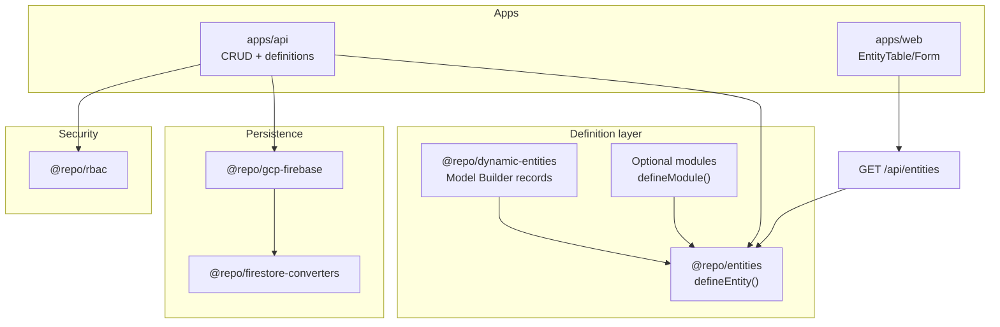

# Entity System Guide

How the schema-driven entity layer fits into the monorepo.

**Phase 1 workstream:** [ENTITY SYSTEM](../Ecosystem%20Plan/v1/workstreams/ENTITY%20SYSTEM%20(CORE%20FOUNDATION).md) · **Master plans:** [master-plans.md](./master-plans.md)

---

## Architecture



| Package / path | Role |
| --- | --- |
| `@repo/entities` | Pure `defineEntity()` — Zod schemas, types, metadata, permissions |
| `@repo/dynamic-entities` | Runtime definitions from Firestore; `resolveEntity(name, tenantId)` |
| `@repo/modules` | `defineModule`, `defineApp`, registries (optional compile-time extensions) |
| `@app/platform` | Shared app config — **`modules: []` by default** |
| `@repo/firestore-converters` | Versioned converters + `_schemaVersion` |
| `@repo/gcp-firebase` | Firestore repository implementations |
| `@repo/rbac` | Permission resolution |
| `apps/api` | HTTP routes, tenant injection, RBAC, definition sync |
| `apps/web` | Dynamic UI from catalog + `@repo/ui-builder` |

Dependency direction: apps → gcp-firebase → firestore-converters → entities. **Entities never import upward.**

### Static vs dynamic entities

| Kind | Source | Registration |
| --- | --- | --- |
| **Dynamic** (default) | Tenant admins via Model Builder | Firestore `entity_definitions`; hydrated by `EntityRuntimeContext` |
| **Static** (optional) | Compile-time modules | Bootstrap via `bootstrapPlatformApp()` when listed in `app.config.ts` |
| **Merged view** | `resolveEntity(name, tenantId)` | Static wins on name collision |

Both share the same CRUD pipeline, catalog API, RBAC pattern, and UI components. See [Dynamic Entity Builder Guide](./dynamic-entity-builder-guide.md).

---

## Core concepts

### Single source of truth

```ts
defineEntity({
  name: "loan",
  fields: {
    amount: { type: "number", required: true },
    status: { type: "enum", enumValues: ["Pending", "Approved"], required: true },
  },
});
```

The system derives full/create/update Zod schemas, TypeScript types, UI metadata, and RBAC permission strings (`loan.read`, …).

### Multi-tenant readiness

Every record includes `tenantId` (system field). The API injects it from the authenticated tenant context. Repositories filter all reads/writes by `tenantId`.

### Record `_schemaVersion` vs definition `version`

| Field | Location | Meaning |
| --- | --- | --- |
| Definition `version` | `entity_definitions/{id}` | Increments when schema is edited in Data Models |
| Record `_schemaVersion` | Entity collection documents | Firestore converter format version (currently `1`) |

---

## Phase 1 integration (complete)

| Workstream | Status | Guide |
| --- | --- | --- |
| CRUD API | Done | [apps/api/src/crud/README.md](../apps/api/src/crud/README.md) |
| Firestore DAL | Done | [firestore-collections-guide.md](./firestore-collections-guide.md) |
| RBAC | Done | [packages/rbac/README.md](../packages/rbac/README.md) |
| Frontend entity UI | Done | [entity README](../apps/web/app/components/entity/README.md) |
| Routing | Done | [routing README](../apps/web/app/routing/README.md) |
| Basic admin | Done | [admin-dashboard-guide.md](./admin-dashboard-guide.md) |

Validate manually: [e2e-validation-runbook.md](./e2e-validation-runbook.md).

---

## Adding entities

### Preferred: Model Builder (dynamic)

1. Open **Settings → Data Model Builder** (`/settings/data-models`)
2. Create models (e.g. `workItem`, then `batch`, then add `batchId` on `workItem`)
3. CRUD routes and sidebar links appear automatically

See [dynamic-entity-builder-guide.md](./dynamic-entity-builder-guide.md) and [relational-data-system-guide.md](./relational-data-system-guide.md) for relations.

### Optional: compile-time module

1. Create `modules/{name}/` with `defineModule()` — [module-extension-guide.md](./module-extension-guide.md)
2. Add module to [`apps/platform/app.config.ts`](../apps/platform/app.config.ts)
3. Restart API and web

---

## Phase 2 extensions (delivered at v1 / partial)

| Feature | Guide |
| --- | --- |
| Relations / FK | [relational-data-system-guide.md](./relational-data-system-guide.md) |
| Query / filter engine | [query-engine-guide.md](./query-engine-guide.md) |
| UI builder | [advanced-ui-builder-guide.md](./advanced-ui-builder-guide.md) |
| Hooks | [hooks-system-guide.md](./hooks-system-guide.md) |

Deferred items: [next-phase-backlog.md](./next-phase-backlog.md).

---

## Related docs

- [@repo/entities README](../packages/entities/README.md)
- [API README](../apps/api/README.md)
- [Module Extension Guide](./module-extension-guide.md)
- [master-plans.md](./master-plans.md)
