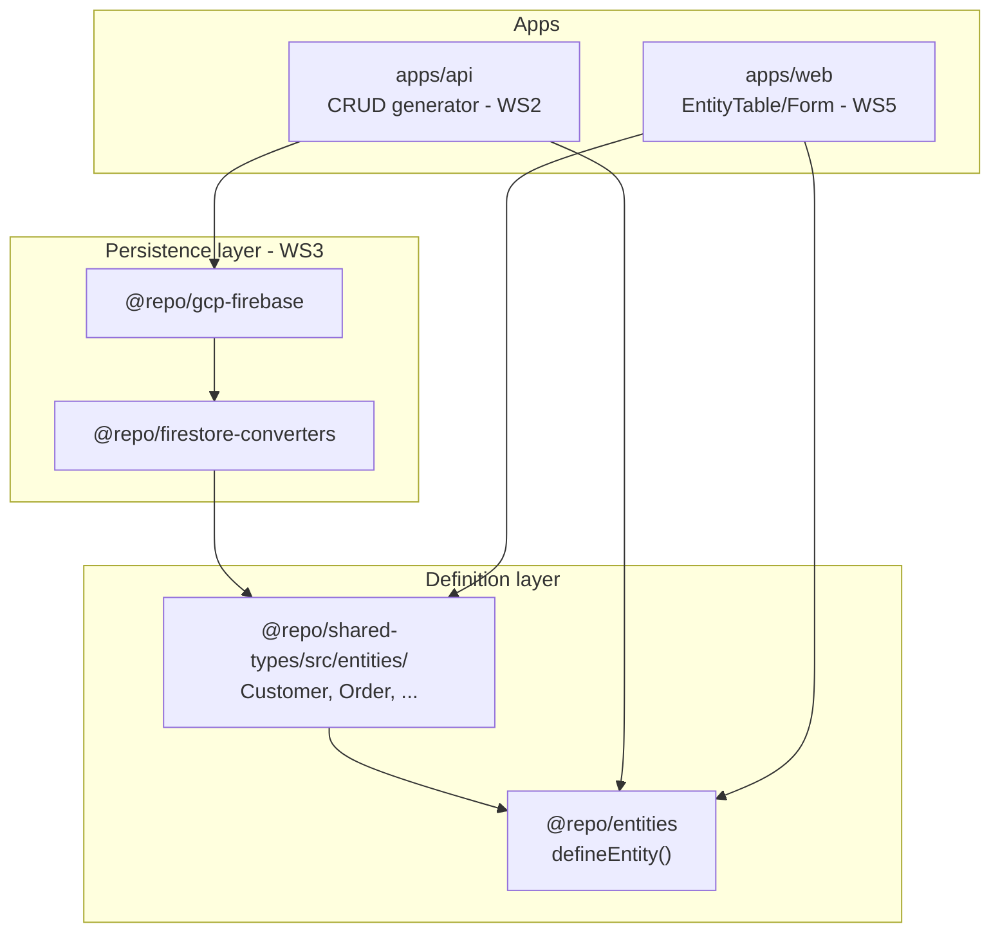

# Entity System Guide

How the schema-driven entity layer fits into the monorepo and how future workstreams integrate with it.

**Workstream:** [ENTITY SYSTEM (CORE FOUNDATION)](<../Ecosystem%20Plan/v1/workstreams/ENTITY%20SYSTEM%20(CORE%20FOUNDATION).md>)

---

## Architecture



| Package / path                     | Role                                                              |
| ---------------------------------- | ----------------------------------------------------------------- |
| `@repo/entities`                   | Pure `defineEntity()` — Zod schemas, types, metadata, permissions |
| `@repo/shared-types/src/entities/` | Concrete business entity definitions                              |
| `@repo/firestore-converters`       | Versioned converters + `_schemaVersion` (User pattern)            |
| `@repo/gcp-firebase`               | Firestore repository implementations                              |
| `apps/api`                         | HTTP routes, tenant injection, RBAC                               |
| `apps/web`                         | Dynamic UI from entity metadata                                   |

Dependency direction: apps → gcp-firebase → firestore-converters → shared-types → entities. **Entities never import upward.**

---

## Core concepts

### Single source of truth

A developer defines fields once:

```ts
defineEntity({
  name: "customer",
  fields: {
    name: { type: "string", required: true },
    isActive: { type: "boolean", default: true },
  },
});
```

The system derives:

- Full, create, and update Zod schemas
- TypeScript types (`z.infer`)
- UI/API field metadata
- RBAC permission strings (`customer.read`, …)

### Multi-tenant readiness

Every full entity record includes `tenantId` (system field). Create schemas exclude it — the API middleware injects it from authenticated tenant context. Repositories must filter all reads/writes by `tenantId`.

### Dates

`type: "date"` uses **ISO datetime strings**, not native `Date` objects. Aligns with Firestore and the existing User model. See [@repo/entities README](../packages/entities/README.md#dates-are-iso-strings-not-date-objects).

---

## Workstream integration map

### WS2 — CRUD API (implemented)

Auto-generated routes in [`apps/api`](../apps/api/README.md):

- `GET/POST /api/{entity}`, `GET/PUT/DELETE /api/{entity}/:id`
- Auth: Bearer JWT + App Check + **`tenantId` custom claim**
- Response envelope: `{ data, error }`
- RBAC: `noopPreHandler` stub — wire `requirePermission` in WS4

### WS3 — Firestore DAL (implemented)

Persistence via [`createFirestoreAdminEntityRepository`](../packages/gcp-firebase/src/firestore-admin-entity-repository.ts):

- Path: `tenants/{tenantId}/{collection}/{documentId}` (collection from `metadata.collection`)
- Converters: `customerConverter`, `orderConverter` in `@repo/firestore-converters`
- Persisted schemas: `{ENTITY}_SCHEMA_VERSION` + `_schemaVersion` in `@repo/shared-types`
- API tests inject in-memory repos via `buildServer({ repositories })`; production uses Firestore

| Workstream            | Status  | Consumes from entity system                                              |
| --------------------- | ------- | ------------------------------------------------------------------------ |
| **2 — CRUD API**      | Done    | `createSchema`, `updateSchema`, `schema`, `permissions` (RBAC stub only) |
| **3 — Firestore DAL** | Done    | `schema` + `_schemaVersion`; `metadata.collection`                       |
| **4 — RBAC**          | Planned | `metadata.permissions`                                                   |
| **5 — Frontend UI**   | Planned | `metadata.fields`, shared Zod schemas                                    |
| **6 — Routing**       | Planned | Entity list from registry or shared-types exports                        |
| **7 — Admin roles**   | Planned | Permission strings registered from entities                              |

### Future `defineApp`

```ts
// Planned — not implemented yet
defineApp({
  entities: [Customer, Order],
});
```

Use `registerEntity()` from `@repo/entities` today to prototype entity discovery. See entity registry notes in the package README.

---

## Adding a new business entity

1. Add `packages/shared-types/src/entities/{entity}.ts` — [template](../packages/shared-types/src/entities/README.md#file-template)
2. Export from `packages/shared-types/src/index.ts`
3. Follow [Firestore collections guide](./firestore-collections-guide.md) for converter + repository (WS3)
4. Register CRUD routes in [`apps/api/src/server.ts`](../apps/api/src/server.ts) — see [CRUD README](../apps/api/src/crud/README.md)
5. Add dynamic UI routes in `apps/web`

---

## Extension points (Phase 2+)

Designed but **not implemented** in Workstream 1:

| Feature                  | Extension mechanism                              |
| ------------------------ | ------------------------------------------------ |
| Relations / foreign keys | New field type + `FieldTypeRegistry` handler     |
| Custom field types       | Same registry pattern                            |
| Field-level permissions  | Extend `NormalizedFieldMeta`                     |
| Dynamic UI config        | `EntityMetadata.ui` optional bag                 |
| Enums                    | New field type or `string` + metadata constraint |
| Query/filter engine      | New package consuming `metadata.fields`          |

Keep extensions in the field registry and metadata types — avoid changing `defineEntity` core logic for each new feature.

---

## Related docs

- [@repo/entities package README](../packages/entities/README.md) — entity definition API
- [API app README](../apps/api/README.md) — CRUD routes, auth, tenant claims
- [CRUD generator](../apps/api/src/crud/README.md) — design and extension points
- [Business entities folder](../packages/shared-types/src/entities/README.md) — per-entity file template
- [Firestore collections guide](./firestore-collections-guide.md) — persistence wiring
- [General Definitions — Phase 1](../Ecosystem%20Plan/v1/General%20Definitions.md) — full platform scope
