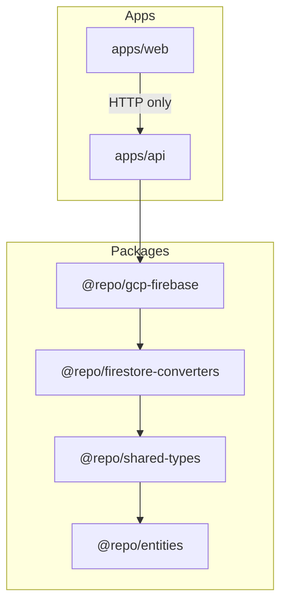
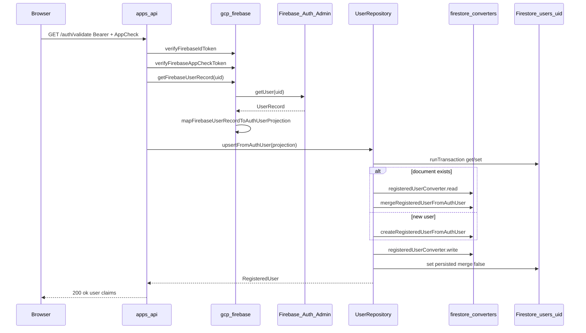

# Firestore Collections Guide

This guide describes how Firestore collections are structured in this monorepo and how to add a new collection by following the same pattern as the **User** reference implementation.

The User collection is the canonical example: versioned Zod schemas, a Firestore converter with migrations, an Admin SDK repository, and an API route that orchestrates auth and persistence. Use it as a template for every new entity.

**Tenant-scoped business entities** are defined dynamically via Model Builder or statically with `defineEntity()` in optional modules. See [Entity System Guide](./entity-system-guide.md) and [@repo/entities README](../packages/entities/README.md).

---

## Table of contents

1. [Principles and boundaries](#1-principles-and-boundaries)
2. [Naming conventions](#2-naming-conventions)
3. [User reference — file map](#3-user-reference--file-map)
4. [End-to-end data flow](#4-end-to-end-data-flow)
5. [Step-by-step: add a new collection](#5-step-by-step-add-a-new-collection)
6. [Schema versioning and migrations](#6-schema-versioning-and-migrations)
7. [What is optional vs required](#7-what-is-optional-vs-required)
8. [Local development quick reference](#8-local-development-quick-reference)
9. [PR checklist](#9-pr-checklist)

Related: [Entity System Guide](./entity-system-guide.md) — tenant-scoped entities defined via `defineEntity()`.

---

## 1. Principles and boundaries

### API-only Firestore access

The web app never reads or writes Firestore documents directly. It calls HTTP endpoints on `apps/api`, which uses the Firebase Admin SDK through `@repo/gcp-firebase`.

Example: after Google sign-in, the browser calls `GET /auth/validate` via `apps/web/app/lib/auth-session.ts`. The API upserts `users/{uid}` in Firestore.

### Package layers

Dependencies flow in one direction. Lower layers never import from apps.



| Package                      | Responsibility                                                                                |
| ---------------------------- | --------------------------------------------------------------------------------------------- |
| `@repo/entities`             | `defineEntity()` — Zod schemas, metadata, permissions (no Firestore/API/UI)                   |
| `@repo/shared-types`         | Zod schemas, TypeScript types, collection names, schema version constants                     |
| `@repo/firestore-converters` | Versioned read/write converters, domain mappers, repository **interfaces** (no Firestore SDK) |
| `@repo/gcp-firebase`         | Firebase Admin init, auth/App Check helpers, Firestore **repository implementations**         |
| `apps/api`                   | HTTP routes; wires auth verification to repositories                                          |
| `apps/web`                   | UI and API clients only                                                                       |

### ESLint enforcement

Firestore SDK imports are restricted so persistence stays in repository adapters.

| Config                                           | Rule                                                                                                                                           |
| ------------------------------------------------ | ---------------------------------------------------------------------------------------------------------------------------------------------- |
| `apps/api/eslint.config.js`                      | Blocks `firebase-admin/firestore` and `firebase/firestore`. Use `@repo/gcp-firebase` instead.                                                  |
| `packages/firestore-converters/eslint.config.js` | Blocks all Firestore SDK usage in every file.                                                                                                  |
| `packages/gcp-firebase/eslint.config.js`         | Blocks Firestore SDK in `src/**/*.ts` **except** `src/firebase-admin.ts` and repository files (e.g. `src/firestore-admin-user-repository.ts`). |

When you add a new repository file under `packages/gcp-firebase/src/`, add its path to the ESLint override that sets `"no-restricted-imports": "off"` for allowed adapter files.

### Firestore security rules

`firestore.rules` denies all client reads and writes. All persistence goes through the Admin SDK in the API. Do not open client access unless product requirements explicitly need it.

---

## 2. Naming conventions

Use consistent names when adding a collection. Replace `{Entity}` / `{entity}` / `{ENTITY}` with your domain name (e.g. `Project`, `project`, `PROJECT`).

| Concept              | User example                                   | New collection template                         |
| -------------------- | ---------------------------------------------- | ----------------------------------------------- |
| Collection constant  | `USERS_COLLECTION = "users"`                   | `{ENTITY}_COLLECTION = "plural-kebab-or-snake"` |
| Schema version       | `USER_SCHEMA_VERSION = 1`                      | `{ENTITY}_SCHEMA_VERSION = 1`                   |
| Domain Zod schema    | `registeredUserSchemaV1`                       | `{entity}SchemaV1`                              |
| Persisted Zod schema | `persistedRegisteredUserSchemaV1`              | `persisted{Entity}SchemaV1`                     |
| Domain type          | `RegisteredUser`                               | `{Entity}`                                      |
| Persisted type       | `PersistedRegisteredUser`                      | `Persisted{Entity}`                             |
| Converter            | `registeredUserConverter`                      | `{entity}Converter`                             |
| Migrations map       | `registeredUserMigrations`                     | `{entity}Migrations`                            |
| Repository interface | `RegisteredUserRepository`                     | `{Entity}Repository`                            |
| Repository factory   | `createFirestoreAdminRegisteredUserRepository` | `createFirestoreAdmin{Entity}Repository`        |
| Package subfolder    | `src/user/`                                    | `src/{entity}/`                                 |

**File naming**

- `schema.latest.ts` — binds the current schema version to `createVersionedConverter`.
- `transforms/index.ts` — migration functions keyed by version number.
- `{entity}-mapper.ts` — create/merge helpers (optional; User uses `user-mapper.ts`).
- `repository-contract.ts` — TypeScript interface only; no implementation.

When you introduce a breaking schema change, you may add `schema.v2.ts` alongside `schema.latest.ts` if you need to keep multiple converter bindings during a transition.

### Tenant-scoped business entities

Entities defined via `defineEntity()` (`batch`, `workItem`, …) use a **nested tenant path** instead of a flat top-level collection:

```
tenants/{tenantId}/{collection}/{documentId}
```

| Entity   | Collection segment | Example path                              |
| -------- | ------------------ | ----------------------------------------- |
| Batch    | `batches`          | `tenants/tenant_123/batches/batch_abc`     |
| WorkItem | `workItems`        | `tenants/tenant_123/workItems/item_456`    |

- `{collection}` comes from `entity.metadata.collection` (plural by default).
- `{tenantId}` is also stored as a document field for defense in depth.
- Repository: generic `createFirestoreAdminEntityRepository` in `@repo/gcp-firebase` (implements `TenantScopedEntityRepository`).
- Converters: per-entity `schema.latest.ts` under `packages/firestore-converters/src/{entity}/`.

**Auth-global entities** (e.g. `RegisteredUser`) remain at flat paths like `users/{uid}`.

### Tenant registry (`tenants/{tenantId}`)

Platform tenants are first-class Firestore documents (not env vars):

| Field       | Type                              | Notes                          |
| ----------- | --------------------------------- | ------------------------------ |
| `id`        | string                            | Same as document ID            |
| `name`      | string                            | Display name in admin UI       |
| `status`    | `"active"` \| `"suspended"`       | Suspended tenants are blocked  |
| `createdBy` | string \| null                    | UID of creating superadmin     |
| `createdAt` | ISO string                        |                                |
| `updatedAt` | ISO string                        |                                |

- Collection constant: `TENANTS_COLLECTION` in `@repo/shared-types`.
- Repository: `createFirestoreAdminTenantRepository` in `@repo/gcp-firebase`.
- Dev seed on API startup: `rates` tenant with Rates domain definitions, sample data, and `normalRatesUser` role (idempotent).
- Business entity data remains under `tenants/{tenantId}/{collection}/{documentId}`.

---

## 3. User reference — file map

### Layer 1: `packages/shared-types`

| File                          | Role                                                                                                 |
| ----------------------------- | ---------------------------------------------------------------------------------------------------- |
| `src/user/registered-user.ts` | Collection constant, schema version, Zod domain + persisted schemas, `AuthUserProjection` input type |
| `src/index.ts`                | Barrel exports for the rest of the monorepo                                                          |

**Zod patterns used in User**

- `isoDatetimeStringSchema` — trimmed string validated with `Date.parse` (not `z.coerce.date()`).
- `nullableTrimmedString` — trim, require min length when present, transform empty to `null`.
- `.strict()` on all object schemas — reject unknown keys.
- Persisted shape extends domain with `_schemaVersion: z.literal(USER_SCHEMA_VERSION)`.

**Key exports**

```ts
export const USERS_COLLECTION = "users";
export const USER_SCHEMA_VERSION = 1 as const;
export const registeredUserSchemaV1 = z.object({ ... }).strict();
export const persistedRegisteredUserSchemaV1 = registeredUserSchemaV1.extend({
  _schemaVersion: z.literal(USER_SCHEMA_VERSION),
}).strict();
export type RegisteredUser = z.infer<typeof registeredUserSchemaV1>;
export type PersistedRegisteredUser = z.infer<typeof persistedRegisteredUserSchemaV1>;
export interface AuthUserProjection { ... }  // input from Firebase Auth, not stored as-is
```

### Layer 2: `packages/firestore-converters`

| File                              | Role                                                                  |
| --------------------------------- | --------------------------------------------------------------------- |
| `src/core/versioned-converter.ts` | Generic `read` / `write`, migrations, timestamp normalization         |
| `src/core/timestamps.ts`          | `normalizeFirestoreTimestamps` (Firestore `Timestamp` → ISO string)   |
| `src/core/errors.ts`              | `UnsupportedSchemaVersionError`, `SchemaValidationError`, etc.        |
| `src/user/schema.latest.ts`       | Wires User schemas to `createVersionedConverter`                      |
| `src/user/transforms/index.ts`    | `registeredUserMigrations` (empty `{}` at v1)                         |
| `src/user/user-mapper.ts`         | `createRegisteredUserFromAuthUser`, `mergeRegisteredUserFromAuthUser` |
| `src/user/repository-contract.ts` | `RegisteredUserRepository` interface                                  |
| `src/index.ts`                    | Public package exports                                                |

**Converter config (User)**

```ts
export const registeredUserConverter = createVersionedConverter<
  RegisteredUser,
  PersistedRegisteredUser
>({
  currentVersion: registeredUserCurrentVersion,
  domainSchema: registeredUserSchemaV1,
  persistedSchema: persistedRegisteredUserSchemaV1,
  migrations: registeredUserMigrations,
  fromPersisted: (persisted) => {
    const domain = { ...persisted };
    Reflect.deleteProperty(domain, "_schemaVersion");
    return domain;
  },
  toPersisted: (domain) => domain,
});
```

**Repository contract (User)**

```ts
export interface RegisteredUserRepository {
  getByUid(uid: string): Promise<RegisteredUser | null>;
  upsertFromAuthUser(authUser: AuthUserProjection): Promise<RegisteredUser>;
}
```

### Layer 3: `packages/gcp-firebase`

| File                                     | Role                                                                                                         |
| ---------------------------------------- | ------------------------------------------------------------------------------------------------------------ |
| `src/firebase-admin.ts`                  | App initialization, `getFirestoreAdmin`, emulator env vars                                                   |
| `src/auth.ts`                            | `verifyFirebaseIdToken`, `getFirebaseUserRecord`                                                             |
| `src/app-check.ts`                       | `verifyFirebaseAppCheckToken`                                                                                |
| `src/firestore-admin-user-repository.ts` | User repository: `getByUid`, transactional `upsertFromAuthUser`, `mapFirebaseUserRecordToAuthUserProjection` |
| `src/index.ts`                           | Public exports                                                                                               |

**Repository upsert pattern (User)**

1. Validate document id (`uid`) with a minimal Zod pick.
2. Run a Firestore transaction on `users/{uid}`.
3. If document exists: `converter.read(raw)` → `mergeRegisteredUserFromAuthUser` → `converter.write`.
4. If new: `createRegisteredUserFromAuthUser` → `converter.write`.
5. `transaction.set(docRef, persisted, { merge: false })` — full document replace.
6. Return domain `RegisteredUser` (not the persisted shape).

### Layer 4: `apps/api`

| File                                | Role                                                                   |
| ----------------------------------- | ---------------------------------------------------------------------- |
| `src/routes/auth-validate.route.ts` | `GET /auth/validate` — verifies Bearer token + App Check, upserts user |
| `src/server.ts`                     | Registers routes with `firebaseAdminConfig`                            |
| `src/config/env.ts`                 | `GCP_PROJECT_ID`, emulator hosts, CORS origins                         |

The route never imports Firestore. It creates the repository once at plugin registration:

```ts
const registeredUserRepository = createFirestoreAdminRegisteredUserRepository(
  opts.firebaseAdminConfig,
);
```

### Tests (User today)

| Layer                | File                                     | Coverage                                                        |
| -------------------- | ---------------------------------------- | --------------------------------------------------------------- |
| firestore-converters | `src/user/schema.latest.test.ts`         | Converter read/write, unknown key stripping, migration behavior |
| firestore-converters | `src/core/timestamps.test.ts`            | Timestamp normalization                                         |
| gcp-firebase         | —                                        | No repository tests yet                                         |
| apps/api             | `src/routes/auth-validate.route.test.ts` | 401 without headers; 200 with mocked `@repo/gcp-firebase`       |
| apps/web             | `app/lib/auth-session.test.ts`           | Fetch to `/auth/validate` with correct headers                  |

---

## 4. End-to-end data flow

User registration after Google sign-in:



### Type transformation chain

```
UserRecord (firebase-admin/auth)
  → AuthUserProjection (gcp-firebase mapper)
  → RegisteredUser (firestore-converters user-mapper + Zod)
  → PersistedRegisteredUser (registeredUserConverter.write + _schemaVersion)
  → Firestore document in collection "users", document id = uid
```

On read (`getByUid` or inside upsert):

```
Firestore raw document
  → normalizeFirestoreTimestamps
  → apply registeredUserMigrations stepwise (none at v1)
  → persistedRegisteredUserSchemaV1 validation
  → strip _schemaVersion → RegisteredUser
  → registeredUserSchemaV1 validation (unknown keys stripped)
```

---

## 5. Step-by-step: add a new collection

Follow these steps for a new entity (example: `Project` / `projects`). Copy structure from User files; adapt fields and repository methods to your domain.

### Step 1 — `@repo/shared-types`

1. Create `packages/shared-types/src/{entity}/{entity}.ts`.
2. Define:
   - `{ENTITY}_COLLECTION` (e.g. `PROJECTS_COLLECTION = "projects"`)
   - `{ENTITY}_SCHEMA_VERSION = 1 as const`
   - `{entity}SchemaV1` — domain Zod object with `.strict()`
   - `persisted{Entity}SchemaV1` — domain extended with `_schemaVersion: z.literal(...)`
   - `type {Entity}` and `type Persisted{Entity}` via `z.infer`
3. If data comes from an external source (API payload, another service, Firebase Auth), add an **input projection** interface (User uses `AuthUserProjection`).
4. Reuse shared Zod helpers where applicable (`isoDatetimeStringSchema`, `nullableTrimmedString`) — copy from `registered-user.ts` or extract to a shared module if multiple entities need them.
5. Export everything from `packages/shared-types/src/index.ts`.

**Minimal schema skeleton**

```ts
import { z } from "zod";

export const PROJECT_SCHEMA_VERSION = 1 as const;
export const PROJECTS_COLLECTION = "projects";

export const projectSchemaV1 = z
  .object({
    id: z.string().trim().min(1),
    createdAt: isoDatetimeStringSchema,
    updatedAt: isoDatetimeStringSchema,
    // ... entity fields
  })
  .strict();

export const persistedProjectSchemaV1 = projectSchemaV1
  .extend({ _schemaVersion: z.literal(PROJECT_SCHEMA_VERSION) })
  .strict();

export type Project = z.infer<typeof projectSchemaV1>;
export type PersistedProject = z.infer<typeof persistedProjectSchemaV1>;
```

### Step 2 — `@repo/firestore-converters`

1. **`src/{entity}/schema.latest.ts`** — mirror `src/user/schema.latest.ts`:
   - Import schemas and types from `@repo/shared-types`
   - Call `createVersionedConverter` with `currentVersion`, `domainSchema`, `persistedSchema`, `migrations`, `fromPersisted`, `toPersisted`
   - Export `{entity}Converter` and `{entity}CurrentVersion`

2. **`src/{entity}/transforms/index.ts`** — start with an empty migrations map:

   ```ts
   import type { SchemaTransform } from "../../core/versioned-converter.js";

   export const projectMigrations: Record<number, SchemaTransform> = {};
   ```

3. **`src/{entity}/{entity}-mapper.ts`** (if create/merge logic is non-trivial) — pure functions that build domain objects and validate with Zod. No Firestore imports.

4. **`src/{entity}/repository-contract.ts`** — interface only:

   ```ts
   export interface ProjectRepository {
     getById(id: string): Promise<Project | null>;
     create(input: ProjectCreateInput): Promise<Project>;
     // ... methods your API needs
   }
   ```

5. Export converter, mapper helpers, and repository interface from `packages/firestore-converters/src/index.ts`.

### Step 3 — `@repo/gcp-firebase`

1. Create `packages/gcp-firebase/src/firestore-admin-{entity}-repository.ts`.
2. Implement `{Entity}Repository` using:
   - `getFirestoreAdmin(config)` for the Firestore instance
   - `{ENTITY}_COLLECTION` for the collection path
   - `{entity}Converter.read(snapshot.data())` on reads
   - `{entity}Converter.write(domain)` before `set` / `update`
3. Use **transactions** for read-modify-write (see User `upsertFromAuthUser`).
4. Add any external-to-projection mappers here (User’s `mapFirebaseUserRecordToAuthUserProjection` lives in this file).
5. Export `createFirestoreAdmin{Entity}Repository` from `packages/gcp-firebase/src/index.ts`.
6. Add the new repository file path to the ESLint override in `packages/gcp-firebase/eslint.config.js` (alongside `firestore-admin-user-repository.ts`).

**Repository read skeleton**

```ts
async getById(id: string): Promise<Project | null> {
  const parsedId = id.trim();
  if (!parsedId) return null;

  const snapshot = await getFirestoreAdmin(this.config)
    .collection(PROJECTS_COLLECTION)
    .doc(parsedId)
    .get();

  if (!snapshot.exists) return null;
  return projectConverter.read(snapshot.data());
}
```

### Step 4 — `apps/api` (when HTTP access is needed)

1. Add `apps/api/src/routes/{entity}-{action}.route.ts`.
2. Follow `auth-validate.route.ts`:
   - Zod validation for headers/body/params
   - Verify auth (Bearer, App Check, or your policy)
   - Call repository methods from `@repo/gcp-firebase`
   - Return JSON; do not expose `_schemaVersion` unless intentional
3. Register the route in `apps/api/src/server.ts`.
4. Never import `firebase-admin/firestore` or `firebase/firestore` in the route file.

### Step 5 — `apps/web` (only if the UI needs the data)

1. Add an API client in `apps/web/app/lib/` (e.g. `fetch` with Bearer + App Check headers).
2. Extend `apps/web/app/config/app-config.ts` if new `VITE_*` env vars are required.
3. Do **not** add Firestore client writes for server-owned collections.

### Step 6 — Tests (recommended minimum)

| Layer                | File                                              | What to test                                                                                                |
| -------------------- | ------------------------------------------------- | ----------------------------------------------------------------------------------------------------------- |
| firestore-converters | `src/{entity}/schema.latest.test.ts`              | `write` adds `_schemaVersion`; `read` round-trip; strips unknown keys; migration from v1→v2 when applicable |
| gcp-firebase         | `src/firestore-admin-{entity}-repository.test.ts` | Optional; mock Firestore or use emulator                                                                    |
| apps/api             | `src/routes/{route}.test.ts`                      | 401/403 without auth; 200 with mocked repository                                                            |

User currently has converter tests but no repository tests. Prefer adding repository tests for new entities.

**Example converter test assertion**

```ts
const persisted = projectConverter.write({ ...domain, legacyField: "removed" });
expect(persisted._schemaVersion).toBe(1);
expect("legacyField" in persisted).toBe(false);
```

---

## 6. Schema versioning and migrations

When you change the persisted shape:

1. Increment `{ENTITY}_SCHEMA_VERSION` in `shared-types`.
2. Add `persisted{Entity}SchemaV2` (and domain `schemaV2` if the domain shape changed).
3. Add migration functions in `transforms/index.ts`:

   ```ts
   export const projectMigrations: Record<number, SchemaTransform> = {
     1: (raw) => ({
       ...raw,
       newField: raw.oldField ?? null,
     }),
   };
   ```

   Migration `N` transforms a document **from version N toward N+1**. The versioned converter applies migrations sequentially until `currentVersion`.

4. Point `schema.latest.ts` at the new schemas and `currentVersion`.
5. Old documents are migrated on **read** inside the converter; you do not need a one-off batch job for reads to keep working.
6. On **write**, only the latest persisted schema is emitted (with the new `_schemaVersion`).

**Errors to expect**

- `MissingSchemaVersionError` — document has no `_schemaVersion`
- `UnsupportedSchemaVersionError` — document version is newer than code supports
- `SchemaValidationError` — document fails Zod after migration

---

## 7. What is optional vs required

Not every collection needs every User artifact.

| Artifact                       | Required for all collections?       | User-specific?                                |
| ------------------------------ | ----------------------------------- | --------------------------------------------- |
| Domain + persisted Zod schemas | Yes                                 | No                                            |
| Collection + version constants | Yes                                 | No                                            |
| Versioned converter            | Yes                                 | No                                            |
| Repository interface           | Yes (if persisted)                  | No                                            |
| Admin SDK repository           | Yes (if persisted)                  | No                                            |
| Input projection interface     | Only if syncing external data       | User: `AuthUserProjection` from Firebase Auth |
| create/merge mapper            | When upsert logic is non-trivial    | User: auth sync                               |
| API route                      | When clients need HTTP access       | User: `/auth/validate`                        |
| App Check on route             | When exposing public registration   | User: yes                                     |
| Web client changes             | When UI displays or mutates via API | User: `auth-session.ts`                       |

---

## 8. Local development quick reference

### Host-only (three terminals)

```bash
pnpm emulators                                    # Firebase emulators
pnpm --filter api dev                             # API (use 127.0.0.1 emulator hosts in .env.dev)
pnpm --filter web dev                             # Vite dev server
```

Copy env files from examples:

```bash
cp apps/api/.env.dev.example apps/api/.env.dev
cp apps/web/.env.development.example apps/web/.env.development
```

### Docker Compose (emulator + API + web)

```bash
cp apps/api/.env.dev.example apps/api/.env.dev
pnpm dev:docker
```

**Networking rule:** Vite `VITE_*` variables are read in the **browser**. Even when web runs inside Docker, use published host ports:

- `VITE_API_URL=http://127.0.0.1:3000`
- `VITE_FIREBASE_AUTH_EMULATOR_HOST=127.0.0.1:9099`

Do **not** use Docker service names (`api`, `firebase-emulator`) in `VITE_*` vars.

The API container uses Docker service names for server-side emulator hosts (`firebase-emulator:9099`, `firebase-emulator:8080`, `firebase-emulator:9199`) — see `apps/api/.env.dev.example`.

For Storage logo uploads, the API also sets `FIREBASE_STORAGE_EMULATOR_PUBLIC_HOST=127.0.0.1:9199` so URLs saved to Firestore are browser-accessible. See [gcs-storage-guide.md](./gcs-storage-guide.md).

### Verify User flow

1. Open `http://localhost:5173` and sign in with Google.
2. Network tab: `GET http://127.0.0.1:3000/auth/validate` → **200**.
3. Firestore emulator UI: document at `users/{uid}`.

### Verify logo upload (Storage emulator)

1. As superadmin, open **Platform → Appearance** (`/settings/appearance`).
2. Upload a logo image → expect success (not "The specified bucket does not exist").
3. Sidebar shows the logo; Storage emulator UI lists `tenants/{tenantId}/images/{objectId}.*`.
4. Optional: save a theme preset or palette — Firestore `tenants/{id}.appearance` stores `preset`, `palettes`, `semantics` (see [theme-and-tenant-branding-guide.md](./theme-and-tenant-branding-guide.md)).

---

## 9. PR checklist

Before opening a PR for a new collection:

- [ ] `packages/shared-types` — schemas, types, exports
- [ ] `packages/firestore-converters` — converter, migrations, contract, mapper (if any), exports
- [ ] `packages/gcp-firebase` — repository implementation, exports, ESLint override for new adapter file
- [ ] `apps/api` — route(s) and `server.ts` registration (if applicable)
- [ ] `apps/web` — API client only (if applicable); no direct Firestore access
- [ ] Tests — at least `schema.latest.test.ts` and route tests
- [ ] `pnpm validate` passes locally
- [ ] PR description lists affected packages (see `.github/pull_request_template.md`)

---

## Quick reference: User file checklist

Use this as a copy list when adding `{entity}`:

```
packages/shared-types/src/{entity}/{entity}.ts
packages/shared-types/src/index.ts                          (add exports)

packages/firestore-converters/src/{entity}/schema.latest.ts
packages/firestore-converters/src/{entity}/transforms/index.ts
packages/firestore-converters/src/{entity}/{entity}-mapper.ts       (optional)
packages/firestore-converters/src/{entity}/repository-contract.ts
packages/firestore-converters/src/index.ts                          (add exports)

packages/gcp-firebase/src/firestore-admin-{entity}-repository.ts
packages/gcp-firebase/src/index.ts                                  (add exports)
packages/gcp-firebase/eslint.config.js                              (ESLint override)

apps/api/src/routes/...route.ts                                     (if needed)
apps/api/src/server.ts                                              (register route)

packages/firestore-converters/src/{entity}/schema.latest.test.ts
apps/api/src/routes/....test.ts                                     (if route added)
```

---

## Relation field indexes

Foreign-key relation fields used for reverse lookups require composite indexes. Example for `workItems.batchId`:

```json
{
  "collectionGroup": "workItems",
  "fields": [
    { "fieldPath": "batchId", "order": "ASCENDING" },
    { "fieldPath": "id", "order": "ASCENDING" }
  ]
}
```

Add entries to [`firestore.indexes.json`](../firestore.indexes.json) at the repo root. Use `indexes` for **multi-field** composite indexes; use `fieldOverrides` for **single-field** indexes (required for `collectionGroup()` queries such as `user_invites` by `email`). Join collections use equality filters on `sourceEntity`, `sourceId`, `targetEntity`, and `targetId` — add indexes when query patterns require them.

**Ownership-scoped list queries** (default entity lists) require a composite index on `accessUserIds` (array-contains) + `id` per collection. Regenerate the catalog with:

```bash
pnpm generate:firestore-indexes
pnpm generate:firestore-indexes -- --dynamic-from-firestore --tenant-id tenant_dev_1
pnpm generate:firestore-indexes -- --collections accounts,loans
```

Then deploy via Terraform apply or `firebase deploy --only firestore:indexes`. With `ENSURE_FIRESTORE_INDEXES=true` (default outside production), the API also requests indexes when entity **models** are created or updated in Model Builder (not on list filter/sort). See [dynamic-firestore-indexes.md](./dynamic-firestore-indexes.md).

See [Relational Data System Guide](./relational-data-system-guide.md) for full relation storage and validation behavior.

The User implementation remains the source of truth. When in doubt, read the User files side by side with this guide.
