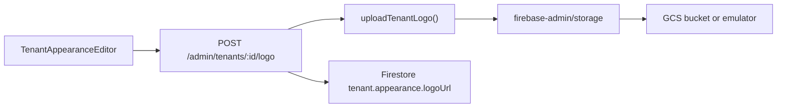

# GCS / Firebase Storage Guide

Tenant logo uploads (Platform → Appearance) use **Firebase Admin Storage**, backed by Google Cloud Storage in production and the **Firebase Storage emulator** locally.

**Related:** [admin-dashboard-guide.md](./admin-dashboard-guide.md), [firestore-collections-guide.md](./firestore-collections-guide.md)

---

## Architecture



- Uploads go **server-side only** (`packages/gcp-firebase/src/tenant-storage.ts`); the web app never writes to Storage directly.
- Object path: `tenants/{tenantId}/images/{objectId}.{png|webp|jpg}` (unique per upload; tenant `logoUrl` points to the latest)
- Production URLs: `https://storage.googleapis.com/{bucket}/tenants/{tenantId}/images/{objectId}.{ext}` (public via `file.makePublic()`)
- Emulator URLs: `http://127.0.0.1:9199/v0/b/{bucket}/o/{path}?alt=media`

---

## Local development

### Start emulators

Storage runs on port **9199** alongside Auth, Firestore, and Hosting:

```bash
pnpm emulators          # host
pnpm dev:docker         # Docker Compose
```

### API environment

| Variable | Native dev | Docker API container |
|----------|------------|----------------------|
| `FIREBASE_STORAGE_EMULATOR_HOST` | `127.0.0.1:9199` | `firebase-emulator:9199` |
| `FIREBASE_STORAGE_EMULATOR_PUBLIC_HOST` | (omit — same as above) | `127.0.0.1:9199` |
| `GCP_STORAGE_BUCKET` | `demo-project-base.appspot.com` | `demo-project-base.appspot.com` |

`FIREBASE_STORAGE_EMULATOR_PUBLIC_HOST` ensures logo URLs saved to Firestore use a hostname the **browser** can reach. The API container connects to the emulator via Docker service names; browsers cannot.

Copy from [`apps/api/.env.dev.example`](../apps/api/.env.dev.example) or rely on [`docker-compose.dev.yml`](../docker-compose.dev.yml) overrides.

### Verify logo upload

1. Sign in as superadmin, select a tenant
2. Open **Platform → Appearance** (`/settings/appearance`)
3. Upload a logo image
4. Confirm sidebar shows the logo
5. Emulator UI (`http://127.0.0.1:4000`) → Storage tab shows `tenants/{tenantId}/images/{objectId}.*`

---

## Production deployment

### Prerequisites

1. **Enable Firebase Storage** on the GCP project (creates the default bucket `{projectId}.appspot.com`)
2. Set `GCP_PROJECT_ID` to the Firebase/GCP project ID
3. Set `GCP_STORAGE_BUCKET` if using a non-default bucket name
4. **Do not** set `FIREBASE_STORAGE_EMULATOR_HOST` or `FIREBASE_STORAGE_EMULATOR_PUBLIC_HOST` in production

### API runtime credentials

The API needs a service account with permission to write objects and set public ACLs:

- Firebase Admin SDK default credentials (Cloud Run / GKE workload identity), or
- `roles/storage.objectAdmin` on the bucket

See TODOs in [`apps/api/Dockerfile`](../apps/api/Dockerfile) for Secret Manager and workload identity.

### Storage rules

[`storage.rules`](../storage.rules) at the repo root allows public read and blocks client writes (Admin SDK bypasses rules). Deploy with:

```bash
firebase deploy --only storage
```

### Docker (production-like)

[`docker-compose.yml`](../docker-compose.yml) expects real GCP credentials via `apps/api/.env` — no emulators. Ensure `GCP_STORAGE_BUCKET` is set and the bucket exists in the target project.

---

## Environment reference

| Variable | Required | Description |
|----------|----------|-------------|
| `GCP_STORAGE_BUCKET` | No | Bucket name; defaults to `{GCP_PROJECT_ID}.appspot.com` |
| `FIREBASE_STORAGE_EMULATOR_HOST` | Local only | Admin SDK emulator connection (`host:port`) |
| `FIREBASE_STORAGE_EMULATOR_PUBLIC_HOST` | Docker local | Browser-accessible host for saved logo URLs |

Implemented in [`packages/gcp-firebase/src/env.ts`](../packages/gcp-firebase/src/env.ts) and wired in [`apps/api/src/server.ts`](../apps/api/src/server.ts).

---

## Tests

Integration test: `packages/gcp-firebase/src/tenant-storage.test.ts`

Runs only when `FIREBASE_STORAGE_EMULATOR_HOST` is set (Storage emulator running):

```bash
FIREBASE_STORAGE_EMULATOR_HOST=127.0.0.1:9199 pnpm --filter @repo/gcp-firebase test
```
