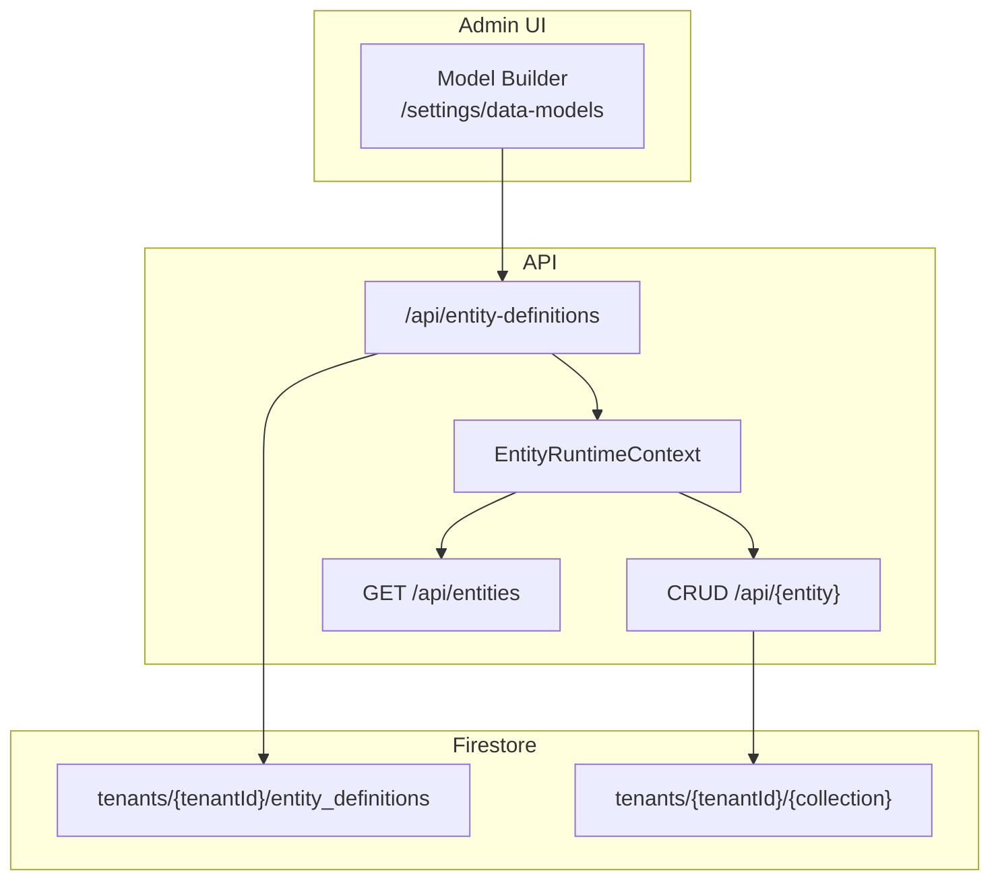

# Dynamic Entity Builder Guide

Runtime tenant-defined entity models that behave like static module entities — catalog, CRUD, Query Engine, RBAC, and UI Builder — without redeploying the API.

**Workstream:** 10.8 DYNAMIC ENTITY BUILDER

---

## Architecture



| Package / path | Role |
| --- | --- |
| `@repo/dynamic-entities` | Stored definition schema, `defineEntityFromRecord()`, tenant cache, evolution rules |
| `@repo/firestore-converters` | `EntityDefinitionRepository` contract + in-memory implementation |
| `@repo/gcp-firebase` | `createFirestoreAdminEntityDefinitionRepository()` |
| `apps/api/src/entities/entity-runtime-context.ts` | Tenant-aware entity/repo/query resolution, lazy CRUD route registration |
| `apps/api/src/entities/register-entity-definition-routes.ts` | Definition CRUD API |
| `apps/web/app/components/data-models/` | Model Builder wizard UI |

Static entities from modules are unchanged. Dynamic entities are merged at runtime per tenant.

---

## Storage

Definitions are stored at:

```
tenants/{tenantId}/entity_definitions/{definitionId}
```

Entity **data** uses the same tenant path pattern as static entities (`tenants/{tenantId}/{collection}/{docId}`), with collection names derived from `defineEntity` pluralization (for example `loan` → `loans`).

---

## Permissions

| Permission | Purpose |
| --- | --- |
| `entityDefinition.read` | List and view definitions |
| `entityDefinition.create` | Create new models |
| `entityDefinition.update` | Patch models (add optional fields, UI metadata) |
| `internalEntity.read` | Browse entities marked **Hide from navigation** in the sidebar and `GET /api/entities` catalog |
| `entityCategory.read` | Open **Data structure → Entity categories** (included in `*.read` for built-in viewer) |
| `entityCategory.create` | Create navigation categories |
| `entityCategory.update` | Edit or delete categories (delete blocked while models are assigned) |

Each dynamic entity also exposes standard CRUD permissions (`{name}.read`, `{name}.create`, …). Attach action-based hooks via `POST /api/hooks` targeting `{entity}.beforeCreate` etc.

### Internal lookup entities (`hiddenFromNav`)

Use **Hide from navigation** on lookup/reference models (often combined with **Tenant-wide read access**) that power relation fields but should not appear as standalone app sections for regular users.

| Audience | Catalog / sidebar | Relation pickers | Direct `/app/{entity}` |
| --- | --- | --- | --- |
| Regular user with `{entity}.read` | Hidden | Works (`listEntity` on target) | Not found (excluded from catalog) |
| `internalEntity.read` or superadmin | Visible (if they also have `{entity}.read`) | Works | Works |

Model Builder loads **all** entity definitions for relation targets (`GET /api/entity-definitions`), so hidden models remain selectable when authoring schemas.

### Sidebar navigation categories

Tenants can define **entity categories** (name, Lucide icon name, sort order) under **Data structure → Entity categories**. Assign models in Model Builder via **Navigation category**, **Navigation order**, and **Navigation icon** (`navCategoryId`, `navOrder`, and `ui.nav.icon` on the entity definition). Use **Use category icon** to copy the selected category’s Lucide name into the model’s sidebar icon.

| Sidebar group | Contents |
| --- | --- |
| **Data Models** | Models with no `navCategoryId` (uncategorized), sorted by `navOrder` then label |
| One group per category | Models with matching `navCategoryId`, sorted by `navOrder` then label; empty groups are hidden |

`GET /api/entity-categories` uses the same `*.read` guard as `GET /api/entities`, so viewers see grouped navigation without `entityCategory.create` / `entityCategory.update`. Category names are tenant-defined (not i18n keys).

Deleting a category fails with `400` while any entity definition still references it.

Platform superadmins can manage definitions for any tenant via `tenantId` query/body on the definition API and `/settings/admin/data-models`.

---

## Model Builder UI

| Route | Audience |
| --- | --- |
| `/settings/data-models` | Tenant admin — own tenant |
| `/settings/entity-categories` | Tenant admin — sidebar navigation categories |
| `/settings/admin/data-models` | Platform superadmin — tenant picker |

The wizard flow:

1. **Basic info** — entity name (camelCase), display label, optional **Tenant-wide read access** and **Hide from navigation**
2. **Fields** — type picker, required toggle, enum values, relation target (entity **model names**, not records). Relation fields auto-name FK columns; one-to-many shows a warning that links are saved on the child via many-to-one.
3. **Review** — optional **Navigation category**, **Navigation order**, and **Navigation icon** (or **Use category icon**), confirm schema, then create

The entity **edit** form exposes the same navigation fields for existing models.

After save, `useEntityCatalog().refresh()` runs so the new entity appears in the sidebar without a page reload.

### JSON View / Import

Hand-authored schemas can be imported without using the wizard field-by-field. See **[Entity definition JSON specification](../reference/entity-definition.md)** for the full data-team handoff format.

| UI location | Envelope `kind` | Use case |
|-------------|-----------------|----------|
| Field modal (details step) | `field-definition` | Single field draft |
| Create / Edit entity | `entity-definition` | One entity form |
| Data Entities list | `entity-definitions-catalog` | **Replace** full tenant catalog |

List **View JSON** exports the current catalog; **Import JSON** validates live and shows planned create/update/delete counts before confirm.

---

## Field types (v1)

| Type | Notes |
| --- | --- |
| `string` | Text input |
| `number` | Numeric input; optional `numberKind` (`integer` \| `decimal`); UI `displayFormat` can be `plain`, `currency`, or `percentage` (stored as decimal, e.g. `0.1` displays as `10%`) |
| `boolean` | Checkbox |
| `date` | Date input |
| `enum` | Requires `enumValues: string[]`; renders as select |
| `relation` | Requires `relation.target` and `relation.type`; target must exist in tenant catalog |

---

## Schema evolution (v1)

On PATCH, the API allows:

- Adding new **optional** fields
- Updating label and UI metadata

The API rejects:

- Renaming or deleting fields
- Changing field types
- Renaming the entity

---

## API reference

| Method | Path | Description |
| --- | --- | --- |
| `GET` | `/api/entity-definitions` | List definitions for tenant |
| `POST` | `/api/entity-definitions` | Create definition + register runtime entity |
| `GET` | `/api/entity-definitions/:id` | Get one definition |
| `PATCH` | `/api/entity-definitions/:id` | Evolve definition (add fields only) |
| `PUT` | `/api/entity-definitions/catalog` | Replace tenant catalog from `entity-definitions-catalog` envelope |

Superadmin cross-tenant: pass `tenantId` as query or body parameter.

Payload shapes: [entity-definition-json.md](../reference/entity-definition.md).

---

## Programmatic usage

```ts
import {
  registerDynamicEntity,
  resolveEntity,
  getEntitiesForTenant,
} from "@repo/dynamic-entities";

// After loading a record from Firestore:
registerDynamicEntity(tenantId, record);

// Per-request resolution in CRUD handlers:
const entity = resolveEntity("loan", tenantId);

// Catalog merge:
const entities = getEntitiesForTenant(tenantId);
```

---

## Deferred (not in v1)

- Field-level permissions UI
- Schema templates / cloning
- Cross-tenant templates
- Migration engine / data backfill tooling
- Field rename or delete (soft-deprecate only)

---

## Related guides

- [Entity definition JSON specification](../reference/entity-definition.md) — import/export JSON for data teams
- [Entity System Guide](./entity-system.md) — static vs dynamic entities
- [Hooks System Guide](./hooks-system.md)
- [Module Extension Guide](./module-extension.md) — compile-time modules complement runtime models
- [Advanced UI Builder Guide](./advanced-ui-builder.md) — catalog-driven UI for dynamic entities
