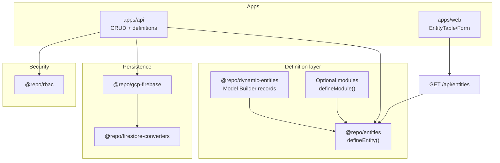

# Entity System Guide

How the schema-driven entity layer fits into the monorepo.

---

## Architecture



| Package / path | Role |
| --- | --- |
| `@repo/entities` | Pure `defineEntity()` — Zod schemas, types, metadata, permissions |
| `@repo/dynamic-entities` | Runtime definitions from Firestore; `resolveEntity(name, tenantId)` |
| `@repo/modules` | `defineModule`, `defineApp`, registries (optional compile-time extensions) |
| `@app/platform` | Shared app config — **`modules: []` by default** |
| `@repo/firestore-converters` | Versioned converters + `_schemaVersion` |
| `@repo/gcp-firebase` | Firestore repository implementations |
| `@repo/rbac` | Permission resolution |
| `apps/api` | HTTP routes, tenant injection, RBAC, definition sync |
| `apps/web` | Dynamic UI from catalog + `@repo/ui-builder` |

Dependency direction: apps → gcp-firebase → firestore-converters → entities. **Entities never import upward.**

### Static vs dynamic entities

| Kind | Source | Registration |
| --- | --- | --- |
| **Dynamic** (default) | Tenant admins via Model Builder | Firestore `entity_definitions`; hydrated by `EntityRuntimeContext` |
| **Static** (optional) | Compile-time modules | Bootstrap via `bootstrapPlatformApp()` when listed in `app.config.ts` |
| **Merged view** | `resolveEntity(name, tenantId)` | Static wins on name collision |

Both share the same CRUD pipeline, catalog API, RBAC pattern, and UI components. See [Dynamic Entity Builder Guide](./dynamic-entity-builder.md).

---

## Core concepts

### Single source of truth

```ts
defineEntity({
  name: "loan",
  fields: {
    amount: { type: "number", required: true },
    status: { type: "enum", enumValues: ["Pending", "Approved"], required: true },
  },
});
```

The system derives full/create/update Zod schemas, TypeScript types, UI metadata, and RBAC permission strings (`loan.read`, …).

### Multi-tenant readiness

Every record includes `tenantId` (system field). The API injects it from the authenticated tenant context. Repositories filter all reads/writes by `tenantId`.

### Record `_schemaVersion` vs definition `version`

| Field | Location | Meaning |
| --- | --- | --- |
| Definition `version` | `entity_definitions/{id}` | Increments when schema is edited in Data Models |
| Record `_schemaVersion` | Entity collection documents | Firestore converter format version (currently `1`) |

---

## Phase 1 integration (complete)

| Workstream | Status | Guide |
| --- | --- | --- |
| CRUD API | Done | [apps/api/src/crud/README.md](../../apps/api/src/crud/README.md) |
| Firestore DAL | Done | [firestore-collections-guide.md](./firestore-collections.md) |
| RBAC | Done | [packages/rbac/README.md](../../packages/rbac/README.md) |
| Frontend entity UI | Done | [entity README](../../apps/web/app/components/entity/README.md) |
| Routing | Done | [routing README](../../apps/web/app/routing/README.md) |
| Basic admin | Done | [admin-dashboard-guide.md](./admin-dashboard.md) |

Validate manually: [e2e-validation-runbook.md](./e2e-validation-runbook.md).

---

## Adding entities

### Preferred: Model Builder (dynamic)

1. Open **Settings → Data Model Builder** (`/settings/data-models`)
2. Create models (e.g. `workItem`, then `batch`, then add `batchId` on `workItem`)
3. CRUD routes and sidebar links appear automatically

See [dynamic-entity-builder-guide.md](./dynamic-entity-builder.md) and [relational-data-system-guide.md](./relational-data-system.md) for relations.

### Optional: compile-time module

1. Create `modules/{name}/` with `defineModule()` — [module-extension-guide.md](./module-extension.md)
2. Add module to [`apps/platform/app.config.ts`](../../apps/platform/app.config.ts)
3. Restart API and web

---

## Phase 2 extensions (delivered at v1 / partial)

| Feature | Guide |
| --- | --- |
| Relations / FK | [relational-data-system.md](./relational-data-system.md) |
| Query / filter engine | [query-engine.md](./query-engine.md) |
| UI builder | [advanced-ui-builder.md](./advanced-ui-builder.md) |
| Hooks | [hooks-system.md](./hooks-system.md) |

---

## User-level ownership and sharing

Tenant isolation alone is not enough: within a tenant, users only see their own records unless a share exists. **No role — including superadmin or tenant-admin — bypasses ownership.**

### System fields

| Field | Type | Description |
| --- | --- | --- |
| `ownerId` | `string` | UID of the creating user (set on create) |
| `accessUserIds` | `string[]` | Denormalized `[ownerId, ...sharedUserIds]` for `array-contains` list filters |
| `sharedWith` | `Record<string, "read" \| "write">` | Per-user share map |

Defined in `packages/entities/src/systemFields.ts` / `buildEntitySchemas.ts`.

### Enforcement

| Layer | Location | Behavior |
| --- | --- | --- |
| Query | `apps/api/src/access/ownership-query-injector.ts` | Injects `accessUserIds array-contains currentUser` unless entity has `tenantWideRead: true` |
| Record | `apps/api/src/access/record-access.ts` | `checkRecordAccess` — read if owner/shared; write if owner/`write` share; delete owner-only |
| Share API | `apps/api/src/access/register-share-routes.ts` | `POST/GET/DELETE /api/:entityName/:id/share` — requires `{entity}.share` **and** ownership; no re-sharing |
| Sensitive fields | `packages/encryption` + converter | Fields with `sensitive: true` encrypted at rest (AES-256-GCM, per-tenant HKDF key from `TENANT_ENCRYPTION_MASTER_KEY`) |

Permissions from `buildPermissions()` include `{entity}.share` (and reserved `{entity}.manage_shares`). There are no `read_all` / `write_all` / `delete_all` elevation permissions by design.

UI (`EntityTable`, `useEntityPermissions`) hides Edit/Delete/Share per row from `ownerId` / `sharedWith`. Share grant/revoke is audited under `tenants/{tenantId}/_audit`.

## Related docs

- [@repo/entities README](../../packages/entities/README.md)
- [API README](../../apps/api/README.md)
- [Module Extension Guide](./module-extension.md)
