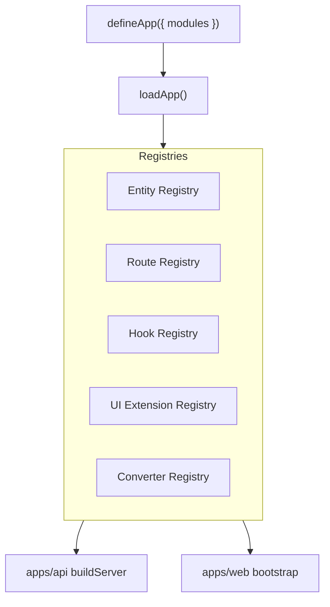

# Module Extension Guide

How to extend the platform with self-contained modules — entities, converters, routes, hooks, and UI — without editing core server or web code.

**Workstream:** 10.3 MODULE / EXTENSION SYSTEM

---

## Architecture



| Package / path | Role |
| --- | --- |
| `@repo/modules` | `defineModule`, `defineApp`, `loadApp`, registries, dependency resolver |
| `@app/platform` | Shared `platformApp` config + `bootstrapPlatformApp()` — **`modules: []` by default** |
| `apps/api` | CRUD loop over registered entities, module routes when modules exist, hook emission |
| `apps/web` | Field/view React registries + UI extension merge via catalog API |

**Default bootstrap:** No compile-time modules are shipped. Tenants use the Model Builder for entities. Add modules when you need custom routes, converters, or code-defined entities.

**Out of scope (v1):** third-party sandboxing, tenant module toggling, remote/marketplace loading, drag-and-drop module authoring.

---

## Quick start — add a module

1. Create `modules/{name}/` with a `defineModule()` export.
2. List the module in [`apps/platform/app.config.ts`](../../apps/platform/app.config.ts).
3. Restart API and web — no edits to `server.ts`, `EntityTable`, or nav code.

```ts
// apps/platform/app.config.ts — default
import { defineApp } from "@repo/modules";

export const platformApp = defineApp({
  modules: [],
});

// When adding a module:
// import { myModule } from "@modules/my-module";
// export const platformApp = defineApp({ modules: [myModule] });
```

Both API and web call the same bootstrap:

```ts
// apps/platform/bootstrap.ts
bootstrapPlatformApp(platformApp); // idempotent — safe to call once per process
```

---

## `defineModule` reference

```ts
import { defineModule } from "@repo/modules";

export const myModule = defineModule({
  name: "my-module",
  version: "1.0.0",
  dependencies: ["core"], // optional — topological load order

  entities: [MyEntity], // DefinedEntity from defineEntity()

  converters: {
    myEntity: myEntityConverter, // or createEntityConverter(MyEntity)
  },

  routes: [
    {
      method: "GET",
      path: "/api/modules/my-module/summary",
      permission: "myEntity.read", // RBAC guard
      handler: async (request, context) => ({ /* ... */ }),
    },
  ],

  hooks: [
    {
      event: "batch.afterDelete",
      handler: async (ctx) => { /* cross-entity reaction */ },
    },
  ],

  ui: {
    components: {
      "custom-badge": "BadgeField",
    },
    extend: {
      batch: {
        views: [{ type: "table", name: "extra", fields: ["name"] }],
      },
    },
  },
});
```

`defineModule()` validates the shape with Zod and returns a frozen `ModuleDefinition`.

---

## `defineApp` reference

```ts
import { defineApp } from "@repo/modules";

export const platformApp = defineApp({
  modules: [myModule],
});
```

`loadApp()`:

1. Validates unique module names and dependency references
2. Topologically sorts modules (`resolveModuleOrder()` — fails on missing deps or cycles)
3. Registers entities, converters, routes, hooks, and UI extensions into registries

---

## Module folder layout

```
modules/
  my-module/
    package.json          @modules/my-module
    src/
      index.ts            defineModule export
      entities/
        myEntity.ts
```

Add `modules/*` to `pnpm-workspace.yaml` when creating the first module. Modules must **not** import each other directly — communicate via hooks and shared entity names in registries.

---

## Extension points

### Entities

Entities registered via `defineModule({ entities })` are added to the global entity registry (`registerEntity` in `@repo/entities`). The API CRUD generator loops `getAllEntities()` — new entities get routes automatically.

RBAC permissions (`{entity}.read`, …) are derived dynamically from registered entities via `getAllKnownPermissions()` in `@repo/rbac`.

### Converters

Register custom converters in the module, or rely on the generic factory:

```ts
import { createEntityConverter } from "@repo/firestore-converters";

const converter = createEntityConverter(MyEntity);
// Uses entity.schema + persistedSchemaV1 (_schemaVersion: 1)
```

The API [`entity-converter-registry`](../../apps/api/src/entities/entity-converter-registry.ts) delegates to `@repo/modules` when modules register custom converters; dynamic entities use `createEntityConverter()` at runtime.

### Routes

Module routes are mounted by [`registerModuleRoutes`](../../apps/api/src/modules/register-module-routes.ts):

- Auth + tenant context required
- RBAC via declared `permission` on each route definition
- Default prefix: declared `path` (e.g. `/api/modules/my-module/summary`)

Use the Query Engine for reads inside handlers — do not query Firestore directly.

### Hooks

CRUD routes emit lifecycle events at six hook points (`beforeCreate` … `afterDelete`):

| Event | When |
| --- | --- |
| `{entity}.beforeCreate` | Before POST persist (may mutate payload) |
| `{entity}.afterCreate` | After successful POST |
| `{entity}.beforeUpdate` | Before PUT persist |
| `{entity}.afterUpdate` | After successful PUT |
| `{entity}.beforeDelete` | After relation checks, before DELETE |
| `{entity}.afterDelete` | After successful DELETE |

Hook context:

```ts
{
  tenantId, entityName, event,
  current: Record<string, unknown>,
  previous?: Record<string, unknown>,
  user: { uid },
  services: { logger, entities?: { create, update } },
}
```

Module hooks register via `defineModule({ hooks })`. Tenant admins can add action-based hooks via `POST /api/hooks`. See [Hooks System Guide](./hooks-system.md).

`before*` failures block the operation; `after*` failures are logged only.

### UI extensions

**Server-side merge:** `GET /api/entities` merges base entity `ui` with module extensions via `mergeUiExtensions()` — appends views, deep-merges fields/nav.

**Web-side lookup:**

- [`field-component-registry.tsx`](../../apps/web/app/components/entity/field-component-registry.tsx) — maps implementation ids to React field components
- [`view-component-registry.tsx`](../../apps/web/app/components/entity/view-component-registry.tsx) — maps view types (`table`, `card`, custom) to renderers
- `bootstrapWebPlatform()` in [`apps/web/app/platform/bootstrap.ts`](../../apps/web/app/platform/bootstrap.ts) registers built-ins + module component ids

`EntityField` resolves `component` metadata → `@repo/ui-builder` id → web field registry → built-in fallback.

---

## Example module pattern

A module typically provides:

| Feature | Example |
| --- | --- |
| New entity | `badge` with fields defined via `defineEntity()` |
| Converter | `createEntityConverter(Badge)` |
| Custom route | `GET /api/modules/my-module/summary` |
| Hook | `batch.afterDelete` → cleanup stub |
| UI | Extends `batch.views`; registers custom field component |

No sample module ships in the default repo bootstrap.

---

## Security rules

1. **Query Engine only** — module route handlers and hooks must use `context.services.queryEngine`, not raw Firestore.
2. **RBAC on writes** — declare `permission` on module routes; CRUD routes enforce per-action guards automatically.
3. **No cross-module imports** — modules communicate via hooks and entity names, not direct code dependencies.
4. **Tenant isolation** — all operations scoped to authenticated `tenantId`.

---

## Migration status

| Phase | Status | Notes |
| --- | --- | --- |
| `@repo/modules` + bootstrap | Done | `defineApp`, registries, API/web bootstrap |
| Default empty modules | Done | `app.config.ts` uses `modules: []`; dynamic entities primary |
| Optional compile-time modules | Supported | Add under `modules/` when needed |

[`register-entities.ts`](../../packages/shared-types/src/register-entities.ts) is a deprecated no-op shim for legacy imports.

---

## Testing

```bash
pnpm --filter @repo/modules test
pnpm --filter api test
pnpm --filter web test
```

Key test files:

| File | Covers |
| --- | --- |
| `packages/modules/src/*.test.ts` | Validation, dependency order, registries |
| `apps/api/src/modules/module-integration.test.ts` | Module routes, hooks, catalog merge |
| `apps/api/src/entities/list-entities.route.test.ts` | UI extension merge in catalog |

In-memory test runtime (`createInMemoryCrudRuntime`) bootstraps the platform app and creates repositories for all registered entities.

---

## Related

- [Entity System Guide](./entity-system.md)
- [Advanced UI Builder Guide](./advanced-ui-builder.md)
- [Dynamic Entity Builder Guide](./dynamic-entity-builder.md)
- [Hooks System Guide](./hooks-system.md)
- [@repo/entities README](../../packages/entities/README.md)
- [CRUD README](../../apps/api/src/crud/README.md) — hook events
