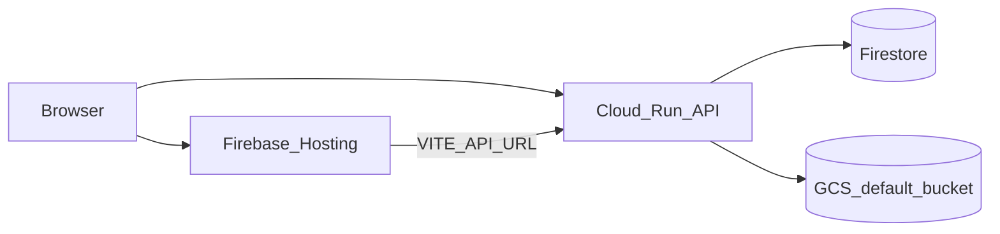

# Deployment guide

## Architecture



- **Web:** static SPA on Firebase Hosting (`apps/web/build/client`).
- **API:** container on Cloud Run v2 (`es-backend-service-{dev|stg|prod}`), scale-to-zero.
- **Data:** Firestore rules/indexes via Terraform; Storage rules via `firebase deploy --only storage`.

## GitHub Actions workflows

| Workflow | When | What it does |
| -------- | ---- | ------------- |
| [.github/workflows/ci.yml](../../.github/workflows/ci.yml) | PR / push to `develop` / `main` | App lint, tests, format (includes `pnpm terraform:fmt:check` on every run) |
| [.github/workflows/verify.yml](../../.github/workflows/verify.yml) | PR touching `packages/infrastructure/terraform/**` | Environment WIF secrets (`development` / `staging`), fmt, validate, remote plan, PR comment |
| [.github/workflows/deploy.yml](../../.github/workflows/deploy.yml) | Merge, tag `v*`, or manual | Build API image, **apply**, deploy Hosting |

### Deploy workflow — triggers

| Event | Target workspace | GCP project |
| ----- | ---------------- | ----------- |
| PR merged to `develop` | `dev` | `entitysystem-development` |
| PR merged to `main` | `staging` | `entitysystem-staging` |
| Push tag `v*` | `prod` | `entitysystem-production` |
| `workflow_dispatch` | user choice | matching project |

### Jobs

1. **resolve-target** — workspace, project, image tag.
2. **build** — Docker Buildx bake `api` target → Artifact Registry.
3. **build-and-deploy** — Terraform init/apply → build web with `VITE_*` → `firebase deploy --only hosting:live,storage`.

Auth: **Workload Identity Federation** only (`GCP_WORKLOAD_IDENTITY_PROVIDER`, `GCP_SERVICE_ACCOUNT`). No `FIREBASE_TOKEN`.

### Frontend build

- `VITE_API_URL` = Terraform output `backend_url`.
- `VITE_ENV` = `dev` for dev/staging workspaces, `prod` for prod workspace.
- Firebase Web SDK values from environment secrets (no emulator hosts).

### Dry run

`workflow_dispatch` with **Dry run = true** runs through **build** and **terraform plan** (plan posted to the job summary) but skips **apply** and Firebase Hosting deploy.

### Local pre-commit

```bash
pnpm precommit
```

Runs `i18n:validate --strict`, `terraform fmt -check`, and `validate:ci`.

## Manual deploy (local)

Prerequisites: `gcloud`, `docker`, `terraform`, `pnpm`, credentials for the target project.

```bash
export PROJECT_ID=entitysystem-development
export REGION=us-central1
export REPO=entitysystem-repo
export TAG=manual-$(git rev-parse --short HEAD)
export REGISTRY="${REGION}-docker.pkg.dev/${PROJECT_ID}/${REPO}"

# Build and push API image
gcloud auth configure-docker "${REGION}-docker.pkg.dev" --quiet
docker buildx bake -f docker-bake.hcl --set "*.args.REGISTRY=${REGISTRY}" --set "*.args.TAG=${TAG}" api --push

cd packages/infrastructure/terraform
terraform init -backend-config=backend-configs/dev.hcl
terraform workspace select -or-create dev
bash ../../../scripts/terraform-import-brownfield.sh "$PROJECT_ID" "$REGION" "$REPO"

# Required before Cloud Run can mount PLATFORM_BOOTSTRAP_SUPERADMIN_EMAILS (latest)
echo -n 'you@example.com' | gcloud secrets versions add PLATFORM_BOOTSTRAP_SUPERADMIN_EMAILS \
  --project="$PROJECT_ID" --data-file=- 2>/dev/null || true

terraform apply \
  -var="region=${REGION}" \
  -var="api_image=${REGISTRY}/api:${TAG}" \
  -var="ci_deployer_sa_email=github-deployer@${PROJECT_ID}.iam.gserviceaccount.com"

export BACKEND_URL=$(terraform output -raw backend_url)
export SITE_ID=$(terraform output -raw firebase_hosting_site_id)

cd ../../..
VITE_API_URL="$BACKEND_URL" VITE_ENV=dev \
  VITE_FIREBASE_API_KEY=... \
  pnpm --filter web build

pnpm exec firebase use "$PROJECT_ID"
pnpm exec firebase target:apply hosting live "$SITE_ID"
pnpm exec firebase deploy --only hosting:live,storage --non-interactive
```

Fill `VITE_FIREBASE_*` from Firebase Console.

## Troubleshooting

| Symptom | Check |
| ------- | ----- |
| Cloud Run unhealthy | `GET /health` on API; logs in Cloud Logging |
| CORS errors | `API_CORS_ORIGINS` includes Hosting `.web.app` and `.firebaseapp.com` URLs |
| 401 on API | Firebase Auth / App Check (MVP uses emulator header stub in web) |
| Terraform 409 on index | Wait and re-apply (see [terraform-state.md](./terraform-state.md)) |
| Terraform 409 Artifact Registry / Firestore / rules release | Run `scripts/terraform-import-brownfield.sh` (CI runs it automatically) |
| Terraform 403 `serviceAccounts.create` | Re-run `setup-github-wif.sh` (`roles/iam.serviceAccountAdmin` on deployer) |
| Secret version `payload required` | Terraform no longer creates versions — use `gcloud secrets versions add` |
| Firebase deploy permission | WIF + `roles/firebase.admin` + compute default `actAs` in `ci_deployer.tf` |
| Cloud Run `reserved env PORT` | Remove `PORT` from Terraform env; `container_port` sets it automatically |
| Stale App Engine in Terraform state | `terraform state rm google_app_engine_application.default` if a prior apply added it |
| Cloud Run startup probe failed | Ensure bootstrap secret has a version; check logs. Deploy sets `SKIP_PLATFORM_STARTUP_SEEDS=true` so `/health` is available before Firestore seeds |
| Platform roles/tenants missing | Run API once locally against the project (without `SKIP_PLATFORM_STARTUP_SEEDS`) or seed via admin tooling |

## PR preview environments (phase 1b)

Not included in MVP. To add later:

- `pr-environment-deploy.yml`, `cleanup.yml`, `reactivate.yml`, `maintenance.yml`
- Terraform workspace `pr` and `firestore_collection_prefix` variable
