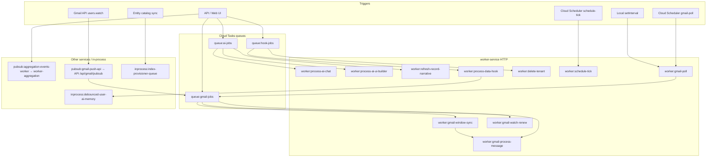

# Workload inventory

Canonical catalog of every async workload registered in
[`packages/workload-registry/src/workload-registry.ts`](../../packages/workload-registry/src/workload-registry.ts).

**Purpose of this doc:** give enough product + engineering rationale that an
external reviewer can recommend what to **keep**, **remove**, **merge**, or
**split** without reading the whole codebase. Every entry answers: *why does
this exist, what would break if we deleted it, and what else is coupled to it?*

See also: [workload-system-catalog.md](./workload-system-catalog.md) (registry
model / wiring),
[workload-inventory-by-entity.md](./workload-inventory-by-entity.md) (same
workloads **grouped by tenant entity catalog** + system),
[environment-variables.md](./environment-variables.md),
[`AGENTS.md`](../../AGENTS.md) (Workload Manager rules),
`pnpm check:workload-coverage`.

---

## How to read this

| Field | Meaning |
| ----- | ------- |
| **Status** | `ACTIVE` = live producer+consumer; `CONDITIONAL` = gated by env/workspace; `INACTIVE (by design)` = provisioned but product mode no-ops it; `CATALOG` = docs/UI metadata for a controlled route (not independently pauseable) |
| **Why defined** | Original design reason — the problem this solves |
| **What it does** | Runtime behavior in one paragraph |
| **If removed** | Concrete breakage |
| **Coupled to** | Sibling workloads / services that must move together |
| **Review lean** | Starting recommendation for keep / merge / remove / revisit — not a decision |

### Kind model (important for diagnosis)

The Platform → Workloads UI mixes **control-plane resources** (queues,
schedulers, subscriptions — pause/resume) with **catalog entries** (worker
HTTP routes and in-process schedulers — usually no pause action; they exist so
runs/logs can be attributed and operators can see the full graph).

```text
Control plane (pauseable)          Catalog / attribution (usually read-only)
─────────────────────────          ────────────────────────────────────────
queue:*                            worker:*  (HTTP target of a queue/scheduler)
scheduler:*                        inprocess:*  (local or in-memory stand-in)
pubsub:*                           hook:{tenant}:{hookId}  (dynamic cron hooks)
```

Do **not** count `worker:*` as “extra jobs.” Most are the HTTP face of a
queue or scheduler. Merging them usually means merging the *control-plane*
resource, not deleting the route.

### UI live status (Platform → Workloads)

Primary badge = **control surface** (what you can pause/stop). Secondary
**Busy** chip = work in flight right now.

| Badge | Meaning |
| ----- | ------- |
| **Active** (`running`) | Armed timer or live listener: Cloud Scheduler ENABLED, enabled scheduled data hook, product-active Pub/Sub, or a queue with pending/in-flight work |
| **Busy** (chip only) | `live.busy` — active runs and/or pending queue tasks; does not replace Active |
| **Ready** | Queue enabled and **idle** (still pauseable; not “doing” anything) |
| **Paused** / **Disabled** | Stopped or product-gated off (e.g. gmail-poll when delivery mode is push) |
| **Handler** / `unknown` | Catalog-only (`worker:*`, `inprocess:*`) — never Active; control via parent |

Schedule-tick and gmail-poll show **Active** while their cron is armed, with
next-run countdown. They only show **Busy** during an in-flight tick/poll.

---

## System map



---

## 1. Cloud Tasks queues

These are the **rate-limit and retry boundaries**. Separate queues exist when
workloads need different concurrency/backoff, blast-radius isolation, or IAM
boundaries — not merely because the job types differ in name.

### `queue:ai-jobs`

| | |
| --- | --- |
| **Status** | ACTIVE |
| **Domain** | `ai` |
| **Env / TF** | `CLOUD_TASKS_QUEUE_NAME` · [`cloudtasks-ai-jobs.tf`](../../packages/infrastructure/terraform/cloudtasks-ai-jobs.tf) |
| **Rate limit** | ~10/min, max 5 concurrent (Vertex cost/latency sensitive) |

**Why defined.** User-facing AI work (chat, UI builder, narrative refresh) must
not run on the API request thread: LLM calls are slow, retryable, and share a
Vertex budget. A dedicated queue isolates AI fan-out from CRUD hooks and Gmail
ingest, and lets operators pause all AI async work without stopping email sync.

**What it does.** API enqueues HTTP tasks to worker-service. Locally,
`AI_TASKS_LOCAL_DISPATCH=true` POSTs the worker directly (same paths).

**Producers**

- [`register-ai-routes.ts`](../../apps/api/src/ai/register-ai-routes.ts) — `POST /api/ai/chat`, `POST /api/ai/ui-builder`
- [`register-ai-insights-routes.ts`](../../apps/api/src/ai/register-ai-insights-routes.ts) — stale narrative refresh
- [`register-ai-record-summary-routes.ts`](../../apps/api/src/ai-record-summaries/register-ai-record-summary-routes.ts) — manual narrative refresh

**Consumers (worker routes)**

- `worker:process-ai-chat`
- `worker:process-ai-ui-builder`
- `worker:refresh-record-narrative`

**If removed.** Chat, UI builder, and async narrative refresh break in
production (local dispatch might still work if rewired). No other queue
currently accepts these paths.

**Coupled to.** The three AI worker routes above; Vertex env on worker;
AI feature flags in platform settings.

**Review lean.** **Keep.** Multiplexing three AI job types on one queue is
intentional (shared Vertex budget). Only split if chat latency must be
isolated from bulk narrative refreshes.

---

### `queue:hook-jobs`

| | |
| --- | --- |
| **Status** | ACTIVE |
| **Domain** | `platform` |
| **Env / TF** | `HOOK_TASKS_QUEUE_NAME` · [`cloudtasks-hook-jobs.tf`](../../packages/infrastructure/terraform/cloudtasks-hook-jobs.tf) |
| **Rate limit** | Prod 50/s · 20 concurrent; non-prod 10/s · 5 concurrent |

**Why defined.** Data hooks with `execution: "queued"` and `phase: "after"`
must return the API write path quickly, then run enrichment/AI/side-effects
asynchronously. Tenant deletion is long-running (archive + recursive purge)
and must not share AI’s tight rate limit. One “platform async” queue covers
both with higher throughput than `ai-jobs`.

**What it does.** API enqueues `/tasks/process-data-hook` or
`/tasks/delete-tenant`. Nested hooks *inside* an already-running worker job
use **in-process** dispatch (not this queue) to avoid recursive Cloud Tasks
amplification.

**Producers**

- [`hook-tasks.client.ts`](../../apps/api/src/hooks/hook-tasks.client.ts) via [`interpret-data-hook.ts`](../../packages/hooks/src/interpret-data-hook.ts)
- [`tenant-deletion-tasks.client.ts`](../../apps/api/src/admin/tenant-deletion-tasks.client.ts) ← admin DELETE tenant
- Ops: [`scripts/force-insights-cascade.sh`](../../scripts/force-insights-cascade.sh) can enqueue schedule-tick (scheduler), not this queue directly for hooks — scheduled hooks run via schedule-tick in-process

**Consumers**

- `worker:process-data-hook`
- `worker:delete-tenant`

**If removed.** Queued after-hooks fail open or block the API; tenant deletion
admin flow breaks.

**Coupled to.** Hook definition `execution` field; CRUD pipeline; admin tenant
lifecycle.

**Review lean.** **Keep.** Optional later split: dedicated `queue:tenant-delete`
if deletion must be paused independently of hooks (today they share blast
radius by design).

---

### `queue:gmail-jobs`

| | |
| --- | --- |
| **Status** | ACTIVE |
| **Domain** | `email` |
| **Env / TF** | `GMAIL_TASKS_QUEUE_NAME` · [`gmail-ingest.tf`](../../packages/infrastructure/terraform/gmail-ingest.tf) |

**Why defined.** Gmail ingest is a fan-out tree (mailbox → window sync → many
process-message tasks). It needs its own concurrency/retry so a mail storm
cannot starve AI chat or hook enrichment. Both API and worker enqueue here
(poll fan-out happens on the worker).

**What it does.** Tasks for window sync, per-message processing, and push-watch
renew. Local dispatch via `GMAIL_TASKS_LOCAL_DISPATCH`.

**Producers**

- API [`gmail-tasks.client.ts`](../../apps/api/src/gmail-ingest/gmail-tasks.client.ts) — Sync now, OAuth, pubsub push path, Observability mode switch
- Worker [`worker-gmail-task-enqueuer.ts`](../../apps/worker-service/src/services/worker-gmail-task-enqueuer.ts) — poll / window-sync fan-out

**Consumers**

- `worker:gmail-window-sync`
- `worker:gmail-process-message`
- `worker:gmail-watch-renew`

**Note:** `/tasks/gmail-poll` is **not** on this queue — it is hit by Cloud
Scheduler (or local interval). Poll *enqueues* window-sync onto this queue.

**If removed.** Email ingest stops (manual sync, poll, and push all fan into
this queue).

**Coupled to.** Entire Gmail subsystem + delivery mode setting.

**Review lean.** **Keep.** Do not merge into `hook-jobs` or `ai-jobs` —
different rate profile and failure domain.

---

## 2. Cloud Scheduler jobs

### `scheduler:schedule-tick`

| | |
| --- | --- |
| **Status** | ACTIVE |
| **Cron** | `* * * * *` (every minute, UTC) |
| **TF** | [`gmail-ingest.tf`](../../packages/infrastructure/terraform/gmail-ingest.tf) |
| **HTTP target** | `worker:schedule-tick` → `/tasks/schedule-tick` |

**Why defined.** Tenant-defined cron data hooks (categorize, enrich, evaluate,
insights, etc.) and expired-tenant archive purge need a single cheap ticker
instead of one Cloud Scheduler job per hook × tenant. The tick scans due hooks
and runs them **in-process** on the worker (does not enqueue
`/tasks/process-data-hook` for the scheduled path).

**What it does.** [`schedule-tick-processor.ts`](../../apps/worker-service/src/services/schedule-tick-processor.ts)
lists tenants, finds due `trigger.kind: "schedule"` hooks, executes them,
best-effort purges expired archives. Non-prod force: query
`?force=true&hook=…` (see [`force-insights-cascade.sh`](../../scripts/force-insights-cascade.sh)).

**Producers.** Cloud Scheduler only (plus admin Run now / ops scripts).

**If removed.** All scheduled data hooks stop; insights cascades and archive
purge stop. Dynamic `hook:*` workloads become inert.

**Coupled to.** Every `hook:{tenant}:{hookId}` workload; data-hook definitions.

**Review lean.** **Keep — core platform fabric.** Do not replace with
per-hook Scheduler jobs unless scale requires it (current design prefers one
tick).

---

### `scheduler:gmail-poll`

| | |
| --- | --- |
| **Status** | ACTIVE under default `GMAIL_INGEST_DELIVERY_MODE=poll`; no-ops when mode is `push` |
| **Cron** | `*/5 * * * *` |
| **TF** | [`gmail-ingest.tf`](../../packages/infrastructure/terraform/gmail-ingest.tf) |
| **HTTP target** | `worker:gmail-poll` → `/tasks/gmail-poll` |

**Why defined.** Default Gmail ingest mode is **poll**, not push: simpler ops,
no live Gmail `users.watch` dependency, predictable load every 5 minutes.
Scheduler is the GCP trigger; locally `inprocess:local-gmail-poll` substitutes.

**What it does.** Lists connected mailboxes and enqueues one window-sync task
per mailbox onto `queue:gmail-jobs`. When delivery mode is `push`, handler
returns without fan-out (scheduler left armed — negligible cost).

**If removed (while staying on poll mode).** Mailboxes stop ingesting until
manual Sync now. Push mode would still work if enabled.

**Coupled to.** `worker:gmail-poll`, `inprocess:local-gmail-poll`,
`queue:gmail-jobs`, Observability delivery-mode toggle. Mutually exclusive
with active use of `pubsub:gmail-push-api`.

**Review lean.** **Keep as default path.** Revisit only if product commits to
push-only (then pause/delete this scheduler and rely on Pub/Sub).

---

## 3. Pub/Sub subscriptions

### `pubsub:aggregation-events-worker`

| | |
| --- | --- |
| **Status** | CONDITIONAL — **off** in default/dev workspaces; **on** in staging/prod ([`workspaces.tf`](../../packages/infrastructure/terraform/workspaces.tf)) |
| **TF** | [`pubsub-aggregation-events.tf`](../../packages/infrastructure/terraform/pubsub-aggregation-events.tf) |
| **Consumer service** | Dedicated Cloud Run [`apps/worker-aggregation`](../../apps/worker-aggregation/src/index.ts) (not worker-service) |

**Why defined.** Metric aggregation after entity writes can be heavy. In
staging/prod, publish `{eventId, tenantId}` to Pub/Sub and let a dedicated
pull worker apply aggregation transactions so API/worker request paths stay
thin. In **dev**, `enable_aggregation_pubsub=false` and the API aggregates
**inline** (`AGGREGATION_EVENTS_PUBSUB=false`) to avoid running a second
service locally.

**What it does.** Publisher: [`emit-aggregation-event.ts`](../../packages/aggregation-engine/src/emit-aggregation-event.ts)
(from CRUD, hooks, import/export, worker hook services) when Pub/Sub flag is
on. Consumer pull-subscribes and runs `processAggregationEventTransaction`.

**If removed.** Staging/prod must fall back to inline aggregation (higher API
latency) or metrics stop updating. Dev is unaffected (already inline).

**Coupled to.** `apps/worker-aggregation` Cloud Run; aggregation engine;
`AGGREGATION_EVENTS_PUBSUB` / topic env.

**Review lean.** **Keep.** Pattern is sound (dev-inline / prod-async). Do not
fold into worker-service unless you want aggregation to compete with Gmail/AI
concurrency.

---

### `pubsub:gmail-push-api`

| | |
| --- | --- |
| **Status** | INACTIVE (by design) under default **poll**; provisioned in all AI-worker envs |
| **TF** | [`gmail-ingest.tf`](../../packages/infrastructure/terraform/gmail-ingest.tf) — topic + push subscription → `${backend}/api/gmail/pubsub` |
| **Publisher** | Google-managed `gmail-api-push@…` (not app code) |

**Why defined.** Optional **realtime** ingest path: Gmail `users.watch` →
Pub/Sub → API → enqueue window sync. Kept provisioned so operators can flip
Platform → Observability → Gmail ingest to `push` without Terraform. Default
product choice is poll (see environment-variables Gmail section).

**What it does.** Push subscription always delivers to the API; handler
returns **204 no-op** unless effective delivery mode is `push`. Watch renew
tasks (`worker:gmail-watch-renew`) only matter in push mode.

**If removed.** Push mode becomes impossible until infra is recreated. Poll
mode unaffected.

**Coupled to.** `GMAIL_PUBSUB_TOPIC`, watch renew route, OAuth connect path,
delivery-mode runtime setting. Environment pair with `scheduler:gmail-poll`.

**Review lean.** **Keep provisioned, leave inactive** unless you want to
delete push support entirely (then also delete watch-renew route + topic TF).
Do **not** treat “shows as Active in Workloads” as “actively ingesting” —
infra arming ≠ delivery mode. When mode is poll, push is **Disabled** in the
UI even if the subscription still exists.

---

### Index provisioning Pub/Sub (removed)

Former gated TF `pubsub-index-provisioning.tf` and registry id
`pubsub:index-provisioning-worker` are **gone**. There was never a Cloud Run
subscription in Terraform. The live path is
[`inprocess:index-provisioner-queue`](#inprocessindex-provisioner-queue).
Do not re-add without a real producer + consumer + registry entry.

---

## 4. Worker HTTP routes

Registered in [`task.scope.ts`](../../apps/worker-service/src/routes/task.scope.ts).
These are **catalog + run-attribution** entries. Pausing is done via the
linked queue/scheduler (`controlledBy`), not the route itself.

### Platform / hooks

#### `worker:process-data-hook`

| | |
| --- | --- |
| **Status** | CATALOG / ACTIVE (via `queue:hook-jobs`) |
| **Route** | `/tasks/process-data-hook` |
| **Source** | [`data-hook-task.route.ts`](../../apps/worker-service/src/routes/data-hook-task.route.ts) |

**Why defined.** HTTP entry for queued after-hooks from the API. Separating
the route from the processor lets Cloud Tasks OID C-auth hit a stable URL.

**What it does.** Validates payload, records workload run, runs
`processDataHookJob`. Nested chained hooks on the worker skip HTTP and call
the processor in-process.

**If removed.** All `execution: "queued"` after-hooks break.

**Review lean.** **Keep** (pair with `queue:hook-jobs`).

---

#### `worker:schedule-tick`

| | |
| --- | --- |
| **Status** | CATALOG / ACTIVE (via `scheduler:schedule-tick`) |
| **Route** | `/tasks/schedule-tick` |
| **Source** | [`schedule-tick.route.ts`](../../apps/worker-service/src/routes/schedule-tick.route.ts) |

**Why defined.** Stable OIDC target for the every-minute Scheduler job and for
ops force-runs.

**What it does.** Invokes `processScheduleTick` (due hooks + archive purge).

**If removed.** Scheduler job 404s; all cron hooks stop.

**Review lean.** **Keep** (pair with `scheduler:schedule-tick`).

---

#### `worker:delete-tenant`

| | |
| --- | --- |
| **Status** | CATALOG / ACTIVE (via `queue:hook-jobs`) |
| **Route** | `/tasks/delete-tenant` |
| **Domain** | `tenant` |
| **Source** | [`tenant-deletion-task.route.ts`](../../apps/worker-service/src/routes/tenant-deletion-task.route.ts) |

**Why defined.** Tenant archive/purge can take minutes; must run with
`awaitCompletion` semantics off the admin request path, with Cloud Tasks
retries.

**What it does.** Long-running deletion pipeline for a tenant id payload.

**If removed.** Admin “delete tenant” async path breaks.

**Review lean.** **Keep.** Candidate to move to its own queue only if hook
pause must not block deletions (see `queue:hook-jobs`).

---

### AI routes

#### `worker:process-ai-chat`

| | |
| --- | --- |
| **Status** | CATALOG / ACTIVE |
| **Route** | `/tasks/process-ai-chat` |
| **Source** | [`ai-chat-task.route.ts`](../../apps/worker-service/src/routes/ai-chat-task.route.ts) |

**Why defined.** Grounded chat jobs are multi-step LLM work; API returns a job
id and the worker completes the run against `ai_jobs` / chat state.

**Invoker.** `POST /api/ai/chat` → `queue:ai-jobs`.

**If removed.** Async chat broken.

**Review lean.** **Keep.**

---

#### `worker:process-ai-ui-builder`

| | |
| --- | --- |
| **Status** | CATALOG / ACTIVE |
| **Route** | `/tasks/process-ai-ui-builder` |
| **Source** | [`ai-ui-builder-task.route.ts`](../../apps/worker-service/src/routes/ai-ui-builder-task.route.ts) |

**Why defined.** Stepped UI builder orchestration is long-running and must not
block the browser request.

**Invoker.** `POST /api/ai/ui-builder` → `queue:ai-jobs`.

**If removed.** UI builder async path broken.

**Review lean.** **Keep.** Same queue as chat is fine unless builder volume
starves chat.

---

#### `worker:refresh-record-narrative`

| | |
| --- | --- |
| **Status** | CATALOG / ACTIVE |
| **Route** | `/tasks/refresh-record-narrative` |
| **Source** | [`record-narrative-refresh-task.route.ts`](../../apps/worker-service/src/routes/record-narrative-refresh-task.route.ts) |

**Why defined.** LLM narratives for record AI summaries can be refreshed from
the API (insights / manual) without waiting on the request. Worker hooks may
also refresh **in-process** via the same processor when already inside a hook
run.

**Invokers.** Insights + record-summary API routes → `queue:ai-jobs`; hooks
may bypass HTTP.

**If removed.** API-triggered narrative refresh breaks; in-process hook path
can remain if processor kept.

**Review lean.** **Keep.** Dual path (HTTP + in-process) is intentional, not
duplication of *workloads*.

---

### Gmail routes

#### `worker:gmail-poll`

| | |
| --- | --- |
| **Status** | CATALOG / ACTIVE in poll mode |
| **Route** | `/tasks/gmail-poll` |
| **Source** | [`gmail-ingest-task.route.ts`](../../apps/worker-service/src/routes/gmail-ingest-task.route.ts) |

**Why defined.** HTTP target for Scheduler / local interval. Fan-out entry
that turns “tick” into per-mailbox window-sync tasks.

**Invokers.** `scheduler:gmail-poll`; `inprocess:local-gmail-poll`.

**If removed.** Poll ingest stops.

**Review lean.** **Keep** (pair with scheduler + local stand-in).

---

#### `worker:gmail-window-sync`

| | |
| --- | --- |
| **Status** | CATALOG / ACTIVE |
| **Route** | `/tasks/gmail-window-sync` |

**Why defined.** Bounded time-window sync is the unit of ingest work (replaces
older backfill + history.list). Shared by poll, push, and Sync now.

**Invokers.** API gmail client; worker poll fan-out; pubsub path (via API).

**If removed.** All ingest entry points break.

**Review lean.** **Keep** — central Gmail ingest unit of work.

---

#### `worker:gmail-process-message`

| | |
| --- | --- |
| **Status** | CATALOG / ACTIVE |
| **Route** | `/tasks/gmail-process-message` |

**Why defined.** Per-message processing is fanned out from window sync so one
bad message retries alone and concurrency stays bounded by `queue:gmail-jobs`.

**Invoker.** Worker enqueuer only (API client has a helper but no call sites).

**If removed.** Window sync cannot process individual messages.

**Review lean.** **Keep.** Do not inline into window-sync without a new
backpressure story.

---

#### `worker:gmail-watch-renew`

| | |
| --- | --- |
| **Status** | CATALOG / ACTIVE only when delivery mode is **push** (otherwise no-ops / unused) |
| **Route** | `/tasks/gmail-watch-renew` |

**Why defined.** Gmail watch subscriptions expire (~7 days). Renew must be
async after OAuth connect and when switching Observability to push.

**Invokers.** OAuth connect; Observability mode→push; worker renew scheduling.

**If removed.** Push mode cannot sustain watches; poll mode unaffected.

**Review lean.** **Keep while push remains a supported mode**; remove together
with `pubsub:gmail-push-api` if push is abandoned.

---

## 5. In-process schedulers

### `inprocess:local-gmail-poll`

| | |
| --- | --- |
| **Status** | ACTIVE when `IS_LOCAL=true` + Gmail configured |
| **Source** | [`local-gmail-poll-scheduler.ts`](../../apps/worker-service/src/services/local-gmail-poll-scheduler.ts) |

**Why defined.** Local Docker/dev has no Cloud Scheduler. Same 5-minute
behavior as `scheduler:gmail-poll` without GCP.

**What it does.** `setInterval` → POST `/tasks/gmail-poll` (skips when mode ≠
poll).

**If removed.** Local poll ingest requires manual curl / Sync now.

**Coupled to.** Environment pair with `scheduler:gmail-poll` (not duplication
across envs).

**Review lean.** **Keep.** Correct local stand-in pattern.

---

### `inprocess:debounced-user-ai-memory`

| | |
| --- | --- |
| **Status** | ACTIVE |
| **Source** | [`debounced-user-ai-memory-refresh.ts`](../../apps/worker-service/src/ai/debounced-user-ai-memory-refresh.ts) |

**Why defined.** Record AI summary updates can burst; refreshing L2 user
memory on every write would thrash Vertex. A ~5-minute in-memory debounce
coalesces per-user refreshes on the worker process.

**What it does.** `onRecordSummaryUpdated` → `schedule()` → after debounce →
`processUserAiMemoryRefresh` **in-process** (no Cloud Tasks route; former
HTTP routes were removed as dead).

**If removed.** User AI memory / grounded-chat context goes stale after
summary changes (until some other refresh is added).

**Coupled to.** Data-hook AI summary pipeline; `userAiMemoryRepository`.

**Review lean.** **Keep.** If multi-replica workers make in-memory debounce
lossy, revisit with a **queued** refresh (new route on `queue:ai-jobs`) —
that would be a deliberate upgrade, not restoring the old unused HTTP routes.

---

### `inprocess:index-provisioner-queue`

| | |
| --- | --- |
| **Status** | ACTIVE (API process) |
| **Source** | [`firestore-index-provisioner.ts`](../../packages/gcp-firebase/src/firestore-index-provisioner.ts) |

**Why defined.** Creating Firestore composite indexes via Admin API must be
rate-limited and serialized; doing it inline on every entity sync would hit
quotas. An in-process FIFO with concurrency + batch delay is the live
solution (`ENSURE_FIRESTORE_INDEXES=true`). Async Pub/Sub path was never
fully productized.

**What it does.** Entity runtime sync, catalog import/replace, and admin
index routes enqueue specs; the FIFO drains `ensureFirestoreIndexes`.

**If removed.** Index creation must become fully synchronous on those paths
(timeout risk) or indexes must be managed only manually.

**Coupled to.** Entity definition sync; admin index UI. Former gated
`pubsub-index-provisioning.tf` scaffolding was removed (System Phase 1).

**Review lean.** **Keep** as the index provisioning workload.

---

## 6. Dynamic workloads

### `hook:{tenantId}:{hookId}`

| | |
| --- | --- |
| **Status** | ACTIVE (one per scheduled data-hook definition) |
| **Synthesized by** | [`scheduled-hooks.adapter.ts`](../../apps/api/src/workloads/adapters/scheduled-hooks.adapter.ts) |
| **Executed by** | `scheduler:schedule-tick` → `processScheduleTick` |

**Why defined.** Operators need to see/pause/enable **tenant cron hooks** in
Platform → Workloads without creating a GCP Scheduler job per hook. The
dynamic id maps to the hook document’s `enabled` flag and schedule metadata.

**What it does.** Appears in the workloads list; enable/disable updates the
hook definition. Execution still rides the single minute ticker.

**If removed (as a concept).** Scheduled hooks still run, but ops visibility
and per-hook enable from Workloads UI go away.

**Review lean.** **Keep.** This is the right abstraction for many tenant
crons; do not explode into N Scheduler jobs without a scale reason.

---

## 7. Cross-cutting review guide

Use this section when deciding clean-up vs architecture change.

**Tenant scope.** Static registry workloads are **platform pipes** (any tenant).
Tenant-specific schedules are dynamic `hook:{tenantId}:{hookId}` from each
tenant’s data-hook catalog. Do not encode tenant entity product rules into
`@repo/*` packages. System Phase 1 matrix:
[workload-inventory-by-entity.md §A](./workload-inventory-by-entity.md#a-system-not-tied-to-one-entity).

### Recommended KEEP (baseline clean set)

| ID | Verdict | Role |
| -- | ------- | ---- |
| `queue:ai-jobs` + 3 AI worker routes | KEEP | User AI async |
| `queue:hook-jobs` + process-data-hook + delete-tenant | KEEP | Platform async |
| `queue:gmail-jobs` + window-sync + process-message | KEEP | Email fan-out |
| `scheduler:schedule-tick` + worker:schedule-tick + `hook:*` | KEEP | Cron fabric |
| `scheduler:gmail-poll` + worker:gmail-poll + local-gmail-poll | KEEP | Default email ingest |
| `pubsub:aggregation-events-worker` | KEEP (conditional) | Prod metrics offload |
| `inprocess:debounced-user-ai-memory` | KEEP | L2 memory refresh |
| `inprocess:index-provisioner-queue` | KEEP | Firestore indexes |

### Optional product decisions (not defects)

| Topic | Options |
| ----- | ------- |
| **Gmail push vs poll** | **DEFER.** A) Keep both (current: poll default, push optional). B) Poll-only → delete `pubsub:gmail-push-api` + watch-renew + topic TF. C) Push-only → pause/delete `scheduler:gmail-poll` + local stand-in. |
| **Aggregation in non-prod** | Keep dev-inline / prod-PubSub (current). Or always-PubSub (run worker-aggregation locally). |
| **Split `queue:ai-jobs`** | Only if chat SLOs suffer under narrative/UI-builder load. |
| **Split `queue:hook-jobs`** | Only if pausing hooks must not pause tenant deletion. |
| **User AI memory on Cloud Tasks** | Needed only for multi-replica debounce correctness; today single in-process debounce is intentional. |

### Do not “merge” these (false duplicates)

| Pair | Why they are not merge candidates |
| ---- | --------------------------------- |
| `scheduler:gmail-poll` + `inprocess:local-gmail-poll` | Same behavior, different environments |
| `worker:*` + its `queue:` / `scheduler:` | Route is the HTTP face of the control-plane resource |
| `worker:refresh-record-narrative` HTTP + in-process hook refresh | Same processor; different call sites |
| Poll path + push path | Mutual exclusion via delivery mode, not parallel ingest |

### Already removed (do not re-add without a producer)

| Former ID | Why it was removed |
| --------- | ------------------ |
| `queue:ai-embed` | Zero enqueue; embeddings synchronous on worker |
| `worker:nightly-user-ai-memory` | No invoker, no Scheduler |
| `worker:refresh-user-ai-memory` | HTTP never enqueued; in-process debouncer is the path |
| `pubsub:index-provisioning-worker` | Subscription never in TF; in-process queue is live |
| `pubsub-index-provisioning.tf` (gated topic/IAM) | Unused scaffolding deleted in System Phase 1; live path remains `inprocess:index-provisioner-queue` |

---

## 8. Evidence checklist for reviewers

Before recommending removal of any **KEEP** item, confirm:

1. **Producer** — greppable enqueue / Scheduler / Pub/Sub publish / `setInterval` / entity sync call.
2. **Consumer** — route registered in `task.scope.ts` or dedicated service (`worker-aggregation`).
3. **Terraform** — resource exists when expected (`pnpm check:workload-coverage`).
4. **Product gate** — if CONDITIONAL / INACTIVE, check env default + Observability override, not only UI “Active” badge.
5. **Local stand-in** — if GCP-only, confirm `IS_LOCAL` path still works after change.

Registry source of truth:
[`packages/workload-registry/src/workload-registry.ts`](../../packages/workload-registry/src/workload-registry.ts)
(20 static entries + dynamic `hook:*`).
