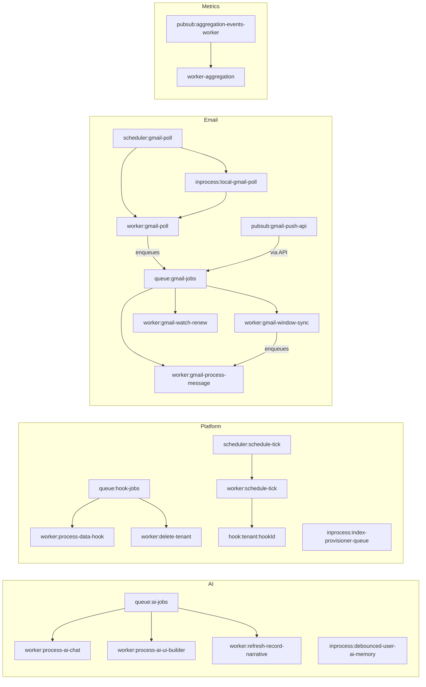

# Workload system catalog

How async workloads are **modeled in the catalog**, **wired in the system**, and
**connected** to each other.

| Doc | Audience | Question it answers |
| --- | -------- | ------------------- |
| **This doc** (`workload-system-catalog.md`) | Operators / engineers onboarding | How is the catalog shaped, implemented, and linked end-to-end? |
| [workload-inventory.md](./workload-inventory.md) | External review / cleanup | What to keep, remove, merge, or split? |

See also: [environment-variables.md](./environment-variables.md),
[`AGENTS.md`](../../AGENTS.md) (Workload Manager rules),
`pnpm check:workload-coverage`.

**Coverage:** the full set of workloads documented in the inventory — **20
static** registry entries plus the dynamic `hook:{tenantId}:{hookId}` family.

---

## 1. Catalog model

### Source of truth

| Piece | Location |
| ----- | -------- |
| Static registry | [`packages/workload-registry/src/workload-registry.ts`](../../packages/workload-registry/src/workload-registry.ts) |
| Schema (`WorkloadRecord`, kinds, domains) | [`packages/workload-registry/src/workload.ts`](../../packages/workload-registry/src/workload.ts) |
| Dynamic scheduled hooks | [`apps/api/src/workloads/adapters/scheduled-hooks.adapter.ts`](../../apps/api/src/workloads/adapters/scheduled-hooks.adapter.ts) |
| Admin API / live state | [`apps/api/src/workloads/`](../../apps/api/src/workloads/) |
| UI | Platform → Workloads (`/platform/workloads`) |
| Parity gate | [`scripts/check-workload-coverage.ts`](../../scripts/check-workload-coverage.ts) |

Every Cloud Tasks queue, Cloud Scheduler job, Pub/Sub subscription, worker
`/tasks/*` route, and in-process scheduler **must** be registered (or ignored
with an explicit `// workload-registry:ignore` comment). Async entry points
should record runs via `@repo/workload-runs`.

### Kind taxonomy

| Kind | Id prefix | Pauseable? | Role in the system |
| ---- | --------- | ---------- | ------------------ |
| `cloudTasksQueue` | `queue:` | Yes | Rate-limit / retry boundary; HTTP tasks to worker |
| `schedulerJob` | `scheduler:` | Yes (+ runNow) | GCP cron → worker HTTP |
| `pubsubSubscription` | `pubsub:` | Yes | Push or pull delivery into API or a dedicated worker |
| `workerRoute` | `worker:` | No | OIDC HTTP target + run attribution |
| `inProcessScheduler` | `inprocess:` | No | Local stand-in or in-memory FIFO / debounce |
| `scheduledDataHook` | `hook:` | Enable/disable | Runtime-synthesized per tenant cron hook |

### Axes

| Axis | Values | Meaning |
| ---- | ------ | ------- |
| **source** | `system` | First-party platform fabric |
| | `integration` | External product integration (Gmail) |
| | `hook` | Tenant-authored data-hook definitions (dynamic) |
| **domain** | `ai` / `email` / `platform` / `metrics` / `tenant` | Product area for filtering in the UI |

### Control plane vs catalog

```text
Control plane (pause / resume / runNow)     Catalog / attribution (read-only in UI)
───────────────────────────────────────     ──────────────────────────────────────
queue:*                                     worker:*     (HTTP face of queue/scheduler)
scheduler:*                                 inprocess:*  (local or in-memory stand-in)
pubsub:*                                    hook:*       (dynamic; enable on hook def)
```

`worker:*` entries are **not** extra jobs. They exist so Cloud Tasks / Scheduler
have a stable URL, and so workload runs/logs attribute to a named leaf.
Disabling work means pausing the **parent** (`controlledBy`), not deleting the
route from the catalog.

### Dynamic synthesis

Scheduled data hooks do not get their own Cloud Scheduler job. At list time the
API builds:

```text
hook:{tenantId}:{hookId}
```

from each cron hook definition. Execution still goes through
`scheduler:schedule-tick` → `worker:schedule-tick` → in-process
`processScheduleTick`.

---

## 2. Full catalog matrix

Status values match [workload-inventory.md](./workload-inventory.md):
`ACTIVE` | `CONDITIONAL` | `INACTIVE (by design)` | `CATALOG`.

### Control plane (7)

| Id | Kind | Domain | Source | TF / env | Children / notes | Status |
| -- | ---- | ------ | ------ | -------- | ---------------- | ------ |
| `queue:ai-jobs` | cloudTasksQueue | ai | system | `CLOUD_TASKS_QUEUE_NAME` · `cloudtasks-ai-jobs.tf` | → 3 AI worker routes | ACTIVE |
| `queue:hook-jobs` | cloudTasksQueue | platform | system | `HOOK_TASKS_QUEUE_NAME` · `cloudtasks-hook-jobs.tf` | → process-data-hook, delete-tenant | ACTIVE |
| `queue:gmail-jobs` | cloudTasksQueue | email | system | `GMAIL_TASKS_QUEUE_NAME` · `gmail-ingest.tf` | → window-sync, process-message, watch-renew | ACTIVE |
| `scheduler:schedule-tick` | schedulerJob | platform | system | `gmail-ingest.tf` · cron `* * * * *` | → `worker:schedule-tick` · fans out `hook:*` | ACTIVE |
| `scheduler:gmail-poll` | schedulerJob | email | integration | `gmail-ingest.tf` · cron `*/5 * * * *` | → `worker:gmail-poll`; env pair with local poll | ACTIVE (poll mode) |
| `pubsub:aggregation-events-worker` | pubsubSubscription | metrics | system | `pubsub-aggregation-events.tf` | → `apps/worker-aggregation` | CONDITIONAL (off in dev) |
| `pubsub:gmail-push-api` | pubsubSubscription | email | integration | `gmail-ingest.tf` | → API `/api/gmail/pubsub` → gmail-jobs | INACTIVE by default (poll) |

### Worker routes (10)

| Id | Domain | Source | Route | controlledBy | Source file | Status |
| -- | ------ | ------ | ----- | ------------ | ----------- | ------ |
| `worker:process-data-hook` | platform | system | `/tasks/process-data-hook` | `queue:hook-jobs` | `data-hook-task.route.ts` | CATALOG / ACTIVE |
| `worker:schedule-tick` | platform | system | `/tasks/schedule-tick` | `scheduler:schedule-tick` | `schedule-tick.route.ts` | CATALOG / ACTIVE |
| `worker:delete-tenant` | tenant | system | `/tasks/delete-tenant` | `queue:hook-jobs` | `tenant-deletion-task.route.ts` | CATALOG / ACTIVE |
| `worker:process-ai-chat` | ai | system | `/tasks/process-ai-chat` | `queue:ai-jobs` | `ai-chat-task.route.ts` | CATALOG / ACTIVE |
| `worker:process-ai-ui-builder` | ai | system | `/tasks/process-ai-ui-builder` | `queue:ai-jobs` | `ai-ui-builder-task.route.ts` | CATALOG / ACTIVE |
| `worker:refresh-record-narrative` | ai | system | `/tasks/refresh-record-narrative` | `queue:ai-jobs` | `record-narrative-refresh-task.route.ts` | CATALOG / ACTIVE |
| `worker:gmail-poll` | email | integration | `/tasks/gmail-poll` | `scheduler:gmail-poll` | `gmail-ingest-task.route.ts` | CATALOG / ACTIVE (poll) |
| `worker:gmail-window-sync` | email | integration | `/tasks/gmail-window-sync` | `queue:gmail-jobs` | `gmail-ingest-task.route.ts` | CATALOG / ACTIVE |
| `worker:gmail-process-message` | email | integration | `/tasks/gmail-process-message` | `queue:gmail-jobs` | `gmail-ingest-task.route.ts` | CATALOG / ACTIVE |
| `worker:gmail-watch-renew` | email | integration | `/tasks/gmail-watch-renew` | `queue:gmail-jobs` | `gmail-ingest-task.route.ts` | CATALOG (push mode) |

Routes register via [`task.scope.ts`](../../apps/worker-service/src/routes/task.scope.ts).

### In-process (3)

| Id | Domain | Source | controlledBy | Source file | Status |
| -- | ------ | ------ | ------------ | ----------- | ------ |
| `inprocess:local-gmail-poll` | email | integration | `scheduler:gmail-poll` | `local-gmail-poll-scheduler.ts` | ACTIVE when `IS_LOCAL` |
| `inprocess:debounced-user-ai-memory` | ai | system | — | `debounced-user-ai-memory-refresh.ts` | ACTIVE |
| `inprocess:index-provisioner-queue` | platform | system | — | `firestore-index-provisioner.ts` | ACTIVE (API process) |

### Dynamic family

| Id pattern | Kind | Domain | Source | Controlled / executed by | Status |
| ---------- | ---- | ------ | ------ | ------------------------ | ------ |
| `hook:{tenantId}:{hookId}` | scheduledDataHook | (tenant hooks) | hook | Enable on hook def; run via `scheduler:schedule-tick` | ACTIVE |

**Total static registry:** 20. **Plus** N dynamic hooks per environment.

---

## 3. controlledBy graph

Parent (control plane or conceptual parent) → child (catalog leaf):



---

## 4. Connection / implementation by subsystem

Wiring form:

```text
Trigger → control-plane resource → HTTP route or consumer → processor
```

### 4.1 AI jobs

```text
POST /api/ai/chat | /api/ai/ui-builder | insights/summary refresh
  → queue:ai-jobs  (Cloud Tasks or *_LOCAL_DISPATCH HTTP)
    → worker:process-ai-chat | process-ai-ui-builder | refresh-record-narrative
      → respective processors on worker-service
```

| Link | Implementation |
| ---- | -------------- |
| Enqueue | [`apps/api/src/ai/cloud-tasks.client.ts`](../../apps/api/src/ai/cloud-tasks.client.ts); routes in `register-ai-routes.ts`, `register-ai-insights-routes.ts`, `register-ai-record-summary-routes.ts` |
| Paths | [`packages/ai-engine/src/task-routes.ts`](../../packages/ai-engine/src/task-routes.ts) |
| TF | [`cloudtasks-ai-jobs.tf`](../../packages/infrastructure/terraform/cloudtasks-ai-jobs.tf) |

**User AI memory** is **not** on this queue. Record-summary updates schedule
`inprocess:debounced-user-ai-memory` → `processUserAiMemoryRefresh` in-process
([`debounced-user-ai-memory-refresh.ts`](../../apps/worker-service/src/ai/debounced-user-ai-memory-refresh.ts)).

**Reasonability.** One queue shares Vertex budget and lets ops pause all
user-facing AI async work together. Memory debounce stays in-process to
coalesce bursts without Cloud Tasks chatter.

---

### 4.2 Hook jobs

```text
CRUD / interpret-data-hook (execution: queued, phase: after)
  → queue:hook-jobs
    → worker:process-data-hook → processDataHookJob

Admin DELETE tenant
  → queue:hook-jobs
    → worker:delete-tenant → tenant deletion pipeline
```

| Link | Implementation |
| ---- | -------------- |
| Hook enqueue | [`hook-tasks.client.ts`](../../apps/api/src/hooks/hook-tasks.client.ts) ← [`interpret-data-hook.ts`](../../packages/hooks/src/interpret-data-hook.ts) |
| Tenant enqueue | [`tenant-deletion-tasks.client.ts`](../../apps/api/src/admin/tenant-deletion-tasks.client.ts) |
| Nested hooks on worker | In-process dispatcher inside data-hook processor (no re-enqueue) |
| TF | [`cloudtasks-hook-jobs.tf`](../../packages/infrastructure/terraform/cloudtasks-hook-jobs.tf) |

**Reasonability.** Higher throughput than `ai-jobs`; isolates platform
side-effects from Vertex. Nested worker hooks stay in-process to avoid
recursive Cloud Tasks amplification. Tenant delete shares the queue (same
blast radius) unless later split.

---

### 4.3 Schedule fabric

```text
Cloud Scheduler (* * * * *)
  → scheduler:schedule-tick
    → worker:schedule-tick (/tasks/schedule-tick)
      → processScheduleTick
        → run due hook:{tenant}:{hookId} in-process
        → purge expired tenant archives
```

| Link | Implementation |
| ---- | -------------- |
| TF job | [`gmail-ingest.tf`](../../packages/infrastructure/terraform/gmail-ingest.tf) (`schedule_tick`) |
| Route | [`schedule-tick.route.ts`](../../apps/worker-service/src/routes/schedule-tick.route.ts) |
| Processor | [`schedule-tick-processor.ts`](../../apps/worker-service/src/services/schedule-tick-processor.ts) |
| Ops force | [`scripts/force-insights-cascade.sh`](../../scripts/force-insights-cascade.sh) |
| Dynamic list | [`scheduled-hooks.adapter.ts`](../../apps/api/src/workloads/adapters/scheduled-hooks.adapter.ts) |

**Reasonability.** One cheap ticker instead of N Scheduler jobs × tenants.
Catalog `hook:*` rows give ops enable/visibility without GCP per-hook
resources. Scheduled path does **not** go through `queue:hook-jobs`.

---

### 4.4 Gmail ingest

**Poll path (default — `GMAIL_INGEST_DELIVERY_MODE=poll`):**

```text
scheduler:gmail-poll  (or inprocess:local-gmail-poll when IS_LOCAL)
  → worker:gmail-poll
    → enqueue window-sync per mailbox onto queue:gmail-jobs
      → worker:gmail-window-sync
        → enqueue worker:gmail-process-message (fan-out)
```

**Push path (optional — mode `push`):**

```text
Gmail users.watch → pubsub:gmail-push-api
  → API POST /api/gmail/pubsub
    → enqueue window-sync onto queue:gmail-jobs
      → same window-sync / process-message tree
worker:gmail-watch-renew keeps watches alive
```

| Link | Implementation |
| ---- | -------------- |
| TF (queue, poll, push, schedule-tick) | [`gmail-ingest.tf`](../../packages/infrastructure/terraform/gmail-ingest.tf) |
| API tasks client | [`gmail-tasks.client.ts`](../../apps/api/src/gmail-ingest/gmail-tasks.client.ts) |
| Worker enqueuer | [`worker-gmail-task-enqueuer.ts`](../../apps/worker-service/src/services/worker-gmail-task-enqueuer.ts) |
| Routes / processor | [`gmail-ingest-task.route.ts`](../../apps/worker-service/src/routes/gmail-ingest-task.route.ts), [`gmail-ingest-processor.ts`](../../apps/worker-service/src/services/gmail-ingest-processor.ts) |
| Local poll | [`local-gmail-poll-scheduler.ts`](../../apps/worker-service/src/services/local-gmail-poll-scheduler.ts) |
| Mode toggle | Platform → Observability · runtime settings |

**Reasonability.** Poll is the default product path (simple, predictable).
Push stays provisioned for realtime without Terraform churn. Delivery mode
makes the two paths mutually exclusive at the app layer; both can look
“armed” in GCP. Dedicated `gmail-jobs` queue isolates mail storms from AI
and hooks.

---

### 4.5 Aggregation

```text
CRUD / hooks / import (when AGGREGATION_EVENTS_PUBSUB=true)
  → publish aggregation-events
    → pubsub:aggregation-events-worker
      → apps/worker-aggregation pull consumer
        → processAggregationEventTransaction
```

| Link | Implementation |
| ---- | -------------- |
| Publish | [`emit-aggregation-event.ts`](../../packages/aggregation-engine/src/emit-aggregation-event.ts) |
| TF | [`pubsub-aggregation-events.tf`](../../packages/infrastructure/terraform/pubsub-aggregation-events.tf) |
| Consumer | [`apps/worker-aggregation/src/index.ts`](../../apps/worker-aggregation/src/index.ts) |
| Workspace gate | `enable_aggregation_pubsub` false in default/dev; true in staging/prod |

**When off (dev):** API aggregates **inline** — no second Cloud Run required.

**Reasonability.** Prod offloads heavy metric writes; local stays simple.
Dedicated service avoids competing with Gmail/AI concurrency on worker-service.

---

### 4.6 Index provisioning

```text
Entity catalog sync / import / admin index routes
  → inprocess:index-provisioner-queue (API process FIFO)
    → ensureFirestoreIndexes (Admin API)
```

| Link | Implementation |
| ---- | -------------- |
| FIFO | [`firestore-index-provisioner.ts`](../../packages/gcp-firebase/src/firestore-index-provisioner.ts) |
| Reconciler | [`firestore-index-reconciler.ts`](../../packages/gcp-firebase/src/firestore-index-reconciler.ts) |
| Env | `ENSURE_FIRESTORE_INDEXES=true` (typical) |
| Unused TF | — | Former `pubsub-index-provisioning.tf` deleted; live path is in-process |


**Reasonability.** In-process rate limiting is the live path. Async Pub/Sub
index worker was never fully productized (removed from registry as
misleading).

---

## 5. Reasonability of the catalog shape

System workloads are **tenant-agnostic shared pipes**. Tenant-specific cron
and CRUD side-effects live in each tenant’s data-hook catalog and appear as
dynamic `hook:{tenantId}:{hookId}` — not as hardcoded entity lists in platform
packages.

### Why separate queues

| Queue | Isolates | Rate profile |
| ----- | -------- | ------------ |
| `ai-jobs` | Vertex spend / latency | Tight (~10/min) |
| `hook-jobs` | CRUD side-effects + tenant delete | Higher throughput |
| `gmail-jobs` | Mailbox fan-out storms | Independent of AI/hooks |

Merging them would couple pause and failure domains.

### Why worker routes exist in the catalog

- Stable OIDC audiences for Cloud Tasks / Scheduler
- Workload-run ids and log filters per leaf
- UI graph completeness (`controlledBy` parent → child)

They are catalog leaves, not independently pauseable jobs.

### Why environment / mode pairs

| Pair | Reason |
| ---- | ------ |
| `scheduler:gmail-poll` + `inprocess:local-gmail-poll` | Same poll behavior; GCP vs `IS_LOCAL` |
| Poll vs `pubsub:gmail-push-api` | Product mutual exclusion via delivery mode |
| Aggregation Pub/Sub vs inline | Dev simplicity vs prod scale |

These are **not** duplicate workloads to merge across environments.

### Why one schedule-tick

Tenant cron volume is open-ended. One minute ticker + dynamic `hook:*`
catalog rows scale ops visibility without exploding Scheduler job count.

### What left the catalog (do not re-add without a producer)

Documented in inventory; brief:

| Former id | Why removed from catalog |
| --------- | ------------------------ |
| `queue:ai-embed` | No enqueue; embeddings synchronous |
| `worker:nightly-user-ai-memory` | No invoker |
| `worker:refresh-user-ai-memory` | HTTP unused; debouncer is live |
| `pubsub:index-provisioning-worker` | Never productized; in-process path is live |
| `pubsub-index-provisioning.tf` | Unused gated TF deleted (System Phase 1) |

---

## 6. Implementation map (quick reference)

| Concern | Where |
| ------- | ----- |
| Register a new workload | Add to `WORKLOAD_REGISTRY`; wire TF/env if GCP; instrument entry with workload-runs; run `pnpm check:workload-coverage` |
| Enqueue Cloud Tasks (API) | `apps/api/src/ai/cloud-tasks.client.ts` (shared pattern); domain clients for hooks/gmail |
| Worker task registration | `apps/worker-service/src/routes/task.scope.ts` |
| Live GCP pause/resume | Workload controller adapters under `apps/api/src/workloads/adapters/` |
| Local bypass | `AI_TASKS_LOCAL_DISPATCH`, `HOOK_TASKS_LOCAL_DISPATCH`, `GMAIL_TASKS_LOCAL_DISPATCH` |
| Gmail mode | `GMAIL_INGEST_DELIVERY_MODE` + Observability runtime override |
| Aggregation mode | `AGGREGATION_EVENTS_PUBSUB` / workspace `enable_aggregation_pubsub` |

---

## 7. Related docs

- Diagnosis / keep-remove: [workload-inventory.md](./workload-inventory.md)
- Env vars (incl. Gmail delivery): [environment-variables.md](./environment-variables.md)
- Agent rule: [`AGENTS.md`](../../AGENTS.md)
