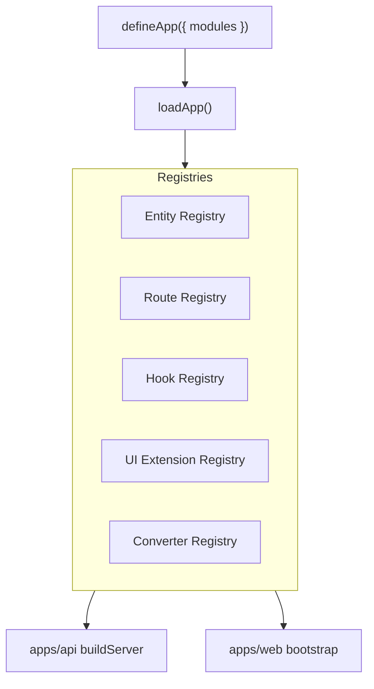

# Module Extension Guide

How to extend the platform with self-contained modules — entities, converters, routes, hooks, and UI — without editing core server or web code.

**Workstream:** [10.3 MODULE / EXTENSION SYSTEM](<../Ecosystem%20Plan/v2/Key%20Capabilitues/10.3%20MODULE%20%2F%20EXTENSION%20SYSTEM.md>)

---

## Architecture



| Package / path | Role |
| --- | --- |
| `@repo/modules` | `defineModule`, `defineApp`, `loadApp`, registries, dependency resolver |
| `@app/platform` | Shared `platformApp` config + `bootstrapPlatformApp()` |
| `modules/core` | Seed entities (`organization`, `project`) and converters |
| `modules/inventory` | Sample extension module (acceptance proof) |
| `apps/api` | CRUD loop over `getAllEntities()`, module routes, hook emission |
| `apps/web` | Field/view React registries + UI extension merge via catalog API |

**Out of scope (v1):** third-party sandboxing, tenant module toggling, remote/marketplace loading, query-engine extensions, drag-and-drop module authoring.

---

## Quick start — add a module

1. Create `modules/{name}/` with a `defineModule()` export.
2. List the module in [`apps/platform/app.config.ts`](../apps/platform/app.config.ts).
3. Restart API and web — no edits to `server.ts`, `EntityTable`, or nav code.

```ts
// apps/platform/app.config.ts
import { defineApp } from "@repo/modules";
import { coreModule } from "@modules/core";
import { inventoryModule } from "@modules/inventory";
import { myModule } from "@modules/my-module";

export const platformApp = defineApp({
  modules: [coreModule, inventoryModule, myModule],
});
```

Both API and web call the same bootstrap:

```ts
// apps/platform/bootstrap.ts
bootstrapPlatformApp(platformApp); // idempotent — safe to call once per process
```

---

## `defineModule` reference

```ts
import { defineModule } from "@repo/modules";

export const myModule = defineModule({
  name: "my-module",
  version: "1.0.0",
  dependencies: ["core"], // optional — topological load order

  entities: [MyEntity], // DefinedEntity from defineEntity()

  converters: {
    myEntity: myEntityConverter, // or createEntityConverter(MyEntity)
  },

  routes: [
    {
      method: "GET",
      path: "/api/modules/my-module/summary",
      permission: "myEntity.read", // RBAC guard
      handler: async (request, context) => ({ /* ... */ }),
    },
  ],

  hooks: [
    {
      event: "organization.deleted",
      handler: async (ctx) => { /* cross-entity reaction */ },
    },
  ],

  ui: {
    components: {
      "custom-badge": "BadgeField", // metadata id → web implementation id
    },
    extend: {
      organization: {
        views: [{ type: "table", name: "extra", fields: ["name"] }],
      },
    },
  },
});
```

`defineModule()` validates the shape with Zod and returns a frozen `ModuleDefinition`.

---

## `defineApp` reference

```ts
import { defineApp } from "@repo/modules";

export const platformApp = defineApp({
  modules: [coreModule, inventoryModule],
  // Legacy compat (deprecated — use modules/core instead):
  // entities: [LegacyEntity],
});
```

`loadApp()`:

1. Validates unique module names and dependency references
2. Topologically sorts modules (`resolveModuleOrder()` — fails on missing deps or cycles)
3. Registers entities, converters, routes, hooks, and UI extensions into registries

---

## Module folder layout

```
modules/
  core/
    package.json          @modules/core
    src/
      index.ts            defineModule export
      entities/
        organization.ts
        project.ts
  inventory/
    package.json          @modules/inventory
    src/
      index.ts            entity + module definition
```

Each module is a workspace package (`modules/*` in `pnpm-workspace.yaml`). Modules must **not** import each other directly — communicate via hooks and shared entity names in registries.

---

## Extension points

### Entities

Entities registered via `defineModule({ entities })` are added to the global entity registry (`registerEntity` in `@repo/entities`). The API CRUD generator loops `getAllEntities()` — new entities get routes automatically.

RBAC permissions (`{entity}.read`, …) are derived dynamically from registered entities via `getAllKnownPermissions()` in `@repo/rbac`.

### Converters

Register custom converters in the module, or rely on the generic factory:

```ts
import { createEntityConverter } from "@repo/firestore-converters";

const converter = createEntityConverter(MyEntity);
// Uses entity.schema + persistedSchemaV1 (_schemaVersion: 1)
```

The API [`entity-converter-registry`](../apps/api/src/entities/entity-converter-registry.ts) delegates to `@repo/modules` with seed fallbacks for core entities.

### Routes

Module routes are mounted by [`registerModuleRoutes`](../apps/api/src/modules/register-module-routes.ts):

- Auth + tenant context required
- RBAC via declared `permission` on each route definition
- Default prefix: declared `path` (e.g. `/api/modules/inventory/summary`)

Use the Query Engine for reads inside handlers — do not query Firestore directly.

### Hooks

CRUD routes emit lifecycle events after successful mutations:

| Event | When |
| --- | --- |
| `{entity}.created` | After POST |
| `{entity}.updated` | After PUT |
| `{entity}.deleted` | After DELETE |

Hook context:

```ts
{
  userId: string;
  tenantId: string;
  entityName: string;
  record: Record<string, unknown>;
  services: { queryEngine, logger };
}
```

Handlers run sequentially; errors are logged and do **not** fail the CRUD response (v1).

### UI extensions

**Server-side merge:** `GET /api/entities` merges base entity `ui` with module extensions via `mergeUiExtensions()` — appends views, deep-merges fields/nav.

**Web-side lookup:**

- [`field-component-registry.tsx`](../apps/web/app/components/entity/field-component-registry.tsx) — maps implementation ids to React field components
- [`view-component-registry.tsx`](../apps/web/app/components/entity/view-component-registry.tsx) — maps view types (`table`, `card`, custom) to renderers
- `bootstrapWebPlatform()` in [`apps/web/app/platform/bootstrap.ts`](../apps/web/app/platform/bootstrap.ts) registers built-ins + module component ids

`EntityField` resolves `component` metadata → `@repo/ui-builder` id → web field registry → built-in fallback.

---

## Sample module: inventory

[`modules/inventory`](../modules/inventory/src/index.ts) demonstrates all extension points:

| Feature | Implementation |
| --- | --- |
| New entity | `inventoryItem` with relation to `organization` |
| Converter | `createEntityConverter(InventoryItem)` |
| Custom route | `GET /api/modules/inventory/summary` |
| Hook | `organization.deleted` → logs stub |
| UI | Extends `organization.views`; registers `badge` component |

Adding inventory requires only listing `inventoryModule` in `app.config.ts`.

---

## Security rules

1. **Query Engine only** — module route handlers and hooks must use `context.services.queryEngine`, not raw Firestore.
2. **RBAC on writes** — declare `permission` on module routes; CRUD routes enforce per-action guards automatically.
3. **No cross-module imports** — modules communicate via hooks and entity names, not direct code dependencies.
4. **Tenant isolation** — all operations scoped to authenticated `tenantId`.

---

## Staged migration (Answer Q)

| Phase | Status | Notes |
| --- | --- | --- |
| 1 — `@repo/modules` + bootstrap | Done | `defineApp`, registries, API/web bootstrap |
| 2 — `modules/core` | Done | Organization + project moved from shared-types |
| 3 — Sample extension | Done | `modules/inventory` |
| 4 — Deprecate legacy | Deferred | Remove `entities: []` compat path when all tests migrated |

[`register-entities.ts`](../packages/shared-types/src/register-entities.ts) is a deprecated no-op shim. Entity definitions live in `modules/core` and are re-exported from `@repo/shared-types` for backward compatibility.

---

## Testing

```bash
pnpm --filter @repo/modules test
pnpm --filter api test
pnpm --filter web test
```

Key test files:

| File | Covers |
| --- | --- |
| `packages/modules/src/*.test.ts` | Validation, dependency order, registries |
| `apps/api/src/modules/module-integration.test.ts` | Module routes, hooks, catalog merge |
| `apps/api/src/entities/list-entities.route.test.ts` | UI extension merge in catalog |

In-memory test runtime (`createInMemoryCrudRuntime`) bootstraps the platform app and creates repositories for all registered entities.

---

## Related

- [Entity System Guide](./entity-system-guide.md)
- [Advanced UI Builder Guide](./advanced-ui-builder-guide.md)
- [@repo/entities README](../packages/entities/README.md)
- [CRUD README](../apps/api/src/crud/README.md) — hook events
