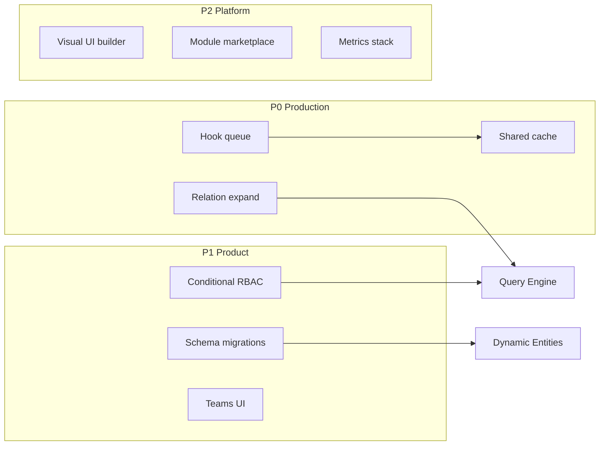

# Next Phase Backlog

Consolidated deferred work from Phase 2 capability guides. Implements [General Definitions §12 Step 4](../Ecosystem%20Plan/v2/General%20Definitions.md): identify gaps, prioritize features, define boundaries for the next implementation plan.

**Not a commitment to build order** — rationale-backed starting points for the next team.

**Related:** [phase-2-platform-handoff.md](./phase-2-platform-handoff.md) capability matrix

---

## Priority tiers

| Tier | Meaning |
|------|---------|
| **P0** | Blocks production scale or common SaaS patterns; high user impact |
| **P1** | Significant product depth; can ship incrementally |
| **P2** | Platform maturity, marketplace, or advanced customization |

---

## P0 — Production and core SaaS gaps

### P0.1 Distributed caching (Performance Phase B)

| | |
|---|---|
| **Problem** | In-process TTL caches (roles, user access, entity definitions) do not share state across API instances |
| **Current state** | `createTtlCache` in `@repo/shared-types`; 60s TTL per process ([performance-scaling-guide.md](./performance-scaling-guide.md)) |
| **Suggested approach** | Redis adapter behind same cache interface; env-driven backend selection |
| **Depends on** | Deployment topology decision |
| **Risk if deferred** | Stale permissions/definitions in multi-instance prod; cache invalidation bugs |

### P0.2 Async hook execution (Performance Phase B)

| | |
|---|---|
| **Problem** | Hooks run synchronously in request path; slow hooks increase latency |
| **Current state** | `execution: "sync"` (default), `deferred` (in-process after-hooks), `queued` (Cloud Tasks → worker-service) |
| **Suggested approach** | ~~BullMQ (or similar) for after-hooks~~ **Done (Phase 5):** Cloud Tasks + worker-service for `execution: "queued"`; keep before-hooks sync |
| **Depends on** | worker-service (same as AI tasks) |
| **Risk if deferred** | Cannot add webhook/email hooks at scale without timeout risk |

### P0.3 Rate limit auth-aware keys

| | |
|---|---|
| **Problem** | Rate limit plugin may run before auth; keys fall back to IP |
| **Current state** | `keyGenerator` uses `request.ctx` when available ([apps/api/src/server.ts](../apps/api/src/server.ts)) |
| **Suggested approach** | Register rate limit after auth hook or use dual-pass keying |
| **Depends on** | Fastify plugin ordering |
| **Risk if deferred** | Shared IP unfair throttling; weak per-tenant fairness |

### P0.4 Relation expansion on GET

| | |
|---|---|
| **Problem** | Clients cannot fetch related records inline; N+1 client fetches |
| **Current state** | FK validation + RelationPicker partial UI; list filters on FK fields work via query engine |
| **Suggested approach** | `?expand=organization` on GET list/detail; query engine `include` support |
| **Depends on** | Query engine + relational data packages |
| **Risk if deferred** | Poor UX for relation-heavy screens |

Sources: [query-engine-guide.md](./query-engine-guide.md), [relational-data-system-guide.md](./relational-data-system-guide.md)

---

## P1 — Product depth

### P1.1 Row-level RBAC query injection

| | |
|---|---|
| **Problem** | All rows visible to users with `entity.read`; no owner-scoped lists |
| **Current state** | Entity-level read gate only; `RbacQueryInjector` extension point documented |
| **Suggested approach** | Implement injector in query engine; role conditions (e.g. `ownerId == uid`) |
| **Depends on** | Advanced RBAC conditions (ABAC lite) |
| **Risk if deferred** | Cannot support “see only my records” SaaS patterns |

### P1.2 ABAC and role hierarchy (RBAC Phase C)

| | |
|---|---|
| **Problem** | No conditional permissions or inherited roles |
| **Current state** | Static grants + field rules per tenant role |
| **Suggested approach** | Condition AST on roles; parent role inheritance in `resolvePermissions` |
| **Depends on** | Role schema migration |
| **Risk if deferred** | Enterprise customers need conditional access |

Source: [advanced-rbac-guide.md](./advanced-rbac-guide.md)

### P1.3 Permission explorer UI

| | |
|---|---|
| **Problem** | Admins cannot visualize effective permissions for a user/role |
| **Current state** | Role editor lists grants; no effective-permission preview |
| **Suggested approach** | Admin UI: pick user → show resolved permissions + field map |
| **Depends on** | Stable RBAC resolution API |
| **Risk if deferred** | Harder to debug access issues in production |

Source: [admin-dashboard-guide.md](./admin-dashboard-guide.md)

### P1.4 Entity schema migrations

| | |
|---|---|
| **Problem** | Field rename/delete not supported; no backfill tooling |
| **Current state** | Evolution rules allow add/restrict type change; soft-deprecate only |
| **Suggested approach** | Migration jobs + admin UI for field deprecate/rename with data transform |
| **Depends on** | Async job queue |
| **Risk if deferred** | Models ossify; tenants afraid to change schemas |

Source: [dynamic-entity-builder-guide.md](./dynamic-entity-builder-guide.md)

### P1.5 Hook execution logs and webhook action

| | |
|---|---|
| **Problem** | No visibility into hook failures; no external integrations |
| **Current state** | **Done (Phase 6):** Firestore `__data_hook_executions` log collection; `callWebhook` action with HTTPS POST |
| **Suggested approach** | ~~Firestore execution log collection; `callWebhook` action type~~ Implemented |
| **Depends on** | Async hooks (P0.2) for after-hooks |
| **Risk if deferred** | Limited automation story |

Source: [hooks-system-guide.md](./hooks-system-guide.md)

### P1.6 Users and teams admin UI

| | |
|---|---|
| **Problem** | Team management beyond basic invite + role assignment |
| **Current state** | Tenant-scoped user invite + role assignment at `/settings/users` (`UserManagement.tsx`); superadmin cross-tenant user PATCH at `/admin/users` |
| **Suggested approach** | Teams/groups, bulk invite, audit log |
| **Depends on** | Auth invite flow enhancements |
| **Risk if deferred** | Large tenants lack org structure in UI |

Source: [admin-dashboard-guide.md](./admin-dashboard-guide.md)

---

## P2 — Platform maturity and customization

### P2.1 Drag-and-drop UI builder

| | |
|---|---|
| **Problem** | UI layout requires JSON/config editing or module code |
| **Current state** | `@repo/ui-builder` interprets static `ui` metadata; table/card/form views |
| **Suggested approach** | Visual layout editor persisting `EntityUIConfig`; preview mode |
| **Depends on** | Stable UI config schema |
| **Risk if deferred** | “No-code” promise incomplete for non-technical admins |

Source: [advanced-ui-builder-guide.md](./advanced-ui-builder-guide.md), Ecosystem Plan 10.2

### P2.2 Dashboard view type

| | |
|---|---|
| **Problem** | No aggregated dashboard widgets |
| **Current state** | Table and card list views only |
| **Suggested approach** | `dashboard` view type in ui-builder; widget registry |
| **Depends on** | UI builder admin (P2.1) |
| **Risk if deferred** | Limited analytics-style landing pages |

### P2.3 Module marketplace and tenant toggles

| | |
|---|---|
| **Problem** | Modules are compile-time only; all tenants get all modules |
| **Current state** | `defineApp({ modules: [core, inventory] })` at build time |
| **Suggested approach** | Tenant module enablement in Firestore; dynamic route registration |
| **Depends on** | Module isolation audit |
| **Risk if deferred** | Cannot offer optional paid modules per tenant |

Source: [module-extension-guide.md](./module-extension-guide.md)

### P2.4 Sandboxed script hooks

| | |
|---|---|
| **Problem** | Hooks limited to predefined action types |
| **Current state** | Structured actions only |
| **Suggested approach** | Isolated VM or WASM sandbox for `config.script` |
| **Depends on** | Security review, resource limits |
| **Risk if deferred** | Power users cannot express arbitrary logic safely |

Source: [hooks-system-guide.md](./hooks-system-guide.md)

### P2.5 Observability stack

| | |
|---|---|
| **Problem** | Structured logs only; no metrics dashboards |
| **Current state** | `request-timing` logs rbacMs/queryMs/hooksMs; index hint warnings |
| **Suggested approach** | Prometheus exporter + Grafana dashboards; trace IDs |
| **Depends on** | Infra |
| **Risk if deferred** | Hard to SLO production API |

Source: [performance-scaling-guide.md](./performance-scaling-guide.md)

### P2.6 Query engine advanced features

| | |
|---|---|
| **Problem** | No OR filters, aggregations, full-text search |
| **Current state** | Single inequality + sort discipline; Firestore executor |
| **Suggested approach** | Extend parser; document Firestore index requirements; or alternate executor |
| **Depends on** | Product requirements for search |
| **Risk if deferred** | Complex reporting stays out of platform |

Source: [query-engine-guide.md](./query-engine-guide.md)

### P2.7 Schema templates and cloning

| | |
|---|---|
| **Problem** | Each tenant builds models from scratch |
| **Current state** | Manual Model Builder wizard |
| **Suggested approach** | Template library (platform or tenant); clone entity definition |
| **Depends on** | Entity definition export/import format |
| **Risk if deferred** | Slower tenant onboarding |

Source: [dynamic-entity-builder-guide.md](./dynamic-entity-builder-guide.md)

---

## Suggested module boundaries for next phase

---

## Out of scope (unchanged from Phase 2 plans)

- Micro-frontends
- React Query offline sync
- CDN configuration (until hosting strategy defined)
- Load-test harness (until SLO targets defined)
- Third-party module sandboxing without security review

---

## How to use this backlog

1. Pick a tier aligned with your release goal (prod vs feature vs platform)
2. Read the linked capability guide for current API surface
3. Use [codebase-map.md](./codebase-map.md) to locate extension points
4. Draft implementation plan with acceptance tests mapped to [e2e-validation-runbook.md](./e2e-validation-runbook.md)
