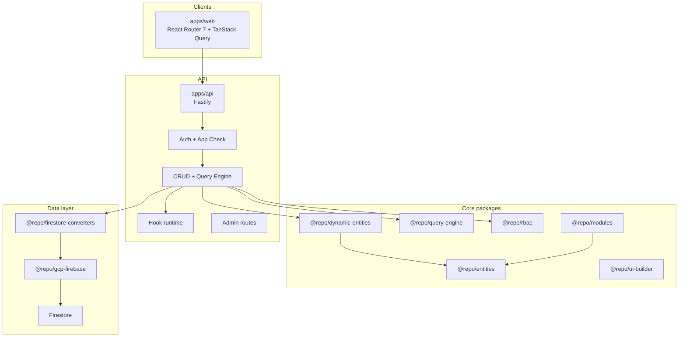
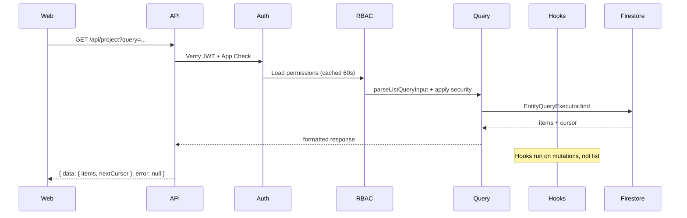

# Phase 2 Platform Handoff

**Audience:** Engineering leads and implementers planning the next platform phase.  
**Purpose:** Self-contained snapshot of what Phase 1 (engine) and Phase 2 (ecosystem) delivered, how the system works today, known gaps, and where to go next.  
**Status:** Phase 1 complete. Phase 2 capabilities delivered at **Partial–Complete** maturity (see capability matrix).  
**Last updated:** May 2026

---

## 1. Platform vision

This is a **multi-tenant ecosystem builder**: businesses define data models (entities), receive auto-generated CRUD APIs, manage permissions and roles, render data through a schema-driven UI, and extend behavior via modules and hooks—without forking the core.

Core principles (from [General Definitions](../Ecosystem%20Plan/v2/General%20Definitions.md)):

- Single ecosystem, multi-tenant isolation
- Schema-driven backend and frontend
- Permission-based access (RBAC)
- Extensible via modules, not forks
- Architecture designed so future phases do not require rewrites

---

## 2. Phase 1 outcome — the engine

Phase 1 delivered a working end-to-end platform. All seven workstreams are **complete**.

| Workstream | What it does | Primary locations | Guide |
|------------|--------------|-------------------|-------|
| Entity system | `defineEntity()`, field types, permissions | `packages/entities`, `modules/core` | [entity-system-guide.md](./entity-system-guide.md) |
| DAL | Firestore converters, tenant-scoped repos | `packages/firestore-converters`, `packages/gcp-firebase` | [firestore-collections-guide.md](./firestore-collections-guide.md) |
| CRUD API generator | Auto routes per entity | `apps/api/src/crud/` | [apps/api/src/crud/README.md](../apps/api/src/crud/README.md) |
| RBAC | `entity.action` permissions, middleware | `packages/rbac`, `apps/api/src/rbac/` | [packages/rbac/README.md](../packages/rbac/README.md) |
| Frontend entity UI | Table, form, field components | `apps/web/app/components/entity/` | [apps/web/app/components/entity/README.md](../apps/web/app/components/entity/README.md) |
| Routing | Dynamic `/app/:entity` routes, guards | `apps/web/app/routing/` | [apps/web/app/routing/README.md](../apps/web/app/routing/README.md) |
| Basic admin | Platform roles, tenant/user assignment | `apps/api/src/routes/admin.routes.ts` | [apps/api/README.md](../apps/api/README.md) |

### Phase 1 validation criteria (all met)

1. A new entity can be created at config level (static via modules or dynamic via Model Builder)
2. CRUD works without new route code
3. Permissions restrict access on API and UI
4. UI reflects permissions dynamically (actions hidden, field-level rules)
5. Tenants see only their data (`tenantId` claim + Firestore path isolation)
6. Role changes take effect on next request (with 60s user-access cache TTL—see stabilization notes)

Reproduce manually: [e2e-validation-runbook.md](./e2e-validation-runbook.md).

---

## 3. Phase 2 outcome assessment

[General Definitions §11](../Ecosystem%20Plan/v2/General%20Definitions.md) defines four Phase 2 outcomes:

| Outcome | Evidence in codebase |
|---------|---------------------|
| **Businesses can fully configure their systems** | Model Builder (`/settings/data-models`), tenant role editor with field rules (`/settings/roles`), hook manager (`/settings/hooks`), Control Plane dashboard |
| **Platform supports real-world SaaS use cases** | Multi-tenant auth + tenant switcher, query engine (filter/sort/pagination), relations (FK + join collections), inventory sample module |
| **Extensions without touching core** | `@repo/modules` compile-time modules (`core`, `inventory`); Firestore-backed dynamic hooks; dynamic entity definitions at runtime |
| **UI customizable and composable** | `@repo/ui-builder` view/form engines, module UI extensions, field/view registries, virtualized table + debounced filters |

Phase 2 is **functionally complete for v1** of each capability. Several areas remain **partial** (deferred items documented in capability guides and [next-phase-backlog.md](./next-phase-backlog.md)).

---

## 4. Capability matrix (10.x)

| ID | Capability | Status | Packages / apps | Guide |
|----|------------|--------|-----------------|-------|
| 10.0 | Query Engine | Partial | `@repo/query-engine`, `@repo/gcp-firebase`, `apps/api` CRUD | [query-engine-guide.md](./query-engine-guide.md) |
| 10.1 | Relational Data | Partial | `@repo/entity-relations`, CRUD relation hooks | [relational-data-system-guide.md](./relational-data-system-guide.md) |
| 10.2 | Advanced UI Builder | Partial | `@repo/ui-builder`, `apps/web/app/components/entity/` | [advanced-ui-builder-guide.md](./advanced-ui-builder-guide.md) |
| 10.3 | Module Extension | Partial | `@repo/modules`, `apps/platform`, `modules/*` | [module-extension-guide.md](./module-extension-guide.md) |
| 10.4 | Custom Business Logic (Hooks) | Partial | `@repo/hooks`, `apps/api/src/hooks/` | [hooks-system-guide.md](./hooks-system-guide.md) |
| 10.5 | Advanced RBAC | Partial | `@repo/rbac`, tenant roles, field rules | [advanced-rbac-guide.md](./advanced-rbac-guide.md) |
| 10.6 | Admin Dashboard | Partial | Control Plane UI, `admin-client.ts` | [admin-dashboard-guide.md](./admin-dashboard-guide.md) |
| 10.7 | Performance & Scaling | Partial (Phase A) | TTL caches, rate limit, TanStack Query, virtualization | [performance-scaling-guide.md](./performance-scaling-guide.md) |
| 10.8 | Dynamic Entity Builder | Partial | `@repo/dynamic-entities`, Model Builder UI | [dynamic-entity-builder-guide.md](./dynamic-entity-builder-guide.md) |

**Status key:** *Complete* = v1 deliverable per guide. *Partial* = core shipped, deferred items remain. *Deferred* = not started; listed in next-phase backlog.

---

## 5. Architecture

### 5.1 Monorepo layout

```
project-base/
├── apps/
│   ├── api/          Fastify HTTP API
│   ├── web/          React Router 7 SPA
│   └── platform/     Shared app config (module bootstrap)
├── modules/
│   ├── core/         organization, project entities
│   └── inventory/    inventoryItem + module route
├── packages/
│   ├── entities/           defineEntity, UI config types
│   ├── dynamic-entities/   runtime model CRUD
│   ├── query-engine/       parse, validate, execute queries
│   ├── entity-relations/   FK + join validation
│   ├── rbac/               permissions, roles, field access
│   ├── hooks/              hook execution engine
│   ├── modules/            defineModule, registries
│   ├── ui-builder/         view/form/query resolution
│   ├── firestore-converters/
│   ├── gcp-firebase/       Firestore admin repos + query executor
│   └── shared-types/       persisted schemas, TTL cache util
└── docs/               guides + this handoff set
```

Dependency direction: **apps → gcp-firebase → firestore-converters → shared-types → entities**. Entity packages never import upward.

### 5.2 System diagram



### 5.3 Request lifecycle (authenticated CRUD list)



### 5.4 Static vs dynamic entities

| Kind | Source | Registration |
|------|--------|--------------|
| **Static** | Modules in `apps/platform/app.config.ts` | Bootstrap at API start via `bootstrapPlatformApp()` |
| **Dynamic** | Tenant admins via Model Builder | Firestore `entity_definitions`; hydrated in `EntityRuntimeContext` |

Both share the same CRUD pipeline, `GET /api/entities` catalog, RBAC pattern, and UI components.

---

## 6. Security model

### 6.1 Authentication

- Firebase Auth (client) + ID token on every API call
- App Check header required on API routes
- `GET /auth/validate` — session + resolved permissions for active tenant
- `POST /auth/select-tenant` — sets `tenantId` custom claim

### 6.2 Tenant isolation

- All entity data under `tenants/{tenantId}/{collection}/{docId}`
- API injects `tenantId` on writes; clients must never send it in body
- Reads filtered by authenticated tenant claim
- Cross-tenant access returns 404 (not 403) for existence hiding

### 6.3 Authorization

- Permission pattern: `{entityName}.{action}` (`read`, `create`, `update`, `delete`)
- Built-in roles: `admin` (`*`), `editor` (`*.read/create/update`), `viewer` (`*.read`)
- Tenant custom roles at `tenants/{tenantId}/roles/{roleId}` with optional **field rules** (read/write/none per field)
- Platform superadmin: `platformRole: superadmin` bypasses tenant role checks
- Field-level filtering on API responses and write validation

### 6.4 Admin boundaries

| Audience | Scope | UI entry |
|----------|-------|----------|
| Tenant admin | Own tenant models, hooks, roles | Control Plane `/settings/*` |
| Platform superadmin | All tenants, users, cross-tenant admin | `/settings/admin` |

---

## 7. API surface summary

All CRUD routes use envelope: `{ data, error }`. Auth routes use `{ ok, ... }`.

### Auth

| Method | Path | Description |
|--------|------|-------------|
| GET | `/auth/validate` | Session validation + permissions |
| POST | `/auth/select-tenant` | Set tenant claim |

### Entity catalog & CRUD

| Method | Path | Description |
|--------|------|-------------|
| GET | `/api/entities` | Serialized entity catalog (static + dynamic) |
| GET | `/api/{entity}` | List (legacy `?limit=&cursor=` or `?query=` JSON) |
| GET | `/api/{entity}/:id` | Get one |
| POST | `/api/{entity}` | Create |
| PUT | `/api/{entity}/:id` | Update |
| DELETE | `/api/{entity}/:id` | Delete |

Query JSON example:

```http
GET /api/project?query={"filter":[{"field":"organizationId","operator":"==","value":"org_1"}],"pagination":{"limit":20}}
```

### Entity definitions (Model Builder)

| Method | Path | Permission |
|--------|------|------------|
| GET | `/api/entity-definitions` | `entityDefinition.read` |
| POST | `/api/entity-definitions` | `entityDefinition.create` |
| PATCH | `/api/entity-definitions/:id` | `entityDefinition.update` |

### Hooks

| Method | Path | Permission |
|--------|------|------------|
| GET | `/api/hooks` | `hook.read` |
| POST | `/api/hooks` | `hook.create` |
| PATCH | `/api/hooks/:id` | `hook.update` |

### Tenant roles

| Method | Path | Permission |
|--------|------|------------|
| GET | `/api/roles` | `role.read` |
| POST | `/api/roles` | `role.create` |
| PATCH | `/api/roles/:id` | `role.update` |

### Module routes (example)

| Method | Path | Permission |
|--------|------|------------|
| GET | `/api/modules/inventory/summary` | `inventoryItem.read` |

### Platform admin (superadmin)

| Method | Path | Description |
|--------|------|-------------|
| GET | `/admin/roles` | Global role templates |
| GET/POST/PATCH | `/admin/tenants` | Tenant registry |
| GET/PATCH | `/admin/users` | User access (tenant role assignments) |

HTTP examples: [apps/api/docs/crud-api.http](../apps/api/docs/crud-api.http).

---

## 8. Frontend structure

### Layouts

| Layout | Routes | Purpose |
|--------|--------|---------|
| Public | `/login` | Authentication |
| Auth-only | `/select-tenant`, `/settings/admin/*` | Tenant selection, platform admin |
| Private | `/`, `/app/*`, `/settings/*` | Authenticated app + Control Plane |

### Key integrations

- **TanStack Query** — provider in `apps/web/app/routes/private-layout.tsx`; entity lists, catalog, record detail
- **Entity catalog** — `EntityCatalogProvider` reads `GET /api/entities`
- **Dynamic routes** — `/app/:entity`, `/app/:entity/new`, `/app/:entity/:id` (React Router auto code-splits each route file)
- **Control Plane** — data models, hooks, roles (permission-gated sidebar group)

### Seed entities (static modules)

| Entity | Module | Notes |
|--------|--------|-------|
| `organization` | core | Base tenant-scoped record |
| `project` | core | FK to `organizationId` |
| `inventoryItem` | inventory | Sample extension entity |

Dynamic entities from Model Builder appear in the same catalog and use the same UI components.

---

## 9. Stabilization notes (General Definitions §12 Step 3)

Cross-layer conventions and known sharp edges for operators and extenders.

### Response envelopes

- CRUD: `{ data: T | null, error: { code, message, details? } | null }`
- Auth validate: `{ ok: true, user: {...} }` or `{ ok: false, code, message }`

### Query pagination

- Default limit: 20; max: 100
- `STRICT_QUERY_PAGINATION=true` in test env rejects bare list requests without `?limit=` or query pagination
- Production default: `false` (implicit default limit applied)

### Caching (in-process only)

| Cache | TTL env | Invalidation |
|-------|---------|--------------|
| Role catalog | `CACHE_TTL_MS` (60s) | Role CRUD |
| User access profile | `CACHE_TTL_MS` | Admin user PATCH |
| Tenant entity definitions | `CACHE_TTL_MS` | Definition create/PATCH |

**Multi-instance deployments:** caches are per-process. Phase B Redis required for shared cache (see performance guide).

### Rate limiting

- `@fastify/rate-limit` enabled when `API_RATE_LIMIT_MAX > 0` and `NODE_ENV !== test`
- Key generator prefers `uid:tenantId` when auth context exists; falls back to IP (rate limit runs before auth on some routes—Phase B improvement)

### Dynamic entity evolution

- Entity names immutable after creation
- Field additions allowed; type changes restricted; field delete not supported (soft-deprecate only)
- Relation targets validated against tenant entity catalog

### Hooks

- Execute synchronously in request path (no queue in Phase A)
- Action types: `updateField`, `createRecord`, `sendNotification`

---

## 10. Test and quality evidence

Run from repo root:

```bash
pnpm install
pnpm test              # all packages via turbo
pnpm typecheck
pnpm lint
```

Representative suite results (May 2026, `pnpm test`):

| Package / app | Tests | Notes |
|---------------|-------|-------|
| `apps/api` | 69 | CRUD, auth, admin, hooks, roles, modules, entity-definitions |
| `apps/web` | 52 | Entity UI, routing, admin, data models |
| `@repo/rbac` | 30 | Permissions, field rules, role catalog |
| `@repo/entities` | 31 | defineEntity, UI config |
| `@repo/query-engine` | 17 | Parser, strict pagination |
| `@repo/firestore-converters` | 11 | Schema converters |
| `@repo/hooks` | 8 | Hook execution |
| `@repo/modules` | 7 | Module resolution |
| `@repo/ui-builder` | 6 | View/form resolution |
| `@repo/entity-relations` | 5 | Relation validation |
| `@repo/dynamic-entities` | 5 | Runtime definitions |
| `@repo/shared-types` | 4 | TTL cache |
| `@repo/gcp-firebase` | 2 (+5 skipped) | Emulator tests skipped without Firestore |

**Total:** ~247 tests across 13 turbo tasks; all passing.

Integration tests use in-memory repositories; Firestore emulator required for `@repo/gcp-firebase` integration tests.

Manual E2E: [e2e-validation-runbook.md](./e2e-validation-runbook.md).

---

## 11. Environment and operations

### Local development

```bash
pnpm install
pnpm emulators          # Firebase Auth + Firestore emulators
pnpm --filter api dev   # API on :3000
pnpm --filter web dev   # Web on :5173
```

Or: `pnpm dev:docker` for emulators + api + web together.

### Key API environment variables

| Variable | Default | Purpose |
|----------|---------|---------|
| `GCP_PROJECT_ID` | `demo-project-base` | Firebase project |
| `FIRESTORE_EMULATOR_HOST` | (dev) | Local Firestore |
| `FIREBASE_AUTH_EMULATOR_HOST` | (dev) | Local Auth |
| `PLATFORM_BOOTSTRAP_SUPERADMIN_EMAILS` | — | Promote first-login emails to superadmin |
| `CACHE_TTL_MS` | `60000` | In-process cache TTL |
| `API_RATE_LIMIT_MAX` | `100` | Requests per window (`0` disables) |
| `API_RATE_LIMIT_TIME_WINDOW_MS` | `60000` | Rate limit window |
| `ENABLE_PERF_LOGS` | `true` (non-prod) | Structured timing logs |
| `STRICT_QUERY_PAGINATION` | `true` in test | Reject unbounded list requests |

See `apps/api/.env.dev.example` and [performance-scaling-guide.md](./performance-scaling-guide.md).

---

## 12. Documentation index

Full index: [docs/README.md](./README.md).

| Document | Summary |
|----------|---------|
| [phase-2-platform-handoff.md](./phase-2-platform-handoff.md) | This document |
| [e2e-validation-runbook.md](./e2e-validation-runbook.md) | Manual validation steps |
| [next-phase-backlog.md](./next-phase-backlog.md) | Prioritized deferred work |
| [codebase-map.md](./codebase-map.md) | Annotated file index |
| Capability guides (10.0–10.8) | Deep dives per feature area |

---

## 13. Handoff checklist for next team

Read in this order:

1. **This document** — overall state and architecture
2. [e2e-validation-runbook.md](./e2e-validation-runbook.md) — confirm platform works in your environment
3. [next-phase-backlog.md](./next-phase-backlog.md) — plan next implementation phase
4. [codebase-map.md](./codebase-map.md) — locate code before changing anything
5. [docs/README.md](./README.md) — capability guides as needed for your chosen workstream
6. [General Definitions](../Ecosystem%20Plan/v2/General%20Definitions.md) — original master plan context

Before planning Phase 3 (or Phase B/C sub-phases), decide:

- **Production readiness:** Performance Phase B (Redis, async hooks, observability)
- **Product depth:** UI builder drag-and-drop, relation expansion, ABAC
- **Platform scale:** Module marketplace, tenant module toggles

Suggested starting point: P0 items in [next-phase-backlog.md](./next-phase-backlog.md).

---

## 14. Related ecosystem plan

Original capability specs live under `Ecosystem Plan/v2/Key Capabilitues/` (10.0 Query Engine through 10.8 Dynamic Entity Builder). This handoff reflects **implemented state**; plan files describe **intended full vision** including deferred items.
