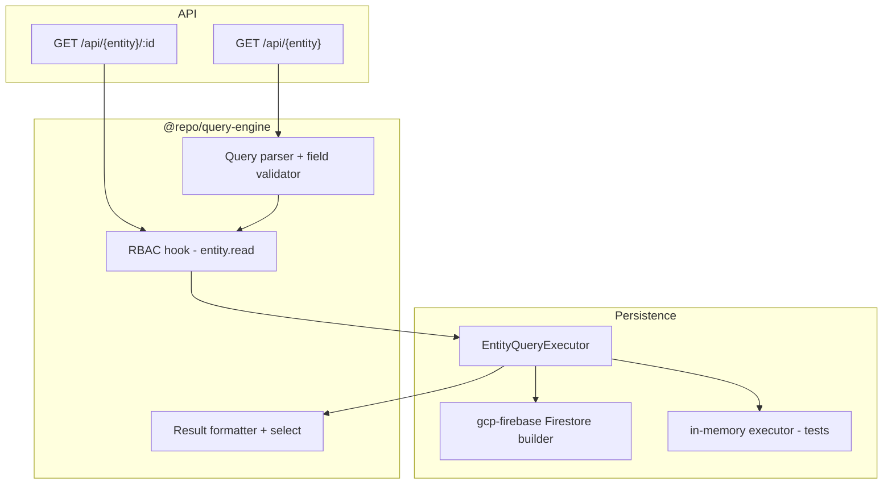

# Query Engine Guide

Phase 2 Key Capability **10.0** — centralized read path for CRUD list/get with schema-driven filter, sort, pagination, tenant isolation, and entity-level RBAC.

See also: [Entity System Guide](./entity-system-guide.md) · [Relational Data System Guide](./relational-data-system-guide.md) · [CRUD README](../apps/api/src/crud/README.md) · [Ecosystem plan](../Ecosystem%20Plan/v2/Key%20Capabilitues/10.0%20QUERY%20ENGINE.md)

---

## Overview

All CRUD **list** and **get** reads go through `@repo/query-engine`:

```ts
queryEngine.find(entityName, queryConfig, context);
queryEngine.findOne(entityName, id, context);
```

HTTP clients pass an optional `query` JSON string on `GET /api/{entity}`; legacy `?limit=` and `?cursor=` remain supported.

**Implemented in v1:**

- Filter, sort, pagination, and `select` projection
- Entity-level RBAC (`{entity}.read`)
- Tenant path isolation (client cannot filter on `tenantId`)
- Firestore-backed execution via `@repo/gcp-firebase`
- In-memory executor for tests

**Deferred:**

- `include` / relation expansion
- Row-level RBAC query injection (`ownerId` filters)
- OR conditions, aggregations, full-text search

**Web client (10.2):** `EntityTable` / `EntityCardView` build `QueryConfig` via `@repo/ui-builder` and pass it through `useEntity` → `api-client.listEntity(..., { query })`. See [Advanced UI Builder Guide](./advanced-ui-builder-guide.md).

---

## Architecture



| Package | Role |
| --- | --- |
| `@repo/query-engine` | Parse, validate, secure, and format queries (no Firestore) |
| `@repo/firestore-converters` | `NormalizedEntityQuery` + `EntityQueryExecutor` contract |
| `@repo/gcp-firebase` | Firestore query builder |
| `apps/api` | HTTP parsing, executor wiring, passes `request.ctx` |

---

## QueryConfig reference

```ts
type QueryConfig = {
  filter?: Filter[];
  sort?: Sort[];           // max 1 sort field in v1
  pagination?: { limit: number; cursor?: string };
  select?: string[];
};
```

### Filter operators by field type

| Field type | Allowed operators |
| --- | --- |
| `string` | `==`, `!=`, `in` |
| `number` | `==`, `!=`, `<`, `<=`, `>`, `>=`, `in` |
| `boolean` | `==` |
| `date` | `==`, `!=`, `<`, `<=`, `>`, `>=` |
| `relation` (FK) | `==`, `in` |

Queryable system fields: `id`, `createdAt`. `tenantId` and `updatedAt` are rejected on filter/sort/select.

### Firestore constraints (enforced at parse time)

- At most **one inequality** filter (`!=`, `<`, `<=`, `>`, `>=`) per query
- At most **one sort** field
- When an inequality is present, the primary sort field must match that field; `id` is appended as tiebreaker at execution time
- No OR conditions

Invalid queries return `400` with `QUERY_VALIDATION_ERROR` or `QUERY_UNSUPPORTED`.

---

## HTTP examples

### Legacy pagination (backward compatible)

```http
GET /api/loan?limit=20&cursor=loan_abc123
Authorization: Bearer …
x-firebase-appcheck: …
```

### Filter workItems by batch

```http
GET /api/workItem?query={"filter":[{"field":"batchId","operator":"==","value":"batch_123"}]}
```

### Sort by amount descending

```http
GET /api/loan?query={"sort":[{"field":"amount","direction":"desc"}]}
```

### Combined filter, sort, and pagination

```http
GET /api/workItem?limit=10&query={"filter":[{"field":"batchId","operator":"==","value":"batch_123"}],"sort":[{"field":"title","direction":"asc"}]}
```

Response envelope (unchanged):

```json
{
  "data": {
    "items": […],
    "nextCursor": "ord_xyz" | null
  },
  "error": null
}
```

---

## Security

1. **Route guards** — existing `authorize.list` / `authorize.get` check `{entity}.read` first.
2. **Query engine** — double-checks `{entity}.read` (or `isSuperAdmin`) before execution.
3. **Tenant isolation** — executors scope to `tenants/{tenantId}/{collection}`; client filters on `tenantId` are rejected.

Extension point: `RbacQueryInjector` for future row-level filters (Advanced RBAC 10.5).

---

## Firestore indexes

Composite indexes are required when a query combines **filters and sort** (Firestore rule). User isolation adds `accessUserIds` `array-contains` on every scoped list, and the default sort is `id`, so each **entity collection** needs an index like:

| Use case | Index fields |
| --- | --- |
| User-scoped list (default) | `accessUserIds CONTAINS`, `id ASC` |
| FK filter (e.g. workItem by batch) | `batchId ASC`, `id ASC` |
| Sort by numeric field | `amount ASC/DESC`, `id ASC/DESC` |
| Filter FK + sort another field | Match Firestore inequality rules — see parse-time validation |

**Do not** pre-populate [`firestore.indexes.json`](../firestore.indexes.json) with example collection names (`customers`, `widgets`, etc.). Entity collections are defined per tenant/module/dynamic model — add indexes **when you introduce an entity or query shape**, using:

1. The link in Firestore’s `FAILED_PRECONDITION` error when a query first runs in dev/staging
2. API `onIndexHint` logs from `createFirestoreEntityQueryExecutor`
3. A targeted entry in `firestore.indexes.json` for that collection, then `firebase deploy --only firestore:indexes`

The emulator is lenient; production Firestore is not. Deploy indexes before relying on filtered/sorted lists in a hosted environment.

---

## Wiring a new entity

**Dynamic (Model Builder):** No code wiring — indexes may be needed for FK filters. See [firestore.indexes.json](../firestore.indexes.json).

**Static module:**

1. Register entity in module + `app.config.ts`
2. Wire Firestore query executor in `apps/api/src/server.ts` (or rely on dynamic CRUD path for module entities registered at bootstrap)
3. Add composite indexes for expected filter/sort pairs

---

## Related docs

- [Relational Data System Guide](./relational-data-system-guide.md) — FK fields like `customerId` are filterable via the query engine
- [Firestore collections guide](./firestore-collections-guide.md) — tenant-scoped collection paths
