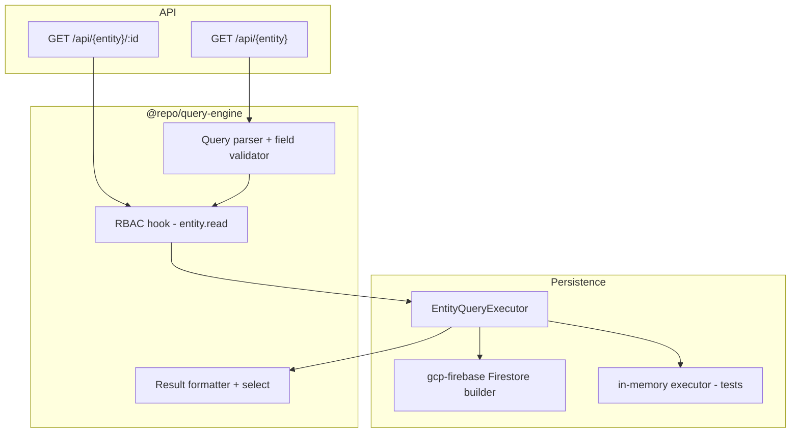

# Query Engine Guide

Phase 2 Key Capability **10.0** — centralized read path for CRUD list/get with schema-driven filter, sort, pagination, tenant isolation, and entity-level RBAC.

See also: [Entity System Guide](./entity-system-guide.md) · [Relational Data System Guide](./relational-data-system-guide.md) · [CRUD README](../apps/api/src/crud/README.md) · [Ecosystem plan](../Ecosystem%20Plan/v2/Key%20Capabilitues/10.0%20QUERY%20ENGINE.md)

---

## Overview

All CRUD **list** and **get** reads go through `@repo/query-engine`:

```ts
queryEngine.find(entityName, queryConfig, context);
queryEngine.findOne(entityName, id, context);
```

HTTP clients pass an optional `query` JSON string on `GET /api/{entity}`; legacy `?limit=` and `?cursor=` remain supported.

**Implemented in v1:**

- Filter, sort, pagination, and `select` projection
- Entity-level RBAC (`{entity}.read`)
- Tenant path isolation (client cannot filter on `tenantId`)
- Firestore-backed execution via `@repo/gcp-firebase`
- In-memory executor for tests

**Deferred:**

- `include` / relation expansion
- Row-level RBAC query injection (`ownerId` filters)
- OR conditions, aggregations, full-text search
- Web client filter/sort UI

---

## Architecture



| Package | Role |
| --- | --- |
| `@repo/query-engine` | Parse, validate, secure, and format queries (no Firestore) |
| `@repo/firestore-converters` | `NormalizedEntityQuery` + `EntityQueryExecutor` contract |
| `@repo/gcp-firebase` | Firestore query builder |
| `apps/api` | HTTP parsing, executor wiring, passes `request.ctx` |

---

## QueryConfig reference

```ts
type QueryConfig = {
  filter?: Filter[];
  sort?: Sort[];           // max 1 sort field in v1
  pagination?: { limit: number; cursor?: string };
  select?: string[];
};
```

### Filter operators by field type

| Field type | Allowed operators |
| --- | --- |
| `string` | `==`, `!=`, `in` |
| `number` | `==`, `!=`, `<`, `<=`, `>`, `>=`, `in` |
| `boolean` | `==` |
| `date` | `==`, `!=`, `<`, `<=`, `>`, `>=` |
| `relation` (FK) | `==`, `in` |

Queryable system fields: `id`, `createdAt`. `tenantId` and `updatedAt` are rejected on filter/sort/select.

### Firestore constraints (enforced at parse time)

- At most **one inequality** filter (`!=`, `<`, `<=`, `>`, `>=`) per query
- At most **one sort** field
- When an inequality is present, the primary sort field must match that field; `id` is appended as tiebreaker at execution time
- No OR conditions

Invalid queries return `400` with `QUERY_VALIDATION_ERROR` or `QUERY_UNSUPPORTED`.

---

## HTTP examples

### Legacy pagination (backward compatible)

```http
GET /api/order?limit=20&cursor=ord_abc123
Authorization: Bearer …
x-firebase-appcheck: …
```

### Filter orders by customer

```http
GET /api/order?query={"filter":[{"field":"customerId","operator":"==","value":"cust_123"}]}
```

### Sort by total descending

```http
GET /api/order?query={"sort":[{"field":"total","direction":"desc"}]}
```

### Combined filter, sort, and pagination

```http
GET /api/order?limit=10&query={"filter":[{"field":"customerId","operator":"==","value":"cust_123"}],"sort":[{"field":"total","direction":"desc"}]}
```

Response envelope (unchanged):

```json
{
  "data": {
    "items": […],
    "nextCursor": "ord_xyz" | null
  },
  "error": null
}
```

---

## Security

1. **Route guards** — existing `authorize.list` / `authorize.get` check `{entity}.read` first.
2. **Query engine** — double-checks `{entity}.read` (or `isSuperAdmin`) before execution.
3. **Tenant isolation** — executors scope to `tenants/{tenantId}/{collection}`; client filters on `tenantId` are rejected.

Extension point: `RbacQueryInjector` for future row-level filters (Advanced RBAC 10.5).

---

## Firestore indexes

Composite indexes are required for filter + sort combinations. See [`firestore.indexes.json`](../firestore.indexes.json):

| Use case | Index fields |
| --- | --- |
| Orders by customer | `customerId ASC`, `id ASC` |
| Orders by total | `total ASC/DESC`, `id ASC/DESC` |
| Filter customer + sort total | `customerId ASC`, `total ASC`, `id ASC` |

Deploy indexes before relying on filtered/sorted queries in production.

---

## Wiring a new entity

1. Register entity in `@repo/shared-types/register-entities.ts`
2. Create Firestore query executor in `apps/api/src/server.ts`:

```ts
const myQueryExecutor = createFirestoreEntityQueryExecutor({
  config: firebaseAdminConfig,
  collection: MY_COLLECTION,
  converter: myConverter,
});
```

3. Add to `createQueryRuntimeContext({ …, myEntity: myQueryExecutor })`
4. Pass shared `queryEngine` to `registerCrudRoutes`
5. Add composite indexes for expected filter/sort pairs

For tests, use `createInMemoryCrudRuntime()` or `createInMemoryEntityRuntime()` from `apps/api/src/test/in-memory-entity-runtime.ts` so repositories and query executors share the same store.

---

## Related docs

- [Relational Data System Guide](./relational-data-system-guide.md) — FK fields like `customerId` are filterable via the query engine
- [Firestore collections guide](./firestore-collections-guide.md) — tenant-scoped collection paths
