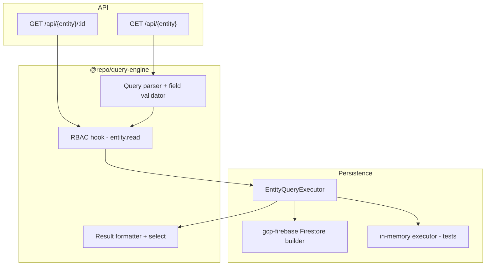

# Query Engine Guide

Phase 2 Key Capability **10.0** — centralized read path for CRUD list/get with schema-driven filter, sort, pagination, tenant isolation, and entity-level RBAC.

See also: [Entity System Guide](./entity-system-guide.md) · [Relational Data System Guide](./relational-data-system-guide.md) · [Entity query definition JSON](./entity-query-definition-json.md) · [CRUD README](../apps/api/src/crud/README.md) · [Ecosystem plan](../Ecosystem%20Plan/v2/Key%20Capabilitues/10.0%20QUERY%20ENGINE.md)

---

## Overview

All CRUD **list** and **get** reads go through `@repo/query-engine`:

```ts
queryEngine.find(entityName, queryConfig, context);
queryEngine.findOne(entityName, id, context);
```

HTTP clients pass an optional `query` JSON string on `GET /api/{entity}`; legacy `?limit=` and `?cursor=` remain supported.

**Implemented in v1:**

- Filter tree with AND/OR groups (nested), legacy flat `filter[]` arrays, sort, pagination, and `select` projection
- Post-filter operators (`contains`, `startsWith`, `endsWith`) on string fields
- Entity-level RBAC (`{entity}.read`)
- Tenant path isolation (client cannot filter on `tenantId`)
- Firestore-backed execution via `@repo/gcp-firebase` (`Filter.and` / `Filter.or` when expressible)
- In-memory / client fallback when OR shapes lack indexes or post-filters are present
- In-memory executor for tests

**Deferred:**

- `include` / relation expansion
- Row-level RBAC query injection (`ownerId` filters)
- Aggregations, full-text search

**Web client (10.2):** `EntityTable` / `EntityCardView` build `QueryConfig` via `@repo/ui-builder` and pass it through `useEntity` → `api-client.listEntity(..., { query })`. See [Advanced UI Builder Guide](./advanced-ui-builder-guide.md).

---

## Architecture



| Package | Role |
| --- | --- |
| `@repo/query-engine` | Parse, validate, secure, and format queries (no Firestore) |
| `@repo/firestore-converters` | `NormalizedEntityQuery` + `EntityQueryExecutor` contract |
| `@repo/gcp-firebase` | Firestore query builder |
| `apps/api` | HTTP parsing, executor wiring, passes `request.ctx` |

---

## QueryConfig reference

```ts
type FilterNode =
  | { type: "condition"; field: string; operator: FilterOperator; value: unknown }
  | { type: "group"; combinator: "and" | "or"; children: FilterNode[] };

type QueryConfig = {
  filter?: FilterNode | Filter[];  // legacy flat arrays normalized to AND group
  sort?: Sort[];           // max 1 sort field in v1
  pagination?: { limit: number; cursor?: string };
  select?: string[];
};
```

### Filter tree

HTTP `query` JSON accepts either a **filter tree** root group or a legacy flat `filter` array (implicit AND). Example:

```json
{
  "filter": {
    "type": "group",
    "combinator": "and",
    "children": [
      { "type": "condition", "field": "status", "operator": "==", "value": "ACTIVE" },
      {
        "type": "group",
        "combinator": "or",
        "children": [
          { "type": "condition", "field": "amount", "operator": ">", "value": 100 },
          { "type": "condition", "field": "amount", "operator": "==", "value": 0 }
        ]
      }
    ]
  }
}
```

### Filter operators by field type

| Field type | Allowed operators |
| --- | --- |
| `string` | `==`, `!=`, `in` |
| `number` | `==`, `!=`, `<`, `<=`, `>`, `>=`, `in` |
| `boolean` | `==` |
| `date` | `==`, `!=`, `<`, `<=`, `>`, `>=` |
| `relation` (FK) | `==`, `in` |

Queryable system fields: `id`, `createdAt`. `tenantId` and `updatedAt` are rejected on filter/sort/select.

### Firestore constraints (enforced at parse / execution time)

- At most **one inequality** field (`!=`, `<`, `<=`, `>`, `>=`) per AND branch (each OR disjunction evaluated separately at execution)
- At most **one sort** field
- **Period equality rewrite:** a calendar-aligned `date` range (`>=` month/year start and `<=` matching end) is rewritten to companion equality (`month == "YYYY-MM"` or `year == "YYYY"`) when the entity defines a string `month` / `year` field. That removes the inequality so any sort field can use the native Firestore path.
- When an inequality remains and the primary sort field matches it, execution is native; `id` is appended as tiebreaker
- When an inequality remains and the primary sort field **differs**, execution uses **range re-sort**: scan by the inequality field (up to `CLIENT_QUERY_FALLBACK_MAX_DOCS`), sort in memory by the requested field, then paginate. Matching more documents than the cap returns `400` with `QUERY_TOO_BROAD`
- OR groups use Firestore `Filter.or` when the query is index-compatible; otherwise the executor falls back to client-side filtering with `evaluateFilterTree`
- Max **30** OR disjunctions (Firestore limit)
- Max filter tree depth **10**

Invalid queries return `400` with `QUERY_VALIDATION_ERROR`, `QUERY_UNSUPPORTED`, or `QUERY_TOO_BROAD`.

---

## HTTP examples

### Legacy pagination (backward compatible)

```http
GET /api/loan?limit=20&cursor=loan_abc123
Authorization: Bearer …
x-firebase-appcheck: …
```

### Filter workItems by batch

```http
GET /api/workItem?query={"filter":[{"field":"batchId","operator":"==","value":"batch_123"}]}
```

### Sort by amount descending

```http
GET /api/loan?query={"sort":[{"field":"amount","direction":"desc"}]}
```

### Combined filter, sort, and pagination

```http
GET /api/workItem?limit=10&query={"filter":[{"field":"batchId","operator":"==","value":"batch_123"}],"sort":[{"field":"title","direction":"asc"}]}
```

Response envelope (unchanged):

```json
{
  "data": {
    "items": […],
    "nextCursor": "ord_xyz" | null
  },
  "error": null
}
```

---

## Security

1. **Route guards** — existing `authorize.list` / `authorize.get` check `{entity}.read` first.
2. **Query engine** — double-checks `{entity}.read` (or `isSuperAdmin`) before execution.
3. **Tenant isolation** — executors scope to `tenants/{tenantId}/{collection}`; client filters on `tenantId` are rejected.

Extension point: `RbacQueryInjector` for future row-level filters (Advanced RBAC 10.5).

---

## Firestore indexes

Composite indexes are required for filter + sort combinations. See [`firestore.indexes.json`](../firestore.indexes.json):

| Use case | Index fields |
| --- | --- |
| FK filter (e.g. workItem by batch) | `batchId ASC`, `id ASC` |
| Sort by numeric field | `amount ASC/DESC`, `id ASC/DESC` |
| Filter FK + sort another field | Match Firestore inequality rules — see parse-time validation |
| OR filter groups | No automatic index generation in v1 — queries may use client fallback; equality fields in OR branches are logged as index hints |

Deploy indexes before relying on filtered/sorted queries in production.

---

## Wiring a new entity

**Dynamic (Model Builder):** No code wiring — indexes may be needed for FK filters. See [firestore.indexes.json](../firestore.indexes.json).

**Static module:**

1. Register entity in module + `app.config.ts`
2. Wire Firestore query executor in `apps/api/src/server.ts` (or rely on dynamic CRUD path for module entities registered at bootstrap)
3. Add composite indexes for expected filter/sort pairs

---

## Related docs

- [Relational Data System Guide](./relational-data-system-guide.md) — FK fields like `customerId` are filterable via the query engine
- [Firestore collections guide](./firestore-collections-guide.md) — tenant-scoped collection paths
