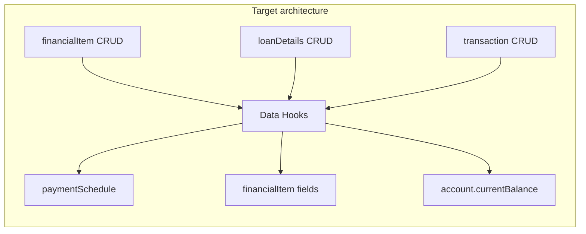
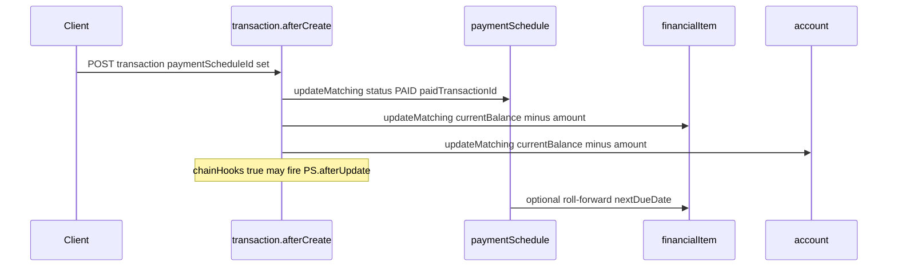

# Rates Tenant — Data Hooks Gap Analysis

Shareable brief for the **data hooks platform team** and Rates implementers. Maps personal-finance business rules ([rates-data-model.md](./rates-data-model.md)) to current Data Hook capabilities ([data-hook-definition-json.md](./data-hook-definition-json.md)) before authoring the Rates hook catalog.

**Machine-readable catalog (Phase 2):** [`rates-data-hooks.json`](../apps/api/src/admin/rates-tenant/catalogs/rates-data-hooks.json) — imported via `pnpm seed:database`.

---

## Table of contents

1. [Purpose and audience](#1-purpose-and-audience)
2. [Current state](#2-current-state)
3. [Automation inventory](#3-automation-inventory)
4. [Rates schema gaps](#4-rates-schema-gaps)
5. [Platform capability gaps](#5-platform-capability-gaps)
6. [Recommended delivery phases](#6-recommended-delivery-phases)
7. [Appendix — chaining and hook order](#7-appendix--chaining-and-hook-order)

---

## 1. Purpose and audience

| Audience | Use this document to |
|----------|----------------------|
| **Data hooks team** | Prioritize platform extensions (compound filters, delete actions, aggregates, financial functions) |
| **Rates / domain team** | Know which rules ship in JSON now vs. need system hooks or schema changes |
| **QA** | Validate enabled hooks against the feasibility column |

This bridges [rates-data-model.md §12 Phase B](./rates-data-model.md#phase-b--schedules--transactions) (schedules + transactions) and the hook specification cookbook.

---

## 2. Current state

| Asset | Status |
|-------|--------|
| Entity / metric / query / custom-view catalogs | Seeded — 11 entities, 35 queries, 21 custom views |
| [`rates-data-hooks.json`](../apps/api/src/admin/rates-tenant/catalogs/rates-data-hooks.json) | **Replaced** — legacy `loan` placeholders removed; Ready-tier Rates hooks added |
| [`seed-demo-data.ts`](../apps/api/src/admin/rates-tenant/records/seed-demo-data.ts) | Still **manually** creates `paymentSchedule` rows for deterministic demo data until hook-generated schedules are verified in e2e |
| Seed pipeline | [`seed-rates-catalogs.ts`](../apps/api/src/admin/rates-tenant/seed-rates-catalogs.ts) imports hooks after custom views |

---

## 3. Automation inventory

Feasibility tags:

| Tag | Meaning |
|-----|---------|
| **Ready** | Implementable with current actions and expressions |
| **Partial** | Workaround possible but fragile, incomplete, or very verbose |
| **Blocked** | Requires platform extension, schema change, or system hook |

### 3.1 `financialItem` — commitment lifecycle

| ID | Rule | Trigger | Desired outcome | Feasibility | Gap ref |
|----|------|---------|-----------------|-------------|---------|
| FI-01 | Default `status = ACTIVE` | `beforeCreate` | Set field when empty | **Ready** | — |
| FI-02 | Derive `balanceSheetRole` from `itemType` | `beforeCreate` / `beforeUpdate` (`itemType`) | ASSET / LIABILITY / NONE per [§5 lookup](./rates-data-model.md#balance-sheet-role-lookup) | **Partial** | Nested `if`/`==` chain (~20 `itemType` values); consider system hook or lookup action |
| FI-03 | Generate initial schedule row | `afterCreate` | One `paymentSchedule` from `nextDueDate`, `amount`, `status=UPCOMING` | **Ready** | MVP: single row via `createRecord` |
| FI-04 | Generate rolling horizon (N months) | `afterCreate` / `afterUpdate` | Multiple rows from `frequency` | **Partial** | [PLAT-06](#plat-06-frequency--date-step-mapping), [PLAT-07](#plat-07-createrecords-limit) |
| FI-05 | Regenerate on schedule-affecting update | `afterUpdate` (`frequency`, `nextDueDate`, `amount`) | Cancel future rows, recreate | **Blocked** | [PLAT-01](#plat-01-compound-updatematching-where), [PLAT-02](#plat-02-delete-actions) |
| FI-06 | Pause / close item | `afterUpdate` (`status` → `PAUSED` / `CLOSED`) | Cancel or skip future `paymentSchedule` rows | **Blocked** | [PLAT-01](#plat-01-compound-updatematching-where) |
| FI-07 | ONE_TIME completion | After payment fulfilled | `status → COMPLETED` | **Partial** | Chain: transaction → schedule PAID → item update; needs frequency check |

### 3.2 `loanDetails` — amortization plan

| ID | Rule | Trigger | Desired outcome | Feasibility | Gap ref |
|----|------|---------|-----------------|-------------|---------|
| LD-01 | Generate full payment plan on create | `afterCreate` | Loop `periods` × `paymentSchedule` with due dates, principal/interest | **Blocked** | [SCHEMA-01](#schema-01-loandetails-term-fields), [PLAT-05](#plat-05-amortization-functions) |
| LD-02 | Regenerate on sensitive field change | `afterUpdate` (`interestRate`, `paymentAmount`, `amortizationType`, …) | Inactivate current plan, recreate | **Blocked** | [PLAT-01](#plat-01-compound-updatematching-where), [PLAT-02](#plat-02-delete-actions), [SCHEMA-02](#schema-02-paymentschedule-plan-version) |

**User-cited example:** *“When creating loan details, hook a loop to create the full plan depending on frequency, periods, rate, startDate.”* → **LD-01** — **Blocked** until schema + amortization support.

**User-cited example:** *“When updating loan details, identify sensitive data changes to inactivate current plan and recreate.”* → **LD-02** — **Blocked**.

### 3.3 `transaction` — payment fulfillment

| ID | Rule | Trigger | Desired outcome | Feasibility | Gap ref |
|----|------|---------|-----------------|-------------|---------|
| TX-01 | Mark linked schedule PAID | `afterCreate` when `paymentScheduleId` set | `paymentSchedule.status=PAID`, `paidTransactionId=id` | **Ready** | — |
| TX-02 | Advance parent `nextDueDate` | `afterCreate` (linked payment) | Set `financialItem.nextDueDate` to next due | **Partial** | [PLAT-04](#plat-04-aggregate--list-expressions) — no “min dueDate among UPCOMING” |
| TX-03 | Update commitment balance | `afterCreate`, `type=PAYMENT` | Decrease liability `currentBalance` by amount | **Partial** | Sign rules per `balanceSheetRole`; null `currentBalance` coalesce |
| TX-04 | Update account liquidity | `afterCreate` | Adjust `account.currentBalance` by type (+ income, − expense/payment) | **Partial** | Separate hooks per `type`; TRANSFER needs two accounts |
| TX-05 | Auto-create transaction when schedule marked PAID | `paymentSchedule.afterUpdate` on `status` | `createRecord` transaction | **Ready** | Use `chainHooks: true` on schedule hook |

**User-cited examples:**

- *“When adding payments, hook the commitment status update.”* → **TX-01** + **FI-07** (Partial).
- *“When adding payments, hook the next commitment status update to pending.”* → Interpreted as advancing schedule / next UPCOMING row → **TX-02** + roll-forward hook **PS-01** (Partial).
- *“When adding payment, update contract balance.”* → **TX-03** on `financialItem.currentBalance` (Partial — implemented for PAYMENT type in catalog).

### 3.4 `paymentSchedule` — calendar maintenance

| ID | Rule | Trigger | Desired outcome | Feasibility | Gap ref |
|----|------|---------|-----------------|-------------|---------|
| PS-01 | Roll forward after PAID | `afterUpdate` (`status` → `PAID`) | Create next UPCOMING row from `frequency` | **Partial** | [PLAT-06](#plat-06-frequency--date-step-mapping); need parent fields via `financialItemId` lookup |
| PS-02 | Overdue marking | Time-based | `UPCOMING → OVERDUE` when `dueDate < today` | **Blocked** | [PLAT-09](#plat-09-scheduled--time-triggers) |

### 3.5 `balanceSnapshot` — net worth history

| ID | Rule | Trigger | Desired outcome | Feasibility | Gap ref |
|----|------|---------|-----------------|-------------|---------|
| BS-01 | Mirror balance on snapshot create | `afterCreate` | Copy `balance` → `financialItem.currentBalance` | **Ready** | — |
| BS-02 | Auto-snapshot on balance-changing payment | Chained from transaction | `createRecord` balanceSnapshot | **Ready** | Optional; not in MVP catalog |

### 3.6 Other entities

| ID | Rule | Feasibility | Gap ref |
|----|------|-------------|---------|
| EX-01 | `incomeDetails` / `serviceDetails`: derive `payDay` / `billingDay` from parent `nextDueDate` | **Ready** | — |
| EX-02 | `financialItem.afterDelete` cascade cleanup | **Blocked** | [PLAT-02](#plat-02-delete-actions) |
| EX-03 | Due-date alerts / reminders | **Blocked** | [PLAT-09](#plat-09-scheduled--time-triggers), notifications log-only |

---

## 4. Rates schema gaps

These are **entity catalog** gaps — not hook-engine gaps — but they block clean automation.

### SCHEMA-01: `loanDetails` term fields

[`loanDetails`](../apps/api/src/admin/rates-tenant/catalogs/rates-entity-definitions.json) has rate and payment breakdown fields only. Missing for plan generation:

| Proposed field | Type | Purpose |
|----------------|------|---------|
| `termMonths` or `periods` | integer | Loop count for `createRecords` |
| `planVersion` | integer | Tie schedules to a plan generation pass |

Term can be **derived** from parent [`financialItem`](apps/api/src/admin/rates-tenant/catalogs/rates-entity-definitions.json) (`startDate`, `endDate`, `frequency`) but hooks cannot read parent fields without [PLAT-03](#plat-03-getrecord--loadrelated).

### SCHEMA-02: `paymentSchedule` plan version

Missing:

| Proposed field | Type | Purpose |
|----------------|------|---------|
| `sequence` | integer | Order within plan (cookbook uses this; Rates entity does not) |
| `planVersion` | integer | Distinguish regenerated plans |
| `status=CANCELLED` | enum value | Soft-delete superseded rows without [PLAT-02](#plat-02-delete-actions) |

### SCHEMA-03: `financialItem` schedule horizon

| Proposed field | Type | Purpose |
|----------------|------|---------|
| `scheduleHorizonMonths` | integer (default 12) | Rolling generation window instead of full loan term |

### SCHEMA-04: Balance sign conventions

Document explicitly in rates-data-model:

| `balanceSheetRole` | Payment effect on `currentBalance` |
|--------------------|-------------------------------------|
| `LIABILITY` | Subtract payment amount (debt goes down) |
| `ASSET` | Add contribution; subtract withdrawal |
| `NONE` | Usually no `currentBalance`; cashflow-only items |

---

## 5. Platform capability gaps

Priority-ordered asks for the hooks team. Source: [`interpret-data-hook.ts`](../packages/hooks/src/interpret-data-hook.ts), [`data-hook-definition-json.md` §13](./data-hook-definition-json.md#13-not-yet-supported).

### PLAT-01: Compound `updateMatching.where`

**Today:** Single-field equality lookup only (`findByField` + operator re-check).

**Impact:** Cannot target `financialItemId = X AND status = UPCOMING`. Updating all rows for an item would overwrite **PAID** history.

**Suggested:** AND/OR condition tree on `where`, or per-match condition before apply.

### PLAT-02: Delete actions

**Today:** No `deleteRecord` / `deleteMatching`.

**Impact:** Loan replan cannot remove superseded schedule rows.

**Suggested:** Delete action with same lookup shape as `updateMatching`, or mandate soft-delete enum + compound where.

### PLAT-03: `getRecord` / `loadRelated`

**Today:** Expression scope is `current`, `previous`, `now`, `userId`, `loopIndex` only.

**Impact:** `loanDetails` hook cannot read parent `financialItem.frequency` without side-effect `updateMatching` hack.

**Suggested:** `getRecord` action binding result to a named var, or `{ kind: "field", source: "related", entity, path }`.

### PLAT-04: Aggregate / list expressions

**Today:** No `sum`, `count`, `min`, `max` over related records (spec §13).

**Impact:** Cannot pick next UPCOMING schedule by min `dueDate`; cannot recompute balance from transaction sum.

**Suggested:** `aggregateRelated` action or list functions with strict limits.

### PLAT-05: Amortization functions

**Today:** 27 expression functions — arithmetic and dates only.

**Impact:** Cannot compute `principalPortion` / `interestPortion` per period for `FRENCH` / `GERMAN` / etc.

**Suggested:** System module hook, or `call` functions: `pmt`, `ipmt`, `ppmt`, `balanceAfterPayment`.

### PLAT-06: Frequency → date step mapping

**Today:** Each schedule hook must nest `if` on `frequency` to pick `dateAdd` unit (`MONTH` vs `WEEK` vs …).

**Suggested:** `dateAddByFrequency(date, n, frequencyEnum)` expression function.

### PLAT-07: `createRecords` limit

**Today:** Max 1,000 iterations.

**Impact:** Acceptable for monthly mortgages (~360); not for daily-accrual over 30 years.

**Suggested:** Document limit; use rolling horizon ([SCHEMA-03](#schema-03-financialitem-schedule-horizon)).

### PLAT-08: Hook entity `list` query

**Today:** [`HookEntityListQuery`](../packages/hooks/src/types.ts) — single field + string value.

**Impact:** Same limitation as PLAT-01 for any future “find then act” patterns.

### PLAT-09: Scheduled / time triggers

**Today:** CRUD lifecycle only.

**Impact:** Overdue status (`PS-02`), reminders ([EX-03](./rates-data-model.md#11-future-extensions)).

**Suggested:** Cloud Scheduler firing synthetic updates, or system events (`schedule.tick`).

### PLAT-10: Expression authoring UX

Complex Rates rules require Advanced JSON for nested `if` / `binary` nodes. Acceptable for seed catalog; templates should be documented in cookbook.

### PLAT-11: Firestore document depth limit

Deeply nested expression ASTs (e.g. chained `if` for 20-way `itemType` lookup) exceed Firestore’s ~20-level document limit when hooks are persisted. **Workaround:** split into multiple hooks with OR condition groups on `itemType` (see Rates catalog). **Suggested:** lookup-table action or flat `switch` expression node.

---

## 6. Recommended delivery phases

### Phase A — Ship now (JSON catalog, `enabled: true`)

Implemented in [`rates-data-hooks.json`](../apps/api/src/admin/rates-tenant/catalogs/rates-data-hooks.json):

| Hook | Entity | Covers |
|------|--------|--------|
| Default active status | `financialItem` | FI-01 |
| Derive balance sheet role | `financialItem` | FI-02 (OR condition hooks, not nested if) |
| Create initial schedule row | `financialItem` | FI-03 |
| Mark schedule PAID | `transaction` | TX-01 |
| Update item balance on payment | `transaction` | TX-03 |
| Update account on income | `transaction` | TX-04 (INCOME) |
| Update account on expense/payment | `transaction` | TX-04 (EXPENSE, PAYMENT) |
| Sync item balance from snapshot | `balanceSnapshot` | BS-01 |

### Phase B — Partial workarounds (enable after review)

| Hook | Blocker |
|------|---------|
| Roll forward next schedule (PS-01) | Frequency date math + parent field read |
| Advance `nextDueDate` (TX-02) | Aggregate min dueDate |
| ONE_TIME → COMPLETED (FI-07) | Condition on parent `frequency` |

### Phase C — Platform / schema dependent (`enabled: false` stubs in catalog)

| Hook | IDs | Needs |
|------|-----|-------|
| Regenerate schedules on item update | FI-05, FI-06 | PLAT-01, PLAT-02, SCHEMA-02 |
| Full loan amortization plan | LD-01, LD-02 | SCHEMA-01, PLAT-05, PLAT-01 |
| Overdue cron | PS-02 | PLAT-09 |
| Cascade delete | EX-02 | PLAT-02 |

### Phase D — System hooks (alternative to JSON)

Consider code-based hooks in `rates-tenant` module for:

- Full `balanceSheetRole` lookup table maintenance
- Amortization engine (LD-01, LD-02)
- Nightly overdue sweep (PS-02)

---

## 7. Appendix — chaining and hook order

### Recommended `chainHooks` usage

| Source hook | `chainHooks` | Downstream |
|-------------|--------------|------------|
| `transaction.afterCreate` (mark PAID) | `true` | Optional `paymentSchedule.afterUpdate` roll-forward |
| `financialItem.afterCreate` (schedule) | `false` | Avoid duplicate schedule hooks on chained creates |
| `paymentSchedule.afterUpdate` (create txn) | `true` | `transaction` balance hooks |

### Execution sequence (payment with linked schedule)

### Hook order within same entity event

Lower `order` runs first. Current catalog ordering:

1. `financialItem` `beforeCreate`: status (0) → balanceSheetRole (1)
2. `transaction` `afterCreate`: mark schedule PAID (0) → item balance (1) → account balance (2, type-specific hooks)

### Sign conventions for TX-03 / TX-04

| Transaction `type` | `account.currentBalance` | `financialItem.currentBalance` |
|--------------------|--------------------------|--------------------------------|
| `INCOME` | `+ amount` | N/A (usually unlinked) |
| `EXPENSE`, `PAYMENT` | `− amount` | `− amount` (liability) |
| `TRANSFER` | `− amount` on source account only in MVP | N/A |

TRANSFER destination account update requires a second hook or PLAT-03 to read a “to account” field (not on current `transaction` schema).

---

## Related documentation

- [rates-data-model.md](./rates-data-model.md) — domain model and Phase B/C implementation notes
- [data-hook-definition-json.md](./data-hook-definition-json.md) — hook JSON specification
- [data-hooks.md](./data-hooks.md) — product overview
- [hooks-system-guide.md](./hooks-system-guide.md) — dispatch architecture
