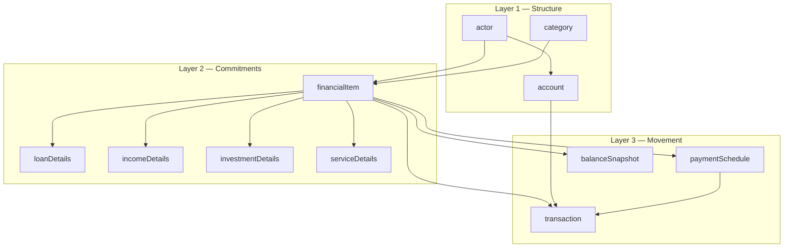
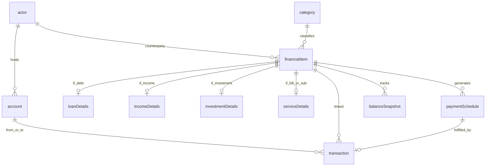
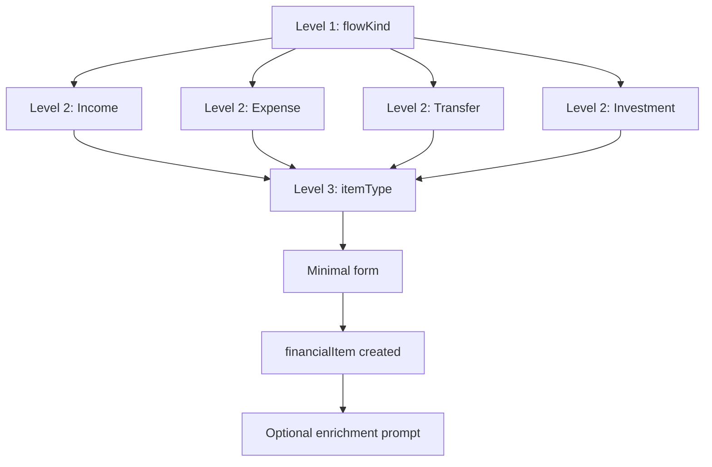
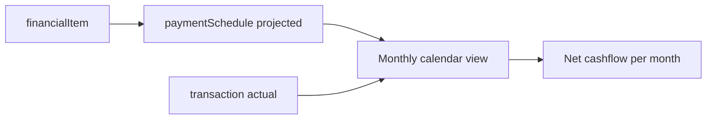

# Rates Tenant Data Model

Domain model specification for the **`rates` dev tenant** on the ESP platform. This document is the source of truth for the tenant seed and Model Builder catalogs.

**Machine-readable catalogs** (applied via **`pnpm seed:database`**):

- [`apps/api/src/admin/rates-tenant/catalogs/rates-entity-definitions.json`](../apps/api/src/admin/rates-tenant/catalogs/rates-entity-definitions.json) — 11 entities
- [`apps/api/src/admin/rates-tenant/catalogs/rates-metric-definitions.json`](../apps/api/src/admin/rates-tenant/catalogs/rates-metric-definitions.json) — 20 metrics
- [`apps/api/src/admin/rates-tenant/catalogs/rates-query-definitions.json`](../apps/api/src/admin/rates-tenant/catalogs/rates-query-definitions.json) — 35 saved queries
- [`apps/api/src/admin/rates-tenant/catalogs/rates-custom-views.json`](../apps/api/src/admin/rates-tenant/catalogs/rates-custom-views.json) — 21 sidebar custom views

For JSON envelope format, see [entity-definition-json.md](./entity-definition-json.md), [entity-query-definition-json.md](./entity-query-definition-json.md), and [custom-view-definition-json.md](./custom-view-definition-json.md).

**Platform stack:** Firestore + dynamic entities (`@repo/dynamic-entities`) + UI Builder wizard + metrics engine (`@repo/metrics-engine`).

---

## Table of contents

1. [Purpose and scope](#1-purpose-and-scope)
2. [Design principles](#2-design-principles)
3. [Conceptual model](#3-conceptual-model)
4. [Entity reference](#4-entity-reference)
5. [Derived classifications](#5-derived-classifications)
6. [Progressive wizard](#6-progressive-wizard)
7. [Enrichment flows](#7-enrichment-flows)
8. [Cashflow, net worth, and profitability](#8-cashflow-net-worth-and-profitability)
9. [Migration appendix](#9-migration-appendix)
10. [Metrics and dashboard blueprint](#10-metrics-and-dashboard-blueprint)
11. [Future extensions](#11-future-extensions)
12. [Implementation phases](#12-implementation-phases)

---

## 1. Purpose and scope

### Origin

The model supports **monthly payment control** — one row per financial commitment with due dates, balances, and payment amounts — extended into a full cashflow, balance sheet, and profitability platform.

| Concept | Meaning |
|---|---|
| Next due date | Next payment or receipt date |
| Frequency | Recurrence (Monthly, One-time, etc.) |
| Name | Item name |
| Current balance | Current balance / accumulated value |
| Payment amount | Installment or payment amount |

### Target capabilities

| Capability | User-facing outcome |
|---|---|
| **Cashflow** | Calendar of projected and actual money in/out |
| **Balance sheet** | Assets / Liabilities / Net worth — auto-classified, never asked in forms |
| **Profitability** | Investment returns and personal net result over time |
| **Progressive UX** | Create in 3–4 taps; enrich loan terms, snapshots, and files later |

### What this is not

- Not a normalized reference-data encyclopedia. Enums replace lookup tables wherever possible.
- Not a mandatory full-detail form on first save. Details are optional enrichment.

---

## 2. Design principles

| Principle | Application |
|---|---|
| **Minimal first, rich later** | Create with name + amount + date; loan terms and snapshots come in step two |
| **Deduce, don't ask** | A mortgage is a liability; a savings plan is an asset — no balance-sheet jargon in forms |
| **One counterparty entity** | `actor` holds banks, people, employers, utilities — differentiated by enum |
| **Enums over reference tables** | Currency, frequency, status as enums — not 15 lookup entities |
| **1:1 child extensions** | Optional detail records linked to `financialItem`, not bloated parent forms |
| **Generic core, typed extensions** | `financialItem` is the universal row; `loanDetails`, `incomeDetails`, etc. add specificity |

---

## 3. Conceptual model

### Three layers



### Entity relationship diagram



### Sidebar navigation

| Group | Entities | Icon |
|---|---|---|
| **My Money** | `account`, `actor` | Wallet |
| **Commitments** | `financialItem` | FileText |
| **Details** | `loanDetails`, `incomeDetails`, `investmentDetails`, `serviceDetails` | Puzzle |
| **Movements** | `transaction`, `paymentSchedule`, `balanceSnapshot` | ArrowLeftRight |
| **Classification** | `category` | FolderTree |

Technical collection names and UI labels both use English (platform convention).

---

## 4. Entity reference

### 4.1 `actor` — unified counterparty

Replaces separate Bank / Provider / Person entities. Any party you pay, receive from, or hold money with.

| Field | Type | Required on create | Notes |
|---|---|---|---|
| `name` | string | Yes | "Metro Bank", "Example Employer", "Rental Property A" |
| `type` | enum | Yes (default inferred from wizard) | See enum below |
| `logo` | image | No | Optional enrichment |
| `website` | string | No | |

**`type` enum:** `BANK`, `PERSON`, `EMPLOYER`, `UTILITY`, `GOVERNMENT`, `FIDUCIARY`, `PROPERTY`, `OTHER`

| Type | Examples |
|---|---|
| `BANK` | Metro Bank, North Credit Union |
| `PERSON` | Example Person (personal loans) |
| `EMPLOYER` | Example Employer (salary) |
| `FIDUCIARY` | Demo Fiduciary |
| `GOVERNMENT` | Tax or social security agency |
| `PROPERTY` | Rental Property A, Rental Property B |
| `UTILITY` | City Power, internet provider |

---

### 4.2 `account` — where money lives

| Field | Type | Required on create | Notes |
|---|---|---|---|
| `name` | string | Yes | "Main account", "Nequi" |
| `accountType` | enum | Yes | See enum below |
| `actorId` | relation → `actor` | No | Institution that holds the account |
| `currency` | enum | Yes (default `COP`) | `COP`, `USD` — extensible |
| `currentBalance` | decimal | No | Updated by transactions or manual edit |

**`accountType` enum:** `BANK`, `CASH`, `SAVINGS`, `INVESTMENT`, `CREDIT`, `DIGITAL_WALLET`

---

### 4.3 `category` — user-facing grouping

| Field | Type | Required | Notes |
|---|---|---|---|
| `name` | string | Yes | "Housing", "Debts", "Salary" |
| `kind` | enum | Auto from wizard | `INCOME`, `EXPENSE`, `TRANSFER`, `INVESTMENT` |
| `parentId` | relation → `category` | No | Optional hierarchy |

Categories are **suggested** by wizard Level 2. User can rename or reorganize later.

**Default category seeds (suggested):**

| kind | Default categories |
|---|---|
| INCOME | Salary, Rentals, Business, Yields, Other income |
| EXPENSE | Housing, Debts, Services, Subscriptions, Personal expenses, Other expense |
| TRANSFER | Between accounts, To savings, To investment |
| INVESTMENT | Scheduled savings, Yield savings, Fiduciary fund, Other |

---

### 4.4 `financialItem` — main generic entity

The sheet row, generalized. Every commitment, income source, transfer rule, or investment lives here.

#### Required on create (wizard)

| Field | Type | Source |
|---|---|---|
| `name` | string | User input |
| `flowKind` | enum | Wizard Level 1 |
| `itemType` | enum | Wizard Level 3 |
| `amount` | decimal | Payment amount / expected amount / transfer amount |
| `currency` | enum | Default tenant currency (`COP`) |
| `isRecurring` | boolean | From frequency choice |
| `frequency` | enum | `MONTHLY`, `ONE_TIME`, etc. |
| `nextDueDate` | date | Next due date — if recurring or one-time future |
| `categoryId` | relation → `category` | Auto-assigned from wizard Level 2 |
| `actorId` | relation → `actor` | Optional quick-pick counterparty |
| `accountId` | relation → `account` | Required for transfers; optional otherwise |

#### Optional on create (shown only when relevant)

| Field | Type | When shown |
|---|---|---|
| `currentBalance` | decimal | Debts, cards, savings, investments |

#### Auto-derived (never asked)

| Field | Rule |
|---|---|
| `balanceSheetRole` | `ASSET` / `LIABILITY` / `NONE` from `itemType` — see [§5](#5-derived-classifications) |
| `status` | Default `ACTIVE` |

#### Enrichment fields (second step, detail page)

| Field | Type | Notes |
|---|---|---|
| `startDate` | date | When the commitment began |
| `endDate` | date | Expected end (loans, leases) |
| `description` | string | Free text |
| `tags` | string[] | Optional labels |

#### `flowKind` enum (Wizard Level 1)

| Value | Display label | Meaning |
|---|---|---|
| `INCOME` | Money I receive | Money coming in |
| `EXPENSE` | Money I pay | Money going out |
| `TRANSFER` | Move between my accounts | Internal movement |
| `ASSET_GROWTH` | Savings or investment | Net worth growth |

#### `itemType` enum (Wizard Level 3)

**INCOME (`flowKind = INCOME`):**

| Value | Display label |
|---|---|
| `SALARY` | Salary |
| `RENTAL_INCOME` | Rentals |
| `BUSINESS_INCOME` | Business / Freelance |
| `YIELD_INCOME` | Yields / Interest |
| `OTHER_INCOME` | Other income |

**EXPENSE (`flowKind = EXPENSE`):**

| Value | Display label |
|---|---|
| `MORTGAGE` | Mortgage |
| `LOAN` | Loan |
| `CREDIT_CARD` | Credit card |
| `REVOLVING_CREDIT` | Revolving credit |
| `PERSONAL_DEBT` | Personal debt |
| `UTILITY` | Utilities (power, water, internet, mobile) |
| `HOUSING_FEE` | HOA / rent I pay |
| `SUBSCRIPTION` | Subscriptions |
| `INSURANCE` | Insurance |
| `SOCIAL_SECURITY` | Social security |
| `OTHER_EXPENSE` | Other expense |

**TRANSFER (`flowKind = TRANSFER`):**

| Value | Display label |
|---|---|
| `ACCOUNT_TRANSFER` | Transfer between accounts |
| `TO_SAVINGS` | Move to savings |
| `TO_INVESTMENT` | Invest money |

**ASSET_GROWTH (`flowKind = ASSET_GROWTH`):**

| Value | Display label |
|---|---|
| `SCHEDULED_SAVINGS` | Scheduled savings |
| `YIELD_SAVINGS` | Savings with yield |
| `FIDUCIARY` | Fiduciary fund |
| `INVESTMENT_FUND` | Investment with yield |
| `OTHER_INVESTMENT` | Other |

#### `frequency` enum

| Value | Sheet equivalent |
|---|---|
| `MONTHLY` | Monthly |
| `ONE_TIME` | One-time |
| `WEEKLY` | — |
| `BIWEEKLY` | — |
| `QUARTERLY` | — |
| `ANNUAL` | — |
| `IRREGULAR` | — |

#### `status` enum

`ACTIVE`, `PAUSED`, `COMPLETED`, `DEFAULTED`, `CLOSED`

---

### 4.5 Extension entities (1:1, optional)

Each extension links to exactly one `financialItem` via `financialItemId` (required). Created after the parent item exists — never blocking initial save.

#### `loanDetails`

**When:** `itemType` ∈ { `MORTGAGE`, `LOAN`, `CREDIT_CARD`, `REVOLVING_CREDIT`, `PERSONAL_DEBT` }

| Field | Type | Required | Sheet column |
|---|---|---|---|
| `financialItemId` | relation | Yes | — |
| `interestRate` | decimal (%) | No | Interest Rate |
| `paymentAmount` | decimal | No | Payment Amount |
| `principalPortion` | decimal | No | Principal |
| `interestPortion` | decimal | No | Interest |
| `rateType` | enum | No | `FIXED`, `VARIABLE`, `MIXED` |
| `amortizationType` | enum | No | `FRENCH`, `GERMAN`, `AMERICAN`, `BULLET`, `NONE` |

**Note on negative principal:** Credit cards where payment is less than accrued interest can produce negative `principalPortion`. This is valid — it means the balance grew despite a payment. Track real balance via `currentBalance` on `financialItem` and `balanceSnapshot`.

#### `incomeDetails`

**When:** `itemType` ∈ { `SALARY`, `RENTAL_INCOME`, `BUSINESS_INCOME`, `YIELD_INCOME`, `OTHER_INCOME` }

| Field | Type | Required | Notes |
|---|---|---|---|
| `financialItemId` | relation | Yes | |
| `incomeType` | enum | No | Redundant with `itemType` for most cases; useful for `OTHER_INCOME` |
| `expectedAmount` | decimal | No | Defaults to `financialItem.amount` |
| `payDay` | integer (1–31) | No | Day of month for salary/rent |

#### `investmentDetails`

**When:** `itemType` ∈ { `SCHEDULED_SAVINGS`, `YIELD_SAVINGS`, `FIDUCIARY`, `INVESTMENT_FUND`, `OTHER_INVESTMENT` }

| Field | Type | Required | Notes |
|---|---|---|---|
| `financialItemId` | relation | Yes | |
| `expectedReturnRate` | decimal (%) | No | e.g. 1.00% monthly on Av Colon |
| `riskLevel` | enum | No | `LOW`, `MEDIUM`, `HIGH` |
| `liquidity` | enum | No | `HIGH`, `MEDIUM`, `LOW` |
| `contributionAmount` | decimal | No | Monthly contributions (Payment Amount column for savings) |

#### `serviceDetails`

**When:** `itemType` ∈ { `UTILITY`, `HOUSING_FEE`, `SUBSCRIPTION`, `INSURANCE`, `SOCIAL_SECURITY`, `OTHER_EXPENSE` }

| Field | Type | Required | Notes |
|---|---|---|---|
| `financialItemId` | relation | Yes | |
| `billingDay` | integer (1–31) | No | Derived from `nextDueDate` if not set |
| `autoPay` | boolean | No | Default false |
| `meterOrPolicyRef` | string | No | Account number, policy ID, etc. |

---

### 4.6 `paymentSchedule` — upcoming dues

Replaces the implicit "Next Due Date" column. One row per upcoming (or past) due date.

| Field | Type | Required | Notes |
|---|---|---|---|
| `financialItemId` | relation | Yes | Parent item |
| `dueDate` | date | Yes | From sheet or generated |
| `expectedAmount` | decimal | Yes | Payment amount |
| `principalPortion` | decimal | No | From `loanDetails` when known |
| `interestPortion` | decimal | No | From `loanDetails` when known |
| `status` | enum | Yes | `UPCOMING`, `PAID`, `OVERDUE`, `SKIPPED` |
| `paidTransactionId` | relation → `transaction` | No | Set when fulfilled |

**Generation rules:**

- Recurring items: system generates next N schedule rows from `frequency` + `nextDueDate`.
- `ONE_TIME` items: single row; on payment, parent `financialItem.status` → `COMPLETED`.
- User can manually mark a schedule row as `PAID` or link a `transaction`.

---

### 4.7 `transaction` — actual money movement

| Field | Type | Required | Notes |
|---|---|---|---|
| `type` | enum | Yes | See enum below |
| `amount` | decimal | Yes | Always positive; direction implied by type |
| `date` | date | Yes | |
| `accountId` | relation → `account` | Yes | |
| `financialItemId` | relation → `financialItem` | No | Link to commitment |
| `paymentScheduleId` | relation → `paymentSchedule` | No | Ties payment to schedule |
| `categoryId` | relation → `category` | No | Auto from item when linked |
| `description` | string | No | |

**`type` enum:** `INCOME`, `EXPENSE`, `TRANSFER`, `PAYMENT`, `INTEREST`, `FEE`

| Type | Use case |
|---|---|
| `INCOME` | Salary received, rent collected |
| `EXPENSE` | Bill paid, purchase |
| `TRANSFER` | Move between own accounts |
| `PAYMENT` | Loan/card payment (links to `loanDetails`) |
| `INTEREST` | Yield credited to investment |
| `FEE` | Bank fee, late charge |

---

### 4.8 `balanceSnapshot` — balance history

Optional time series for current balance tracking on debts, cards, and investments.

| Field | Type | Required | Notes |
|---|---|---|---|
| `financialItemId` | relation | Yes | |
| `date` | date | Yes | Snapshot date |
| `balance` | decimal | Yes | Balance at date |
| `accruedInterest` | decimal | No | Optional |

Create a snapshot on migration for each row that has Current Balance > 0, using the migration date.

---

## 5. Derived classifications

Users never see "asset", "liability", or "balance sheet role" in forms. The system derives `balanceSheetRole` from `itemType` at write time (hook or client-side default).

### Balance sheet role lookup

| `itemType` | `balanceSheetRole` | Rationale |
|---|---|---|
| `MORTGAGE`, `LOAN`, `CREDIT_CARD`, `REVOLVING_CREDIT`, `PERSONAL_DEBT` | `LIABILITY` | Debt — liability |
| `SCHEDULED_SAVINGS`, `YIELD_SAVINGS`, `FIDUCIARY`, `INVESTMENT_FUND`, `OTHER_INVESTMENT` | `ASSET` | Savings/investment — asset |
| All INCOME types | `NONE` | Cashflow only, not balance sheet |
| All EXPENSE types (non-debt) | `NONE` | Cashflow only, not balance sheet |
| All TRANSFER types | `NONE` | Internal movement |

### Cashflow direction lookup

| `flowKind` | Direction |
|---|---|
| `INCOME` | Inflow (+) |
| `EXPENSE` | Outflow (−) |
| `TRANSFER` | Neutral (zero net worth impact) |
| `ASSET_GROWTH` | Neutral on transfer; inflow when yield is credited |

### Net worth formula

```
Net worth = Σ currentBalance (where balanceSheetRole = ASSET)
          − Σ currentBalance (where balanceSheetRole = LIABILITY)
```

Account balances (`account.currentBalance`) represent **liquidity** (cash position), separate from item balances. Do not double-count: a savings `financialItem` balance is the asset; the `account` it sits in is where cash lives before/after transfer.

---

## 6. Progressive wizard

### Flow overview



### Level 1 — What are you recording?

| Option | Emoji | `flowKind` |
|---|---|---|
| Money I receive | 💰 | `INCOME` |
| Money I pay | 💸 | `EXPENSE` |
| Move between my accounts | 🔁 | `TRANSFER` |
| Savings or investment | 📈 | `ASSET_GROWTH` |

### Level 2 — Context (depends on Level 1)

**Money I receive (`INCOME`):**

| Option | Default category |
|---|---|
| Salary | Salary |
| Rentals | Rentals |
| Business / Freelance | Business |
| Yields / Interest | Yields |
| Other income | Other income |

**Money I pay (`EXPENSE`):**

| Option | Default category |
|---|---|
| Housing | Housing |
| Debts | Debts |
| Services | Services |
| Subscriptions | Subscriptions |
| Personal expenses | Personal expenses |
| Other expense | Other expense |

**Move between accounts (`TRANSFER`):**

| Option | Default category |
|---|---|
| Transfer between accounts | Between accounts |
| Move to savings | To savings |
| Invest money | To investment |

**Savings or investment (`ASSET_GROWTH`):**

| Option | Default category |
|---|---|
| Scheduled savings | Scheduled savings |
| Investment with yield | Yield savings |
| Fiduciary fund | Fiduciary fund |
| Other | Other |

### Level 3 — Exact type (`itemType`)

Maps 1:1 from Level 2 option to `itemType` enum value. See [§4.4](#44-financialitem--main-generic-entity) for full mapping.

Example: Level 1 = EXPENSE → Level 2 = Debts → Level 3 options: Mortgage, Credit card, Revolving credit, Personal debt, Loan.

### Minimal form fields by `flowKind`

| `flowKind` | Fields shown |
|---|---|
| `INCOME` | name, amount, frequency, nextDueDate (pay day), actor (employer/tenant) |
| `EXPENSE` | name, amount, frequency, nextDueDate, actor (optional) |
| `TRANSFER` | from account, to account (second `financialItem` or `account` picker), amount, frequency |
| `ASSET_GROWTH` | name, amount (contribution), frequency, actor (fiduciary/bank), currentBalance (optional) |

**Defaults applied silently:** `currency = COP`, `status = ACTIVE`, `balanceSheetRole` from `itemType`, `categoryId` from Level 2.

---

## 7. Enrichment flows

After `financialItem` is saved, show a non-blocking prompt based on `itemType`:

| `itemType` group | Prompt | Opens |
|---|---|---|
| Debt types | "Add interest rate and principal/interest breakdown?" | `loanDetails` form |
| Income types | "Add pay day and expected amount details?" | `incomeDetails` form |
| Investment types | "Add expected return rate?" | `investmentDetails` form |
| Service types | "Enable auto-pay or add a reference number?" | `serviceDetails` form |

### Detail page layout (UI Builder)

Recommended sections on `financialItem` detail view:

1. **Summary** — name, amount, nextDueDate, actor logo, status badge
2. **Balance** — currentBalance + latest `balanceSnapshot` sparkline (future)
3. **Details** — embedded related extension record (loan/income/investment/service)
4. **Upcoming payments** — related `paymentSchedule` list
5. **Movements** — related `transaction` list
6. **Files** — attachments (future `file` entity, optional Phase D)

Enrichment never blocks the list view or monthly control dashboard.

---

## 8. Cashflow, net worth, and profitability

### Cashflow generation



| Source | Type | Use |
|---|---|---|
| `paymentSchedule` where `status = UPCOMING` | Projected | Forward-looking calendar |
| `transaction` | Actual | Historical cashflow |
| Recurring `financialItem` | Template | Generates future `paymentSchedule` rows |

**Monthly net cashflow (projected):**

```
Σ paymentSchedule.expectedAmount (outflows, linked to EXPENSE items)
+ Σ paymentSchedule.expectedAmount (inflows, linked to INCOME items)
```

For the current month, blend projected (future dates) with actual `transaction` rows (past dates).

### Balance sheet (net worth)

| Metric | Computation |
|---|---|
| **Total assets** | Σ `financialItem.currentBalance` where `balanceSheetRole = ASSET` |
| **Total liabilities** | Σ `financialItem.currentBalance` where `balanceSheetRole = LIABILITY` |
| **Net worth** | assets − liabilities |
| **Liquidity** | Σ `account.currentBalance` |

`balanceSnapshot` enables net worth trend over time (monthly snapshot job or manual).

### Personal profitability

| Metric | Computation |
|---|---|
| **Monthly result** | Σ INCOME transactions − Σ EXPENSE/PAYMENT transactions (month) |
| **Investment return** | Σ INTEREST transactions on item ÷ `financialItem.currentBalance` |
| **Cost of debt** | Σ `loanDetails.interestPortion` or INTEREST-type transactions (month) |
| **Debt service ratio** | Σ debt payments ÷ Σ income (month) — alert if > 40% |

---

## 9. Demo seed appendix

### Seed order

Import or seed dependencies in this order to satisfy relation FKs:

1. `category` (default categories)
2. `actor` (counterparties — banks, people, properties)
3. `account` (bank accounts and wallets)
4. `financialItem` (commitments and holdings)
5. Extension records (`loanDetails`, `incomeDetails`, `investmentDetails`, `serviceDetails`)
6. `balanceSnapshot` (one per item with non-zero balance)
7. `paymentSchedule` (one UPCOMING row per active item from `nextDueDate`)
8. `transaction` (actual movements — seeded for demo metrics)

The dev tenant seed in [`apps/api/src/admin/rates-tenant/records/seed-demo-data.ts`](../apps/api/src/admin/rates-tenant/records/seed-demo-data.ts) implements this order with fictional data only.

### Example demo records (generic)

| Entity | Example name | Key fields |
|---|---|---|
| `actor` | Metro Bank | type=BANK |
| `actor` | Rental Property A | type=PROPERTY |
| `actor` | Example Employer | type=EMPLOYER |
| `category` | Housing | kind=EXPENSE |
| `category` | Income | kind=INCOME |
| `account` | Primary Checking | currentBalance=12500 |
| `financialItem` | Primary Mortgage | flowKind=EXPENSE, itemType=MORTGAGE, amount=1850 |
| `financialItem` | Monthly Salary | flowKind=INCOME, itemType=SALARY, amount=6500 |
| `financialItem` | Electric Utility | flowKind=EXPENSE, itemType=UTILITY, amount=140 |
| `loanDetails` | (linked to mortgage) | interestRate=0.045, paymentAmount=1850 |
| `paymentSchedule` | (linked to mortgage) | status=UPCOMING, dueDate=2026-07-05 |
| `transaction` | July salary deposit | type=INCOME, amount=6500, date=2026-07-01 |

### Demo seed notes

- **Yield income items:** `currentBalance` represents the capital base for yield calculation, not necessarily a balance-sheet asset — use `balanceSheetRole = NONE` when appropriate.
- **Property symmetry:** Link HOA fees and rental income for the same property to one `actor` for consolidated property P&L (future dashboard).
- **Paused items:** Items with zero payment can use `status = PAUSED` until the user sets an amount.

---

## 10. Metrics and dashboard blueprint

Uses existing `@repo/metrics-engine` and aggregation pipeline. See [rates-metrics-guide.md](./rates-metrics-guide.md) for wiring patterns (KPI, Series widgets) — entity names differ in this tenant.

**Catalogs:** Applied via **`pnpm seed:database`** from [`rates-tenant/catalogs/`](../apps/api/src/admin/rates-tenant/catalogs/). Derived KPIs (net result, net worth) combine multiple metric bindings in the UI — see [metric-definition-json.md](./metric-definition-json.md).

**Saved query views:** 35 queries in `rates-query-definitions.json`. **21 custom views** in `rates-custom-views.json` replace raw entity list pages in the sidebar — see [custom-view-definition-json.md](./custom-view-definition-json.md).

### Navigation strategy

| Visible in sidebar | Hidden from nav (`hiddenFromNav`) |
|---|---|
| Custom views (query-filtered lists at `/app/views/{viewId}`) | `financialItem`, `paymentSchedule`, `transaction`, `account`, `balanceSnapshot` |
| `actor`, `category` (setup/reference entities) | `loanDetails`, `incomeDetails`, `investmentDetails`, `serviceDetails` |

Import order: entities → metrics → queries → **custom views** (via `pnpm seed:database`).

### Recommended metric definitions

| ID | Label | sourceModel | Aggregation | groupBy | Use |
|---|---|---|---|---|---|
| M1 | Total income | `transaction` | Sum `amount` where type=INCOME | — | KPI |
| M2 | Total expenses | `transaction` | Sum `amount` where type=EXPENSE,PAYMENT | — | KPI |
| M3 | Net result | derived | M1 − M2 | month | KPI |
| M4 | Income by month | `transaction` | Sum `amount` | month, type | Series |
| M5 | Expenses by month | `transaction` | Sum `amount` | month, type | Series |
| M6 | Upcoming payments | `paymentSchedule` | Sum `expectedAmount` | — | KPI (filter status=UPCOMING) |
| M7 | Total assets | `financialItem` | Sum `currentBalance` | balanceSheetRole=ASSET | KPI |
| M8 | Total liabilities | `financialItem` | Sum `currentBalance` | balanceSheetRole=LIABILITY | KPI |
| M9 | Net worth | derived | M7 − M8 | — | KPI |
| M10 | Debt service | `loanDetails` | Sum `paymentAmount` | — | KPI |
| M11 | Actual yield | `transaction` | Sum `amount` where type=INTEREST | financialItemId | Series |

### Dashboard views

| View | Custom view `viewId` | Query | Also useful |
|---|---|---|---|
| **Monthly control** | `monthly-control` | Active commitments | `commitments-due-this-month`, `past-due-commitments` |
| **Cashflow calendar** | `upcoming-payments`, `payments-due-this-month` | Upcoming payments, Due this month | `due-today`, `overdue-payments` |
| **Net worth** | `assets`, `liabilities`, `balance-history` | Assets, Liabilities, Latest balance snapshots | `debts` |
| **Personal profitability** | `income-this-month`, `expenses-this-month` | Income/Expenses this month | `transactions-this-month` |
| **By property** | `by-property` | By property | — |
| **Accounts** | `accounts-by-balance` | Accounts by balance | `actor` entity page |

---

## 11. Future extensions

| Extension | Description | New entities / fields |
|---|---|---|
| **Multi-currency** | USD accounts + exchange rate conversion | `exchangeRate` snapshot; display currency on tenant settings |
| **Household sharing** | Spouse/family sees subset of items | Tenant RBAC field-level permissions (existing `@repo/rbac`) |
| **Property registry** | Full real estate asset with valuation | `propertyDetails` extension; `marketValue` separate from `currentBalance` |
| **File attachments** | Statement PDFs, receipts | `file` entity with parentType = FINANCIAL_ITEM |
| **Auto-import** | Bank CSV / email parsing | Hook on file upload → draft `transaction` rows |
| **Budget targets** | Monthly caps per category | `budget` entity linked to `category` |
| **Alerts** | Due date reminders, debt ratio warnings | Notification hooks on `paymentSchedule` |

### Intentionally omitted (keep model simple)

| Omitted | Replacement |
|---|---|
| Separate `Currency` entity | Enum on `account` / `financialItem` |
| Separate `ProductType` reference table | `itemType` enum |
| User-entered balance sheet class | Derived `balanceSheetRole` |
| Mandatory extension on create | Post-save enrichment prompt |
| Separate Bank / Person / Provider entities | Single `actor` with type enum |

---

## 12. Implementation phases

### Phase A — Definitions + wizard (MVP)

- Entity/metric/query catalogs applied via **`pnpm seed:database`** (not on API startup)
- Default categories and sample actors from demo seed
- UI Builder wizard override on `financialItem` (3-level flow + minimal form) — future work
- List view mirroring current sheet: name, nextDueDate, amount, currentBalance, actor logo

**Platform references:**

- [dynamic-entity-builder-guide.md](./dynamic-entity-builder-guide.md) — runtime model CRUD
- [advanced-ui-builder-guide.md](./advanced-ui-builder-guide.md) — wizard + expandable table
- [relational-data-system-guide.md](./relational-data-system-guide.md) — FK relations between entities

### Phase B — Schedules + transactions

- `paymentSchedule` generation hook on `financialItem` create/update
- `transaction` CRUD with link to schedule
- Mark schedule PAID → optional auto-create transaction
- Initial migration seed for 23 rows

### Phase C — Metrics dashboards

- Metric and query catalogs applied with entity definitions via `pnpm seed:database`
- Dashboard layouts: Monthly control, Net worth, Cashflow calendar (wire metrics + `query-viewer` widgets)
- `balanceSnapshot` manual + monthly reminder

### Phase D — Enrichment + files (optional)

- Post-save enrichment prompts
- `file` entity for attachments
- Property consolidated P&L view

### Relationship to existing codebase

| Existing asset | Role |
|---|---|
| `apps/api/src/admin/rates-tenant/` | Rates tenant seed — catalogs, demo records, metrics backfill |
| `packages/dynamic-entities` | Implementation path for entity definitions |
| `packages/ui-builder` | Wizard and detail view configuration |

---

## Related documentation

- [entity-definition-json.md](./entity-definition-json.md) — entity catalog import format
- [metric-definition-json.md](./metric-definition-json.md) — metric catalog import format
- [entity-query-definition-json.md](./entity-query-definition-json.md) — saved query catalog import format
- [entity-system-guide.md](./entity-system-guide.md) — `defineEntity()` and dynamic entities
- [metrics-consumption.md](./metrics-consumption.md) — metric API contract
- [rates-metrics-guide.md](./rates-metrics-guide.md) — KPI/Series wiring patterns (adapt entity names)
- [hooks-system-guide.md](./hooks-system-guide.md) — auto-generate `paymentSchedule`, derive `balanceSheetRole`
