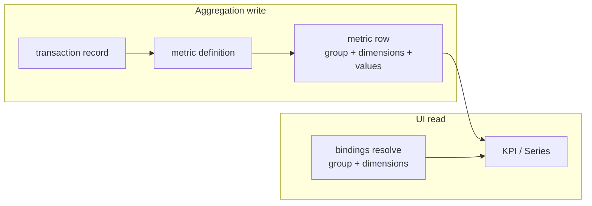

# Rates Tenant — Metrics Guide (Definitions → KPI & Series)

End-to-end guide for creating metrics on the **mocked Rates tenant**, wiring them in **entity view settings**, and understanding **why** each field is chosen. Complements [metrics-consumption.md](./metrics-consumption.md) (API contract) and [aggregations.md](./aggregations.md) (write pipeline).

---

## Table of contents

1. [Core concepts](#1-core-concepts)
2. [Rates models you can aggregate](#2-rates-models-you-can-aggregate)
3. [Progressive metric catalog (simple → complex)](#3-progressive-metric-catalog-simple--complex)
   - [Creation form field reference](#creation-form-field-reference)
   - [Level 1 — M1–M3](#level-1--m1m3)
   - [Level 2 — M4–M9](#level-2--m4m9)
   - [Level 3 — M10–M12](#level-3--m10m12)
   - [Level 4 — M13–M15](#level-4--m13m15)
   - [Level 5 — M16–M23](#level-5--m16m23)
4. [Create definitions (Settings → Metrics)](#4-create-definitions-settings--metrics)
5. [Wire the UI (Design layout → KPI & Series)](#5-wire-the-ui-design-layout--kpi--series)
6. [Binding sources cheat sheet](#6-binding-sources-cheat-sheet)
7. [Permissions & troubleshooting](#7-permissions--troubleshooting)

---

## 1. Core concepts

### What is a metric definition?

A **metric definition** is configuration stored in Firestore (`tenants/{tenant}/__metrics_definitions/{id}`). It tells the aggregation engine:

- **Which entity** to watch (`sourceModel`, e.g. `transaction`)
- **What to compute** (`aggregations`: Sum, Avg, or Count)
- **How to slice rows** (`groupBy`, `dimensions`)
- **When to recalculate** (`fieldsDependency`)

Pre-aggregated results live under `tenants/{tenant}/metrics/{targetCollection}/rows/{docId}` and are read in **O(1)** by the web app (KPI / Series widgets).

### Group by vs dimensions

Both end up as keys on each stored metric row. The API always requires **exactly** the fields listed in the definition—no more, no less.

| Concept | Role | Analogy |
|--------|------|--------|
| **Group by** | Splits metrics into **separate buckets** (separate row per unique combination). | “One total **per** category” → `groupBy: [categoryId]` |
| **Dimensions** | **Labels** on a row used to **address** a value when group is fixed or empty. | “My total, **for** category X only” → `groupBy: []`, `dimensions: [categoryId]` |

**Row identity** (simplified):

```text
docId = hash(userId + group + dimensions)
```

#### When to use group by

- You want **many buckets** maintained automatically (e.g. every `transactionTypeId` you ever record).
- **Series widgets** often use **static bindings** per bucket against a **grouped** metric (one bucket = one `transactionTypeId` value).

**Example:** `groupBy: [transactionTypeId]` → rows for `txn_expense`, `txn_income`, `txn_payment`, `txn_transfer`.

#### When to use dimensions

- You want **one logical “total” shape** but need to **query** a specific slice (e.g. one category at a time).
- **KPI** on a list page: “Spend in **this** category” with `listFilter` on `categoryId` or a **static** category id.

**Example:** `groupBy: []`, `dimensions: [categoryId]` → same user can have many rows, one per category id, each with its own `sum_amount`.

#### Using both together

**Example:** `groupBy: [accountId]`, `dimensions: [categoryId]` → one row per **account + category** pair. Useful for advanced dashboards; bindings must supply **both** fields.



### Field dependencies

Lists fields that, when changed on a source record, **trigger** a metric update. Include:

- The aggregated numeric field (e.g. `amount`)
- Every field in `groupBy` and `dimensions`
- Relation ids you care about (e.g. `accountId`, `categoryId`)

**Reasoning:** Avoids recomputing when unrelated fields (e.g. `description`) change.

### User scope (Rates seed data)

Metric rows are keyed by **`ownerId`** on source records (JWT `uid` on read). Mock transactions live under seed demo data (`rd_txn_*` in `apps/api/src/admin/rates-tenant/records/seed-demo-data.ts`). To see non-empty widgets:

1. Sign in as that seeded user (or create transactions as your user).
2. Run **Backfill** after creating each metric.

### Date grouping

`transaction.date` is stored as a full ISO datetime. When you group by `date`, choose a **date split** in Settings → Metrics:

| Split | Stored bucket example |
|-------|------------------------|
| Day | `2026-06-02` |
| Month | `2026-06` |
| Year | `2026` |

Set `dateFieldGranularity: { "date": "month" }` (via UI) and run **Backfill** so existing transactions roll up into calendar months. For amount metrics, set **Result display format** to **Currency**.

**Example — M24 Monthly spend (all expenses):**

| Field | Value |
|-------|-------|
| Name | Monthly expense total |
| Source model | transaction |
| Operation | Sum |
| Aggregation field | amount |
| Fields dependency | amount |
| Group by | date |
| Date split (date) | Month |
| Filters | transactionTypeId eq `txn_expense` |
| Value display format | Currency |
| Status | ACTIVE |

Widget binding: static group `date` = `2026-06` (or `entityField` on a month field with normalization at query time).

---

## 2. Rates models you can aggregate

### Transaction (`transaction`) — primary teaching model

| Field | Type | Use in metrics |
|-------|------|----------------|
| `amount` | Decimal | **Sum / Avg** (main measure) |
| `accountId` | Relation | Group by / dimension (which account) |
| `transactionTypeId` | Relation | Group by / dimension (`txn_income`, `txn_expense`, `txn_payment`, `txn_transfer`) |
| `categoryId` | Relation | Group by / dimension (`tu1_cat_01`, …) |
| `productId` | Relation | Optional dimension (nullable on some seed rows) |
| `date` | DateTime | Group by with **date split** (day / month / year); include in `fieldsDependency` if amounts can move across time |
| `description` | String | **Field dependencies** only (not a good group key) |

### Other visible models (illustrate cross-entity metrics)

| Model | Numeric fields | Typical use |
|-------|----------------|-------------|
| `account` | `balance` | Portfolio snapshot totals; group by `accountTypeId`, `currencyId` |
| `financialProduct` | `initialAmount`, `currentBalance` | Wealth by `productTypeId` or `statusId` |
| `productSnapshot` | `balance`, `accruedInterest` | Historical balance; group by `productId` |
| `transactionSource` | `percentage` | Allocation %; group by `sourceProductId` |
| `productTerm` | `paymentAmount`, `interestRate`, `totalPeriods` | Loan terms; group by `productId` |
| `incomeDetail` | `expectedAmount` | Expected income; group by `incomeTypeId` |
| `investmentDetail` | `expectedReturnRate` | Avg return; group by `riskLevelId` |

Lookup tables (`transactionType`, `category`, …) are not source models—they are referenced **through relation ids** on facts like `transaction`.

---

## 3. Progressive metric catalog (simple → complex)

Create each metric in **Settings → Metrics** using the **full form values** below, then **Save** and **Run backfill**.

**Overview**

| Level | Metrics | Idea |
|-------|---------|------|
| 1 | M1–M3 | Single total on `transaction` (sum / count / avg) |
| 2 | M4–M9 | One slicing field (group by **or** dimensions) |
| 3 | M10–M12 | Two transaction fields combined |
| 4 | M13–M15 | Full relation coverage + count/avg variants |
| 5 | M16–M23 | Other Rates entities (`account`, `financialProduct`, …) |

Wire **M16–M23** on their entity list pages (`/app/account`, `/app/financialProduct`, …), not only Transactions.

---

### Creation form field reference

These are the fields shown in **Settings → Metrics → Create metric** (`MetricDefinitionEditor`). Enter values exactly as in the tables below.

| Form label (EN) | Meaning |
|-----------------|--------|
| **Metric name** | Display name; also used as KPI title unless overridden in view settings. |
| **Description** | Optional documentation (shown in summary, not on KPI). |
| **Source model** | Entity name (`transaction`, `account`, …). Must match Firestore entity. |
| **Status** | `ACTIVE` (updates + readable) or `PAUSED` (frozen). |
| **Aggregation** | `Sum`, `Average`, or `Count documents`. |
| **Numeric field** | Field to aggregate for Sum/Avg (`amount`, `balance`, …). Empty for Count documents. |
| **Field dependencies** | Source fields that trigger recalculation when changed. Select all fields used in group by / dimensions plus the numeric field. |
| **Group by** | Multiselect: splits into separate metric rows per distinct value. |
| **Dimensions** | Multiselect: extra key fields required on every read query. |
| **Filters** | Optional rules: only source records matching **every** filter are aggregated. Use **Equals** for one value or **Is one of** for several (e.g. `type` = `INCOME`, or `type` in `EXPENSE`, `PAYMENT`). After changing filters, run **Backfill**. |

**Set automatically on create:** `schemaVersionDependency` = `1`, `version` = `1`.

**Multiselect empty:** Leave the control with no badges selected (not the same as picking a field).

**After save:** Open the metric → **Run backfill** so existing seed rows are aggregated.

---

### Level 1 — M1–M3

Single total on `transaction`; no group by or dimensions.

#### M1 — Total transaction amount

| Creation form field | Value to enter |
|-------------------|----------------|
| **Metric name** | `Total transaction amount` |
| **Description** | Sum of all transaction `amount` values for the logged-in user. |
| **Source model** | `transaction` |
| **Status** | `ACTIVE` |
| **Aggregation** | `Sum` |
| **Numeric field** | `amount` |
| **Field dependencies** | `amount` |
| **Group by** | *(none)* |
| **Dimensions** | *(none)* |

**Why:** Simplest metric—one row per user, one KPI with no bindings. Stored value key: `sum_amount`.

---

#### M2 — Transaction count

| Creation form field | Value to enter |
|-------------------|----------------|
| **Metric name** | `Transaction count` |
| **Description** | Number of transaction documents owned by the user. |
| **Source model** | `transaction` |
| **Status** | `ACTIVE` |
| **Aggregation** | `Count documents` |
| **Numeric field** | *(leave empty — not used for document count)* |
| **Field dependencies** | *(none — document COUNT recalculates on every create/delete)* |
| **Group by** | *(none)* |
| **Dimensions** | *(none)* |

**Why:** Counts rows, not `amount`. Optional: add `amount`, `categoryId`, `accountId` to field dependencies if you also want recounts when those fields change on update (not required for seed demo).

**Stored value key:** `count`.

---

#### M3 — Average transaction size

| Creation form field | Value to enter |
|-------------------|----------------|
| **Metric name** | `Average transaction size` |
| **Description** | Mean transaction `amount` across all transactions. |
| **Source model** | `transaction` |
| **Status** | `ACTIVE` |
| **Aggregation** | `Average` |
| **Numeric field** | `amount` |
| **Field dependencies** | `amount` |
| **Group by** | *(none)* |
| **Dimensions** | *(none)* |

**Why:** Typical “average ticket” KPI. Stored keys: `sum_amount`, `count_amount`, `avg_amount` (UI shows `avg_amount`).

---

### Level 2 — M4–M9

One slicing field—either **group by** (many buckets) or **dimensions** (query one slice at a time).

#### M4 — Amount by transaction type *(group by)*

| Creation form field | Value to enter |
|-------------------|----------------|
| **Metric name** | `Amount by transaction type` |
| **Description** | Sum of `amount` per `transactionTypeId` (income, expense, payment, transfer). |
| **Source model** | `transaction` |
| **Status** | `ACTIVE` |
| **Aggregation** | `Sum` |
| **Numeric field** | `amount` |
| **Field dependencies** | `amount`, `transactionTypeId` |
| **Group by** | `transactionTypeId` |
| **Dimensions** | *(none)* |

**Why:** Maintains one row per type (`txn_expense`, `txn_income`, …). Best for **Series** comparing types with static bindings.

---

#### M5 — Amount by category *(group by)*

| Creation form field | Value to enter |
|-------------------|----------------|
| **Metric name** | `Amount by category` |
| **Description** | Sum of `amount` per category relation id. |
| **Source model** | `transaction` |
| **Status** | `ACTIVE` |
| **Aggregation** | `Sum` |
| **Numeric field** | `amount` |
| **Field dependencies** | `amount`, `categoryId` |
| **Group by** | `categoryId` |
| **Dimensions** | *(none)* |

**Why:** One row per `tu1_cat_*`. Series can compare Living vs Transport vs Entertainment.

---

#### M6 — Amount by account *(group by)*

| Creation form field | Value to enter |
|-------------------|----------------|
| **Metric name** | `Amount by account` |
| **Description** | Sum of `amount` per account. |
| **Source model** | `transaction` |
| **Status** | `ACTIVE` |
| **Aggregation** | `Sum` |
| **Numeric field** | `amount` |
| **Field dependencies** | `amount`, `accountId` |
| **Group by** | `accountId` |
| **Dimensions** | *(none)* |

**Why:** Splits spend across `tu1_acc_01`, `tu1_acc_02`, etc.

---

#### M7 — Amount for one category *(dimensions)*

| Creation form field | Value to enter |
|-------------------|----------------|
| **Metric name** | `Amount for one category` |
| **Description** | Sum of `amount` for a single category (query supplies `categoryId`). |
| **Source model** | `transaction` |
| **Status** | `ACTIVE` |
| **Aggregation** | `Sum` |
| **Numeric field** | `amount` |
| **Field dependencies** | `amount`, `categoryId` |
| **Group by** | *(none)* |
| **Dimensions** | `categoryId` |

**Why:** Same measure as M5 but optimized for **one** category per KPI (list filter or static `tu1_cat_02`). Contrast with M5: all categories stored, M7 addressed per query.

---

#### M8 — Amount for one account *(dimensions)*

| Creation form field | Value to enter |
|-------------------|----------------|
| **Metric name** | `Amount for one account` |
| **Description** | Sum of `amount` for a single account (query supplies `accountId`). |
| **Source model** | `transaction` |
| **Status** | `ACTIVE` |
| **Aggregation** | `Sum` |
| **Numeric field** | `amount` |
| **Field dependencies** | `amount`, `accountId` |
| **Group by** | *(none)* |
| **Dimensions** | `accountId` |

**Why:** KPI for “this account only” via static `tu1_acc_01` or future account filter.

---

#### M9 — Amount for one product *(dimensions)*

| Creation form field | Value to enter |
|-------------------|----------------|
| **Metric name** | `Amount for one product` |
| **Description** | Sum of `amount` where `productId` is set; query supplies product id. |
| **Source model** | `transaction` |
| **Status** | `ACTIVE` |
| **Aggregation** | `Sum` |
| **Numeric field** | `amount` |
| **Field dependencies** | `amount`, `productId` |
| **Group by** | *(none)* |
| **Dimensions** | `productId` |

**Why:** Some seed transactions omit `productId`; only linked transactions contribute. Binding example: static `tu1_prod_01`.

---

### Level 3 — M10–M12

Two transaction fields combined (group + dimensions).

#### M10 — Amount by account and category

| Creation form field | Value to enter |
|-------------------|----------------|
| **Metric name** | `Amount by account and category` |
| **Description** | Sum of `amount` per account and category pair. |
| **Source model** | `transaction` |
| **Status** | `ACTIVE` |
| **Aggregation** | `Sum` |
| **Numeric field** | `amount` |
| **Field dependencies** | `amount`, `accountId`, `categoryId` |
| **Group by** | `accountId` |
| **Dimensions** | `categoryId` |

**Why:** Cross-tab cell—“account X + category Y”. KPI bindings: both fields static (e.g. `tu1_acc_01` + `tu1_cat_05`).

---

#### M11 — Amount by type and category

| Creation form field | Value to enter |
|-------------------|----------------|
| **Metric name** | `Amount by type and category` |
| **Description** | Sum of `amount` per transaction type and category. |
| **Source model** | `transaction` |
| **Status** | `ACTIVE` |
| **Aggregation** | `Sum` |
| **Numeric field** | `amount` |
| **Field dependencies** | `amount`, `transactionTypeId`, `categoryId` |
| **Group by** | `transactionTypeId` |
| **Dimensions** | `categoryId` |

**Why:** Answers “expenses in Groceries” vs “income in Salary” with two bindings.

---

#### M12 — Amount by account and type

| Creation form field | Value to enter |
|-------------------|----------------|
| **Metric name** | `Amount by account and type` |
| **Description** | Sum of `amount` per account and transaction type. |
| **Source model** | `transaction` |
| **Status** | `ACTIVE` |
| **Aggregation** | `Sum` |
| **Numeric field** | `amount` |
| **Field dependencies** | `amount`, `accountId`, `transactionTypeId` |
| **Group by** | `accountId` |
| **Dimensions** | `transactionTypeId` |

**Why:** Per-account view of inflows vs outflows (bind `accountId` + `txn_expense`, etc.).

---

### Level 4 — M13–M15

Uses all main transaction relation fields or alternate aggregations.

#### M13 — Full transaction cube

| Creation form field | Value to enter |
|-------------------|----------------|
| **Metric name** | `Full transaction cube` |
| **Description** | Sum of `amount` by account and type, with category and product on each row. |
| **Source model** | `transaction` |
| **Status** | `ACTIVE` |
| **Aggregation** | `Sum` |
| **Numeric field** | `amount` |
| **Field dependencies** | `amount`, `accountId`, `transactionTypeId`, `categoryId`, `productId` |
| **Group by** | `accountId`, `transactionTypeId` |
| **Dimensions** | `categoryId`, `productId` |

**Why:** Exercises every relation field on `transaction`. UI bindings must supply all four keys. Rows without `productId` still aggregate when that field is absent from the stored slice.

---

#### M14 — Count by type and category

| Creation form field | Value to enter |
|-------------------|----------------|
| **Metric name** | `Count by type and category` |
| **Description** | Number of transactions per type and category. |
| **Source model** | `transaction` |
| **Status** | `ACTIVE` |
| **Aggregation** | `Count documents` |
| **Numeric field** | *(empty)* |
| **Field dependencies** | `transactionTypeId`, `categoryId` |
| **Group by** | `transactionTypeId` |
| **Dimensions** | `categoryId` |

**Why:** Volume metric, not amount. Field dependencies ensure type/category moves recount on update; create/delete always recount for document COUNT.

---

#### M15 — Avg amount by category

| Creation form field | Value to enter |
|-------------------|----------------|
| **Metric name** | `Avg amount by category` |
| **Description** | Average transaction size per category. |
| **Source model** | `transaction` |
| **Status** | `ACTIVE` |
| **Aggregation** | `Average` |
| **Numeric field** | `amount` |
| **Field dependencies** | `amount`, `categoryId` |
| **Group by** | `categoryId` |
| **Dimensions** | *(none)* |

**Why:** Typical ticket size per category—complements M5 (total) with averages.

**Optional enhancement:** Add `date` to field dependencies on any M1–M15 if you need recalculation when timestamps change (do not add `date` to group by unless you want per-timestamp buckets).

---

### Level 5 — M16–M23

Other Rates **source models** (configure KPI/Series on matching list pages).

#### M16 — Total account balance

| Creation form field | Value to enter |
|-------------------|----------------|
| **Metric name** | `Total account balance` |
| **Description** | Sum of `balance` across all accounts for the user. |
| **Source model** | `account` |
| **Status** | `ACTIVE` |
| **Aggregation** | `Sum` |
| **Numeric field** | `balance` |
| **Field dependencies** | `balance` |
| **Group by** | *(none)* |
| **Dimensions** | *(none)* |

**Why:** Portfolio-wide balance from seed accounts. Wire on `/app/account`.

---

#### M17 — Balance by account type

| Creation form field | Value to enter |
|-------------------|----------------|
| **Metric name** | `Balance by account type` |
| **Description** | Sum of `balance` per account type (`atype_bank`, `atype_wallet`, `atype_credit`). |
| **Source model** | `account` |
| **Status** | `ACTIVE` |
| **Aggregation** | `Sum` |
| **Numeric field** | `balance` |
| **Field dependencies** | `balance`, `accountTypeId` |
| **Group by** | `accountTypeId` |
| **Dimensions** | *(none)* |

**Why:** Split balances by bank vs wallet vs credit.

---

#### M18 — Total financial product balance

| Creation form field | Value to enter |
|-------------------|----------------|
| **Metric name** | `Total financial product balance` |
| **Description** | Sum of `currentBalance` across financial products. |
| **Source model** | `financialProduct` |
| **Status** | `ACTIVE` |
| **Aggregation** | `Sum` |
| **Numeric field** | `currentBalance` |
| **Field dependencies** | `currentBalance` |
| **Group by** | *(none)* |
| **Dimensions** | *(none)* |

**Why:** Total portfolio value on products. Wire on `/app/financialProduct`.

---

#### M19 — Financial product balance by status

| Creation form field | Value to enter |
|-------------------|----------------|
| **Metric name** | `Financial product balance by status` |
| **Description** | Sum of `currentBalance` per product status (`status_active`, etc.). |
| **Source model** | `financialProduct` |
| **Status** | `ACTIVE` |
| **Aggregation** | `Sum` |
| **Numeric field** | `currentBalance` |
| **Field dependencies** | `currentBalance`, `statusId` |
| **Group by** | `statusId` |
| **Dimensions** | *(none)* |

**Why:** Active vs inactive product totals.

---

#### M20 — Product snapshot balance by product

| Creation form field | Value to enter |
|-------------------|----------------|
| **Metric name** | `Product snapshot balance by product` |
| **Description** | Sum of snapshot `balance` per financial product. |
| **Source model** | `productSnapshot` |
| **Status** | `ACTIVE` |
| **Aggregation** | `Sum` |
| **Numeric field** | `balance` |
| **Field dependencies** | `balance`, `productId` |
| **Group by** | `productId` |
| **Dimensions** | *(none)* |

**Why:** Historical statement balances per product (`tu1_prod_*`). Wire on `/app/productSnapshot`.

---

#### M21 — Avg transaction source allocation

| Creation form field | Value to enter |
|-------------------|----------------|
| **Metric name** | `Avg transaction source allocation` |
| **Description** | Average `percentage` allocation per source product on transaction sources. |
| **Source model** | `transactionSource` |
| **Status** | `ACTIVE` |
| **Aggregation** | `Average` |
| **Numeric field** | `percentage` |
| **Field dependencies** | `percentage`, `sourceProductId` |
| **Group by** | `sourceProductId` |
| **Dimensions** | *(none)* |

**Why:** How much of each transaction is attributed to which product. Wire on `/app/transactionSource`.

---

#### M22 — Expected income by type

| Creation form field | Value to enter |
|-------------------|----------------|
| **Metric name** | `Expected income by type` |
| **Description** | Sum of `expectedAmount` per income type on income details. |
| **Source model** | `incomeDetail` |
| **Status** | `ACTIVE` |
| **Aggregation** | `Sum` |
| **Numeric field** | `expectedAmount` |
| **Field dependencies** | `expectedAmount`, `incomeTypeId` |
| **Group by** | `incomeTypeId` |
| **Dimensions** | *(none)* |

**Why:** Extension entity for income planning. Wire on `/app/incomeDetail`.

---

#### M23 — Total product term payment

| Creation form field | Value to enter |
|-------------------|----------------|
| **Metric name** | `Total product term payment` |
| **Description** | Sum of loan `paymentAmount` per financial product. |
| **Source model** | `productTerm` |
| **Status** | `ACTIVE` |
| **Aggregation** | `Sum` |
| **Numeric field** | `paymentAmount` |
| **Field dependencies** | `paymentAmount`, `productId` |
| **Group by** | `productId` |
| **Dimensions** | *(none)* |

**Why:** Payment totals per product term row. Wire on `/app/productTerm`.

---

## 4. Create definitions (Settings → Metrics)

**Path:** Sidebar → **Metrics** (requires `metricDefinition.create`).

1. Click **Create metric**
2. Copy values from [§3](#3-progressive-metric-catalog-simple--complex) for each metric you need
3. **Save**
4. Open the saved metric → **Run backfill**
5. Repeat for the next metric

---

## 5. Wire the UI (Design layout → KPI & Series)

**Configure layout:** **Settings → Design layout → Item list** → select entity (e.g. transaction), or **Design layout** on `/app/transaction`  
Requires: `entityUiOverride.update` + `metricDefinition.read`  
**View values:** `transaction.read` (e.g. `normalRatesUser`)

**Table** and **card** views have **separate** `metricWidgets` arrays—configure both if you use both.

### Recommended Transactions page layout

```text
┌─────────────────────────────────────────────────────────────┐
│  [Toolbar: search / filters]                                 │
├─────────────────────────────────────────────────────────────┤
│  KPI strip (EntityViewMetricsStrip)                          │
│  ┌──────────┐ ┌──────────┐ ┌──────────┐ ┌──────────────┐  │
│  │ M1 Total │ │ M3 Avg   │ │ M7 Cat*  │ │ M14 Series   │  │
│  └──────────┘ └──────────┘ └──────────┘ └──────────────┘  │
├─────────────────────────────────────────────────────────────┤
│  Table or card list                                          │
└─────────────────────────────────────────────────────────────┘
```

### KPI widgets (single cell each)

| Widget | Metric | Bindings | Reason |
|--------|--------|----------|--------|
| **Portfolio spend (total)** | M1 | *(none)* | Simplest; no group/dimension fields |
| **Average ticket** | M3 | *(none)* | |
| **Spend in category** | M7 | `categoryId` → **List filter** `categoryId` OR **Static** `tu1_cat_02` | List filter: follows user filter; static: demo Groceries |
| **Expense total** | M4 | `transactionTypeId` → **Static** `txn_expense` | One type from grouped metric |
| **Checking account spend** | M6 or M8 | `accountId` → **Static** `tu1_acc_01` | M6 if grouped by account; M8 if dimension-only |
| **Cross-tab cell** | M10 | `accountId` static `tu1_acc_01`, `categoryId` static `tu1_cat_05` | Illustrates two binding dimensions |

**Steps (KPI):**

1. Design layout → Item list → **Add KPI** (metrics section)
2. Select metric definition
3. For each field under Group by / Dimensions, set **Binding source** (see [§6](#6-binding-sources-cheat-sheet))
4. **Save layout**

### Series widgets (grid of cells)

Best with **grouped** metrics (M4, M5, M6).

**Example — Compare transaction types (M4)**

1. **Add series** → metric **Amount by transaction type**
2. Add buckets:

| Bucket | `transactionTypeId` (static) |
|--------|----------------------------|
| 1 | `txn_expense` |
| 2 | `txn_income` |
| 3 | `txn_payment` |
| 4 | `txn_transfer` |

3. Save → four KPI cells in one widget.

**Example — Compare categories (M5)**

| Bucket | `categoryId` (static) | Seed label |
|--------|----------------------|------------|
| 1 | `tu1_cat_01` | Living |
| 2 | `tu1_cat_05` | Transport |
| 3 | `tu1_cat_07` | Entertainment |
| 4 | `tu1_cat_11` | Income-related |

**Example — M11 type + category (advanced series)**

Metric M11: `groupBy: [transactionTypeId]`, `dimensions: [categoryId]`.

Each bucket needs **both** bindings, e.g. bucket 1: `txn_expense` + `tu1_cat_02`.

### Card view — per-row KPI (`metric-kpi` slot)

For **card** view type only, in the card layout builder:

1. Add slot → component **metric-kpi**
2. Pick metric (e.g. M7 or M1)
3. Use **Entity field** bindings where the row should drive the key—e.g. `categoryId` → **Entity field** `categoryId` so each card shows that row’s category total.

**Reasoning:** Strip KPIs are list-level; card slots are **row-level**.

### Derived metric KPI (`metric-derived-kpi`)

Use a **derived KPI** when you need a calculated value from multiple metrics (for example monthly income minus outflows, margin percentage, or averages) without engine-level sign rules on a single aggregation row.

**Prerequisites**

1. Create separate metric definitions (e.g. **Monthly Income** with filter `type = INCOME`, **Monthly Outflows** with filter `type in …`).
2. All metrics referenced in the formula must share the **same `groupBy` and `dimensions` keys** (typically `groupBy: [date]` with month granularity).

**Steps**

1. Metrics row widget designer → add component **Derived metric KPI**.
2. Build the **formula** with metric tokens, operators (`+`, `−`, `×`, `÷`), numeric constants, and parentheses.
3. **Shared bindings:** bind `date` once (static month, list filter, or route param).
4. Optional **label** (e.g. “Total balance”).
5. Save → one cell shows the evaluated result for the bound period.

**Examples**

| Goal | Formula tokens |
|------|----------------|
| Total balance | `Income − Outflows` |
| Margin % | `(Income − Outflows) / Income` |
| Tax estimate | `Income * 0.15` |
| Average ticket | `Revenue / Count` |

**Precedence**

- Multiplication and division run before addition and subtraction.
- Parentheses override the default order, e.g. `(Income − Outflows) / Income`.

**Notes**

- Missing metric rows count as **0** in the formula.
- If all referenced metrics are empty, the widget shows **No value**.
- Division by zero shows a dedicated error state.
- Legacy layouts that used **+1 / −1 multipliers** auto-migrate to `MetricA − MetricB`.
- Currency/formatting follows the **first metric** in the formula.

---

## 6. Binding sources cheat sheet

| Source | When to use | Example on Transactions |
|--------|-------------|-------------------------|
| **Static value** | Fixed id in layout config | `categoryId` = `tu1_cat_05` |
| **List filter** | KPI should follow toolbar filter | `categoryId` list filter |
| **Route param** | Deep link `?categoryId=` | param name `categoryId` |
| **Entity field** | Card `metric-kpi` per row | `categoryId` from current transaction |

If any required group/dimension is unresolved → widget shows **No value** (no API call).

---

## 7. Permissions & troubleshooting

| Action | Permission |
|--------|------------|
| Create / edit / backfill definitions | `metricDefinition.*` |
| Add KPI / Series to view | `entityUiOverride.update` + `metricDefinition.read` |
| See values on Transactions | `transaction.read` (or `metricValue.read`) |
| See values on Accounts | `account.read` |

| Symptom | Check |
|---------|--------|
| Empty KPI | Bindings complete? Backfill run? Logged-in user owns rows? |
| 403 on API | `transaction.read` for transaction metrics |
| 404 row | Wrong group/dimension values vs stored keys |
| Builder empty | `metricDefinition.read` + ACTIVE definitions |
| Series all empty | Each bucket needs full binding set |

### Seed reference (mock ids)

**Transaction types:** `txn_income`, `txn_payment`, `txn_expense`, `txn_transfer`  
**Sample categories:** `tu1_cat_01` Living, `tu1_cat_05` Transport, `tu1_cat_07` Entertainment  
**Sample accounts:** `tu1_acc_01`, `tu1_acc_02`, `tu1_acc_03`

---

## Quick reference — transaction field → metric pattern

| Field | Level 1 | Level 2 group | Level 2 dimension | Level 3+ |
|-------|---------|---------------|-------------------|----------|
| `amount` | Sum/Avg/Count | With any group | With any dimension | Combined |
| `transactionTypeId` | — | M4 | M7 pairing | M11, M12 |
| `categoryId` | — | M5 | M7 | M10, M11 |
| `accountId` | — | M6 | M8 | M10, M12 |
| `productId` | — | optional group | M9 | M13 |
| `date` | dependency only | avoid group | avoid | dependency |
| `description` | dependency optional | — | — | — |

---

## Related docs

- [metrics-consumption.md](./metrics-consumption.md) — API, keys, React hooks
- [aggregations.md](./aggregations.md) — write path, worker
- [query-aggregations.md](./query-aggregations.md) — design intent
