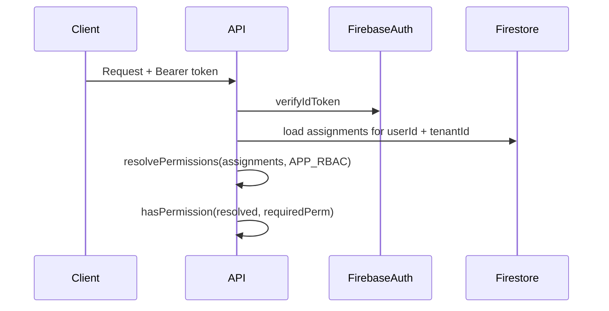

# RBAC Phase 2 — Contextual assignments

Phase 1 (current) stores **one role per user** on `users.role` and in JWT custom claims `{ role: "billing_manager" }`.

Phase 2 adds **scoped role assignments** when a user needs different roles per tenant or module (e.g. billing manager in Acme, viewer only in Beta).

## Target model

```typescript
interface RoleAssignment {
  readonly userId: string;
  readonly tenantId: string;
  readonly roleId: string; // key in APP_RBAC.roles
  readonly scope: "platform" | "module";
  readonly moduleId?: string; // e.g. "billing"
}
```

Collection: `role_assignments` (or embed on `tenant_members`).

## Request resolution



## JWT / claims

- Keep claims small (Firebase ~1000 bytes).
- JWT carries `tenantId` + `assignmentsVersion` (or hash), not the full permission list.
- API loads assignments when version differs or on sensitive routes.

## API surface (planned)

```typescript
hasPermission(
  resolved: ResolvedPrincipal,
  permission: Permission,
  context?: { tenantId: string; moduleId?: string },
): boolean;
```

`ResolvedPrincipal` = union of permissions from all assignments matching context. Platform `admin` remains superadmin via `isSuperAdmin` or platform-scoped wildcard.

## Migration from Phase 1

1. Backfill `role_assignments` from `users.role` (one platform-scoped row per user).
2. Dual-read: prefer assignments when present, else `users.role`.
3. Stop writing `users.role` when all products use assignments.
4. Update `GET /auth/validate` to return effective permissions or assignment summary for the active tenant.

## Deferred (Phase 2b)

- Custom roles per tenant stored in Firestore (not static slices).
- External policy engines (Casbin, OPA) unless customer-defined policies are required in v1.

Implement Phase 2 when the first product requires multi-role-per-tenant; until then, composable slices (Phase 1) are sufficient.
