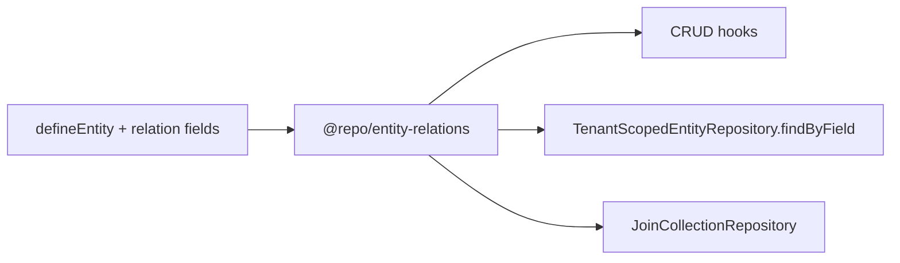

# Relational Data System Guide

Phase 2 Key Capability **10.1** — structured entity-to-entity relationships in a schema-driven, multi-tenant environment.

See also: [Entity System Guide](./entity-system-guide.md) · [Firestore collections guide](./firestore-collections-guide.md) · [Ecosystem plan](../Ecosystem%20Plan/v2/Key%20Capabilitues/10.1%20RELATIONAL%20DATA%20SYSTEM.md)

---

## Overview

The relational layer adds:

- Declarative `type: "relation"` fields in `defineEntity()`
- CRUD validation of foreign keys (existence + tenant scope)
- Reverse lookups via repository `findByField`
- Scalable many-to-many via join collections
- Delete semantics (`restrict`, `nullify`, `cascade`)

Relation expansion on GET and list filtering remain deferred to the Query Engine (10.7).

---

## Architecture



| Package | Role |
| --- | --- |
| `@repo/entities` | Relation field type, Zod schemas, metadata helpers |
| `@repo/entity-relations` | Validator, delete handler, join handler |
| `@repo/firestore-converters` | `findByField` + join collection contracts |
| `@repo/gcp-firebase` | Firestore implementations |
| `apps/api` | CRUD integration via `createRelationRuntimeContext` |

---

## Defining relations

### Many-to-one (foreign key)

```ts
customerId: {
  type: "relation",
  required: true,
  relation: {
    target: "customer",
    type: "many-to-one",
    onDelete: "restrict",
  },
}
```

Stored as a string ID on the entity document. Validated on create/update.

### Many-to-many (join collection)

```ts
projects: {
  type: "relation",
  relation: {
    target: "project",
    type: "many-to-many",
    joinCollection: "user_projects",
  },
}
```

Not stored on the entity document. Links live in:

```
tenants/{tenantId}/{joinCollection}/{joinId}
```

Use `createJoinCollectionHandler` from `@repo/entity-relations` to link/unlink and query both directions.

### Relation config

| Property | Description |
| --- | --- |
| `target` | Target entity name (e.g. `"customer"`) |
| `type` | `one-to-one` · `one-to-many` · `many-to-one` · `many-to-many` |
| `inverse` | Optional reverse field name on target entity |
| `required` | Whether the reference must be present on create |
| `onDelete` | `restrict` (default) · `nullify` · `cascade` |
| `joinCollection` | Override join collection name for M2M |

---

## Storage strategy

| Relation type | Storage |
| --- | --- |
| `one-to-one`, `many-to-one` | FK string on current entity |
| `one-to-many` | FK on the "many" side (define as `many-to-one` on child) |
| `many-to-many` | Join collection under tenant |

Default join collection name: `{sourceEntity}_{targetEntity}` (e.g. `user_project`).

---

## CRUD behavior

### Create / update

1. Zod validates field shape (string ID for FK relations)
2. `RelationValidator` confirms referenced record exists in the same tenant
3. Record persisted with reference ID only (no expansion)

### Delete

Before deleting entity `A`:

1. Scan all registered entities for FK fields targeting `A`
2. Apply `onDelete` per referencing field:
   - **restrict** — abort with `409 RELATION_DELETE_RESTRICTED`
   - **nullify** — clear FK on referencing records
   - **cascade** — delete referencing records
3. Remove join collection rows where `A` appears as source or target

### API error codes

| Code | HTTP | Meaning |
| --- | --- | --- |
| `RELATION_NOT_FOUND` | 400 | Referenced ID does not exist in tenant |
| `RELATION_REQUIRED` | 400 | Required relation field missing |
| `RELATION_DELETE_RESTRICTED` | 409 | Delete blocked by `onDelete: restrict` |

---

## Reverse lookups

Repository contract extension:

```ts
findByField({
  tenantId,
  field: "customerId",
  value: customerId,
  limit?,
  cursor?,
})
```

Used by the delete handler today; designed for the future Query Engine filter builder.

---

## Firestore indexes

Composite indexes are required for FK reverse lookups. Example for orders by customer:

```json
{
  "collectionGroup": "orders",
  "fields": [
    { "fieldPath": "customerId", "order": "ASCENDING" },
    { "fieldPath": "id", "order": "ASCENDING" }
  ]
}
```

See [`firestore.indexes.json`](../firestore.indexes.json) and [Firestore collections guide](./firestore-collections-guide.md).

---

## Entity registry

Relations require a runtime entity catalog. Production entities register via:

```ts
// packages/shared-types/src/register-entities.ts
import "@repo/shared-types/register-entities";
```

Imported once at API startup in `apps/api/src/server.ts`.

---

## Pilot: Order → Customer

`Order` includes required `customerId` referencing `customer` with `onDelete: restrict`. Schema version bumped to `2` with v1→v2 migration in the order converter.

---

## Out of scope (this deliverable)

- Relation-aware UI (entity picker)
- Query Engine list filters (`?customerId=...`)
- Relation expansion on GET (`?expand=customer`)
- Denormalized display fields

---

## Adding relations to a new entity

1. Add `type: "relation"` fields in `@repo/shared-types`
2. Register entity in `register-entities.ts`
3. Wire repository in `apps/api/src/server.ts` and extend `createRelationRuntimeContext` repository map
4. Add Firestore composite indexes for FK fields used in reverse lookups
5. Bump persisted schema version if changing stored shape
