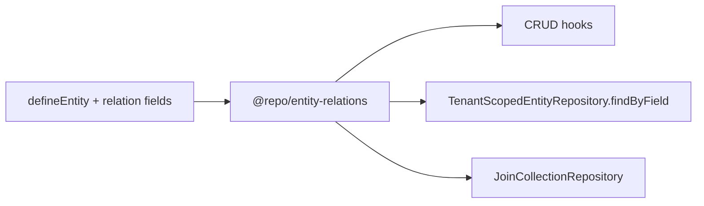

# Relational Data System Guide

Phase 2 Key Capability **10.1** — structured entity-to-entity relationships in a schema-driven, multi-tenant environment.

See also: [Entity System Guide](./entity-system-guide.md) · [Firestore collections guide](./firestore-collections-guide.md) · [Ecosystem plan](../Ecosystem%20Plan/v2/Key%20Capabilitues/10.1%20RELATIONAL%20DATA%20SYSTEM.md)

---

## Overview

The relational layer adds:

- Declarative `type: "relation"` fields in `defineEntity()`
- CRUD validation of foreign keys (existence + tenant scope)
- Reverse lookups via repository `findByField`
- Scalable many-to-many via join collections
- Delete semantics (`restrict`, `nullify`, `cascade`)

Relation expansion on GET remains deferred. List filtering on FK fields (for example `batchId`) is available via the [Query Engine](./query-engine-guide.md).

---

## Architecture



| Package | Role |
| --- | --- |
| `@repo/entities` | Relation field type, Zod schemas, metadata helpers |
| `@repo/entity-relations` | Validator, delete handler, join handler |
| `@repo/firestore-converters` | `findByField` + join collection contracts |
| `@repo/gcp-firebase` | Firestore implementations |
| `apps/api` | CRUD integration via `createRelationRuntimeContext` |

---

## Defining relations

### Many-to-one (foreign key)

```ts
batchId: {
  type: "relation",
  required: false,
  relation: {
    target: "batch",
    type: "many-to-one",
    onDelete: "restrict",
  },
}
```

Stored as a string ID on the entity document. Validated on create/update.

### Many-to-many (join collection)

```ts
tags: {
  type: "relation",
  relation: {
    target: "tag",
    type: "many-to-many",
    joinCollection: "workItem_tags",
  },
}
```

Not stored on the entity document. Links live in:

```
tenants/{tenantId}/{joinCollection}/{joinId}
```

Use `createJoinCollectionHandler` from `@repo/entity-relations` to link/unlink and query both directions.

Entity forms sync many-to-many links through the API after document create/update:

| Method | Path | Description |
| --- | --- | --- |
| `GET` | `/api/{entity}/{recordId}/relations/{fieldName}` | List linked target IDs |
| `PUT` | `/api/{entity}/{recordId}/relations/{fieldName}` | Replace linked targets (`{ "targetIds": ["..."] }`) |

Many-to-many and one-to-many (parent-side) fields are **not** stored on entity documents. Document CRUD strips those keys before validation. One-to-many parent fields are read-only in forms — define the foreign key on the child entity as `many-to-one` instead.

**List/table display:** One-to-many columns (e.g. `batch.workItems`) use reverse lookup via the child FK (`workItem.batchId`) in `EntityTable` / `EntityCardView` — see `useOneToManyColumnData` in the web app.

### Dynamic models: batch and workItem

When using Data Models (not code-defined entities):

1. Create the **child** model first (e.g. `workItem`)
2. Create the **parent** model (e.g. `batch`); an optional `workItems` one-to-many → `workItem` field is metadata only
3. Edit the child model; add `batchId` many-to-one → `batch`
4. Link records by setting `batchId` on each workItem — not via the parent's `workItems` field

Relation targets in the schema builder are **entity model names** from Data Models, not individual records.

### Record `_schemaVersion` vs definition `version`

| Field | Location | Meaning |
| --- | --- | --- |
| `version` on definition | `entity_definitions/{id}` | Increments when the schema is edited in Data Models |
| `_schemaVersion` on records | Entity collection documents | Firestore converter persistence version (currently `1`; unrelated to definition version) |

After PATCHing a definition to add fields (e.g. `batchId`), the API refreshes its entity runtime cache so new fields persist on create/update.

### Relation config

| Property | Description |
| --- | --- |
| `target` | Target entity name (e.g. `"batch"`) |
| `type` | `one-to-one` · `one-to-many` · `many-to-one` · `many-to-many` |
| `inverse` | Optional reverse field name on target entity |
| `required` | Whether the reference must be present on create |
| `onDelete` | `restrict` (default) · `nullify` · `cascade` |
| `joinCollection` | Override join collection name for M2M |

---

## Storage strategy

| Relation type | Storage |
| --- | --- |
| `one-to-one`, `many-to-one` | FK string on current entity |
| `one-to-many` | FK on the "many" side (define as `many-to-one` on child) |
| `many-to-many` | Join collection under tenant |

Default join collection name: `{sourceEntity}_{targetEntity}` (e.g. `workItem_tag`).

---

## CRUD behavior

### Create / update

1. Zod validates field shape (string ID for FK relations)
2. `RelationValidator` confirms referenced record exists in the same tenant
3. Record persisted with reference ID only (no expansion)

### Delete

Before deleting entity `A`:

1. Scan all registered entities for FK fields targeting `A`
2. Apply `onDelete` per referencing field:
   - **restrict** — abort with `409 RELATION_DELETE_RESTRICTED`
   - **nullify** — clear FK on referencing records
   - **cascade** — delete referencing records
3. Remove join collection rows where `A` appears as source or target

### API error codes

| Code | HTTP | Meaning |
| --- | --- | --- |
| `RELATION_NOT_FOUND` | 400 | Referenced ID does not exist in tenant |
| `RELATION_REQUIRED` | 400 | Required relation field missing |
| `RELATION_DELETE_RESTRICTED` | 409 | Delete blocked by `onDelete: restrict` |

---

## Reverse lookups

Repository contract extension:

```ts
findByField({
  tenantId,
  field: "batchId",
  value: batchId,
  limit?,
  cursor?,
})
```

Used by delete handler and one-to-many table reverse lookup (`useOneToManyColumnData`). The Query Engine uses FK fields for list filters — see [Query Engine Guide](./query-engine-guide.md).

---

## Firestore indexes

Composite indexes are required for FK reverse lookups. Example for work items by batch:

```json
{
  "collectionGroup": "workItems",
  "fields": [
    { "fieldPath": "batchId", "order": "ASCENDING" },
    { "fieldPath": "id", "order": "ASCENDING" }
  ]
}
```

See [`firestore.indexes.json`](../firestore.indexes.json) and [Firestore collections guide](./firestore-collections-guide.md).

---

## Entity registry

Relations require a runtime entity catalog. Production entities register via:

```ts
// packages/shared-types/src/register-entities.ts
import "@repo/shared-types/register-entities";
```

Imported once at API startup in `apps/api/src/server.ts`.

---

## Example: WorkItem → Batch

`workItem` includes optional `batchId` referencing `batch` with `onDelete: restrict`. Create both models in Model Builder or define statically in a module. Parent list views show linked children via reverse lookup on the one-to-many side.

---

## Out of scope (deferred)

- Relation expansion on GET (`?expand=batch`)
- Denormalized display fields

List filters on FK fields are handled by the [Query Engine](./query-engine-guide.md) (for example `?query={"filter":[{"field":"batchId","operator":"==","value":"…"}]}`).

---

## Adding relations to a new entity

1. Add `type: "relation"` fields in Model Builder or in a static entity definition
2. For static entities: register via module in `app.config.ts`
3. Add Firestore composite indexes for FK fields used in reverse lookups
4. Bump persisted schema version if changing stored shape on static entities
