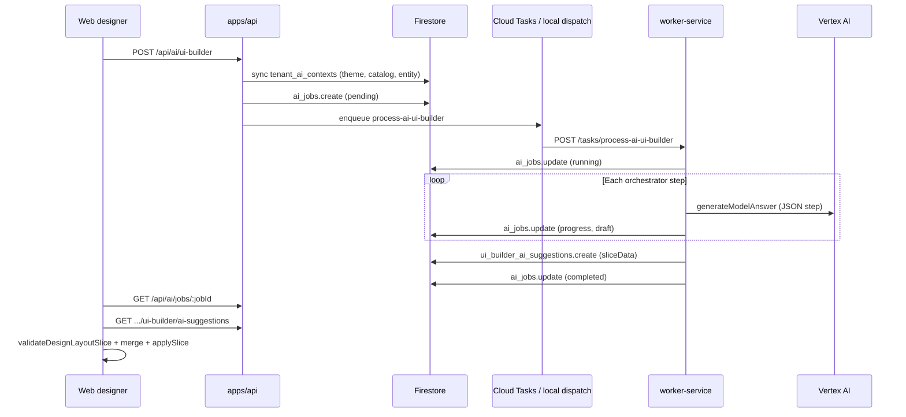

# Stepped AI Builder — Full Replication Guide

This document is a **self-contained implementation manual** for replicating the stepped AI UI builder pattern (currently implemented for the **list** surface) across the remaining design surfaces and for **data model creation**.

It covers architecture, file paths, context fragments, Firestore collections, API/worker joins, validation chains, step flows, and concrete checklists per feature.

---

## Table of contents

1. [Executive summary](#1-executive-summary)
2. [System architecture](#2-system-architecture)
3. [Shared infrastructure (all surfaces)](#3-shared-infrastructure-all-surfaces)
4. [Reference implementation: List surface](#4-reference-implementation-list-surface)
5. [Replicate: Forms surface](#5-replicate-forms-surface)
6. [Replicate: Main page surface](#6-replicate-main-page-surface)
7. [Replicate: Record detail surface](#7-replicate-record-detail-surface)
8. [Replicate: Metrics row designer surface](#8-replicate-metrics-row-designer-surface)
9. [Replicate: Data model creation](#9-replicate-data-model-creation)
10. [Context fragment catalog](#10-context-fragment-catalog)
11. [Validation and apply pipeline](#11-validation-and-apply-pipeline)
12. [Environment, permissions, and operations](#12-environment-permissions-and-operations)
13. [Testing strategy](#13-testing-strategy)
14. [Lessons learned (list card / contract job)](#14-lessons-learned-list-card--contract-job)

---

## 1. Executive summary

### What exists today

| Feature | Stepped orchestrator | Suggestion persistence | Web AI controls | Apply to editor |
|---------|---------------------|------------------------|-----------------|-----------------|
| **List** (table / card / expandable) | ✅ | ✅ `sliceData` | ✅ `ItemListDesignerAiControls` | ✅ `mergeListSliceForApply` |
| Forms (plain / wizard) | ❌ legacy single-shot | ❌ | ❌ | ❌ |
| Main page | ❌ | ❌ | ❌ | ❌ |
| Record detail | ❌ | ❌ | ❌ | ❌ |
| Metrics row designer | ❌ | ❌ | ❌ | ❌ |
| Data model creation | ❌ (scaffold only) | ❌ | ❌ | ❌ |

### Pattern to replicate

Every new feature follows the same vertical slice:

```
Web prompt → API job → Worker orchestrator → multi-step Vertex calls
  → draft in Firestore → final assembly → validate → suggestion record
  → Web poll + apply → existing manual save path
```

The **list surface** is the canonical reference. Copy its layering; do not copy its list-specific logic into other surfaces.

---

## 2. System architecture

### End-to-end flow (list — reference)



### Package responsibilities

| Package | Role |
|---------|------|
| `packages/ai-engine` | Orchestrator engine, surface recipes, Vertex client, job schemas |
| `packages/ai-context` | Static + dynamic context fragments, step context assembly |
| `packages/ui-builder-core` | Layout/component Zod schemas, field path rules, design surfaces |
| `packages/entities` | `DesignLayoutSliceData`, `validateDesignLayoutSlice`, envelope JSON |
| `packages/dynamic-entities` | `defineEntityFromRecord`, entity definition validation |
| `packages/firestore-converters` | Repository contracts + in-memory test repos |
| `packages/gcp-firebase` / `packages/worker-firestore` | Firestore admin repositories |
| `apps/api` | HTTP routes, context sync, job enqueue |
| `apps/worker-service` | Task handlers, orchestrator execution |
| `apps/web` | Designer UI, AI hooks, apply merge helpers |

### Firestore collections (tenant-scoped)

All paths: `tenants/{tenantId}/…`

| Collection | Constant / schema | Purpose |
|------------|-------------------|---------|
| `entity_definitions` | dynamic-entities types | Stored entity schemas |
| `tenant_ai_contexts` | `tenant-ai-context.schema.ts` | Cached AI fragments (theme, catalog, per-entity) |
| `ai_jobs` | `AI_JOBS_COLLECTION` in `ai-job.schema.ts` | Async job state (`progress`, `draft`, `output`, `error`) |
| `ui_builder_ai_suggestions` | `ui-builder-suggestion.schema.ts` | Validated layout suggestions (`sliceData`) |

**Tenant AI context doc IDs** (`buildTenantAiContextDocId`):

| Doc ID | Kind | Fragments |
|--------|------|-----------|
| `theme` | theme | `theme.*` tokens from tenant theme |
| `entityCatalog` | entityCatalog | `entity.tenant`, `entity.catalog` |
| `entity__{entityName}` | entity | `entity.current` |

---

## 3. Shared infrastructure (all surfaces)

### 3.1 Generic orchestrator

**Location:** `packages/ai-engine/src/ui-builder-orchestrator/`

| File | Purpose |
|------|---------|
| `orchestrator.ts` | Step queue loop, progress callbacks, step cap |
| `step-runner.ts` | Vertex call + JSON extract + retries |
| `types.ts` | `SurfaceRecipe`, `UiBuilderStep`, draft types |
| `limits.ts` | `MAX_STEP_RETRIES=2`, `MAX_TOTAL_STEPS=60`, `STEP_COOLDOWN_MS=300`, per-step token budgets |
| `progress.ts` | `buildProgress(stepIndex, totalSteps, step)` |
| `layout-path.ts` | Layout target path keys, component config keys |

**Orchestrator loop (pseudocode):**

```
queue = recipe.createInitialSteps(context)
while queue not empty:
  guard total steps <= 60
  step = queue.shift()
  onProgress(...)
  ctx = recipe.buildStepContext(step, { ...context, draft })
  result = runStepWithRetries(vertex, ctx, (raw) => recipe.validateStepOutput(step, raw, ctx))
  draft = recipe.mergeStepIntoDraft(step, result.data, draft, result.appendSteps)
  onDraftUpdate(draft)
  queue.push(...recipe.appendStepsAfterMerge(...))
  if more steps: sleep(300ms)
return { draft, output: { summary, stepCount } }
```

### 3.2 Vertex integration

| File | Purpose |
|------|---------|
| `packages/ai-engine/src/vertex-ai.client.ts` | `generateModelAnswer`, JSON mime type, truncation handling |
| `packages/ai-engine/src/vertex-retry.ts` | Exponential backoff for 429, `sleep()` |
| `packages/ai-engine/src/extract-json-from-model-answer.ts` | Parse model JSON from response text |
| `packages/ai-engine/src/vertex-mock-responses.ts` | Step-aware mocks for local dev |

**Vertex config** (worker): `{ projectId, region, modelId, mockEnabled }` where `mockEnabled = IS_LOCAL && !USE_REAL_VERTEX`.

### 3.3 AI job schema

**File:** `packages/ai-engine/src/schemas/ai-job.schema.ts`

```typescript
feature: "chat" | "uiBuilder" | "dataModelBuilder"  // dataModelBuilder unused today
status: "pending" | "running" | "completed" | "failed"
input: aiChatInputSchema | aiUiBuilderInputSchema    // extend for data model
output: chat answer | { summary, stepCount }
progress?: { stepIndex, totalSteps, stepId, stepLabel, phase }
draft?: Record<string, unknown>                       // live orchestrator state
```

### 3.4 UI builder input (API submit body)

**File:** `packages/ai-engine/src/schemas/ai-ui-builder.schema.ts`

```typescript
{
  question: string,           // user prompt, max 8000
  entityName: string,
  surface: "list" | "forms" | "mainPage" | "recordDetail" | "metricsRowDesigner",
  listViewType?: "table" | "card" | "expandableTable",   // list only
  formPresentation?: "plain" | "wizard",                  // forms only
  currentLayoutJson?: string,  // design-layout-slice envelope JSON
}
```

### 3.5 API routes

| Method | Path | File | Permission |
|--------|------|------|------------|
| POST | `/api/ai/ui-builder` | `apps/api/src/ai/register-ai-routes.ts` | `ai.uiBuilder.run` |
| GET | `/api/ai/jobs/:jobId` | same | `ai.chat.read` OR `ai.uiBuilder.read` |
| GET | `/api/entities/:entityName/ui-builder/ai-suggestions` | `register-ui-builder-ai-suggestion-routes.ts` | `ai.uiBuilder.read` |
| GET | `/api/entities/:entityName/ui-builder/ai-suggestions/:id` | same | `ai.uiBuilder.read` |

**Pre-job sync:** `ensureUiBuilderAiContexts()` in `apps/api/src/ai/sync-tenant-ai-contexts.ts` upserts theme + entity catalog + per-entity fragments.

**Gap:** `GET /api/ai/jobs/:jobId` may not expose `progress` / `draft` in all API response shapes — verify and extend when adding step UI to new surfaces.

### 3.6 Worker routing

| File | Purpose |
|------|---------|
| `packages/ai-engine/src/task-routes.ts` | `AI_TASK_ROUTES.PROCESS_AI_UI_BUILDER` |
| `apps/worker-service/src/routes/ai-ui-builder-task.route.ts` | HTTP task handler |
| `apps/worker-service/src/services/ai-ui-builder-processor.ts` | Branch: `surface === "list"` → orchestrator; else legacy |

### 3.7 Web shared AI module

**Location:** `apps/web/app/features/ui-builder-ai/`

| File | Purpose |
|------|---------|
| `use-ai-ui-builder.ts` | Submit job, poll status, load suggestions |
| `use-persisted-ui-builder-ai-job.ts` | sessionStorage last run + active job |
| `ui-builder-ai-job-storage.ts` | Storage keys per tenant/entity/surface |
| `UiBuilderAiRequestModal.tsx` | Prompt modal |
| `UiBuilderAiResultPopover.tsx` | Result preview + apply |
| `UiBuilderAiSuggestionsPopover.tsx` | History of suggestions |

Surface-specific: add `*DesignerAiControls.tsx` in each designer feature folder and wire the shared hooks with the correct `surface` param.

### 3.8 Entity bridge (all UI surfaces)

Every orchestrator run loads the entity definition and builds field-path context:

```
EntityDefinitionRecord (Firestore)
  → defineEntityFromRecord()          packages/dynamic-entities/src/define-entity-from-record.ts
  → FieldPathValidationDefinition     packages/ai-context/src/builders/build-entity-context.ts
  → layout vs table field path sets   packages/ui-builder-core/src/validation/field-paths.ts
```

**Critical distinction (list):**

| Path kind | Example | Used in |
|-----------|---------|---------|
| Layout field path | `provider.name`, `provider.logo` | Card/cell/expand layouts (`listItem`, cell layouts) |
| Table column field path | `providerId` | `table.fields[]` — relation labels auto-resolve |

---

## 4. Reference implementation: List surface

### 4.1 File map

```
packages/ai-engine/src/ui-builder-orchestrator/surfaces/list/
├── run-list-orchestrator.ts          # Entry: orchestrate → assemble → validateDesignLayoutSlice
├── list-recipe.ts                    # SurfaceRecipe: validate/merge/assemble
├── list-steps.ts                     # Step type constants + Zod output schemas + instructions
├── list-plan.ts                      # Step expansion (plan graph)
├── list-step-context.ts              # Bridge to assembleUiBuilderStepContext
├── list-assembler.ts                 # Draft → ListSliceData
├── list-field-paths.ts               # Layout vs table path validation
├── list-slice-companions.ts          # Merge active view + stub companions from current layout
├── sanitize-list-component-config.ts   # Repair AI component configs (primary, styles, badgeVariant)
├── normalize-layout-skeleton-output.ts # Coerce full layouts → skeleton shape
├── normalize-configure-component-output.ts # Coerce bare component → { component }
├── repair-list-layout-document.ts    # Fix nested columnCount, drop empty columns
└── fixtures/                         # Regression fixtures from real Firestore drafts
```

**Tests:** `packages/ai-engine/src/ui-builder-orchestrator/ui-builder-orchestrator.test.ts`, `surfaces/list/*.test.ts`

**Web entry:** `apps/web/app/features/item-list-designer/ItemListDesignerAiControls.tsx`  
**Route:** `/settings/design-layout/list/:entityName` (`apps/web/app/routes.ts`)  
**Apply merge:** `apps/web/app/features/ui-builder-ai/merge-list-slice-for-apply.ts`

### 4.2 List step types

**Constants:** `LIST_STEP_TYPES` in `list-steps.ts`

| Step ID prefix | Phase | Model output shape |
|--------------|-------|-------------------|
| `list.selectViewType` | selection | `{ listViewType: "table"\|"card"\|"expandableTable" }` |
| `list.tableSelectFields` | table | `{ fields: string[], showActions?: boolean }` |
| `list.expandableDefineColumns` | expandableTable | `{ columns: [{ id, label?, displayFrom?, displayTo?, summaryField? }], showActions? }` |
| `list.layoutSkeleton:{pathKey}` | layout | `{ components: SkeletonComponentSpec[] }` |
| `list.configureComponent:{pathKey}:{componentPath}` | component | `{ component: UiComponentConfig }` |

### 4.3 Step flow diagrams

#### Table

```
selectViewType → "table"
  → tableSelectFields
  → assembleListSliceData (no skeleton/configure steps)
```

#### Card

```
selectViewType → "card"
  → layoutSkeleton(pathKey = "listItem")
  → configureComponent × N   (walk skeleton tree; skip nested-layout nodes)
  → assembleListSliceData
```

#### Expandable table

```
selectViewType → "expandableTable"
  → expandableDefineColumns
  → layoutSkeleton("expandableTable.columns[0].cellLayout")
  → configureComponent × N for column 0
  → [after configure batch] appendNextExpandableSkeletonIfReady:
        next column cellLayout OR rowExpandLayout skeleton
  → repeat skeleton + configure for each column + row expand
  → assembleListSliceData
```

### 4.4 Layout target path keys

| pathKey | Label | When used |
|---------|-------|-----------|
| `listItem` | Card list item layout | `listViewType === "card"` |
| `expandableTable.columns[{i}].cellLayout` | Grouped column cell | expandable table |
| `expandableTable.rowExpandLayout` | Expanded row detail | expandable table |

### 4.5 Component config path keys (joins inside a layout target)

Skeleton walk in `list-plan.ts` produces component paths:

```
root/{skeletonIndex}                          top-level skeleton item
root/{i}/col{j}/{k}                           inside nested-layout columns
```

Examples from a real contract card job:

| Component path | Kind | fieldPath |
|----------------|------|-----------|
| `root/0/col0/0` | image | `provider.logo` |
| `root/0/col0/1` | text | `name` |
| `root/0/col0/2` | text | `provider.name` |
| `root/0/col1/0` | badge | `status` |
| `root/0/col1/1` | numeric | `currentBalance` |
| `root/0/col1/2` | date | `startDate` |
| `root/0/col1/3` | badge | `contractType` |

**Join rule:** `componentConfigs[componentPath]` is merged at assembly time via `componentConfigKey(path)` in `list-assembler.ts`.

**Skeleton structure for cards (recommended):**

```json
{
  "components": [{
    "kind": "nested-layout",
    "columnCount": 2,
    "columns": [
      { "components": [{ "kind": "image", "fieldPath": "provider.logo" }, ...] },
      { "components": [{ "kind": "badge", "fieldPath": "status" }, ...] }
    ]
  }]
}
```

Rendered layout tree:

```
listItem.root (columnCount: 1)
  └── columns[0].rows[0]  type: nested-layout  ← rows.0 in validation errors refers here
        ├── columns[0]  (provider branding)
        └── columns[1]  (status, balance, dates)
```

### 4.6 ListUiBuilderDraft shape

```typescript
{
  surface: "list",
  entityName: string,
  userPrompt: string,
  currentLayoutJson?: string,
  listViewType?: "table" | "card" | "expandableTable",
  table?: { fields: string[], showActions?: boolean },
  expandableColumns?: ExpandableColumnMeta[],
  showActions?: boolean,
  layoutTargets: {
    [pathKey: string]: {
      pathKey: string,
      label: string,
      skeleton?: SkeletonComponentSpec[],
      componentConfigs: Record<string, UiComponentConfig>,  // keyed by component path
    }
  },
  completedStepIds: string[],
}
```

### 4.7 Step context fragments (list)

**Bridge:** `list-step-context.ts` → `assembleUiBuilderStepContext()` in `packages/ai-context/src/assembler/assemble-ui-builder-step-context.ts`

| Step | Fragments included |
|------|-------------------|
| `selectViewType` | `ui.list.presentation-selection`, `entity.current`, `step.task`, `user.prompt` |
| `tableSelectFields` | + `ui.surface.list.table`, `step.allowedTableFieldPaths` |
| `expandableDefineColumns` | + `ui.responsive-visibility`, `ui.surface.list.expandableTable`, layout field paths |
| `layoutSkeleton` | + `ui.layout.base`, surface list fragment, `step.allowedLayoutFieldPaths`, `ui.list.design-excellence` (card) |
| `configureComponent` | + `ui.components.{kind}`, theme style rules/tokens, styling atoms |

**Runtime blocks (not in manifest):**

| Block ID | Source |
|----------|--------|
| `step.task` | Task description from `list-step-context.ts` |
| `step.hierarchy` | `describeHierarchyContext(draft, pathKey)` |
| `step.allowedLayoutFieldPaths` | `buildLayoutFieldPaths(entity)` |
| `step.allowedTableFieldPaths` | `buildTableFieldPaths(entity)` |
| `user.prompt` | User question |
| `entity.current` | Per-entity fragment from Firestore |

### 4.8 Assembly and validation

```
ListUiBuilderDraft
  → assembleListSliceData(entity, draft)
      → buildLayoutFromTarget for active view
      → sanitizeListComponentConfig per component
      → repairListLayoutDocument after normalizeLayout
      → mergeListSliceWithCompanions (keeps inactive view stubs from currentLayoutJson)
  → validateDesignLayoutSlice(entity, "list", sliceData)
      → listSliceDataSchema (Zod)
      → sliceDataToUiConfig → validateEntityUIConfig (semantic)
```

**Output envelope** (what gets stored in suggestions):

```json
{
  "kind": "design-layout-slice",
  "surface": "list",
  "version": 1,
  "data": {
    "listViewType": "card",
    "table": { "fields": [...], "showActions": true },
    "expandableTable": { "columns": [...], "rowExpandLayout": {...}, "showActions": true },
    "listItem": { "root": {...}, "showActions": true, "cardsPerRow": 1 }
  }
}
```

### 4.9 Web apply path

```
Suggestion.sliceData
  → validateDesignLayoutSlice(entity, "list", sliceData)
  → mergeListSliceForApply(currentEditorSlice, incomingSlice)
  → editor.applySlice(merged)
  → user saves via existing PUT override flow
```

---

## 5. Replicate: Forms surface

### 5.1 Current state

| Layer | Status |
|-------|--------|
| Designer UI | ✅ `apps/web/app/features/form-designer/` |
| Route | `/settings/design-layout/forms/:entityName` |
| AI context fragments | ✅ `ui.surface.forms.plain`, `ui.surface.forms.wizard` |
| Slice validation | ✅ `FormsSliceData` in `design-layout-slice-schema.ts` |
| Stepped orchestrator | ❌ uses legacy single-shot Vertex call |
| Web AI | ❌ |

### 5.2 Target slice shape

**File:** `packages/entities/src/ui/design-layout-slice-schema.ts`

```typescript
FormsSliceData = {
  presentation: "plain" | "wizard",
  layout?: UiLayoutDocument,           // plain form root layout
  wizardShellLayout?: UiLayoutDocument,
  wizardStepLayouts?: UiLayoutDocument[],
  wizardModalFooterLayout?: UiLayoutDocument,
  // ...see schema for full wizard fields
}
```

**Design surfaces** (`packages/ui-builder-core`): `formPlain`, `formCreate`, `formEdit`, `formWizardShell`, `formWizardStep`, `formModalFooter`

**Allowed component kinds:** `form-field`, `form-section`, `form-actions`, `wizard-progress`, `wizard-step-host`, `wizard-actions`, plus display kinds where applicable.

### 5.3 Proposed step flow

#### Plain form

```
forms.selectPresentation → "plain"
  → forms.layoutSkeleton(pathKey = "plain.root")
  → forms.configureComponent × N
  → assembleFormsSliceData
```

#### Wizard form

```
forms.selectPresentation → "wizard"
  → forms.layoutSkeleton("wizard.shell")
  → configureComponent × N (shell)
  → forms.defineWizardSteps { steps: [{ id, label }] }
  → for each step i:
      layoutSkeleton("wizard.steps[i]")
      configureComponent × N
  → optional: layoutSkeleton("wizard.modalFooter")
  → configureComponent × N
  → assembleFormsSliceData
```

### 5.4 Files to create

```
packages/ai-engine/src/ui-builder-orchestrator/surfaces/forms/
├── run-forms-orchestrator.ts
├── forms-recipe.ts
├── forms-steps.ts
├── forms-plan.ts
├── forms-step-context.ts
├── forms-assembler.ts
├── forms-field-paths.ts          # form field paths (not layout display paths)
├── sanitize-form-component-config.ts
└── normalize-*-output.ts
```

### 5.5 Context extensions

Extend `assemble-ui-builder-step-context.ts`:

| Step type | Add fragments |
|-----------|---------------|
| `forms.selectPresentation` | `ui.list.presentation-selection` equivalent for forms (new atom or reuse) |
| skeleton / configure | `ui.surface.forms.plain` OR `ui.surface.forms.wizard` |
| configure `form-field` | `ui.components.form-field` |
| configure wizard | `ui.components.wizard-progress`, `wizard-step-host`, `wizard-actions` |

**Field paths:** use `formFieldPathOptions(definition)` from ui-builder-core — direct entity fields only (like table columns), not `relation.name` display paths.

### 5.6 Worker + web wiring

1. `ai-ui-builder-processor.ts`: `surface === "forms"` → `runFormsUiBuilderOrchestrator`
2. Create suggestion with `surface: "forms"`, `sliceData: FormsSliceData`
3. `apps/web/app/features/form-designer/FormDesignerAiControls.tsx`
4. `merge-forms-slice-for-apply.ts` — merge plain vs wizard branches like list merge
5. Extend `vertex-mock-responses.ts` for form step IDs

### 5.7 Implementation checklist

- [ ] `FormsUiBuilderDraft` type + extend `UiBuilderDraft` union
- [ ] Step types + Zod schemas + `STEP_OUTPUT_INSTRUCTIONS`
- [ ] Plan graph (`forms-plan.ts`)
- [ ] Recipe validate/merge/assemble
- [ ] Step context builder
- [ ] `validateDesignLayoutSlice(entity, "forms", data)` in run orchestrator
- [ ] Worker branch + suggestion persistence
- [ ] Web AI controls + apply merge
- [ ] Unit + integration tests
- [ ] Mock Vertex responses

---

## 6. Replicate: Main page surface

### 6.1 Current state

| Layer | Status |
|-------|--------|
| Designer | ✅ `apps/web/app/features/main-view-designer/` |
| Route | `/settings/design-layout/main/:entityName` |
| Fragment | ✅ `ui.surface.mainPage` |
| Slice | `{ mainPage: UiLayoutDocument }` |
| Stepped AI | ❌ |

### 6.2 Layout model

Main page uses **page slot components** inside a layout tree:

| Component kind | Role |
|----------------|------|
| `page-header` | Title area |
| `page-toolbar` | Actions / filters |
| `page-metrics` | Metric strip |
| `page-list` | Embedded list |

**Design surface:** `mainPage` — see `componentKindsForSurface("mainPage")`.

### 6.3 Proposed step flow

**Option A — single skeleton (simpler):**

```
mainPage.layoutSkeleton
  → configureComponent for each slot region in skeleton
  → assembleMainPageSliceData
```

**Option B — per-slot steps (more control):**

```
mainPage.defineSlots { slots: ["header", "toolbar", "metrics", "list"] }
  → for each slot: layoutSkeleton + configure
  → assemble
```

### 6.4 Files to create

```
packages/ai-engine/src/ui-builder-orchestrator/surfaces/main-page/
├── run-main-page-orchestrator.ts
├── main-page-recipe.ts
├── main-page-steps.ts
├── main-page-plan.ts
├── main-page-assembler.ts
└── ...
```

### 6.5 Context

| Step | Fragments |
|------|-----------|
| skeleton / configure | `ui.layout.base`, `ui.surface.mainPage`, `ui.responsive-visibility` |
| configure slot | `ui.components.page-header`, `page-toolbar`, `page-metrics`, `page-list` |

**Field paths:** main page slots often don't bind entity fields except inside embedded list/metrics — step context may omit field path lists or include metric/list-specific paths.

### 6.6 Web wiring

- `MainViewDesignerAiControls.tsx`
- `merge-main-page-slice-for-apply.ts`
- Route already exists; hook `surface: "mainPage"`

---

## 7. Replicate: Record detail surface

### 7.1 Current state

| Layer | Status |
|-------|--------|
| Designer | ✅ `apps/web/app/features/detail-view-designer/` |
| Route | `/settings/design-layout/detail/:entityName` |
| Fragment | ✅ `ui.surface.recordDetail` |
| Slice | `{ recordDetail: UiLayoutDocument }` |
| Stepped AI | ❌ |

### 7.2 Layout model

Similar to list card layouts: display components + `related-records`.

**Design surface:** `recordDetail`

**Field paths:** layout field paths (relation display paths allowed) — same rules as list card.

### 7.3 Proposed step flow

```
recordDetail.layoutSkeleton
  → configureComponent × N
  → assembleRecordDetailSliceData
```

For `related-records` components, add a dedicated step or include in configure with kind validation:

```json
{ "kind": "related-records", "childEntity": "payment", "foreignKeyField": "contractId" }
```

Validate `childEntity` against `entity.catalog` relation graph.

### 7.4 Files to create

```
packages/ai-engine/src/ui-builder-orchestrator/surfaces/record-detail/
└── (mirror list/card pattern with single layout target "recordDetail")
```

### 7.5 Context

| Step | Fragments |
|------|-----------|
| skeleton / configure | `ui.layout.base`, `ui.surface.recordDetail`, `step.allowedLayoutFieldPaths` |
| related-records | `ui.components.related-records` |

---

## 8. Replicate: Metrics row designer surface

### 8.1 Current state

| Layer | Status |
|-------|--------|
| Designer | ✅ `apps/web/app/features/metrics-row-designer/` |
| Route | `/settings/design-layout/metrics/:entityName` |
| Fragment | ✅ `ui.surface.metricsRow` |
| Slice | `{ metricWidgets: [...], metricRowLayout: UiLayoutDocument }` |
| Stepped AI | ❌ |

### 8.2 Dual output model (most complex UI surface)

Unlike other surfaces, metrics row requires **both**:

1. **Metric widget definitions** (`metricWidgets[]`) — entity-scoped widget configs with bindings
2. **Layout document** (`metricRowLayout`) — positions `metric-widget` components referencing widget IDs

### 8.3 Proposed step flow

```
metrics.defineWidgets
  → { widgets: [{ id, label, metricDefinitionId, bindings... }] }
metrics.layoutSkeleton("metricRowLayout")
  → configureComponent × N (kinds: metric-widget, text, badge, ...)
  → assembleMetricsRowSliceData
```

**Validation join:** each `metric-widget` component in layout must reference a `widgetId` defined in step 1.

### 8.4 Context fragments

| Fragment | Purpose |
|----------|---------|
| `ui.surface.metricsRow` | Surface rules |
| `ui.metric-bindings` | Binding source types |
| `ui.components.metric-widget` | Widget component schema |
| `entity.current` | Entity fields for bindings |

### 8.5 Files to create

```
packages/ai-engine/src/ui-builder-orchestrator/surfaces/metrics-row/
├── metrics-row-steps.ts       # includes defineWidgets step
├── metrics-row-assembler.ts   # produces BOTH widgets + layout
├── metrics-widget-paths.ts    # validate bindings against entity + metric defs
└── ...
```

### 8.6 Web wiring

- `MetricsRowDesignerAiControls.tsx`
- `merge-metrics-row-slice-for-apply.ts` — merge widget defs + layout together

---

## 9. Replicate: Data model creation

### 9.1 Current state

| Asset | Path | Status |
|-------|------|--------|
| Manual wizard/editor | `apps/web/app/components/data-models/` | ✅ Full UI |
| API CRUD | `apps/api/src/entities/register-entity-definition-routes.ts` | ✅ |
| Static AI fragments | `packages/ai-context/src/generate/model-schema.ts` | ✅ |
| Context assembler | `assemble-data-model-context.ts` | ✅ unused at runtime |
| Job feature enum | `dataModelBuilder` in `ai-job.schema.ts` | ✅ enum only |
| Permission | `ai.dataModelBuilder.run` | ✅ declared |
| API / worker / web AI | — | ❌ not implemented |

### 9.2 Manual create flow (target apply path)

```
EntityDefinitionWizard (3 steps)
  → POST /api/entity-definitions
  → Firestore entity_definitions
  → EntityRuntimeContext.syncDefinition
  → syncEntityAiContextsForTenant (refreshes entity.catalog + entity.current)
  → Web catalog refresh
```

**AI apply must converge on the same POST/PATCH validation** — do not bypass server schemas.

### 9.3 Static model context fragments

Generated by `pnpm generate:ai-context` from `model-schema.ts`:

| Fragment ID | Content |
|-------------|---------|
| `model.entity.schema` | Top-level create/patch shape |
| `model.field.types` | Closed field type set |
| `model.field.properties` | Core + type-specific props |
| `model.field.ui` | Field UI flags |
| `model.field.relations` | Cardinality, onDelete, naming |
| `model.field.files` | image/document reference shape |
| `model.example.full` | Full demo entity |

**Assembler:** `assembleDataModelContext({ userPrompt?, existingDefinitionJson? })`

### 9.4 Dynamic context joins (Firestore)

For data model AI, load from `tenant_ai_contexts`:

| Doc | Use in data model steps |
|-----|-------------------------|
| `entityCatalog` | `entity.catalog` — valid relation targets, existing entity names |
| `entity__{name}` | `entity.current` — edit mode only |
| (optional) tenant policy fragments | nav categories, encryption rules |

**Sync trigger:** already runs on entity definition create/patch — call same sync before data-model AI jobs.

### 9.5 Proposed orchestrator (new package area)

```
packages/ai-engine/src/data-model-orchestrator/
├── orchestrator.ts              # reuse runOrchestrator from ui-builder-orchestrator OR shared extract
├── run-data-model-orchestrator.ts
├── data-model-recipe.ts
├── data-model-steps.ts
├── data-model-plan.ts
├── data-model-step-context.ts   # wraps assembleDataModelStepContext (new)
├── data-model-assembler.ts      # draft → CreateEntityDefinitionInput
└── validate-data-model-draft.ts # relation targets, name availability, field evolution
```

### 9.6 Proposed step flow

#### Create new entity

```
model.intentAndScope
  → { mode: "create", proposedName, label, summary }
model.coreFields
  → { fields: FieldDefinition[] }        # scalars first
model.relations
  → { relationFields: FieldDefinition[] } # validated against entity.catalog
model.enumsAndFiles
  → { fields: FieldDefinition[] }        # enum values, image/document fields
model.navigation
  → { displayField, navCategoryId, navOrder, hiddenFromNav, tenantWideRead }
model.review
  → { definition: CreateEntityDefinitionInput }
```

#### Edit existing entity

Same steps but:
- Include `model.current.definition` + `entity.current` in every step context
- Run `validateDefinitionEvolution` on merge
- PATCH-shaped output instead of CREATE

### 9.7 Schemas to add

**File:** `packages/ai-engine/src/schemas/ai-data-model-builder.schema.ts`

```typescript
export const aiDataModelBuilderInputSchema = z.object({
  question: z.string().trim().min(1).max(8000),
  mode: z.enum(["create", "edit"]),
  entityName: z.string().optional(),       // required for edit
  existingDefinitionId: z.string().optional(),
});
```

**Suggestion collection (new):** `data_model_ai_suggestions`

```typescript
{
  id, tenantId, jobId, status: "ready" | "failed",
  userContext: string,
  definitionDraft: CreateEntityDefinitionInput | PatchEntityDefinitionInput,
  validationErrors?: { path, message }[],
  createdBy, createdAt,
}
```

**Extend:**

- `aiJobInputSchema` union
- `AI_TASK_ROUTES.PROCESS_AI_DATA_MODEL`
- `ai-job.schema.ts` output type `{ summary, stepCount }`

### 9.8 API routes to add

| Method | Path | Permission |
|--------|------|------------|
| POST | `/api/ai/data-model-builder` | `ai.dataModelBuilder.run` |
| GET | `/api/data-model-builder/ai-suggestions` | `ai.dataModelBuilder.read` (new) |
| GET | `/api/data-model-builder/ai-suggestions/:id` | same |

Pre-job: `syncEntityAiContextsForTenant(tenantId)`.

### 9.9 Worker to add

```
apps/worker-service/src/routes/ai-data-model-task.route.ts
apps/worker-service/src/services/ai-data-model-processor.ts
```

Deps: `AiJobRepository`, `TenantAiContextRepository`, `DataModelAiSuggestionRepository` (new), `EntityDefinitionRepository`.

### 9.10 Web to add

```
apps/web/app/features/data-model-ai/
├── use-ai-data-model-builder.ts
├── use-persisted-data-model-ai-job.ts
├── DataModelAiControls.tsx
├── DataModelAiRequestModal.tsx
└── DataModelAiResultPopover.tsx
```

Wire into:
- `DataModelManager.tsx` (list header — create new entity with AI)
- `EntityDefinitionEditor.tsx` (edit existing — extend with AI)

**Apply path:**

```
Suggestion.definitionDraft
  → client preview
  → user confirms
  → POST /api/entity-definitions (create) OR PATCH (edit)
  → existing validation + sync paths
```

Optional: pre-fill `EntityDefinitionWizard` steps from draft instead of direct POST.

### 9.11 Step context assembly (new file)

**File:** `packages/ai-context/src/assembler/assemble-data-model-step-context.ts`

| Step | Fragments |
|------|-----------|
| all | subset of `model.*` atoms |
| relations | + `entity.catalog` from Firestore |
| edit | + `model.current.definition`, `entity.current` |
| all | + `step.task`, `user.prompt`, `draft.soFar` |

Mirror the selective inclusion pattern from `assemble-ui-builder-step-context.ts`.

### 9.12 Validation joins

| Validation | Package | When |
|------------|---------|------|
| `createEntityDefinitionInputSchema` | dynamic-entities | final assembly |
| `validateRelationTargets` | dynamic-entities | after relations step |
| `assertDynamicNameAvailable` | dynamic-entities | create mode |
| `validateDefinitionEvolution` | dynamic-entities | edit mode |
| Field type closed set | model.field.types | every field step |

---

## 10. Context fragment catalog

**Design team manual:** [ui-design-manual/README.md](./ui-design-manual/README.md) — human SSOT for layout JSON. Recipe pages under `docs/ui-design-manual/07-recipes/` feed AI via `generate/manual-recipes.ts`.

### 10.1 Static UI fragments (generated)

**Regenerate:** `pnpm generate:ai-context`  
**Manifest:** `packages/ai-context/src/generated/manifest.json`  
**Markdown sources:** `packages/ai-context/src/generated/ui/*.md`

#### Handbook and preset atoms

| Fragment ID | Source file |
|-------------|-------------|
| `ui.design-handbook.router` | `atoms/ui/design-handbook-router.ts` |
| `ui.presets.platform` | `atoms/ui/platform-presets.ts` |
| `ui.import.scopes` | `atoms/ui/import-scopes.ts` |
| `ui.persistence.keys` | `atoms/ui/persistence-keys.ts` |

#### Recipe fragments (from manual)

Pattern: `ui.recipes.{slug}` — parsed from YAML frontmatter in `docs/ui-design-manual/07-recipes/*.md` via `generate/manual-recipes.ts`.

Examples: `ui.recipes.card-list-with-badge`, `ui.recipes.wizard-form`, `ui.recipes.kpi-strip`.

#### Surface variants (`SURFACE_VARIANTS` in `surface-variants.ts`)

| Fragment ID | designLayoutSurface | designSurface (ui-builder-core) |
|-------------|---------------------|----------------------------------|
| `ui.surface.list.table` | list | tableColumnCell |
| `ui.surface.list.card` | list | listItem |
| `ui.surface.list.expandableTable` | list | tableColumnCell + tableRowExpand |
| `ui.surface.forms.plain` | forms | formPlain |
| `ui.surface.forms.wizard` | forms | formWizardShell / formWizardStep |
| `ui.surface.mainPage` | mainPage | mainPage |
| `ui.surface.recordDetail` | recordDetail | recordDetail |
| `ui.surface.metricsRow` | metricsRowDesigner | metricRow |

#### UI atoms

| ID | Source file |
|----|-------------|
| `ui.layout.base` | `atoms/ui/layout-document.ts` |
| `ui.responsive-visibility` | `atoms/ui/responsive-visibility.ts` |
| `ui.data-sources` | `atoms/ui/layout-document.ts` |
| `ui.label-config` | `atoms/ui/label-config.ts` |
| `ui.style-layers` | `atoms/ui/style-layers.ts` |
| `ui.style-rules` | `atoms/ui/layout-document.ts` |
| `ui.conditional-styles` | `atoms/ui/conditional-styles.ts` |
| `ui.motion` | `atoms/ui/motion.ts` |
| `ui.metric-bindings` | `atoms/ui/metric-bindings.ts` |
| `ui.list.presentation-selection` | `atoms/ui/list-presentation-selection.ts` |
| `ui.list.design-excellence` | `atoms/ui/list-design-excellence.ts` |

#### Component atoms

Pattern: `ui.components.{kind}` — generated via `componentAtomId()` in `generate/component-descriptions.ts`. Includes structural `ui.components.grid`.

Examples: `ui.components.text`, `ui.components.badge`, `ui.components.form-field`, `ui.components.metric-widget`, `ui.components.page-header`, `ui.components.related-records`.

### 10.2 Dynamic entity fragments

Built by `packages/ai-context/src/builders/build-entity-context.ts`, stored in Firestore:

| ID | Built from |
|----|----------|
| `entity.tenant` | Tenant name + policy summary |
| `entity.catalog` | All entity definitions — fields, relations, nav |
| `entity.current` | Single entity — fields, valid layout/form/selector paths |

**Relation join in catalog:** edges like `contract.providerId → provider (many-to-one)` enable AI to propose valid relation fields and display paths (`provider.name`).

### 10.3 Theme fragments

| ID | Source |
|----|--------|
| `theme.style-rules` | Static atom |
| `theme.layout-tokens` | Static atom |
| `theme.tenant.snapshot` | Dynamic from tenant theme record |

Included on **configureComponent** steps (list) and should be included for any surface step that sets styles.

---

## 11. Validation and apply pipeline

### 11.1 Layered validation (UI builder)

```
Step output validation     Surface recipe Zod schemas (per step)
        ↓
Component sanitization     sanitize-*-component-config.ts (repair AI output)
        ↓
Layout repair              repair-*-layout-document.ts
        ↓
Slice data Zod             design-layout-slice-schema.ts (per surface)
        ↓
Semantic entity UI         validateEntityUIConfig (field paths, kinds, relations)
```

### 11.2 Field path rules (ui-builder-core)

**File:** `packages/ui-builder-core/src/validation/field-paths.ts`

| Helper | Valid paths |
|--------|-------------|
| `isValidLayoutFieldPath` | Entity fields + relation display paths (`provider.name`) |
| `isValidTableColumnFieldPath` | Top-level entity fields only (`providerId`) |
| `listLayoutFieldOptions` | Allowed layout paths for list surfaces |
| `listTableColumnFieldOptions` | Allowed table column paths |
| `normalizeTableColumnFieldPath` | Maps `provider.name` → `providerId` |

### 11.3 Component config sanitization (list — required for all layout surfaces)

**File:** `sanitize-list-component-config.ts`

| Issue | Repair |
|-------|--------|
| Missing `primary.type: "field"` | Add `type: "field"` |
| Invalid `metric-kpi` in list | Fallback to `text` |
| Invalid `badgeVariant` (e.g. `"primary"`) | Map aliases → `"default"`, drop unknown |
| Invalid style rules | Filter through `styleRuleSchema` |
| Invalid label colors | Restrict to label enum |
| `imageSize` out of range | Clamp 8–96 |

**Replicate equivalent sanitizer for each surface's allowed component kinds.**

### 11.4 AI output coercion (list)

| Coercer | Handles |
|---------|---------|
| `normalize-layout-skeleton-output.ts` | Full layout docs → `{ components: [...] }` skeleton |
| `normalize-configure-component-output.ts` | Bare `{ kind, primary }` → `{ component: {...} }` |

**Add coercers for each new step type where models commonly drift from strict JSON shape.**

### 11.5 Design layout slice envelope

```json
{
  "kind": "design-layout-slice",
  "surface": "<DesignLayoutSurface>",
  "version": 1,
  "data": { /* surface-specific */ }
}
```

**Helpers:** `createDesignLayoutSliceEnvelope`, `parseDesignLayoutSliceJson`, `validateDesignLayoutSlice` in `packages/entities/src/ui/design-layout-slice-schema.ts`.

---

## 12. Environment, permissions, and operations

### 12.1 Environment variables

| Variable | Purpose |
|----------|---------|
| `AI_TASKS_LOCAL_DISPATCH` | API → worker direct POST vs Cloud Tasks |
| `IS_LOCAL` | Local dev mode |
| `USE_REAL_VERTEX` | Real Vertex vs mock when local |
| `GCP_PROJECT_ID` | Firestore project |
| `VERTEX_GCP_PROJECT_ID` | Vertex billing project |
| `GCP_REGION` | Vertex region (default `us-central1`) |
| `VERTEX_MODEL_ID` | Default Flash model (classify / chat / UI builder) |
| `VERTEX_REASONING_MODEL_ID` | Reasoning model for narrative contract JSON summaries |
| `FIRESTORE_EMULATOR_HOST` | Local Firestore (`127.0.0.1:8080`) |

### 12.2 Permissions

| Permission | Feature |
|------------|---------|
| `ai.uiBuilder.run` | Submit UI builder jobs |
| `ai.uiBuilder.read` | Poll jobs + read suggestions |
| `ai.dataModelBuilder.run` | (future) Submit data model jobs |
| `entityDefinition.create` / `.update` | Apply data model drafts |

### 12.3 Local debugging

**Read Firestore emulator job:**

```bash
FIRESTORE_EMULATOR_HOST=127.0.0.1:8080 GCLOUD_PROJECT=demo-project-base \
  npx tsx scripts/firestore-doc-manager/firestore-doc.ts get \
  --project demo-project-base --tenant rates --collection ai_jobs --id aijob_XXXX
```

**Worker logs:**

```bash
docker compose -f docker-compose.dev.yml logs worker-service --tail 200
```

**Reproduce assembly from saved draft:**

```typescript
import draft from "./fixtures/contract-card-draft.fixture.json";
import { assembleListSliceData } from "./list-assembler";
import { uiLayoutDocumentSchema } from "@repo/ui-builder-core";

const slice = assembleListSliceData(entity, draft);
uiLayoutDocumentSchema.safeParse(slice.listItem);
```

---

## 13. Testing strategy

### 13.1 Unit tests (per surface)

| Area | Pattern |
|------|---------|
| Step plan expansion | `expandStepsAfter*` functions |
| Output coercion | `normalize-*-output.test.ts` |
| Sanitization | invalid AI configs → valid schema |
| Assembler | draft fixture → sliceData |
| Recipe validation | bare/wrapped model outputs |

### 13.2 Integration tests

| Test | File pattern |
|------|--------------|
| Full orchestrator (mock Vertex) | `ui-builder-orchestrator.test.ts` |
| Worker processor | `ai-ui-builder-processor` test |
| API routes | `ai.routes.test.ts`, `ui-builder-ai-suggestion.routes.test.ts` |
| Web hooks | `use-ai-ui-builder.test.ts` |

### 13.3 Fixtures from production failures

Store anonymized Firestore drafts under:

```
packages/ai-engine/src/ui-builder-orchestrator/surfaces/{surface}/fixtures/
```

Example: `contract-card-draft.fixture.json` — regression for `badgeVariant: "primary"`.

---

## 14. Lessons learned (list card / contract job)

From real job `aijob_9Zay6uAaPgjv` (tenant `rates`, entity `contract`):

| Failure | Root cause | Fix |
|---------|------------|-----|
| `listItem.root.columns.0.rows.0: Invalid input` | Nested row error masked deeper issue: invalid `badgeVariant: "primary"` in `conditionalStyles` | Sanitize conditional styles in `sanitize-list-component-config.ts` |
| `Invalid component configuration output` | Model returned bare component without `{ component: ... }` wrapper | `normalize-configure-component-output.ts` |
| `Invalid layout skeleton output` | Model returned full layout doc instead of skeleton | `normalize-layout-skeleton-output.ts` |
| `Invalid view field "provider.name"` (table) | Table columns require `providerId` not display path | Separate table vs layout field paths |
| Step failure after 3 attempts | Step validation before sanitization | Coerce first, then validate, then sanitize on merge |

**Design rule:** never pass raw AI styling arrays into Zod layout schema — always sanitize `styles`, `conditionalStyles`, and `fallbacks` before assembly.

---

## Appendix A — Master checklist (copy per feature)

```markdown
## Feature: {surface name}

### ai-engine
- [ ] Draft type
- [ ] Step types + Zod schemas + STEP_OUTPUT_INSTRUCTIONS
- [ ] Plan graph (expandSteps*)
- [ ] SurfaceRecipe (validate/merge/assemble)
- [ ] Step context builder
- [ ] run-{surface}-orchestrator.ts
- [ ] Sanitize + normalize + repair helpers
- [ ] Fixtures from real jobs
- [ ] Unit tests

### ai-context
- [ ] assemble-{surface}-step-context.ts
- [ ] Fragment inclusion matrix per step
- [ ] Update generate:ai-context if new atoms needed

### worker
- [ ] Processor branch in ai-ui-builder-processor.ts (or new processor)
- [ ] Suggestion repository + schema
- [ ] Task route registration

### api
- [ ] Submit route (or extend existing)
- [ ] Suggestion read routes
- [ ] Pre-job context sync
- [ ] Expose progress/draft on job GET

### web
- [ ] {Surface}DesignerAiControls.tsx
- [ ] merge-{surface}-slice-for-apply.ts
- [ ] Wire applySlice on editor
- [ ] i18n keys
- [ ] Hook tests

### validation
- [ ] validateDesignLayoutSlice at orchestrator end
- [ ] Client-side validate before apply
- [ ] Same save path as manual designer
```

---

## Appendix B — Key file index

| Area | Path |
|------|------|
| List orchestrator | `packages/ai-engine/src/ui-builder-orchestrator/surfaces/list/` |
| Generic orchestrator | `packages/ai-engine/src/ui-builder-orchestrator/orchestrator.ts` |
| UI builder step context | `packages/ai-context/src/assembler/assemble-ui-builder-step-context.ts` |
| Full UI builder context (legacy) | `packages/ai-context/src/assembler/assemble-ui-builder-context.ts` |
| Data model context | `packages/ai-context/src/assembler/assemble-data-model-context.ts` |
| Model schema atoms | `packages/ai-context/src/generate/model-schema.ts` |
| Entity context builder | `packages/ai-context/src/builders/build-entity-context.ts` |
| Slice validation | `packages/entities/src/ui/design-layout-slice-schema.ts` |
| Layout Zod schema | `packages/ui-builder-core/src/schema/ui-layout-schema.ts` |
| Field paths | `packages/ui-builder-core/src/validation/field-paths.ts` |
| Worker processor | `apps/worker-service/src/services/ai-ui-builder-processor.ts` |
| API AI routes | `apps/api/src/ai/register-ai-routes.ts` |
| Context sync | `apps/api/src/ai/sync-tenant-ai-contexts.ts` |
| List designer AI | `apps/web/app/features/item-list-designer/ItemListDesignerAiControls.tsx` |
| Shared AI hooks | `apps/web/app/features/ui-builder-ai/` |
| Data models UI | `apps/web/app/components/data-models/` |
| Entity definition API | `apps/api/src/entities/register-entity-definition-routes.ts` |
| Firestore doc CLI | `scripts/firestore-doc-manager/` |

---

*Last updated to reflect the list surface stepped orchestrator as implemented through the contract card job fixes (June 2026).*
