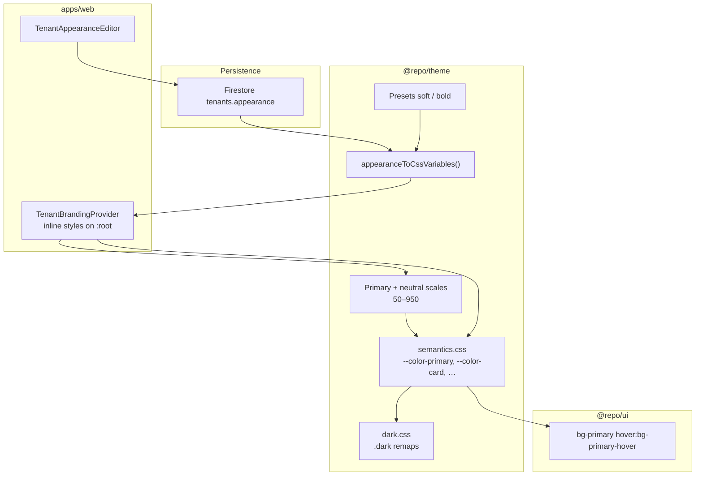

# Theme and tenant branding

How colors, typography, and tenant-specific styling work in the monorepo: **palette scales → semantic tokens → UI components**.

**Package reference:** [packages/theme/README.md](../packages/theme/README.md)  
**Platform UI:** [admin-dashboard-guide.md](./admin-dashboard-guide.md) § Appearance  
**Logo storage:** [gcs-storage-guide.md](./gcs-storage-guide.md)

---

## Architecture



1. **Palette scales** (`--color-primary-500`, `--color-neutral-100`, …) — generated from an anchor color (OKLCH-based) or set per shade.
2. **Semantic tokens** (`--color-primary`, `--color-muted`, `--color-card`, …) — defined in CSS as `var(--color-*-step)` so changing a tenant palette updates buttons, surfaces, and hovers automatically.
3. **Components** — use Tailwind utilities tied to semantics (`bg-primary`, `text-muted-foreground`, `hover:bg-hover`), not raw scale steps like `bg-primary-600`.

Dark mode uses the existing **`.dark` class** on `<html>` (via `ThemeProvider` / `useColorScheme`). Semantic overrides in `dark.css` remap surfaces and hovers; tenant scale overrides on `:root` still flow through `var()` references.

---

## CSS files (import order)

Apps and Storybook should import theme CSS in this order:

```css
@import "@repo/theme/fonts.css";
@import "tailwindcss";
@import "@repo/theme/tokens.css";      /* scales, sidebar, typography, radius */
@import "@repo/theme/semantics.css";  /* palette → semantic mappings */
@import "@repo/theme/dark.css";       /* .dark semantic remaps */
@import "@repo/theme/base.css";       /* body, form defaults */
```

Example: [apps/web/app/app.css](../apps/web/app/app.css).

| File | Role |
|------|------|
| [tokens.css](../packages/theme/src/tokens.css) | Primary, neutral, success, danger, warning scales; sidebar; font/spacing/radius |
| [semantics.css](../packages/theme/src/semantics.css) | Semantic + surface + text hierarchy + interactive + component shortcut tokens |
| [dark.css](../packages/theme/src/dark.css) | Dark-mode semantic remaps |
| [base.css](../packages/theme/src/base.css) | Global element defaults |

---

## Tenant appearance model

Stored on the tenant document as `appearance` ([`TenantAppearance`](../packages/shared-types/src/tenant/tenant-appearance.ts)), validated by API with `tenantAppearanceSchema`.

| Field | Purpose |
|-------|---------|
| `logoUrl` | Public URL for sidebar logo (uploaded via admin API → GCS) |
| `preset` | `"default"` (omit) or a named preset — merges bundled palette/semantic defaults before user fields |
| `palettes.primary` | `{ anchorStep, anchorColor, shadeOverrides? }` — generates `--color-primary-*` |
| `palettes.neutral` | Same shape — generates `--color-neutral-*` |
| `semantics` | Legacy flat semantic overrides (light-mode fallback) |
| `semanticsByScheme` | Explicit light/dark semantic overrides (hybrid with palette derivation) |
| `colors` | Legacy sidebar overrides (light-mode fallback) |
| `colorsByScheme` | Explicit light/dark sidebar and layout color overrides |
| `effects` | Card shadow and primary gradient per color scheme |
| `chartColors` | Chart palette (`chart1`–`chart4`) |
| `customTokens` | Tenant-defined color/gradient CSS vars (`--color-{slug}`, `--gradient-{slug}`) with light/dark values |
| `fontFamily`, `fontSizes`, `radius`, `radiusSm`, `spacingScale` | Typography and layout tokens (`spacingScale.base` is macro layout only) |

### Presets

| Preset | Character |
|--------|-------------|
| `default` | Product default scales and semantics (no extra merge) |
| `soft` | Light surfaces, blue primary, subtle borders |
| `bold` | Strong violet primary, higher-contrast neutrals |
| `elegant` | Warm ivory neutrals, espresso accent |
| `sophisticated` | Cool slate surfaces, restrained teal primary |
| `professional` | Corporate blue, clean gray borders |
| `business` | Conservative navy, high-readability neutrals |
| `frutigerAero` | Glossy aqua primary, sky-tinted backgrounds |

Definitions live in [packages/theme/src/presets/catalog.ts](../packages/theme/src/presets/catalog.ts). Presets set **palettes only** (not light-only semantic hex) so [dark.css](../packages/theme/src/dark.css) can remap surfaces and text when the user toggles dark mode.

Saved `preset: "instagram"` (legacy) is normalized to `soft` when loaded.  
`appearanceToCssVariables(appearance, { colorScheme })` skips inline semantics that `dark.css` already remaps when `colorScheme` is `"dark"`.  
Merge logic: `applyAppearancePreset()` in [packages/theme/src/presets/index.ts](../packages/theme/src/presets/index.ts).

### Runtime application

[`TenantBrandingProvider`](../apps/web/app/theme/TenantBrandingProvider.tsx) reads `tenantAppearance` from auth context and calls:

```ts
appearanceToCssVariables(appearance)
```

That function (in [tenant-overrides.ts](../packages/theme/src/tenant-overrides.ts)):

1. Applies preset merge
2. Expands palettes to scale CSS variables
3. Merges `semantics` and semantic keys from `colors`
4. Applies typography/layout fields

Variables are set on `document.documentElement` and cleared on tenant change/unmount.

### Spacing scale

Tailwind numeric utilities (`p-4`, `gap-2`, `px-3`) multiply `--spacing` (default `0.25rem`). Tenant appearance must **not** override `--spacing` — doing so inflates every padded control.

Instead, tenants customize the semantic spacing scale:

| Token | Default | Typical use |
|-------|---------|-------------|
| `--spacing-tight` | `0.25rem` | Icon-to-text gaps |
| `--spacing-compact` | `0.5rem` | List rows, badges |
| `--spacing-comfortable` | `1rem` | Buttons, inputs, compact cards |
| `--spacing-macro` | `1.5rem` | **Macro layout:** page padding, dashboard grid gaps, large widgets |
| `--spacing-section` | `2rem` | Major section separation |

Use names like `p-macro`, `gap-macro`, or `var(--spacing-macro)`. Do **not** use `--spacing-md` / `--spacing-sm` etc. — those collide with Tailwind width utilities such as `max-w-md`. Legacy `appearance.spacing` is migrated to `spacingScale.base` on read.

---

## Platform UI: Appearance editor

**Route:** `/settings/appearance` (superadmin, active tenant)  
**Component:** [TenantAppearanceEditor.tsx](../apps/web/app/components/platform/TenantAppearanceEditor.tsx)

| Section | What it does |
|---------|----------------|
| Import / export | JSON download, file import, paste import, bundled violet example theme |
| Logo | `PhotoUpload` → `POST /admin/tenants/:id/logo` |
| Theme preset | Dropdown: Default + seven named presets — fills palette scales |
| Primary / neutral palette | Anchor step + color; optional per-shade overrides; live scale preview |
| Semantic colors | Light/dark overrides for `TENANT_OVERRIDE_GROUPS.semantics` with palette hints |
| Badge colors | Light/dark badge semantic overrides |
| Sidebar | Light/dark sidebar CSS vars |
| Effects | Card shadow and primary gradient per scheme |
| Chart colors | `--color-chart-1` … `--color-chart-4` |
| Custom tokens | Tenant color/gradient vars with light/dark values (e.g. `--color-widget`, `--gradient-hero`) |
| Typography / layout | `--font-sans`, text sizes, card/button radius, semantic spacing scale (`--spacing-tight` … `--spacing-section`) |
| Preview panel | Light/dark toggle with card, gradient, badge, and sidebar samples |

Save sends `appearance` on `PATCH /admin/tenants/:id`; then `selectTenant()` refreshes JWT branding.

Import/export uses [theme-import-export.ts](../packages/theme/src/theme-import-export.ts) (`exportTenantTheme`, `importTenantTheme`, `validateTenantThemeImport`, `createTenantThemeSkeleton`).

In the customize modal, **View JSON** opens a read-only modal with the current draft (copy to clipboard). **Import JSON** opens a paste/upload modal with the expected structure skeleton, live validation, and an optional example theme loader — matching the UI builder JSON workflow.

### Custom tokens

Tenants can define up to 32 custom tokens in `appearance.customTokens`:

```json
{
  "kind": "color",
  "name": "widget",
  "label": "Widget surface",
  "light": "#ffffff",
  "dark": "#1a1a2e"
}
```

- **Color** tokens resolve to `--color-{slug}` (hex validated on save).
- **Gradient** tokens resolve to `--gradient-{slug}`.
- Slugs must be lowercase kebab-case and cannot collide with platform semantics or palette steps (`primary-500`, `chart-1`, etc.).

At runtime, `appearanceToCssVariables` sets the active scheme value on `:root`. In the UI builder, configured tokens appear in the color picker under **Custom tokens** (values like `var(--color-widget)`).

Helpers: `sanitizeCustomTokens`, `buildCustomTokenColorOptions` in [custom-tokens.ts](../packages/theme/src/custom-tokens.ts).

---

## Building UI components

### Do

- Use **semantic** Tailwind classes: `bg-primary`, `text-primary-foreground`, `hover:bg-primary-hover`, `bg-card`, `text-muted-foreground`, `border-border`, `hover:bg-hover`, `ring-focus`, `bg-backdrop`.
- Use `@repo/ui` primitives; they already follow this model.
- Use `cn()` from `@repo/theme/utils` for class merging.

### Avoid

- Hardcoding scale steps in shared components (`bg-primary-600`, `hover:bg-neutral-100`) — tenant palettes will not affect those styles.
- Setting one-off hex colors in app code for themeable surfaces.
- Custom overlay scrims — use `OverlayRoot` / `Modal` (`bg-backdrop`).

### Examples

```tsx
// Primary action
<Button variant="primary">Save</Button>
// → bg-primary text-primary-foreground hover:bg-primary-hover

// Muted helper text
<Text variant="muted">Optional field</Text>
// → text-muted-foreground

// Elevated surface
<div className="bg-card text-card-foreground border-border border rounded-lg p-4" />
```

### Input / focus aliases

Semantics expose component shortcuts consumed by `Input`:

- `border-input-border`, `bg-input-background`, `ring-input-focus` (alias of `--color-focus`)

---

## Programmatic API (`@repo/theme`)

| Export path | Use |
|-------------|-----|
| `@repo/theme/tenant-overrides` | `appearanceToCssVariables`, `TENANT_OVERRIDE_GROUPS`, palette helpers, presets |
| `@repo/theme/palette` | `generateColorScale`, `expandPaletteConfig` |
| `@repo/theme/react` | `ThemeProvider`, `useColorScheme`, `useDarkMode` |
| `@repo/theme/tokens.css` etc. | CSS entrypoints |

### Generate CSS variables from appearance

```ts
import { appearanceToCssVariables } from "@repo/theme/tenant-overrides";

const vars = appearanceToCssVariables({
  preset: "soft",
  palettes: {
    primary: { anchorStep: "500", anchorColor: "#1d4ed8" },
  },
});
// vars["--color-primary-500"], vars["--color-card"], …
```

### Overridable semantic tokens (editor + API)

Listed in `SEMANTIC_OVERRIDABLE_CSS_VARS` ([semantic-vars.ts](../packages/theme/src/semantics/semantic-vars.ts)):

`--color-background`, `--color-foreground`, `--color-primary`, `--color-primary-foreground`, `--color-primary-hover`, `--color-primary-active`, `--color-muted`, `--color-muted-foreground`, `--color-border`, `--color-border-muted`, `--color-card`, `--color-card-foreground`, `--color-card-border`, `--color-popover`, `--color-popover-foreground`, `--color-popover-border`, `--color-backdrop`, `--color-hover`, `--color-active`, `--color-accent`, `--color-accent-foreground`.

Full semantic set (including success/warning/info) lives in [semantics.css](../packages/theme/src/semantics.css); only the subset above is exposed for tenant override in v1.

### Glass-glow theme tokens (tenant appearance)

Glassmorphism is **opt-in per tenant** via appearance JSON (import/export version `1.2`). Do not hardcode rates-branded effect defaults in global `tokens.css` — seed catalogs such as [rates-tenant-appearance.json](../apps/api/src/admin/rates-tenant/catalogs/rates-tenant-appearance.json) provide the reference values.

| JSON field | CSS variable | Usage |
|------------|--------------|--------|
| `effects.backgroundApp.dark` | `--gradient-background` | Deep app gradient applied on `<html>` via `TenantBrandingProvider` |
| `effects.backdropFilterCard.dark` | `--backdrop-filter-card` | Frosted card blur — UI builder widgets use `var(--backdrop-filter-card)` |
| `semantics.dark.--color-card` | `--color-card` | Semi-transparent card fill |
| `semantics.*.--color-card-border` | `--color-card-border` | Glass edge |
| `effects.cardGlow.neutral/success/danger/warning/blue/…` | `--gradient-card-glow-*` | Semantic corner glow overlays |
| `effects.shadowCard.dark` | `--shadow-card` | Outer depth + inset top-edge highlight |
| `effects.gradientGlowBorder.dark` | `--gradient-glow-border` | Neon list-row hover ring gradient |
| `effects.shadowGlowBorder.dark` | `--shadow-glow-border` | Neon list-row hover ring shadow |
| `chartColors.glow1–4` | `--color-chart-glow-1..4` | Neon chart strokes with SVG glow filter |

**Component glass (opt-in)** ([`card-glass.ts`](../packages/ui/src/card/card-glass.ts)):

- Shared `Card` / `LayoutCard` / `TableCard` default to **opaque** surfaces.
- Use `variant="glass"` or tenant `effects.backdropFilterCard` with UI-builder `backdropFilter: var(--backdrop-filter-card)`.
- Glass shell: `background-color: var(--color-card)`, `border: 1px solid var(--color-card-border)`, `box-shadow: var(--shadow-card)`, `backdrop-filter: var(--backdrop-filter-card)`.
- Layered glow: `background-image: var(--gradient-card-glow-success), linear-gradient(var(--color-card), var(--color-card))` via `resolveCardGlowBackground()` in [`card-glow.ts`](../packages/ui/src/card/card-glow.ts).

**List row neon highlight** — set `motion.hoverSurface: "glow-border"` on query-viewer item rows. Uses tenant tokens `--gradient-glow-border` and `--shadow-glow-border`.

Example catalog: [rates-tenant-appearance.json](../apps/api/src/admin/rates-tenant/catalogs/rates-tenant-appearance.json).

---

## Color scheme (light / dark)

User preference is stored in `localStorage` (`COLOR_SCHEME_KEY`) and applied as class `dark` on the root.

```tsx
import { ThemeProvider, useColorScheme } from "@repo/theme/react";

// root.tsx
<ThemeProvider defaultColorScheme="light">{children}</ThemeProvider>
```

Semantic tokens automatically switch via `dark.css`; tenant palette overrides on scale variables apply in both modes.

---

## Testing

| Command | Scope |
|---------|--------|
| `pnpm --filter @repo/theme test` | Palette generation, preset merge, semantics expansion |
| `pnpm test:visual` | Storybook screenshots (imports `semantics.css` via [storybook.css](../packages/ui/src/styles/storybook.css)) |

When changing default semantics or component variants, run visual tests and update Linux snapshots if intentional: `pnpm test:visual:update:ci`.

---

## Related files

| Area | Path |
|------|------|
| Theme package | [packages/theme/](../packages/theme/) |
| Shared type | [tenant-appearance.ts](../packages/shared-types/src/tenant/tenant-appearance.ts) |
| Branding provider | [TenantBrandingProvider.tsx](../apps/web/app/theme/TenantBrandingProvider.tsx) |
| Admin API | [admin.routes.ts](../apps/api/src/routes/admin.routes.ts) |
| E2E checks | [e2e-validation-runbook.md](./e2e-validation-runbook.md) §10 |

---

## Deferred (not in v1)

- Tenant-overridable success/warning/danger scales
- Niche component tokens (e.g. story ring)
- `[data-theme="dark"]` — platform uses `.dark` only

See [StylesFeedback.md](../StylesFeedback.md) for the original token wishlist; implemented items are covered above.
