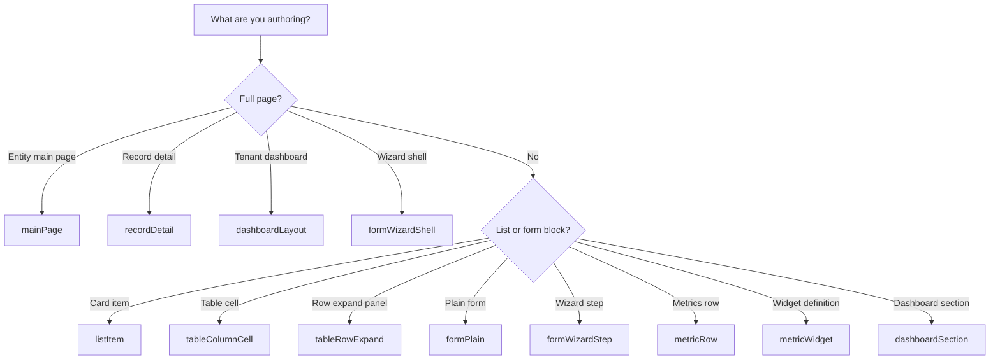

# Design surfaces matrix

A **design surface** is the authoring context that determines which component kinds are valid in a layout. Surfaces map to composition scopes (component, block, section, screen) and drive builder validation, preset filtering, and import checks.

Every surface also allows the universal structural kinds: `container` and `grid`.

---

## Surface reference

| Surface | Scope | Primary use | Persistence key |
|---------|-------|-------------|-----------------|
| `listItem` | Block | Card list item layout | `listItem` |
| `tableColumnCell` | Component | Expandable table column cell | `views[].columns[].cellLayout` |
| `tableRowExpand` | Block | Expanded row panel | `views[].rowExpandLayout` |
| `mainPage` | Screen | Entity main page slots | `mainPage` |
| `recordDetail` | Screen | Record detail panel | `recordDetail` |
| `formCreate` | Section | Create form body | `forms.layout` or `formDesigns[]` |
| `formEdit` | Section | Edit form body | `forms.layout` or `formDesigns[]` |
| `formPlain` | Block | Plain form authoring | `forms.layout` |
| `formWizardShell` | Screen | Wizard chrome (progress, host, actions) | `forms.wizard.shellLayout` |
| `formWizardStep` | Section | Individual wizard step body | `forms.wizard.steps[].layout` |
| `formModalFooter` | Section | Modal footer actions region | `forms.modalFooterLayout` |
| `metricStrip` | Block | Legacy inline KPI strip (deprecated path) | — |
| `metricRow` | Block | Entity metrics row above list | `metricRowLayout` |
| `metricWidget` | Component | Reusable widget inner layout | `metricWidgets[].layout` |
| `dashboardSection` | Section | Dashboard section content | `dashboardSections[].layout` |
| `dashboardLayout` | Screen | Tenant dashboard page shell | `dashboardLayout` |

Envelope surfaces (`design-layout-slice`) are coarser: `list`, `forms`, `mainPage`, `recordDetail`, `metricsRowDesigner`. See [Envelope examples](../appendix/envelope-examples.md).

---

## Allowed component kinds by surface

### List and table

| Surface | Allowed kinds (plus `container`, `grid`) |
|---------|------------------------------------------|
| `listItem` | `text`, `image`, `icon`, `date`, `numeric`, `badge`, `metric-kpi`, `metric-derived-kpi`, `view-filter` |
| `tableColumnCell` | Same as `listItem` |
| `tableRowExpand` | Same as `listItem` |

### Page slots

| Surface | Allowed kinds (plus `container`, `grid`) |
|---------|------------------------------------------|
| `mainPage` | `page-header`, `page-toolbar`, `page-metrics`, `page-list`, `view-filter` |
| `recordDetail` | Display kinds above, plus `related-records` |

Display kinds: `text`, `image`, `icon`, `date`, `numeric`, `badge`, `metric-kpi`, `metric-derived-kpi`, `view-filter`.

### Forms

| Surface | Allowed kinds (plus `container`, `grid`) |
|---------|------------------------------------------|
| `formPlain`, `formCreate`, `formEdit` | `form-field`, `entity-field-selector`, `form-section`, `form-actions`, display kinds |
| `formWizardShell` | `wizard-progress`, `wizard-step-host`, `wizard-actions`, display kinds |
| `formWizardStep` | `form-field`, `entity-field-selector`, `form-section`, display kinds |
| `formModalFooter` | Union of form kinds minus `wizard-step-host` and `form-actions` |

### Metrics

| Surface | Allowed kinds (plus `container`, `grid`) |
|---------|------------------------------------------|
| `metricStrip` | Display kinds, `user`, `metric-widget` |
| `metricRow` | Display kinds, `metric-widget` |
| `metricWidget` | Display kinds (inner widget layout) |

### Dashboard

| Surface | Allowed kinds (plus `container`, `grid`) |
|---------|------------------------------------------|
| `dashboardSection` | Display kinds, `user`, `metric-widget` |
| `dashboardLayout` | Display kinds, `user`, `metric-widget`, `dashboard-section` |

---

## Choosing a surface

---

## Validation rules

1. **Surface-bound kinds** — A component kind not listed for the surface fails import validation.
2. **Structural kinds** — `container` and `grid` are always permitted on any surface.
3. **Root shape** — Screen surfaces (`mainPage`, `recordDetail`, `formWizardShell`, `dashboardLayout`) may use `screen-root`. Block and component surfaces use column `root` → single `container`.
4. **Preset alignment** — Built-in presets target specific surfaces. Applying `card-list` on `listItem` also sets `listViewType: "card"` in the list envelope.

---

## Related

- [List views](./list-views.md) — table, card, expandable table envelopes
- [Forms](./forms.md) — plain and wizard envelopes
- [Main page and detail](./main-page-and-detail.md) — slot composition
- [Metrics and dashboard](./metrics-and-dashboard.md) — KPI row and tenant dashboard
- [Platform presets](../06-presets/platform-presets.md) — default layouts per surface
