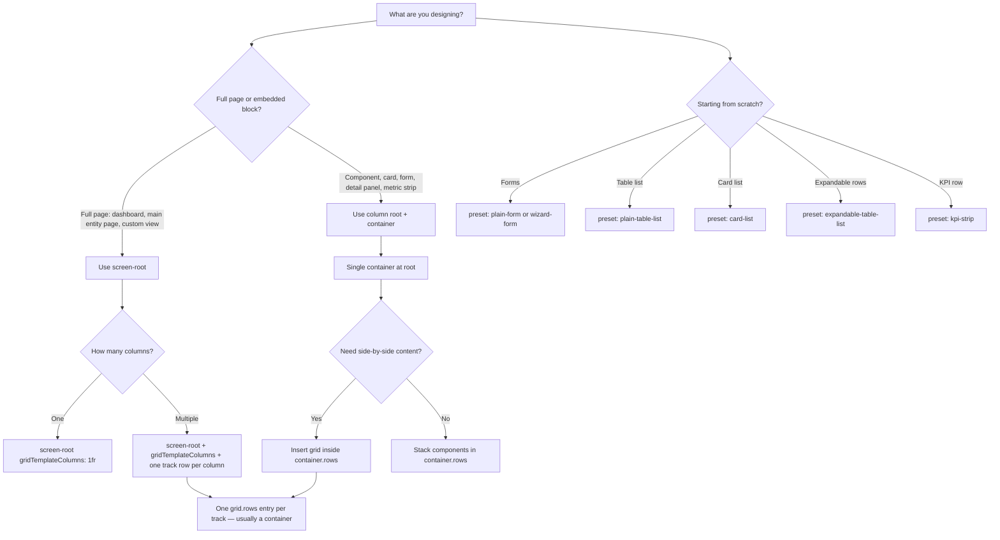

# UI Design Manual

Authoritative reference for designers and implementers who compose entity UI through layout JSON, presets, and design-layout-slice envelopes. This manual explains **what to build** and **how structures behave at runtime** — not how the builder application is implemented.

---

## Quick router

Use this decision tree before authoring JSON.



### Surface → preset defaults

| What you are designing | Recommended preset | Sets |
|------------------------|-------------------|------|
| Create / edit form (plain) | `plain-form` | `presentation: "plain"` |
| Multi-step form | `wizard-form` | `presentation: "wizard"` + wizard shell |
| Table list | `plain-table-list` | `listViewType: "table"` |
| Card list | `card-list` | `listViewType: "card"` + two-track card grid |
| Expandable table | `expandable-table-list` | `listViewType: "expandableTable"` |
| KPI metrics row | `kpi-strip` | horizontal metric KPI layout |

Pick the preset first, then customize layout inside the envelope. Do not set `presentation` or `listViewType` independently when a preset already defines them.

### Surface → allowed component families

| Surface | Primary kinds |
|---------|---------------|
| List item / card | `text`, `image`, `icon`, `date`, `numeric`, `badge`, `metric-kpi`, `metric-derived-kpi`, `view-search`, `view-filters`, `view-date-filter`, `container`, `grid` |
| Table column cell | Same as list item |
| Form (plain) | `form-field`, `entity-field-selector`, `form-section`, `form-actions` + display kinds |
| Form (wizard shell) | `wizard-progress`, `wizard-step-host`, `wizard-actions` |
| Main page | `page-header`, `page-toolbar`, `page-metrics`, `page-list`, `view-search`, `view-filters`, `view-date-filter` |
| Record detail | Display kinds, `related-records`, `metric-*`, `view-search`, `view-filters`, `view-date-filter` |
| Metric row | Display kinds, `metric-widget` |
| App shell — Sidebar | `image`, `icon`, `text`, `user`, `notification-bell`, `sidebar-nav`, `sidebar-collapse`, `container`, `grid` |
| App shell — Header | `image`, `icon`, `text`, `user`, `sidebar-trigger`, `container`, `grid` |
| App shell — Footer | `image`, `icon`, `text`, `user`, `nav-tab`, `ai-chat`, `container`, `grid` |

---

## Glossary

| Term | Definition |
|------|------------|
| **UiLayoutDocument** | Top-level layout JSON object. Contains `root` plus optional `showActions`, `cardsPerRow` (1–4), and `motion`. |
| **screen-root** | Root node type for full-page layouts. Uses CSS Grid directly via `gridTemplateColumns`, `gap`, and `rows[]`. Used for dashboards, main entity pages, and custom views. |
| **grid** | Layout component (`kind: "grid"`) that defines column tracks with `gridTemplateColumns`. Each entry in `grid.rows[]` maps to one track. |
| **container** | Neutral wrapper (`kind: "container"`) that stacks child rows vertically. Every component/block layout starts with exactly one container at the root. |
| **DataSource** | Binding for display values: `{ "type": "field", "path": "…" }` or `{ "type": "static", "value": "…" }`. Used on `primary` and optional `fallbacks[]`. |
| **fieldPath** | Direct entity field name on form components (`form-field`, `entity-field-selector`). No relation dot notation — use `bankId`, not `bank.name`. |
| **design-layout-slice** | Versioned handoff envelope for importing/exporting a single surface: `{ "kind": "design-layout-slice", "surface": "…", "version": 1, "data": { } }`. |

---

## Composition hierarchy

Layouts nest in three conceptual scopes:

```
Page (entity UI surface)
└── Block (section within a page — e.g. card item, form, detail panel)
    └── Component (atomic row: text, form-field, page-list, grid track content, …)
```

**Page scope** — full entity experiences: main page, record detail, list presentation, metrics row. May use `screen-root` for dashboard-style pages.

**Block scope** — self-contained regions inside a page: a list card, an expandable row panel, a form body, a wizard step. Always uses column `root` → single `container`.

**Component scope** — individual rows inside a block. Display components bind data via `DataSource`; form components bind via `fieldPath`.

Structural layout always flows:

```
root
└── container (exactly one at root)
    └── grid (optional — for multi-column)
        ├── track 1 → container → components
        └── track 2 → container → components
```

Do **not** use `nested-layout` — it is deprecated. Use `grid` instead.

---

## Manual sections

### Layout tree

| Document | Topic |
|----------|-------|
| [Grid and screen-root](./01-layout-tree/grid-and-screen-root.md) | Grid-only layout, screen-root vs column root, structural rules |
| [Container and tracks](./01-layout-tree/container-and-tracks.md) | Root container, grid tracks, one row per track |
| [Style rules and motion](./01-layout-tree/style-rules-and-motion.md) | `StyleRule` format, attachment layers, motion presets |
| [Responsive visibility](./01-layout-tree/responsive-visibility.md) | `displayFrom` / `displayTo` breakpoints |

### Data binding

| Document | Topic |
|----------|-------|
| [Data sources](./02-data-binding/data-sources.md) | Field vs static, fallbacks, resolution order, display vs form paths |
| [Form field paths](./02-data-binding/form-field-paths.md) | `fieldPath` for `form-field` and `entity-field-selector` |
| [Metric bindings](./02-data-binding/metric-bindings.md) | `metric-kpi`, `metric-derived-kpi`, `groupBindings`, `dimensionBindings` |
| [Metric definition sources](./02-data-binding/metric-definition-sources.md) | Entity vs custom query population (Settings → Metrics; layout references `metricDefinitionId` only) |
| [Slots and page components](./02-data-binding/slots-and-page-components.md) | `page-header`, `page-toolbar`, `page-metrics`, `page-list` |

### Appendix

| Document | Topic |
|----------|-------|
| [Style property reference](./appendix/style-property-reference.md) | Full property list with ThemeToken guidance |
| [Validation errors](./appendix/validation-errors.md) | Common import/validation errors and fixes |
| [Envelope examples](./appendix/envelope-examples.md) | `design-layout-slice` shapes per surface |

### Meta

| Document | Topic |
|----------|-------|
| [SYNC](./SYNC.md) | How this manual stays aligned with AI context fragments |

### Recipes (optional)

Place step-by-step recipes in `07-recipes/` with YAML frontmatter (`aiContextFragmentId`) to include them in the generated AI context manifest. See [SYNC](./SYNC.md).

---

## Design principles

1. **Grid defines structure; styles decorate.** Never use arbitrary CSS to simulate columns — insert a `grid` component.
2. **Mobile-first.** Design for the `base` breakpoint, then add wider-screen content with `displayFrom`.
3. **One root container.** All user content lives inside `container.rows` at the document root.
4. **Display paths ≠ form paths.** Lists and detail views use relation labels (`bank.name`); forms use FK fields (`bankId`).
5. **Preview equals runtime.** No preview-only styles or overrides.
